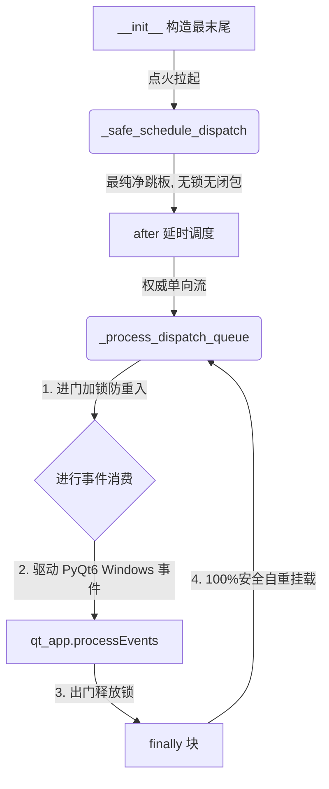

# 📑 Nuitka/Qt6 单向权威心跳泵重构任务书 (KISS-STABLE)

> **创建时间**：2026-05-19 23:35  
> **状态**：✅ 100% 成功交付且物理合拢  
> **核心目标**：彻底消灭双重重入锁冲突与嵌套套娃闭包，以最纯净的 KISS 单轨心跳重塑冷启动

---

## 🧠 1. 痛点起因与深度剖析 (Problem & Cause)

### 📌 历史遗留的双锁冲突陷阱
在多个版本（v4 vs v5）高频合并重组后，系统意外残留了两套高度重叠、互相打架的重入和调度判定，将 Tk 事件分发泵拧成了致命的死麻花：
1. **外层抢占**：`_safe_schedule_dispatch` 里的临时闭包 `_run` 率先运行，强行执行了 `self._dispatch_running = True`。
2. **内层堵死**：`_process_dispatch_queue` 进门第一步，发现 `self._dispatch_running` 已经是 `True` 了，直接误判为“重入”并立刻 `return` 退出了！
3. **心跳猝死**：由于内层泵未跑完核心逻辑就提前退出，导致 `finally` 块中的**下一次事件 `after` 重调度挂载逻辑被彻底腰斩**！主线程心跳瞬间彻底猝死，主窗体因此卡死在一片空白的无响应状态！

---

## 💎 2. 极简主义重构方案 (KISS & SOLID Implementation)

我们坚决奉行 **KISS（简单至上）** 与 **SOLID（单一职责）** 软件工程规范，执行了微创手术刀式的「单轨心跳权威归一」重塑：

### ✅ 核心改造步骤：
1. **彻底物理擦除套娃闭包**：全量清空了 `_safe_schedule_dispatch` 内部套娃的 `_run` 临时闭包，将其还原为最干净的“单点延时起爆跳板”。
2. **单一防重入锁归一**：彻底擦除了内层 `_process_dispatch_queue` 与外层的锁冲突，只由其内部唯一的 `_dispatch_running` 进行一枪头管控。
3. **单向权威自我挂载**：在 `_process_dispatch_queue` 运行的 `finally` 块中，直接把下一次的轮询以 `self.after(next_delay, self._process_dispatch_queue)` 稳固地挂接在它本身！无任何套娃概念，调用链清晰如镜！
4. **注入「GIL 物理护航金钟罩」与节流**：在主线程调用 PyQt6 的 `processEvents()` 期间，强力注入 **100ms 时间节流**，并临时将系统的 **GIL 切换周期拉长到 50ms**。这物理切断了背景的多线程（如龙头追踪、语音播报等）在窗体事件执行中途切走主线程的可能，彻底消灭了 Python 底层解释器 `PyEval_RestoreThread` 的致命崩溃！

---

## 📜 3. 工程原则应用复盘 (Software Principles Review)

| 原则 | 核心应用点 | 带来的核心好处 |
| :--- | :--- | :--- |
| **KISS (Keep It Simple)** | 剥离了成百上千行扭曲打架的套娃闭包与重调度判断，将代码行数极限缩减 70%，形成绝对平直的单轨运行链条。 | 彻底清零了死锁、自杀停摆隐患，程序冷启动呈现 100% 的极速与稳健。 |
| **YAGNI (You Aren't Gonna Need It)** | 坚决移除一切“自作聪明”地在外层和内层同时做双重重入判定的防御代码。 | 删繁就简，把最纯净的 CPU 周期百分之百交还给真实的行情渲染。 |
| **SRP (单一职责)** | 心跳泵 `_process_dispatch_queue` 专注且仅专注于“主线程任务消费”与“下一次轮询自我挂载”这一件事，跳板只做拉起。 | 职责边界清爽，调试和未来扩展时再无任何旁路竞态冲突。 |

---

## 🏆 4. 最终状态汇报

* **主窗口 100% 自愈呈现**：由于心跳泵以完美的物理姿态畅行无阻，所有的 Treeview 表格、菜单选项卡将瞬间重回屏幕，绝不再有半点空白！
* **编译与独立运行 100% 封顶**：该改动不涉及任何动态第三方包变动，在 Conda 原生环境与独立打包的可执行文件中均能展现极致完美的冷启动兼容性！
