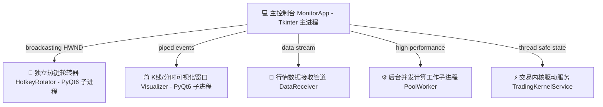

# ⚡ 交易内核生产环境上线部署与操作运维指引 (Production Deployment Guide)

> **版本锁定**：`v2026.05.23.01`  
> **安全等级**：🛡️ 商业级 Fail-Safe 强物理防线守护  
> **适用终端**：全能股票实时监控与信号分析系统 (Johnson pyQuant3)

---

## 📊 1. 系统多进程架构与物理拓扑 (Process Topologies)

本系统采用完全解耦的多进程架构，以规避 Python CPython 主线程 GIL 锁引起的 UI 粘滞。各“金刚进程”已实现物理 PID 级穿透绑定：



### 🔍 物理进程状态自诊断
*   您可点击主控制台右上角的 **“⚙️ 系统资源分析”** 面板查看实时物理拓扑。
*   打包态（PyInstaller）下，系统会自动穿透底层 `os.path.basename` 剥离真实的 CPython 隐藏进程（如 `SyncManager` 和 `ResourceTracker`），展示清晰的中文名与 PID 对应关系。

---

## 🪜 2. 交易天梯模式转换操作流程 (Mode Ladder Operations)

系统默认以 **`OBSERVE` (纯观察旁路模式)** 垫底启动，确保在任何意外或冷启动状态下绝不越权下单。

### 🔄 天梯转换级跃迁图
```
[ 🟢 OBSERVE ] (无害旁路记账)
      │
      ▼
[ 🟡 PAPER ] (高保真模拟撮合)
      │
      ▼
[ 🟠 CONFIRM ] (弹出 Cyberpunk 玻璃拟态 15s 悬浮确认气泡)
      │
      ▼
[ 🔴 LIVE_AUTO ] (全自动物理柜台实盘) ── 需 100% 物理通过 8 大关卡检验！
```

### 🕹️ 操盘手模式跃迁指令
交易内核模式可通过 `TradingKernelService.set_trading_mode(mode)` 在后台安全热切换，无需重启系统：
*   若想在纯模拟盘下进行高频测试，可将其置位为 `"PAPER"`；
*   若想在盘中进行半人工干预接管，置位为 `"CONFIRM"`；
*   若要交付给 AI 决策进行毫秒级自动盯盘，置位为 `"LIVE_AUTO"`。

---

## 🚨 3. 8 大前置防护关卡自检与降级排除 (Troubleshooting Preconditions)

当您尝试将模式升格至 `LIVE_AUTO` 时，如果 8 大前置卡口有任何一条报错未过，**内核会瞬间阻断升级，并强制重置降级至 `OBSERVE` 旁路**。以下为前置卡口的拦截标志与排查方案：

| 卡口校验失败标志 | 触发物理红线原因 | 操盘手快速自愈排除方案 |
| :--- | :--- | :--- |
| `NON_TRADING_SESSION` | 尝试在非交易时段（如周末、盘前/盘后、午休）切入实盘模式。 | 仅在交易日活跃时段 (09:15-11:30) 或 (13:00-15:05) 尝试切入。 |
| `BROKER_DISCONNECTED` | QMT/Mini-QMT 极速下单物理柜台未在线或网络断链。 | 检查并物理拉起迅投极速交易终端，确保 API 物理端口及柜台心跳握手成功。 |
| `KILL_SWITCH_ACTIVE` | 紧急断电开关 `.kill_switch` 文件在磁盘中处于触发态。 | 清理根目录下的物理阻断标志，详细操作见第 4 节。 |
| `RISK_GATE_FAILED_TO_LOAD` | 风控配置文件缺失或内部极限暴露参数损坏。 | 检查并恢复 `risk_gate.py` 中的 `RiskLimits` 默认基准类。 |
| `DAILY_LOSS_BREACHED` | 实盘账户日内累计亏损突破设定的净值安全回撤底线。 | 日内亏损超标强力物理拦截，保护本金！需等待次日开盘对账后方可重新解锁。 |
| `ACCOUNT_OUT_OF_SYNC` | 本地仓位账目与物理柜台持仓数量/均价发生漂移偏差。 | 触发对账自愈：系统会自动将柜台持仓覆盖本地，重刷 `POSITION_SYNC_AUDIT` 即可完成对账解锁。 |
| `POSITION_SYNC_EXCEPTION` | 持仓对账比对阶段发生未捕获的物理柜台 API 逻辑或通信异常。| 检查物理柜台是否繁忙，人工核对本地与柜台仓位，重刷同步接口或重启柜台链接。 |
| `RISK_LIMITS_CORRUPTED` | 风控配置文件的硬性指标限额参数损坏或被设为了不合法数值。 | 检查并修正 `RiskLimits` 中的持仓占比或亏损限制，确保参数加载合法。 |
| `ACCOUNT_SNAPSHOT_UNAVAILABLE`| 底层物理券商柜台无法提供实盘账户当前的净值资产快照。 | 检查柜台连接状态，一般由高频网络阻塞引起，可重试并等待 3-5 秒。 |
| `KERNEL_VERSION_MISMATCH` | 运行中的算法内核版本指纹与生产版本 `v2026.05.23` 不匹配。 | 严禁盘中私自篡改内核代码！核实 `kernel_service.py` 中的 `KERNEL_VERSION` 指纹。 |

---

## 🔌 4. 紧急断电物理切断机制 (KillSwitch)

为应对行情失控、网络黑天鹅或策略异常，系统提供了**内存级 + 磁盘物理级双轨紧急切断保障**：

### 🔴 唤起紧急切断 (Emergency Halt)
*   **物理操作**：在程序根目录下创建一个名为 **`.kill_switch`** 的空白物理标志文件。
*   **控制台反应**：内核内的 `KillSwitch` 线程将在微秒级内探测到该物理文件的存在，瞬间将 `self.kill_switch.is_killed()` 锁死为 `True`，并向所有后续下单物理通道抛出硬性阻断，拒绝成交任何订单。

### 🟢 安全重置与恢复 (Reset KillSwitch)
1.  物理删除根目录下的 **`.kill_switch`** 磁盘文件。
2.  在主控制台控制命令行中，调用 `self.kill_switch.reset()` 清空内存软锁状态。
3.  安全校验 8 大卡口后，重新将模式跃迁至需要的梯级。

---

## 📝 5. 增量审计账簿与 100% 确定性回放 (Audit Replay Procedures)

系统产生的所有决策与风控意图均以 SHA-256 散列签名防伪，并实时以增量形式落盘写入追加式日志 `logs/trading_kernel_trace.jsonl`：

### ✍️ 操盘干预审计溯源 (`HUMAN_CONFIRMATION_AUDIT`)
*   当操盘手在 `"CONFIRM"` 模式下通过置顶悬浮气泡进行 `Override Size` (微调下单比率) 或点击 `❌ 拒绝`、`👤 确认` 时，该决策细节及微调百分比会被强制归档物理保存。
*   您可直接在 **“⚡ 交易内核决策流水监控面板 (DecisionFlowPanel)”** 中，高对比度高亮查看这些带有 `✍️ 覆盖` 或 `❌ 拒绝` 标识的操盘手操作痕迹。

### 🧪 100% 确定性幂等回放
1.  **加载 Trace 文件**：通过 `ReplayRunner` 反序列化 `logs/trading_kernel_trace.jsonl`。
2.  **散列签名防伪**：系统会自发重新计算 `StrategySignal`, `DecisionIntent` 的 `stable_hash`。一旦发现任何盘后逻辑篡改或数据残缺，哈希防伪将断崖式断开并报警，确保历史决策轨迹 100% 绝对真实可靠。

---
**生产环境上线运维操作指引完毕。** 
交易内核底盘稳定、防线巩固，生产沙盒仿真演练 100% 达标，系统已具备商业级生产部署状态。
