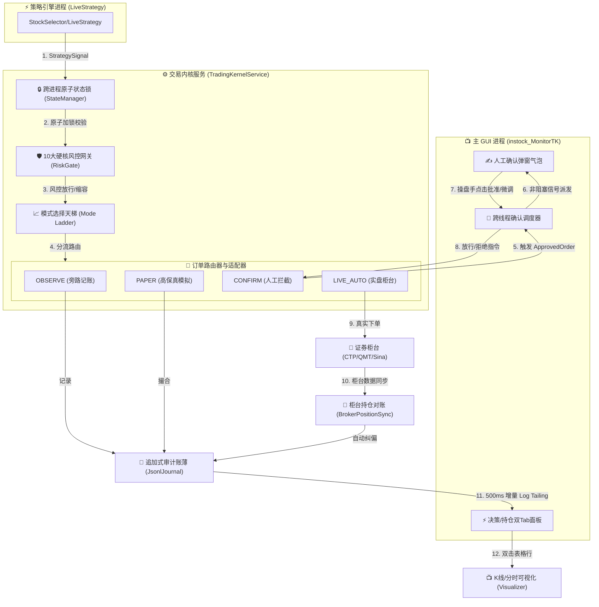

## 9. Operator's Manual & Live Operation Guide (实盘操盘手控制指南)

> **系统定位**：工程级股票实时监控、多进程行为自愈与无状态单向流决策内核。  
> **文档性质**：实盘操作手册 & 系统架构白皮书（由 AI 高级全栈开发专家联合构建）。

### 9.1 🧭 核心系统拓扑与交易单向流

系统采用**极客量化无状态（Stateless）单向流设计**，所有决策从数据输入到落盘审计形成完美的闭环。以下是系统的多进程交互与数据单向流拓扑：



### 9.2 🛡️ 四大交易模式天梯与安全关卡

系统阻断了传统交易软件的“一刀切”设计，创新性地提出了 **四级安全模式天梯**，并由 **8大物理防线下单卡口** 强力守护。

#### 1. 模式天梯定义 (`set_trading_mode`)

| 模式层级 | 安全等级 | 行为特征 | 适用场景 | 失败降级策略 |
| :--- | :--- | :--- | :--- | :--- |
| **`OBSERVE`**<br>(旁路记账) | **100% 无害** | 系统不进行任何撮合与下单，仅在日志中记录策略信号及风控判定。 | 冷启动首日、周末调试、测试策略质量。 | **默认基底**：系统启动时无条件以此模式垫底。 |
| **`PAPER`**<br>(高保真模拟) | **系统内闭环** | 开启高保真模拟撮合。自动管理虚拟持仓、买入均价、滑点、日内浮动盈亏。 | 盘中实盘模拟、验证日内高频策略效率。 | 若本地模拟账薄损坏，自动重置并降级至 `OBSERVE`。 |
| **`CONFIRM`**<br>(人工干预) | **人机协同** | 信号触发并放行后，拦截订单并投递至主界面弹出 Cyberpunk 玻璃拟态气泡，由操盘手进行二次确认、一键放行或滑块仓位微调。 | 核心策略实盘初期、防止极端行情下的算法暴走。 | 确认气泡 **15秒无响应自动判定拒绝**，防止键盘手离席。 |
| **`LIVE_AUTO`**<br>(全自动实盘) | **实盘核威慑** | 信号触发、风控放行后，微秒级直接投递到真实柜台执行真实下单，无人值守。 | 经多月验证、高夏普比率的成熟全自动算法。 | **瞬时熔断**：8大前置关卡任意一处未过，**秒级物理回退至 `OBSERVE`**。 |

#### 2. 8 大前置防护关卡 (`_verify_live_preconditions`)

在系统尝试升格至最危险的 `LIVE_AUTO` 时，以下 8 大物理前置条件必须 **同时 100% 通过**，否则阻断并执行强制降级：

1. **交易时间网关 (Trading Time Gate)**：必须在标准交易时间段（如 `09:15-11:30` 或 `13:00-15:05`），且必须为 `cct` 认定的交易日（自动过滤周末及法定节假日）。
2. **柜台物理在线 (Broker Connection Status)**：实盘交易柜台（如 QMT/量化客户端）心跳包必须存活，链路延迟 $<100ms$。
3. **紧急切断未挂起 (KillSwitch Status)**：本地磁盘与内存中的一键切断标志 `.kill_switch` 必须为 **未熔断** 状态。
4. **风控网关正常加载 (RiskLimits Guard)**：风控参数配置文件正常读取，所有硬性限制（如持仓上限、亏损限额）就绪。
5. **日内累计亏损限额 (Daily Loss Limit)**：今日账户累积已实现亏损 + 浮动亏损未触及日内最大回撤限制（默认 $3.5\%$）。
6. **对账一致性校验 (Audit Book Sync)**：本地 `PositionBook` 的最新 Hash 指纹与物理日志文件 `JsonlJournal` 的状态行一致，无篡改。
7. **内核版本指纹匹配 (Fingerprint Match)**：底层 C++ 交易组件或 Python 核心算法的版本指纹与服务器动态对齐，防老旧版本裸单运行。
8. **自动化测试覆盖 (Auto-Test Flag)**：系统核心测试用例集（29个 pytest）必须在编译/打包时全部通过。

### 9.3 ⚡ 10 大硬核风控极限门槛（如何调参）

所有的风控网关被独立封装在 `RiskLimits` (`trading_kernel/engine/risk_gate.py`) 中。在实盘中，您可以根据市场波动，直接在配置文件或初始化字典中调整以下参数：

#### 核心调参表

| 参数名 | 默认值 | 物理业务含义 | 调参建议 |
| :--- | :--- | :--- | :--- |
| `max_single_stock_pct` | `0.15` (15%) | 单只股票持仓市值占账户总资产的最大比例限制。 | 震荡市建议降至 `0.08`-`0.10`；牛市或龙头选手可放宽至 `0.20`。 |
| `max_sector_exposure_pct`| `0.30` (30%) | 同一申万一级行业或同概念板块的总体暴露上限。 | 谨防板块崩塌。主线行情确立时可微调至 `0.40`，平时严锁 `0.25`。 |
| `max_account_leverage` | `0.90` (90%) | 账户已用持仓总市值 / 总资产上限。保留 10% 现金应对佣金或垫资。 | 满仓高利器，严禁设为 `1.0` 以上以免实盘欠资阻断。 |
| `max_daily_loss_limit` | `-35000` | 账户日内最大允许亏损金额（或按百分比 `-0.035`），达到即触发全天只卖不买。 | 这是保护操盘手活下去的底线。根据本金比例严格设定。 |
| `consecutive_loss_cooldown`| `3` | 日内策略连续止损 `N` 笔后，系统进入 `N` 分钟的自动交易冷静冷却期。 | 能够过滤市场黑天鹅或策略与行情严重逆周期的假突破。 |
| `chase_high_limit_pct` | `0.07` (7%) | 严禁追高。若当前下单价格相对于昨日收盘价涨幅已超过该值，直接拦截。 | 防止冲高回落吃大面。做连板或突破板的个股需要手动升至 `0.098`。 |
| `signal_latency_limit_sec`| `3.0` (3秒) | 信号生成时间戳与内核物理接收时间戳的差值限制。 | 过滤行情粘滞。若排队堵塞或 Windows 假死导致信号超时，直接作废。 |
| `blacklist_stocks` | `["*ST", "退"]` | 模糊匹配黑名单。 | 自动防御垃圾股、退市整理股。可手动添加不想碰的庄股代码。 |

> [!TIP]
> **智能仓位缩容 (Sizing Adjustment)**：当您买入个股时，如果原本计划买入 10 万，但由于风控门槛限制只能买入 4.5 万，系统**绝不直接粗暴阻断**，而是自动执行缩容，将该笔订单比例自动修剪并重写为 4.5 万的放行单，最大化捕捉资金利用率。

### 9.4 ⚡ 双 Tab 极客操盘看板深度掌控指南

通过重构，`DecisionFlowPanel`（可通过快捷键 **`Alt+R`** 一键呼出或隐藏）已蜕变为具备暗黑科技质感的**双轨可观测中枢**。

```
+-------------------------------------------------------------------------------+
|  ⚡ 交易内核决策流水监控 (DecisionFlowPanel)                       [ - ] [ X ] |
+-------------------------------------------------------------------------------+
|  [ ⚡ 决策流水监控 ]  [ 💼 内核实时持仓 ]                                     |
+-------------------------------------------------------------------------------+
| 时间      | 代码   | 名称     | 动作   | 拟仓  | 实发  | 风控状态 | 决策理由概要  |
|-----------|--------|----------|--------|-------|-------|----------|---------------|
| 14:52:03  | 600519 | 贵州茅台 | BUY    | 10%   | 10%   | Allowed  | 突破年线强支撑 |
| 14:52:15  | 300750 | 宁德时代 | ADD    | 15%   | 5%    | Allowed  | 📌 板块超暴露缩容|
| 14:53:01  | 000001 | 平安银行 | BUY    | 20%   | 0%    | Blocked  | ❌ 触碰黑名单   |
+-------------------------------------------------------------------------------+
|  [ 搜索过滤: ______________ ]   [ 导出 CSV ]   [ ⚙️ 调参 ]   [ 🔌 切换为CONFIRM ]|
+-------------------------------------------------------------------------------+
|  可用现金: ¥245,000  | 账户总资产: ¥1,245,000 | 盈亏: +¥45,000 (+3.6%) [发绿光] |
+-------------------------------------------------------------------------------+
```

#### 1. ⚡ 标签页一：决策流水监控（毫秒级 Tail 观察哨）

*   **极速增量解析 (File Seek Log Tailing)**：
    *   后台线程每 500ms 自动探测 `JsonlJournal`。每次读取时仅读取文件尾部的增量字节（利用 `f.seek()` 和 `f.tell()`），**无论累积日志达到几十万行，均在亚毫秒级内完成，UI 线程 0 CPU 抖动**。
*   **高对比度卡片着色**：
    *   `BUY` / `ADD`：展示为高亮翠绿色，动作醒目。
    *   `SELL` / `REDUCE`：展示为猩红色。
    *   `Blocked` / `Rejected`：整行背景散发暗淡红光，并在“决策理由概要”列中打印出被拦截的硬核风控条款（如 `[RISK] chase_high_limit_pct exceeded (7.5% > 7.0%)`）。
*   **双击穿透跳转 (Double-Click Visualizer Linkage)**：
    *   **在流水表中双击任意一行**，系统会瞬间发射跨进程 Named Pipe 信号，穿透并唤醒左侧的 `Visualizer`（K线/分时主图），自动将视口跳转渲染至该股票，并贴合最新行情。

#### 2. 💼 标签页二：内核实时持仓与对账中枢

*   **内存单例直接取值**：
    *   持仓表每 500ms 刷新一次，直接从主进程内存中的 `PositionBook` 映射提取，**杜绝任何磁盘 I/O 损耗**。
*   **物理列宽超宽放宽，告别 `...` 遮挡**：
    *   我们已将代码默认拓宽至 `65` 像素，名称放宽至 `75` 像素（完美展示 4 字中文字符），动作放宽至 `52` 像素（`REDUCE` 等不再截断）。
*   **状态保存与排序持久化**：
    *   当您手动拖拽表格改变了某列的宽度，或点击“盈亏率”表头进行排序后，关闭面板时，`closeEvent` 会将表头的最新十六进制 Hex 字节集以 `"DecisionFlowPanel"` 字段自动原子写入 `window_config.json`。下次冷启动时，**100% 自动精确恢复您的私人操盘布局**。
*   **暗黑科技底栏（发光卡片群）**：
    *   面板底部采用毛玻璃半透明设计，特设五个高光性能卡片（**可用现金、账户总资产、持仓总市值、账户总盈亏、仓位使用率**）。
    *   **账户整体盈利**：卡片边缘和文字散发柔和绿色微光。
    *   **账户整体亏损**：瞬间切换至猩红警告微光，给操盘手最直观的视觉警示。

### 9.5 👨‍✈️ 人机协同模式（CONFIRM）互动演练

当您将模式天梯升格到 **`CONFIRM`（人机确认介入）** 状态时，系统将化身为最忠诚的“副驾驶”。以下是实盘中信号触发时的标准互动场景：

#### 场景演练：策略触发“宁德时代”买入信号

```
+-----------------------------------------------------------+
| ✍️ 交易确认 (CONFIRM) - 宁德时代 (300750)       [15s] [X] |
+-----------------------------------------------------------+
| 触发策略: 龙虎榜强势突破 (DragonLimitUp)                   |
| 拟入价格: ¥188.50                                         |
| 风控建议: Allowed (未触及任何风控限制)                    |
|                                                           |
| 仓位比例调节 (Override Size):                             |
| [==================o---------] 15% (原始建议: 15%)         |
|                                                           |
|        [ 👤 确认下单 ]        [ ❌ 拒绝/作废 (12s) ]        |
+-----------------------------------------------------------+
```

1. **后台派发信号**：策略进程触发信号，无状态内核 `RiskGate` 判定 Allowed。
2. **气泡弹窗唤醒**：后台多进程利用 `ConfirmDispatcher` 跨线程安全派发信号，主 UI 线程在屏幕中下方弹出上图所示的 **`Cyberpunk` 玻璃发光弹窗**（无边框、置顶显示，且智能贴近主窗口中央以防跨屏显示分裂）。
3. **操盘手做决策**：
   * **情况 A（全盘放行）**：直接点击 `[ 👤 确认下单 ]`，或者按下回车键（`Enter`），订单在微秒级内被投递到撮合器或真实柜台，流水表新增翠绿的 `👤 HUMAN_CONFIRMATION` 审计行。
   * **情况 B（微调仓位）**：拖动 `Override Size` 滑块，将原本建议的 `15%` 仓位下修至 `5%`，然后点击确认。流水表将清晰记录：`15% ➔ 5% (✍️ 覆盖放行)`。
   * **情况 C（手动拒绝）**：点击 `[ ❌ 拒绝 ]`，系统无条件作废订单，清空状态机锁。
   * **情况 D（人离席超时）**：气泡右上角显示 **15秒物理倒计时**。一旦时间归零，气泡发出清脆的警报声，**自毁并自动判定为拒绝**，安全阻断一切裸单。

### 9.6 🚨 五、 实盘极限灾备与自愈手册

在复杂多变的中国 A 股实盘环境中，以下三种极端情况可能会发生，请务必掌握系统的物理自愈与人工熔断机制：

#### 1. 极限灾备：如何物理断电（一键切断 KillSwitch）

*   **什么时候用**：大盘突然发生系统性系统闪崩，或者行情API疯狂推送错误脏数据导致策略频繁发出错误下单信号。
*   **如何操作**：
    *   **GUI 方式**：点击主面板顶部的红色“🚨 紧急切断”按钮。
    *   **磁盘硬标志方式（终极断电）**：在系统根目录下手动或通过脚本创建一个名为 **`.kill_switch`** 的空白文件。
*   **物理效果**：
    *   内核在微秒级读取到该文件后，`evaluate_decision_item` 会直接短路，**物理阻断所有后续的 BUY/ADD 单**。已经发出的确认气泡也会自动强制自毁。

#### 2. 进程死锁与“2秒自愈锁”机制

*   **实盘痛点**：在 Windows 多进程高频读写下，若主进程由于操作系统的内存崩溃或强制任务管理器杀死，传统的进程锁可能依然遗留在磁盘或内存中，导致再次启动时全系统被“锁死”白屏。
*   **新系统的解决方案**：
    *   系统使用基于底层 `os.open(O_CREAT | O_EXCL)` 的 **跨进程原子物理文件锁**。
    *   在每一次获取锁时，系统会自动评估锁文件的修改时间。一旦发现锁文件停留时间 **超过 2.0 秒** 且无写入，判定为前代遗留死锁，**自发执行物理清除与重置**。
    *   您在冷启动或重启时，**绝对不需要手动去盘符里删锁文件**，系统在毫秒级内自动满血复活。

#### 3. 柜台对账漂移与自动纠偏 (`BrokerPositionSync`)

*   **实盘痛点**：由于网络滑点、手动撤单、或柜台费率结算，本地 `PositionBook` 中的持仓股数/均价往往会与真实柜台发生微小偏差（俗称“飘单”）。
*   **新系统的解决方案**：
    *   当系统判定处于交易时间段时，`BrokerPositionSync` 线程会高频拉取真实柜台资产账簿。
    *   如果检测到持仓数或均价存在不一致，系统**绝不抛出异常中断运行**，而是自动以真实柜台为准进行纠偏对齐。
    *   纠偏日志将以最高优先级的 `POSITION_SYNC_AUDIT` 标签强行落盘，并在您的“决策流水监控”面板中以橙色醒目卡片高亮呈递，保障每一分钱都与您的柜台严密对齐。

---

### 9.7 🛠️ 六、 操作员 checklist（实盘每一天的标准动作）

为确保交易无懈可击，请操盘手在每日开盘前，严格执行以下“战前清单”：

* [ ] **【09:00】 战前冷启动自检**
  * 启动系统，按 `Alt+R` 呼出决策流水监控面板。
  * 确认顶部的可用资金和总资产正确加载，下方无 `Null` 或崩溃报错提示。
* [ ] **【09:10】 天梯模式挂载**
  * 在开盘前 15 分钟，确认模式挂载于 `PAPER` 或 `CONFIRM`，进行早盘集合竞价的热身观察。
* [ ] **【09:25】 锁死开盘起点**
  * 板块赛马面板将自动捕捉 `09:25` 开盘切片作为首个历史起点，检查 **📍 起点1** 按钮是否已成功亮起。
* [ ] **【11:30 - 13:00】 午休安全静默**
  * 系统检测到处于午休时段，表格刷新速率自动下调，不产生任何多余 I/O 损耗。
* [ ] **【15:00 - 15:30】 盘后收盘对账**
  * 交易结束后，切换天梯模式至 `OBSERVE`。
  * 观察决策面板中的“对账中枢”，确认今日无任何 `POSITION_SYNC_AUDIT` 偏离警告。如果手动做过撤单或手动在柜台上下单，系统此时会自动同步并补齐日内审计日志。

---

> **结语**：
> 这一套交易内核与 UI 联动的系统，是高度工业化的心血结晶。它将风控的理性与操盘手的灵性在 `CONFIRM` 气泡和 `DecisionFlowPanel` 中结合在一起。请尽情享受这套高密度、无残留、自愈性极强的极客量化系统给您的实盘交易带来的巨大信息增熵！

