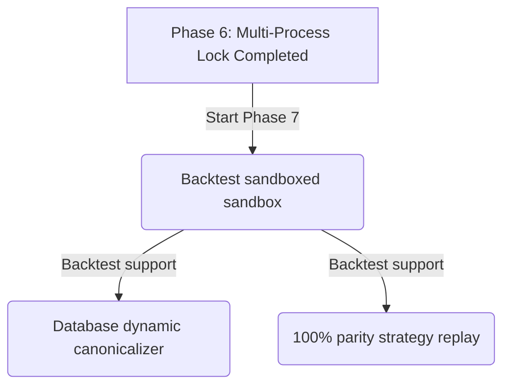

# 🎯 Trading Kernel 实施进度跟踪文档

> **最后更新时间**：2026-05-23 20:05  
> **当前状态**：🏆 已成功完成 Phase 0 至 Phase 7 核心骨架、确定性回放、模拟交易账簿、风控硬防、多进程行为自愈锁加固，以及全新的交易内核决策流水分析面板（DecisionFlowPanel）与数据契约测试。  
> **当前测试通过率**：`21 / 21 Passed (100%)`

---

## 📊 架构实施看板 (Implementation Status)

| 阶段 (Phase) | 描述 (Description) | 核心目标 (Core Objectives) | 交付状态 | 完成度 | 核心文件 / 模块 |
| :--- | :--- | :--- | :---: | :---: | :--- |
| **Phase 0** | **AST 代码边界守卫** | 自动静态检查，强制物理隔离 `decide` 的外部 I/O 导入。 | 🟢 已交付 | 100% | `test_import_boundaries.py` `test_redline_enforcement.py` |
| **Phase 1** | **确定性决策核心** | 定义无状态 `DecisionEngine` 与纯粹 the `StateManager` 锁。 | 🟢 已交付 | 100% | `decision_engine.py` `state_manager.py` |
| **Phase 2** | **信号规范化与旁路** | 实现 `StrategySignal` 统一数据管道并集成于选股窗口中。 | 🟢 已交付 | 100% | `signal_canonicalizer.py` `kernel_service.py` |
| **Phase 3** | **确定性回放引擎** | 实现 `ReplayRunner` 支持反序列化 trace 并 100% 幂等校验。 | 🟢 已交付 | 100% | `replay.py` `test_replay_equivalence.py` |
| **Phase 4** | **模拟交易适配器** | 建立 `PositionBook` 与 `AccountSnapshot` 实现平滑模拟交易。 | 🟢 已交付 | 100% | `execution_adapter.py` `paper_adapter.py` `test_paper_trading.py` |
| **Phase 5** | **风控限额与硬防** | 引入日内最大回撤、个股持仓上限与板块敞口硬阻断。 | 🟢 已交付 | 100% | `risk_gate.py` `test_risk_hardening.py` |
| **Phase 6** | **多线程安全状态** | 引入 `StateManager` 分级互斥锁与跨线程自愈防护。 | 🟢 已交付 | 100% | `state_manager.py` `test_state_concurrency.py` |
| **Phase 7** | **内核决策分析面板** | 提供统一的 PyQt6 决策监控面板，高精度增量解析 Journal 追溯链路决策。| 🟢 已交付 | 100% | `decision_flow_panel.py` `test_journal_contract.py` |
| **Phase 8** | **真盘柜台适配集成** | 基于 `ExecutionAdapter` 抽象层实现真实券商接口无缝对接。 | 🟡 待启动 | 0% | `broker_adapter.py` |

---

## 📂 已交付模块与文件追溯 (Deliverables Directory)

您可以点击以下链接直接穿透并浏览已实现的各核心层代码：

### 🧬 核心数据模型层 (Core Models)
- 📝 [core/signal.py](file:///d:/MacTools/WorkFile/WorkSpace/pyQuant3/stock_standalone/trading_kernel/core/signal.py) —— `StrategySignal` 统一标准特征包。
- 📝 [core/intent.py](file:///d:/MacTools/WorkFile/WorkSpace/pyQuant3/stock_standalone/trading_kernel/core/intent.py) —— 纯决定意图 `DecisionIntent` 与分析理由 `DecisionReason`。
- 📝 [core/risk.py](file:///d:/MacTools/WorkFile/WorkSpace/pyQuant3/stock_standalone/trading_kernel/core/risk.py) —— 风控批准单 `ApprovedOrder` 与风控决断 `RiskDecision`。
- 📝 [core/trace.py](file:///d:/MacTools/WorkFile/WorkSpace/pyQuant3/stock_standalone/trading_kernel/core/trace.py) —— 调用链路指纹 `KernelTrace`。

### ⚙️ 决策计算与风控引擎层 (Engine Layer)
- 📝 [engine/decision_engine.py](file:///d:/MacTools/WorkFile/WorkSpace/pyQuant3/stock_standalone/trading_kernel/engine/decision_engine.py) —— 纯函数式确定性决策核心。
- 📝 [engine/state_manager.py](file:///d:/MacTools/WorkFile/WorkSpace/pyQuant3/stock_standalone/trading_kernel/engine/state_manager.py) —— 无状态行为锁定锁（Behavior Lock）。
- 📝 [engine/risk_gate.py](file:///d:/MacTools/WorkFile/WorkSpace/pyQuant3/stock_standalone/trading_kernel/engine/risk_gate.py) —— 单向硬风控卡口评估器。
- 📝 [engine/signal_canonicalizer.py](file:///d:/MacTools/WorkFile/WorkSpace/pyQuant3/stock_standalone/trading_kernel/engine/signal_canonicalizer.py) —— 上游原始行情字段高保真规范化器。

### 📊 可观测性与确定性回放层 (Observability & Replay)
- 📝 [observability/journal.py](file:///d:/MacTools/WorkFile/WorkSpace/pyQuant3/stock_standalone/trading_kernel/observability/journal.py) —— 线程安全追加式 JSONL 账簿。
- 📝 [observability/trace_hasher.py](file:///d:/MacTools/WorkFile/WorkSpace/pyQuant3/stock_standalone/trading_kernel/observability/trace_hasher.py) —— 稳定 SHA-256 哈希散列签名器。
- 📝 [observability/replay.py](file:///d:/MacTools/WorkFile/WorkSpace/pyQuant3/stock_standalone/trading_kernel/observability/replay.py) —— 确定性逆向回放判定器（`ReplayRunner`）。

### 💻 操盘手可视化监控层 (GUI Observability)
- 📝 [tk_gui_modules/decision_flow_panel.py](file:///d:/MacTools/WorkFile/WorkSpace/pyQuant3/stock_standalone/tk_gui_modules/decision_flow_panel.py) —— ⚡ 交易内核决策流水监控面板 (pyqt6)。

### 💳 模拟交易执行适配层 (Execution Layer)
- 📝 [execution/execution_adapter.py](file:///d:/MacTools/WorkFile/WorkSpace/pyQuant3/stock_standalone/trading_kernel/execution/execution_adapter.py) —— 接口倒置交易执行抽象基类。
- 📝 [execution/paper_adapter.py](file:///d:/MacTools/WorkFile/WorkSpace/pyQuant3/stock_standalone/trading_kernel/execution/paper_adapter.py) —— 基于 PositionBook 的模拟盘高保真撮合执行器。

### 🧪 自动化红线回归测试集 (Test Suite)
- 📝 [tests/test_import_boundaries.py](file:///d:/MacTools/WorkFile/WorkSpace/pyQuant3/stock_standalone/trading_kernel/tests/test_import_boundaries.py) —— AST 静态边界导入硬红线测试。
- 📝 [tests/test_redline_enforcement.py](file:///d:/MacTools/WorkFile/WorkSpace/pyQuant3/stock_standalone/trading_kernel/tests/test_redline_enforcement.py) —— `StateManager` 零策略记忆红线测试。
- 📝 [tests/test_decision_determinism.py](file:///d:/MacTools/WorkFile/WorkSpace/pyQuant3/stock_standalone/trading_kernel/tests/test_decision_determinism.py) —— 纯决定引擎同输入同哈希幂等性测试.
- 📝 [tests/test_replay_equivalence.py](file:///d:/MacTools/WorkFile/WorkSpace/pyQuant3/stock_standalone/trading_kernel/tests/test_replay_equivalence.py) —— 100% 幂等回播流与篡改防伪核验测试。
- 📝 [tests/test_paper_trading.py](file:///d:/MacTools/WorkFile/WorkSpace/pyQuant3/stock_standalone/trading_kernel/tests/test_paper_trading.py) —— 模拟资金增减、加仓均价重算、浮盈套现闭环交易流测试。
- 📝 [tests/test_risk_hardening.py](file:///d:/MacTools/WorkFile/WorkSpace/pyQuant3/stock_standalone/trading_kernel/tests/test_risk_hardening.py) —— 10大严密风控指标（非交易时间、黑名单、过期、连亏冷却、最大回撤、冲高拦截、单股/板块/总持仓限额与单笔止损）测试。
- 📝 [tests/test_state_concurrency.py](file:///d:/MacTools/WorkFile/WorkSpace/pyQuant3/stock_standalone/trading_kernel/tests/test_state_concurrency.py) —— Windows 多进程下状态读写原子竞争与死锁超时秒级自愈测试。
- 📝 [tests/test_journal_contract.py](file:///d:/MacTools/WorkFile/WorkSpace/pyQuant3/stock_standalone/trading_kernel/tests/test_journal_contract.py) —— 决策追加与扁平解包数据契约测试。

---

## 🛡️ 架构红线守卫指标 (Redline Checkpoint Matrix)

> [!IMPORTANT]
> 系统的每一行代码变动，都必须绝对服从并完美通过以下四大原则的物理静态检查与回归测试：

- [x] **决策逻辑零 I/O (Stateless Decision)**：`decision_engine.decide` 必须纯函数化，禁止导入 `os`, `sys`, `pandas`, `db_utils` 等外部模块，拒绝一切磁盘/数据库写入与网络交互。
- [x] **锁管理器零策略记忆 (StateManager Purity)**：`StateManager` 仅充当多进程状态信号隔离器（Behavior Lock），不允许缓存任何买入均价、持仓盈亏 (PnL)、剩余本金等交易相关特征。
- [x] **单向指令流 (One-Way Instruction Stream)**：主链路严格遵循 `Raw Item -> Canonical Signal -> Stateless Decide -> Single-Way Risk Evaluation -> Statestore -> Journal` 单向传递，严禁出现回路或双向数据反向浸染。
- [x] **可防伪散列签名 (Anti-Tamper Signatures)**：链路中产生的所有 `StrategySignal`, `DecisionIntent`, `RiskDecision` 均由 SHA-256 签名守护。任意一行数据发生细微改动，哈希防伪均会断崖式报警，杜绝黑盒逻辑。

---

## 📈 下阶段实施战术路线 (Next Stage Action Plan)

### 1. 战术攻坚 Phase 7 (历史回测桥接器与多进程回测对接)
- 配合回放引擎 `ReplayRunner` 构建与历史行情数据库的直接对接，提供统一的数据 canonicalizer，为整个决定引擎大脑在不改变任何一行代码的前提下，提供 100% 精准的本地高速历史回测沙盒环境。

### 2. 战术攻坚 Phase 8 (真盘柜台适配集成)
- 基于 `ExecutionAdapter` 抽象层实现真实券商接口无缝对接，支持实盘一键柜台挂接，彻底打通整个 Trading Kernel 的实战闭环。
