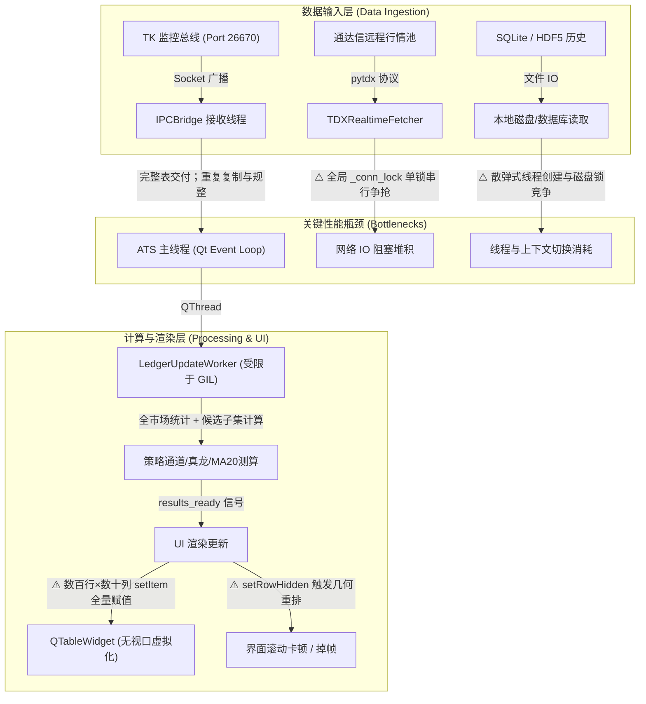
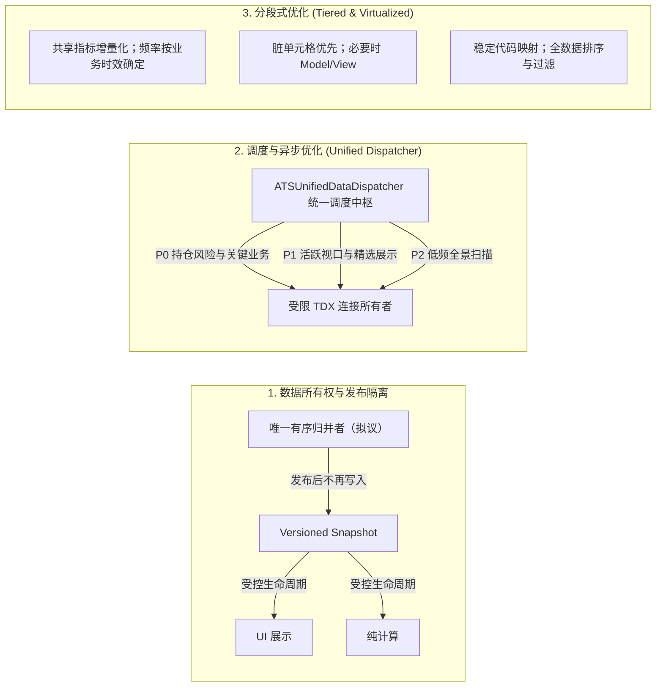

# ATS 系统全流程性能优化分析与实施方案规划（纯规划·不实施）

针对系统的 ATS (Autonomous Trading Terminal)、加载异步机制、数据读取链路、分段式优化体系以及全流程性能瓶颈进行系统性工程剖析，并制定分阶段演进的性能优化实施方案蓝图。

> [!IMPORTANT]
> **本次任务性质**：根据指令，**制定全流程性能优化分析实施方案，但不实施**既有工程代码变更。所有分析基于当前真实源码，方案严格遵循既有接口兼容、Windows 文件锁/多线程安全与 KISS/YAGNI/SOLID/DRY 原则。

> **2026-09-25 复核版**：本文件为正式方案入口。本轮仅静态核对源码、既有测试契约及官方技术文档，未运行系统、采样、压测或修改生产代码；原报告的毫秒耗时、CPU 降幅和包体大小没有实测依据，统一改为待验证预算。源码定位以本轮工作区为准（含用户已有修改），后续以符号名重新定位。

**优先结论**：先补协议与状态所有权，再做有界队列、后台纯计算和共享结果复用；随后优化脏单元格与启动依赖。Model/View、独立进程、共享内存和双轨传输均按实测瓶颈准入，不作为必建架构。

---

## 一、系统 ATS 现状全面深度剖析与五大性能瓶颈诊断



### 1. 瓶颈一：IPC 重复复制、基线并发与发布所有权
- **事实定位**：
  - [`ats/ipc_bridge.py:128-189`](file:///d:/MacTools/WorkFile/WorkSpace/pyQuant3/stock_standalone/ats/ipc_bridge.py#L128-L189)：网络接收后台线程解包后执行 `df_norm = df_payload.copy()` 进行差分合并，完成后执行 `df_to_deliver = self._cached_df.copy()` 深拷贝 5000+ 行全量表；
  - `ats/ipc_bridge.py:225` 调用 `data_callback(df_to_deliver)`，经 `main_window.py:3746` 的信号进入 `_handle_realtime_data`；正常路径是裸 DataFrame，主线程走全量分支。重复复制与索引规整成立，**每帧二次差分合并不成立**，diff 分支是待审计的兼容路径；
  - `IPCBridge.start_realtime_listener` 按连接创建线程，共享 `_cached_df`；全量路径发布缓存对象本身，后续差分可能原位写它，直接删除 UI 防御性复制存在一致性风险。
- **待测影响**：复制字节率、归并耗时与对象驻留。30~80ms、数十 MB/s 尚未采样，不能直接归因为 Minor GC。

### 2. 瓶颈二：通达信 (pytdx) 单一长连接与全局互斥锁串行争抢
- **事实定位**：
  - [`ats/tdx_realtime_fetcher.py:2028, 3280`](file:///d:/MacTools/WorkFile/WorkSpace/pyQuant3/stock_standalone/ats/tdx_realtime_fetcher.py#L2028)：`TDXRealtimeFetcher` 全局仅一个 API 实例，所有请求受单一锁 `with self._conn_lock:` 串行保护；
  - 虽然 SBC 图表实现了 `SBCGlobalDispatcher`，但新股雷达（`NewStockFetcher`）、涨停天梯（`LimitUpEngine`）、板块矿工（`SectorRotationPullbackMiner`）等仍在各自线程直调 TDX API；
- **待测影响**：锁内网络请求会拖延共享连接消费者；只有确认主线程同步等待或计算阻塞，才能判定 GUI 假死，数据停更需单独计量。统一单线程后仍有调度排队和慢请求队首阻塞。

### 3. 瓶颈三：Qt 表格全量属性更新、排序及布局成本
- **事实定位**：
  - [`ats/ui/swing_table.py:333-470`](file:///d:/MacTools/WorkFile/WorkSpace/pyQuant3/stock_standalone/ats/ui/swing_table.py#L333-L470)：遍历全表（数百行×数十列），逐个设置 `QTableWidgetItem` 属性；
  - [`ats/ui/swing_table.py:545-556`](file:///d:/MacTools/WorkFile/WorkSpace/pyQuant3/stock_standalone/ats/ui/swing_table.py#L545-L556)：`_apply_favorite_filter` 对每行调用 `setRowHidden`，反复触发布局几何尺寸重算；
  - [`ats/ui/ipo_command_room_dialog.py:1599-1630`](file:///d:/MacTools/WorkFile/WorkSpace/pyQuant3/stock_standalone/ats/ui/ipo_command_room_dialog.py#L1599-L1630)：每次刷新直接重新 `setRowCount` 并全新 `new` 出所有单元格 item，引发 C++ 对象频繁生灭；
- **待测影响**：Qt Widgets 不使用 DOM；已存在 item 复用，主要需量化无变化属性更新、排序、行隐藏和布局成本。25~35 行取决于窗口与 DPI，50~120ms 未实测，屏外数据仍须参与排序、过滤和导出。

### 4. 瓶颈四：计算密集型策略对 Python GIL 的挤占与主线程响应延迟
- **事实定位**：
  - `LedgerUpdateWorker.run()` 承担了 MA20 通道几何测算、资金主线分析、全表均线循环构建等大量纯 Python 运算；
- **待测影响**：纯 Python 工作可能挤占 GIL，但向量化/native 工作不能一概而论；需区分 CPU 时间、I/O 等待和 GUI 线程直接计算。Worker 还调用账本更新、投影同步及文件快照，并非可以随意取消的纯函数。

### 5. 瓶颈五：散弹式历史/价格补齐与磁盘锁争抢
- **事实定位**：
  - `ats/ui/main_window.py:4412`：`_flush_batch_stock_prices` 已有防抖合批，但每批新建线程；取得 `hdf5_history_lock` 后才调用新浪 HTTP，网络耗时被纳入锁持有期。超时后标记失败，不应未经核对重试策略就断言循环重试。
  - 拆锁前须审计 `Sina(readonly=True)` 的内部缓存与 HDF5 访问；不能直接将现有锁删除。

---

## 二、架构优化方案总览（加载异步、数据读取、分段式优化）



### 1. 加载异步化重构（Async Architecture）
- **主线程热路径无同步 I/O**：接收、唯一归并、纯计算和 GUI 投影分责；不把所有重计算搬进 Socket 接收线程。GUI 仍负责模型提交、布局与绘制，完整回调不能用指针赋值耗时代替；
- **策略计算隔离评估**：先减少重复工作与 Python 对象展开；独立进程只接纯计算，实测覆盖启动/序列化/回传成本后再准入，共享内存另行评估；
- **常驻 Worker 与代际守卫**：每类可合并工作采用一个运行任务加一个最新待处理槽；结果携带版本。账本与信号事件保序处理，不能使用全局 Drop-on-Busy。

### 2. 数据读取全流程优化（Data Ingestion Pipeline）
- **发布隔离契约**：单写者更新私有工作版本，发布版本在所有读者释放前不得修改；先保留必要的隔离复制，再测量减少冗余复制。Pandas CoW 不等于线程同步，也不能靠版本标签冻结对象；
- **统一数据调度**：复用 SBC 已有机制，增加请求合并、容量、截止时间、优先级老化与失败退避；避免重新制造一条无界慢任务队列；
- **分层缓存**：复用 `TDXGlobalCachePool`、已有 RamDisk 与磁盘缓存，增加版本/交易日失效及字节上限；不默认新增 Feather/Arrow 或持久化系统。

### 3. 分段式优化架构（Segmented Optimization）
- **渲染分段**：先脏单元格、样式复用及隐藏页按需刷新；仍超预算的单表再迁移 `QAbstractTableModel + QTableView`，可见范围由实际布局决定；
- **行过滤分段**：使用全数据排序/过滤映射，按稳定证券标识恢复选中和滚动锚点；未变化过滤条件不重复设置行隐藏；
- **计算分段（三级梯度）**：
  - Tier 1（候选 P95 <3ms）：动态报价投影与依赖列变化触发的向量运算；
  - Tier 2（候选 P95 <15ms）：核心标的计算，风险与状态转换频率保持现有业务语义；
  - Tier 3（候选 P95 <80ms）：允许低频的全景统计，周期通过时效契约确定；
- **传输分段（后期候选）**：先列裁剪与订阅合并，再考虑双轨。5000 行 × 6 个 float64 字段已有 240000 字节，未计索引和协议头，不能承诺全市场 <15KB；`vwap/rank` 并非静态字段。

---

## 三、分阶段实施演进路线图（Stage 0 至 Stage 5）

> [!NOTE]
> 实施路线严格遵循“基线先行、热点分离、逐步推进、指标量化”的准入驱动原则。

| 阶段 | 阶段名称 | 核心改造范围 | 准入门禁与可衡量预期成果 |
| :--- | :--- | :--- | :--- |
| **Stage 0** | **基线、契约与黄金样本** | 复用 `ats/startup_profiler.py`，规划端到端探针 | 记录运行环境、调用线程、业务输入与输出，形成可重复回放；所有预算经基线校准 |
| **Stage 1** | **唯一归并、快照隔离与协议保真** | `ats/ipc_bridge.py`, `ats/ui/main_window.py` | 版本、跨日、缺包、空值与慢读者验证通过；减少冗余复制后摄入 P95 <2ms 为候选目标 |
| **Stage 2** | **有界调度与缓存治理** | 复用 SBC Dispatcher、TDX fetcher/cache pool | 关键请求不被 UI 抢占，容量有上限，锁等待和队列等待同时统计，失败可恢复 |
| **Stage 3** | **纯计算与业务提交分离** | `LedgerUpdateWorker`, `LedgerUpdateService`, 各引擎 | 一版输入复用一版结果，过期输出不污染业务状态；按热点决定是否进程化 |
| **Stage 4** | **表格增量更新与按需模型迁移** | `swing_table.py`, `favorite_panel.py`, `ipo_command_room_dialog.py` | 全数据排序、选择、过滤和导出保真；增量更新 P95 <3ms 为候选目标 |
| **Stage 5** | **故障注入、退出与长周期验证** | 现有影子工具适配性核验；回放/监测能力待规划 | 先短回放再 4h/72h，记录内存斜率、句柄与任务数；不得声称有限压测证明零泄漏 |

依赖：Stage 0 是全部实施的前提，Stage 1 先于共享快照优化；Stage 2/3/4 可按基线热点分支推进，不强制串行大改。启动优化在 Stage 0 测量、Stage 2/3 落地，退出契约随资源引入同步设计，最终由 Stage 5 验证；本轮所有 Stage 均未实施。

---

## 四、验证计划（针对未来若启动实施的验收标准）

### 自动化测试与 Golden Samples 比对
```powershell
# 1. 语法与模块编译检查
python -m compileall ats tests -q

# 2. 核心回归测试与 Golden Samples 比对验证
pytest tests/test_ipc_trade_rollover.py tests/test_tk_frame_fingerprint.py tests/test_p1_ledger_single_entry_hardening.py -v

# 3. 影子工具先审计 CLI、隔离性与测量范围，再制定调用命令
# 不把 dry-run 成功视为 GUI 性能或 72 小时压测通过
```

### 关键性能指标阈值（KPI Gate）
以下均为 **Stage 0 待校准预算**，不能据此宣布达标；耗时需注明样本数量、硬件、数据规模、窗口数和预热条件。

| 指标 | 候选门槛 | 口径与限制 |
| :--- | :--- | :--- |
| IPC 摄入 GUI 回调 | P95 <2ms、P99 <5ms | 入口至返回，包含同步调用，不包含后续绘制；独立记录端到端时延 |
| 其他 GUI 短回调 | P95 <5ms | 同时报告 P99/max 与长任务占比，不能用平均值掩盖卡顿 |
| 可见区域增量更新 | P95 <3ms、P99 <8ms | 排序、布局、paint 分开测；不作为全列表渲染预算 |
| GUI 事件循环滞后 | P95 <8ms、P99 <16ms | 用单调时钟记录预定/实际调度时刻；不等同于 120 FPS |
| TDX 服务质量 | 按请求类别截止时间和数据年龄验收 | 分列排队、锁等待、网络服务时间；不要求排队为零 |
| 内存与生命周期 | 预热后稳态无持续上升，候选 4h 增幅 ≤5% | 同时报绝对增长、Private Bytes/RSS、Python 分配、句柄与缓存容量；72h 检查增长趋势 |
| 业务保真 | 离散状态、事件顺序、数量一致 | 浮点容差按字段制定，不能掩盖阈值跨越；已知旧缺陷单独审批，禁止借优化悄然更改 |

## 五、结构性补充：源码证据与已有能力复用

此表区分“可静态确认的行为”和“仍需测量的影响”，不把注释中的性能描述视为测量结果。

| 编号 / 优先级 | 源码锚点（本轮行号） | 已确认行为 | 补充优化与待验证影响 |
| :--- | :--- | :--- | :--- |
| A1 / P0 | `ats/ipc_bridge.py:39` `start_realtime_listener`、`:91` `_handle_client` | 按连接创建线程，共享缓存；`recv(4)` 单次读取头，`data += packet` 拼接 | 受限收包、完整读头、长度上限、累计截止时间、唯一归并者；量化拼接复制与同时在途字节，不仅限制线程数 |
| A2 / P0 | `ats/ipc_bridge.py:196`、`:213`、`:225` | full 分支直接发布缓存；ACK 传回 `source_version/sync_session`，UI callback 只传表 | 保留帧元数据和所有权，审计 `sector_data` 等旁带字段是否在该路径丢失；ACK 必须对应确定的接受阶段 |
| A3 / P0 | `ats/ui/main_window.py:72`、`:217`、`:234`、`:246` | Worker 借用 ledger/profiler/universe/cache，写账本、快照及投影 | 划定状态所有者，纯计算与提交拆分；仅丢 results_ready 无法撤销业务副作用 |
| A4 / P1 | `ats/ui/main_window.py:4224`、`:4259`、`:4799` | UI 调用天梯更新；`singleShot` 中执行直方图统计；结果回调再次调用天梯 | 延迟不是后台化；一次计算、多处订阅，量化实际计算次数与主线程 CPU |
| A5 / P1 | `ats/limit_up_engine.py:488`、`:554`；`ats/capital_dragon_engine.py:472` | 天梯有 1.5s 节流但空缓存时可能继续扫描；资金引擎有 1s 缓存 | 区分“成功计算但为空”与“未计算”，结果按依赖版本失效；重复调用不等于每次重算 |
| A6 / P1 | `ats/ui/main_window.py:4412`、`:4715`、`:4743` | 价格防抖合批后持 HDF 锁发 HTTP；Worker busy 时跳过，闲时新建 QThread | 审计锁粒度、统一批次在途去重；常驻 Worker 增加最新待处理槽与异常复位，不重复建防抖机制 |
| A7 / P1 | `ats/ui/intraday_strategy_dialog.py:4357`、`:7347` | 已有 SBC 注册订阅、唤醒、QueuedConnection、窗口 epoch/pending | 渐进扩展为统一调度接口；保留代码/周期切换守卫与关闭窗口保护 |
| A8 / P1 | `ats/ui/main_window.py:4790`、`:4826` | 活跃 Tab 立即更新，隐藏 Tab 已设脏标记 | 扩展统一版本与一次通知，不再把“所有隐藏页每帧全画”当现状 |
| A9 / P1 | `ats/tdx_realtime_fetcher.py:1569`、`:2907`、`:2959` | 已有多日/增量缓存、交易时段保护、40 只分批；锁包围整个批次循环 | 报价 40 为本仓现有配置，不能推广为所有 API 硬上限；批次间调度让出，复用 cache generation |
| A10 / P1 | `ats/main_ats.py:33`、`:42`、`:79`；`main_window.py:1898`、`:3723`、`:6431` | 主窗口导入在 profiler 里程碑前；启动恢复昨日快照；刷新查文件 mtime；退出使用 `os._exit` | 覆盖导入至首个可信快照，核验构造器传递 I/O；数据库 WAL 模式下不能只依赖主文件 mtime；资源清理不能只依赖 atexit |

## 六、数据与并发契约：极限优化前的必要条件

### 6.1 IPC 顺序、ACK 与空值保真

1. **逻辑单写者**：接收线程不直接写共享基线；唯一归并者按发送端定义的顺序接受更新，不能拿连接完成顺序代替行情顺序。先复用现有 `source_version/sync_session`，审计其递增含义后再决定是否扩展 `base_version/schema_version/trading_day`。
2. **版本有效性**：会话变化、跨日、基线缺失、重复、乱序、结构变化分别定义处理；若 source_version 允许跳号，用显式基线关系校验，不能简单把非连续整数判成丢包。无法验证依赖链则限频请求 full，并保留最后可信快照及 stale 标记。
3. **接受后确认**：ACK 表示包已校验并有序归并、可供恢复/发布的版本已被接受，不表示 GUI 已显示或业务已提交。失败包不得伪成功 ACK；若现有生产端确认语义不同，先双端兼容迁移与重放验证，再改变确认时点。
4. **空值与删除**：当前 `notna()` 合并不能表达“将旧值清空”；复用发送端空值逆转、行列结构变化回退 full 的契约，不先修改一端。显式空值掩码、删除标记仅作为协议升级候选；证券标识须含市场语义，不能把指数和同号个股压成同一个键。
5. **收包边界**：固定长度头需完整读取；包体设字节上限、累计超时与最大同时在途容量。先归并 diff 才能合并展示通知，不能在网络输入阶段任意丢弃增量。

### 6.2 快照生命周期与有界邮箱

- **第一阶段保守隔离**：生产者拥有可变工作版本，发布独立快照；只删除已证明冗余的复制。标签、浅复制和 GIL 均不能替代发布后不再写入的契约；object 列中的嵌套可变对象也需规整或隔离。
- **第二阶段按需减少复制**：热数值列投影、静态列按版本复用；只有写路径与读者生命周期全部明确后，再评估块级复制或缓冲池。Pandas CoW 版本/配置需记录，不能作为无条件线程安全依据。[Pandas copy 文档](https://pandas.pydata.org/docs/reference/api/pandas.DataFrame.copy.html)
- **UI 邮箱**：最多一个待消费展示快照、一个待处理通知；消费者读取最新版本后，受同步保护地清理/重新检查通知标记，防止生产者恰好写入导致丢唤醒。仅在 GUI slot 丢旧帧仍无法阻止 Qt 事件队列积压。
- **计算邮箱**：一个运行任务加一个最新待处理请求；过期纯计算可在安全点取消，但设置完成/发布时间上限，防止行情持续到达导致永远取消。全局市场帧、窗口代码/周期、策略配置、交易日分别带代际，结果匹配相应依赖后才提交。
- **读者回收**：计算完成、取消、异常、窗口关闭均释放快照引用；固定池满时合并展示需求或受控回压，不能覆盖仍被读取的缓冲，也不能无限创建新版本。

### 6.3 展示快照与业务事件分流

| 数据类别 | 可否 latest-only | 顺序和溢出策略 |
| :--- | :--- | :--- |
| 单元格当前报价、直方图展示 | 可以，须保留最后可信时间和版本 | 覆盖待显示槽，监测快照年龄；diff 输入先归并 |
| 无副作用的全景统计请求 | 有条件可以 | 明确依赖版本和最长完成时间；结果不直接改账本 |
| 突破/回落状态、峰值、累计量、告警触发 | 默认不可以 | 可能依赖中间路径，保序计算或保真聚合，不能仅看末帧 |
| 交易事件、账本迁移、持仓核对 | 不可以 | 唯一所有者提交、事件 ID 幂等；沿用原有持久化语义，有界满载时回压或可恢复溢写并明确失败状态 |

- 现有 Worker 已写账本，后续设计须先明确“计算→校验→提交”边界；可取消部分不接收可变 ledger、QObject、数据库连接或锁对象。
- 即便当前业务路径本身已跳帧，新方案也需对齐相同输入与时序基线；改变策略采样频率属于语义变化，不能用性能优化默认授权。

## 七、各层可继续补充的优化方案

### 7.1 TDX/HTTP 调度：消重优先于扩容

- **请求键**：`来源 + 市场/代码 + 数据类型/周期 + 范围 + 复权口径 + 交易日/代际`；相同键的在途请求合并为一次拉取、多订阅者分发，force 请求必须受配额和合并规则约束。
- **优先级**：P0 持仓风险与关键业务，P1 激活视口与交互，P2 历史回填和全景；隐藏窗口只降低展示订阅，不能关闭风险计算。低优先级使用等待时间提权或配额保证，防止长期饿死。
- **容量与截止时间**：分别限制等待任务数、合并键数、订阅者数、在途请求和字节；入队前淘汰已过期的可替代请求。运行中的阻塞网络调用通常不能被新高优先级任务抢占，需传输超时和批次间让出。
- **故障隔离**：先单连接所有者加慢任务分段；若关键数据仍被历史回填拖延，再评估至多两个独立连接通道，各自独占 API 实例，并控制总请求速率。不能让多个 Worker 并发使用同一个 pytdx 连接。
- **恢复**：超时使用有上限的退避与抖动、熔断和少量探测请求；返回缓存时附数据年龄/失败原因，风险消费者按业务最大年龄拒绝不可信数据。取消订阅后没有消费者的等待任务可撤销，在途结果不再触碰已关闭对象。

### 7.2 数据读取、缓存与持久化

- **不建第二套缓存**：复用 TDXGlobalCachePool、历史缓存及现有代际失效；记录命中/过期/负缓存命中、重复拉取与每类字节占用。TTL 不替代数据版本，跨日、复权、配置变更、数据修订、停复牌均纳入失效表。
- **负缓存**：区分成功空结果、未上市/停牌、网络失败和非法请求；失败短冷却并退避，成功空结果可按交易时段复用，避免空集每帧重算。行情恢复或交易日切换必须解除旧失败状态。
- **最小读取**：历史数据按证券、日期范围和必需列读取，批量合并区间；缓存规范化代码及静态名称。SQL 索引和投影优化必须基于真实查询计划，不能凭列名盲目加索引。
- **锁粒度**：为价格补齐、历史读取、序列化与提交分别记录锁时间；在确认底层副作用后将纯网络等待移出磁盘临界区。跨线程/跨进程连接和 HDF 句柄归属明确；不假定 HDF5 可安全并行写，也不为提速降低既有数据库持久性。
- **写入分级**：可重建历史统计批量写，业务事件保持必要确认；临时文件与目标同目录、关闭句柄后原子替换，Windows 文件占用需有限重试和保留上一版。遥测日志异步合批、采样和轮转，防止优化探针成为新 I/O 热点。

### 7.3 增量计算与共享结果工厂

- **依赖表先行**：按引擎声明输入列、历史窗口、交易日、配置与输出；行情、均线、板块映射只规整一次，同版本 `CapitalDragonEngine`/`LimitUpEngine` 报告供 Worker、主面板和弹窗复用。已有 1s/1.5s 缓存保留为保护，增加版本有效性。
- **按脏依赖重算**：价格变化只更新依赖价格的指标；历史 MA/通道等在 bar 完成、修订或配置变化时失效。板块聚合需维护旧贡献减去、新贡献加入，成员迁移/空值/修订触发正确失效；全市场排名不得只重算当前可见行。
- **减少 Python 展开**：`target_df.to_dict('index')` 已是候选子集，先裁剪实际需要的列，再比较数组/元组投影；滚动和/极值增量化须覆盖当前未完成 bar、重复更新、回补修订与数值误差，不贸然降低浮点精度。
- **状态计算保真**：阈值穿越、告警、累计量与风险计算保留时间序列语义；纯展示统计才可降频。主线程现有 `pd.cut` 和天梯扫描移入纯计算结果生产侧，`QTimer.singleShot` 仅用于轻量提交。[Qt 定时器文档](https://doc.qt.io/qt-6/qtimer.html)
- **进程准入**：测量 `T打包 + T传输 + T计算 + T回传 + T提交` 是否低于现状且改善 GUI P99；先一条常驻纯计算进程，避免多个重型实例和 BLAS 线程过量竞争。Windows 使用可导入顶层入口与 spawn 兼容设计，已有 `run_ats.py` 的 `freeze_support` 要复用并验证打包入口。[Python multiprocessing](https://docs.python.org/3/library/multiprocessing.html)
- **共享内存后置**：仅适用于传输已成为主耗时的数值块；生产者填充、版本提交、读者租约及释放分别定义，不在共享区放 Python 对象指针。Windows 必须关闭所有句柄后才能回收映射；取消、子进程崩溃、退出均覆盖，不以“零序列化”承诺零成本。[Python SharedMemory](https://docs.python.org/3/library/multiprocessing.shared_memory.html)

### 7.4 UI：增量投影、模型线程和真实绘制

- **渐进顺序**：现有 item 原位复用 → 值/颜色/字体/提示内容未变则跳过 → 过滤/排序结果复用 → 热点单表 Model/View。不要把数百行直接认定为必须自建虚拟滚动器。
- **排序与身份**：保存当前排序字段/方向，按稳定证券键恢复选中、编辑、上下文菜单和滚动锚点；排序映射覆盖全部行，复制/导出不能只导出视口。区分“全局过滤后的行映射”和“屏幕可见范围”。
- **模型线程**：Worker 产出普通数据，GUI 线程执行 model 数据变更和 `dataChanged`/行增删/布局通知；后台不能直接操作 QAbstractItemModel。避免每帧 resetModel，必要 reset 时显式恢复状态。[Qt 模型线程要求](https://doc.qt.io/qt-6/qabstractitemmodel.html#thread-safety)
- **布局成本**：仅结构/可见性改变时处理隐藏、行高和列宽；固定样式对象复用，Tooltip 等低频内容按需产生。QTableView 按需取数不代表其排序/布局天然只消耗可见行成本。
- **交互优先**：拖拽缩放期间合并装饰更新，业务数据处理持续运行；隐藏页只保留最新版本，重新显示时一次补齐。统计更新调用与 paint 的实际耗时，禁止用 `processEvents()` 循环掩盖长任务并引入重入。

### 7.5 启动加载与退出闭环

- **启动依赖图**：运行时/导入 → QApplication/最小窗口 → IPC 接入 → 可信基线 → 必需账本恢复 → 当前页 → 历史预热/其他窗口。只并发独立的 I/O 工作，QWidget 创建留在 GUI 线程；业务状态未就绪时不发布可操作的“已就绪”状态。
- **四个里程碑**：进程开始、首个可交互窗口、首个可信行情、关键业务状态就绪；冷启动与热启动分别采样，含 TK 不在线、缓存不存在和磁盘慢场景。复用 StartupProfiler，但补齐导入前的计时覆盖，不能仅统计 `window.show()`。
- **配置/文件检测**：构造器及其依赖项逐项审计 I/O；重复配置读取合并，文件变化检测后台化。数据库若采用 WAL，主文件 mtime 不是可靠的全部变更指示，评估同连接 `PRAGMA data_version` 或业务版本契约，先验证实际存储模式。
- **有序退出**：停止接新任务 → 停止定时器/订阅 → 取消可重建工作 → 有期限地完成业务写入 → 回收网络/线程/进程/共享内存 → 退出。主线程不做无限 join；处理晚到信号和已删除窗口，必要未完成业务状态显式留痕，不依赖 `os._exit` 后的清理钩子。

## 八、结构性能上限与容量模型

没有基线不能报“系统极限 FPS/TPS”。以下模型用来判断优化是否迁移了瓶颈，输入由 Stage 0 实测填入。

| 维度 | 模型 / 测量口径 | 决策意义 |
| :--- | :--- | :--- |
| 端到端时延 | 单帧各阶段排队与服务时间之和，额外记录源数据年龄 | 按 frame_id 关联接收、归并、计算、提交和 paint；各阶段 P99 不能简单相加当总体 P99 |
| 网络容量 | 单通道利用率 `ρ = Σ(请求率_i × 平均服务秒_i)` | `ρ >= 1` 无法长期稳定；Stage 0 后留波动余量，先消重/合批，不能靠调优先级制造吞吐 |
| GUI 预算 | 窗口内 GUI 工作总量 `Σ(触发率_i × 单次 GUI 耗时_i)` | 每个回调都小于 2ms，叠加大量回调仍会卡顿；同时限制通知率和每轮处理预算 |
| 复制/传输 | `动态行数 × 投影列宽 × 帧率 × 复制次数`，另计 object/索引/协议头 | 衡量列裁剪与低复制的真实收益；快轨大小以编码后字节测量 |
| 驻留内存 | 工作基线 + 在读版本 + 待处理槽 + 缓存 + Python/Qt/native 开销 | latest-only 只有在通知和读者数量也有界时才能限制内存 |
| 加速上限 | `S <= 1 / ((1-p) + p/s)`，p 为目标环节的实测耗时比例 | 示例：占比 20% 的环节即使零耗时，总体最多约 1.25 倍；禁止把局部收益当整体收益 |

- **测试规模**：1000/5000/10000 行，按实际字段组成设置窄/宽表；0/1/5/10 个可见窗口，50/300/1000 行表格，1/3/10Hz 回放、1%/10%/100% 变更率；高档为压力场景，不暗示生产源具备此频率。
- **环境记录**：CPU 核数与频率、电源模式、内存、磁盘/RamDisk、Python/Pandas/Qt 版本、CoW 设置、DPI、打包方式；同环境同输入至少多轮比较，开盘突发与稳态分开报告。
- **采样分层**：轻量计时/计数长期采样，Python 分配与 native/Qt 资源专项采样，避免重型探针对所有帧全开；对比有/无探针开销。CPython 循环 GC 与引用计数并存，数组分配或 RSS 增长本身不证明 GC 卡顿。[Python GC 文档](https://docs.python.org/3/library/gc.html)
- **降级闭环**：依据队列年龄、事件滞后、CPU、内存和数据新鲜度持续越界触发；先暂停预热/装饰，再降低纯全景刷新，保留关键业务。进入与退出使用不同阈值、持续窗口和最小驻留时间，防止反复震荡；恢复时错峰预热，禁止同时补齐所有欠账。

## 九、验证矩阵、回退与阶段交付物（均待实施）

### 9.1 可复用的测试资产与需要补齐的覆盖

| 资产 | 可复用契约 | 待补充的真实路径覆盖 |
| :--- | :--- | :--- |
| `tests/test_ipc_cold_start_baseline.py`、`test_ipc_trade_rollover.py` | 冷启动/跨日缺基线拒绝 diff | 多连接乱序、断头/断包、ACK 丢失、会话切换、UI 版本信封 |
| `tests/test_tk_perf_diff_null_fidelity.py` | 空值逆转/结构变化回退 full 的模拟契约 | TK 实际发送器 → Bridge → GUI 的端到端测试，不能用模拟器代替完整协议验证 |
| `tests/test_sbc_async_load_dispatcher_and_dirty_check.py` | 订阅唤醒、代际守卫、在途合并、QueuedConnection | 全系统调度、公平性、容量、关闭重开、晚到结果、慢请求抢占边界 |
| `tests/test_tdx_cache_deforcing_and_invalidation.py`、`test_tdx_hdf_multitable_preservation.py` | 去 force、generation 失效、历史表保护 | 跨日负缓存、并发读者、锁内网络时间、缓存字节回收 |
| `tests/test_p1_ledger_single_entry_hardening.py` | 账本单入口约束 | 相同事件序列下状态/信号不丢不重，取消后无半提交，进程重启恢复 |

- **Golden Samples**：覆盖正常全量/差分、空值逆转与删行、跨日重连、突发行情、业务阈值往返及多窗口切换；记录输入时间、配置、账本起始状态和期望事件序列，固定随机性/时钟边界，禁止仅比最终 DataFrame。
- **竞态测试**：读者暂停时继续发下一帧，确认旧快照不变；生产者在通知清标记瞬间发布，确认不丢唤醒；先完成新 epoch 再完成旧 epoch，确认不倒灌；行情持续高于计算能力时仍有受控年龄的结果发布。
- **故障注入**：慢网络/部分读/重复包/缺包、磁盘锁占用/写失败、Worker 异常、窗口销毁、子进程退出；验证预算有界、旧数据可识别、业务事件可恢复，以及恢复后无请求风暴。
- **UI 回归**：排序、过滤、快捷键、选中、多选、复制导出、滚动锚点、不同 DPI、缩放和隐藏恢复；只保真截图不足以证明模型索引正确。
- **持久运行**：短回放正确性通过后再做 4h 与连续 72h（不等同于三个交易日）；预热后按固定窗口统计内存/句柄/线程/快照计数及回收后的稳态。结果只能描述“在该负载下未观察到泄漏”。

### 9.2 每阶段必须形成的交付物

- Stage 0：环境与负载清单、原始样本、分位数/尾部样本、输入输出真值、热点排序；无此产物不定性能收益。
- Stage 1：版本/空值/所有权契约、兼容入口清单、copy/ACK 前后对照、旧快照不变及重连恢复证据。
- Stage 2：各 API 请求清单、去重键、容量和截止时间表、缓存失效表、公平性与故障恢复结果。
- Stage 3：指标依赖图、纯计算边界、唯一状态提交职责、同版本复用率、策略事件保真及总 CPU/延迟对照。
- Stage 4：逐表更新/排序/布局/paint 分解、交互回归、是否迁移模型的决策记录。
- Stage 5：端到端负载报告、72h 资源趋势、恢复与退出时限、回退演练；不能用单元测试通过代替性能验证。

### 9.3 回退契约

- 每阶段独立开关或适配层，影子路径只计算和对比，不重复写账本、发告警或触发交易副作用；协议升级先具备能力协商，旧发送端/接收端继续使用现有 full/diff 契约。
- 发现状态分歧即停新路径；性能退化按相同负载的 P95/P99、数据年龄和资源水位判断。回退所有权或传输路径时先停止新提交、排空/取消可重建工作、重建可信 full 基线，再恢复单一写者，不能新旧路径同时修改同一状态。
- 不默认引入 Redis、Ray、Dask、GPU、JIT、Arrow、RamDisk 新层或全项目重构；只有现有能力无法达到经确认的预算，才独立评估依赖、打包、运维及收益。

## 十、实施优先级建议与本轮边界

| 顺序 | 建议工作 | 收益路径 | 复杂度 / 风险 |
| :--- | :--- | :--- | :--- |
| 1 | 基线与 IPC/业务状态契约 | 避免以错误根因或丢业务换取性能 | 中；后续所有低复制与丢帧的前提 |
| 2 | 收包单写者、有界通知、锁内 I/O 审计 | 控制尾延迟与积压，保护数据一致性 | 中；协议和所有权风险较高 |
| 3 | 请求合并、缓存失效、同版指标复用 | 减少重复网络与重复全表扫描 | 中；复用已有 SBC/cache/engine |
| 4 | UI 脏更新、启动依赖与退出治理 | 减少无用绘制和首屏等待 | 低至中；逐表、逐依赖验收 |
| 5 | 条件化 Model/View、纯计算进程 | 解决实测残余 UI/CPU 热点 | 中至高；语义和 Windows 生命周期需验证 |
| 6 | 共享内存、双轨协议、额外连接 | 仅解决已确认的传输/队首阻塞瓶颈 | 高；不作为默认实施项 |

本轮交付为文档修订与源码事实校准；上述 API、队列、遥测、测试扩展和性能目标均为规划，未实施、未运行、未宣称达标。技术依据为所链接的 Pandas、Qt、Python 官方文档，实际实施需匹配本机依赖版本；历史任务记录见 [20260925_0938_task.md](../20260925_0938_task.md)。
