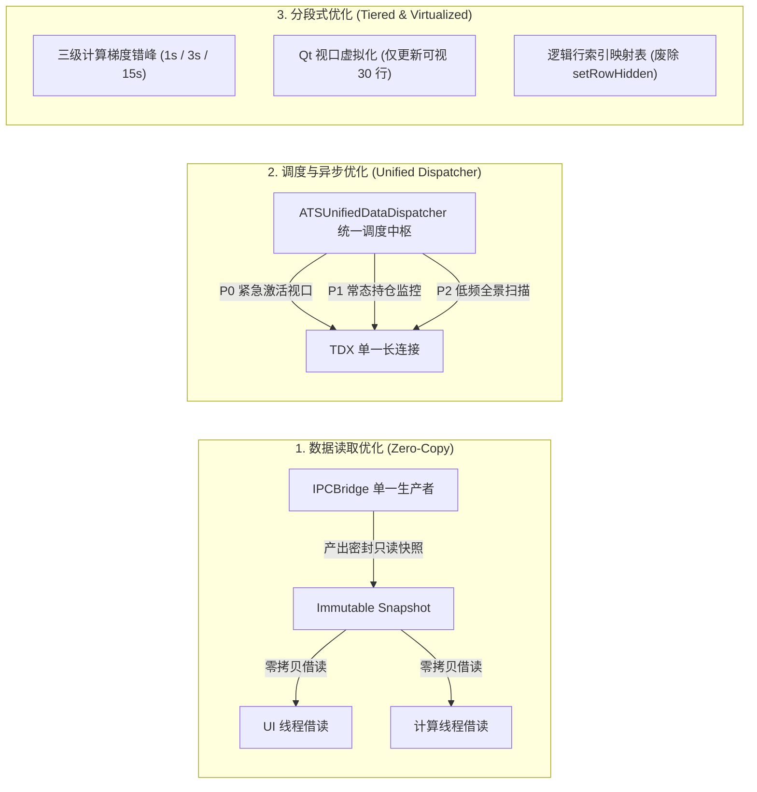

# ATS 系统全流程性能优化分析与实施方案规划（纯规划·不实施）

针对系统的 ATS (Autonomous Trading Terminal)、加载异步机制、数据读取链路、分段式优化体系以及全流程性能瓶颈进行系统性工程剖析，并制定分阶段演进的性能优化实施方案蓝图。

> [!IMPORTANT]
> **本次任务性质**：根据指令，**制定全流程性能优化分析实施方案，但不实施**既有工程代码变更。所有分析基于当前真实源码，方案严格遵循既有接口兼容、Windows 文件锁/多线程安全与 KISS/YAGNI/SOLID/DRY 原则。

---

## 一、系统 ATS 现状全面深度剖析与五大性能瓶颈诊断


### 1. 瓶颈一：IPC 链路多重深拷贝与双重差分合并
- **事实定位**：
  - [`ats/ipc_bridge.py:128-189`](file:///d:/MacTools/WorkFile/WorkSpace/pyQuant3/stock_standalone/ats/ipc_bridge.py#L128-L189)：网络接收后台线程解包后执行 `df_norm = df_payload.copy()` 进行差分合并，完成后执行 `df_to_deliver = self._cached_df.copy()` 深拷贝 5000+ 行全量表；
  - [`ats/ui/main_window.py:4123-4171`](file:///d:/MacTools/WorkFile/WorkSpace/pyQuant3/stock_standalone/ats/ui/main_window.py#L4123-L4171)：主线程收到 Qt Signal 后，`_handle_realtime_data` 再次执行 `df_payload = df_payload.copy()`，并在主线程**二次执行差分合并与 MultiIndex 解包**；
- **危害**：盘中高频（1~3秒一次）推送下，单秒产生数十 MB 垃圾内存，频繁触发 Python Minor GC，主线程二次合并耗时 30~80ms，导致界面偶发顿挫。

### 2. 瓶颈二：通达信 (pytdx) 单一长连接与全局互斥锁串行争抢
- **事实定位**：
  - [`ats/tdx_realtime_fetcher.py:2028, 3280`](file:///d:/MacTools/WorkFile/WorkSpace/pyQuant3/stock_standalone/ats/tdx_realtime_fetcher.py#L2028)：`TDXRealtimeFetcher` 全局仅一个 API 实例，所有请求受单一锁 `with self._conn_lock:` 串行保护；
  - 虽然 SBC 图表实现了 `SBCGlobalDispatcher`，但新股雷达（`NewStockFetcher`）、涨停天梯（`LimitUpEngine`）、板块矿工（`SectorRotationPullbackMiner`）等仍在各自线程直调 TDX API；
- **危害**：任一网络请求因远端波动出现 1~2 秒延迟时，所有模块在 `_conn_lock` 前排队挂起，引发全系统界面“假死”。

### 3. 瓶颈三：Qt 表格全量单元格操作与 DOM 重构风暴（缺乏视口虚拟化）
- **事实定位**：
  - [`ats/ui/swing_table.py:333-470`](file:///d:/MacTools/WorkFile/WorkSpace/pyQuant3/stock_standalone/ats/ui/swing_table.py#L333-L470)：遍历全表（数百行×数十列），逐个设置 `QTableWidgetItem` 属性；
  - [`ats/ui/swing_table.py:545-556`](file:///d:/MacTools/WorkFile/WorkSpace/pyQuant3/stock_standalone/ats/ui/swing_table.py#L545-L556)：`_apply_favorite_filter` 对每行调用 `setRowHidden`，反复触发布局几何尺寸重算；
  - [`ats/ui/ipo_command_room_dialog.py:1599-1630`](file:///d:/MacTools/WorkFile/WorkSpace/pyQuant3/stock_standalone/ats/ui/ipo_command_room_dialog.py#L1599-L1630)：每次刷新直接重新 `setRowCount` 并全新 `new` 出所有单元格 item，引发 C++ 对象频繁生灭；
- **危害**：屏幕可视区域仅能容纳 25~35 行，不可视行的大量 DOM 赋值耗费主线程 50~120ms，滚动条拖拽阻尼感明显。

### 4. 瓶颈四：计算密集型策略对 Python GIL 的挤占与主线程响应延迟
- **事实定位**：
  - `LedgerUpdateWorker.run()` 承担了 MA20 通道几何测算、资金主线分析、全表均线循环构建等大量纯 Python 运算；
- **危害**：在 CPython 运行时环境下，多线程共享 GIL。后台 Worker 满负荷运算时，主线程 Qt 事件循环调度延迟升高，鼠标悬停与窗口交互出现“粘滞感”。

### 5. 瓶颈五：散弹式历史/价格补齐与磁盘锁争抢
- **事实定位**：
  - [`ats/ui/main_window.py:4412-4460`](file:///d:/MacTools/WorkFile/WorkSpace/pyQuant3/stock_standalone/ats/ui/main_window.py#L4412-L4460)：`_flush_batch_stock_prices` 零散创建 OS 原生线程，动态调用新浪 HTTP 接口并争抢 `hdf5_history_lock`，超时丢弃后引发循环重试。

---

## 二、架构优化方案总览（加载异步、数据读取、分段式优化）



### 1. 加载异步化重构（Async Architecture）
- **主线程零 I/O 门禁**：所有解包、差分合并、板块映射缝合收敛至 `IPCBridge` 后台线程。主线程 `_handle_realtime_data` 仅做原子指针交换（<0.1ms）；
- **策略计算进程池隔离评估**：评估重度计算向独立子进程迁移方案，利用共享内存（SharedMemory）零拷贝传递行情，100% 释放主进程 GIL；
- **长驻 Worker 与代际守卫（Epoch Guard）**：复用长驻 Worker 线程，引入丢帧防积压机制（Drop-on-Busy），确保计算紧随最新行情。

### 2. 数据读取全流程优化（Data Ingestion Pipeline）
- **零拷贝借读契约（Zero-Copy Borrowing Contract）**：建立 Single-Writer 规则与 Pandas Copy-on-Write (CoW) 规范，彻底消除全表深拷贝；
- **全系统统一通达信调度中枢（ATSUnifiedDataDispatcher）**：收敛全系统所有模块的 TDX 请求，统一按 P0/P1/P2 优先级队列在单一网络线程中有序执行，终结 `_conn_lock` 锁争抢；
- **多级分层持久化缓存**：L1 内存热缓存 -> L2 RamDisk 快速共享层（Feather/Arrow 格式） -> L3 磁盘异步归档。

### 3. 分段式优化架构（Segmented Optimization）
- **渲染分段（视口虚拟化）**：通过当前滚动条位置动态计算可视范围 `[first_row - 2, last_row + 2]`，仅更新屏幕可见的约 30 行单元格；
- **行过滤分段**：内存中生成 `visible_row_map` 索引列表，废除 `setRowHidden`，消除 Qt 几何重排布局开销；
- **计算分段（三级梯度）**：
  - Tier 1（瞬时层，<3ms）：现价/涨跌幅/偏离度逐秒刷新；
  - Tier 2（核心通道层，<15ms）：持仓与精选池策略 2~3 秒错峰计算；
  - Tier 3（全景主线层，<80ms）：全市场天梯与板块挖掘 15 秒低频轮询；
- **传输分段（双轨 IPC）**：高频极简快轨 Ticker Track（<15KB）+ 低频全量慢轨 Indicator Track。

---

## 三、分阶段实施演进路线图（Stage 0 至 Stage 5）

> [!NOTE]
> 实施路线严格遵循“基线先行、热点分离、逐步推进、指标量化”的准入驱动原则。

| 阶段 | 阶段名称 | 核心改造范围 | 准入门禁与可衡量预期成果 |
| :--- | :--- | :--- | :--- |
| **Stage 0** | **性能基线采集与 Golden Samples 固化** | `ats/startup_profiler.py`, 遥测探针注入, 测试数据集 | 建立端到端耗时测量点；固化 5 组实盘行情与期望计算 Golden Samples |
| **Stage 1** | **数据读取层双重合并消除与零拷贝借读** | `ats/ipc_bridge.py`, `ats/ui/main_window.py` | 消除主线程二次合并与深拷贝，IPC 摄入主线程耗时降至 **< 2ms**，内存抖动降低 70% |
| **Stage 2** | **全局数据调度中枢收敛与 TDX 锁争抢根治** | `ats/tdx_realtime_fetcher.py`, 新建 `ats/unified_data_dispatcher.py` | 全端收敛至统一调度中枢，`_conn_lock` 排队等待时间降为 **0ms**，消除网络卡顿 |
| **Stage 3** | **计算梯度分段与后台并发治理** | `ats/ui/main_window.py` (Worker), 各策略引擎 | 三级错峰计算落地，代际守卫防雪崩，主线程事件调度延迟保持在 **< 8ms** (120 FPS 响应) |
| **Stage 4** | **Qt 视口虚拟化与表格极致 In-Place 复用** | `ats/ui/swing_table.py`, `favorite_panel.py`, `ipo_command_room_dialog.py` | 仅更新视口 30 行，废除 `setRowHidden`，表格单次刷新耗时由 100ms 降至 **< 3ms** |
| **Stage 5** | **全流程长周期压测与容灾降级门禁** | `tools/run_shadow_live_test.py`, 极端降级逻辑 | 72 小时高频压测无崩溃无泄露，CPU 超负荷自适应极速降级与自愈 |

---

## 四、验证计划（针对未来若启动实施的验收标准）

### 自动化测试与 Golden Samples 比对
```powershell
# 1. 语法与模块编译检查
python -m compileall ats tests -q

# 2. 核心回归测试与 Golden Samples 比对验证
pytest tests/test_ipc_trade_rollover.py tests/test_tk_frame_fingerprint.py tests/test_p1_ledger_single_entry_hardening.py -v

# 3. 影子实盘长周期压测快速演练 (Dry-Run 自检)
python tools/run_shadow_live_test.py --dry-run
```

### 关键性能指标阈值（KPI Gate）
1. **主线程最大单次回调耗时**：$\le 5.0\text{ ms}$（当前基线 80~120ms）；
2. **IPC 数据摄入主线程耗时**：$\le 1.0\text{ ms}$（当前基线 30~80ms）；
3. **表格全列表渲染耗时**：$\le 3.0\text{ ms}$（当前基线 50~100ms）；
4. **TDX 网络锁等待耗时**：$= 0.0\text{ ms}$（当前基线数百毫秒至数秒）；
5. **内存 RSS 稳定性**：连续运行 4 小时内存增长率 $\le 5\%$。
