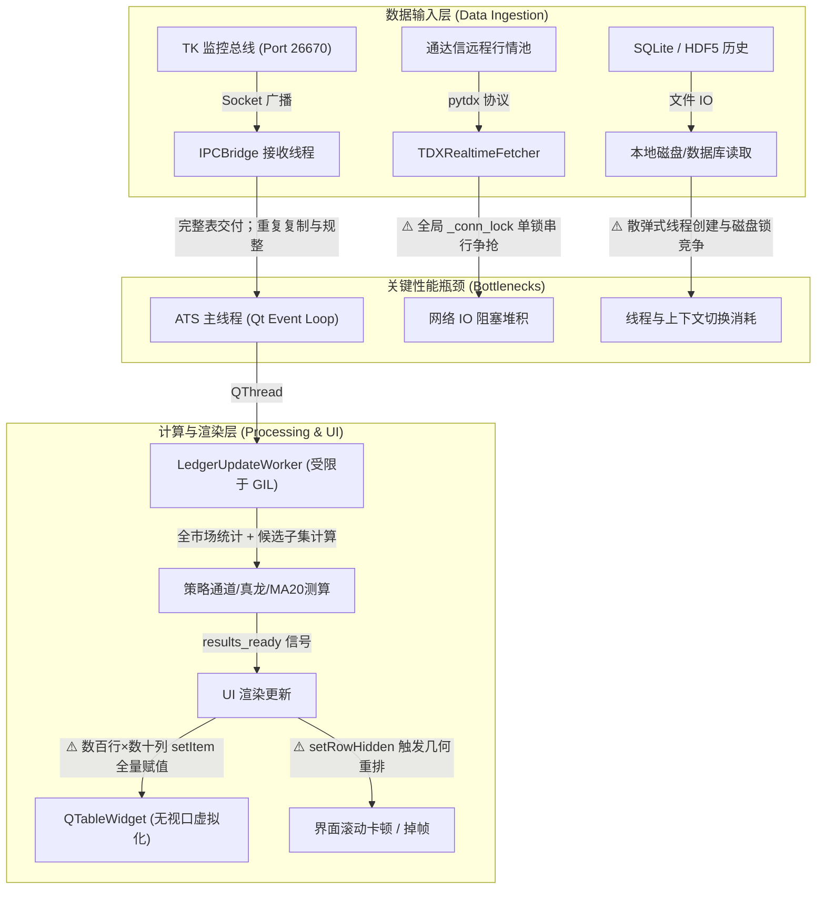
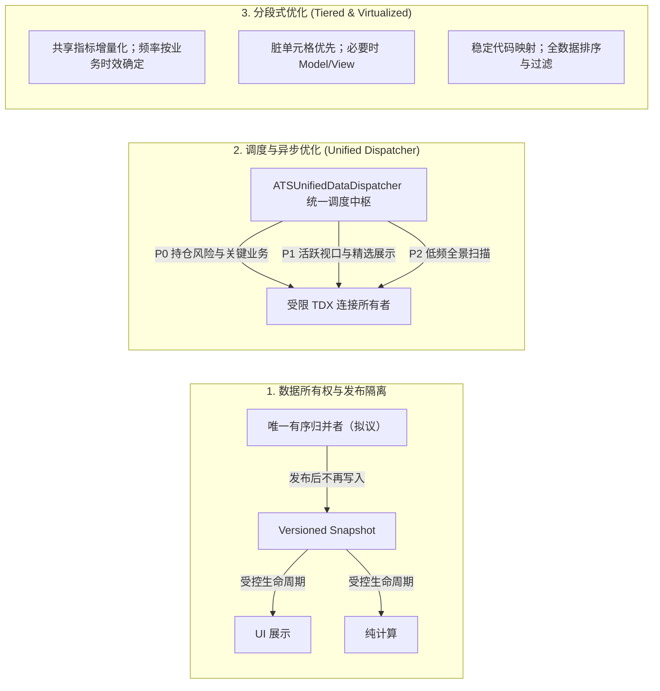

# ATS 系统全流程性能优化分析与实施方案规划（纯规划·不实施）

针对系统的 ATS (Autonomous Trading Terminal)、加载异步机制、数据读取链路、分段式优化体系以及全流程性能瓶颈进行系统性工程剖析，并制定分阶段演进的性能优化实施方案蓝图。

> [!IMPORTANT]
> **本次任务性质**：根据指令，**制定全流程性能优化分析实施方案，但不实施**既有工程代码变更。所有分析基于当前真实源码，方案严格遵循既有接口兼容、Windows 文件锁/多线程安全与 KISS/YAGNI/SOLID/DRY 原则。

> **2026-09-26 功能更新复核版**：本文件为正式方案入口。基准为 HEAD `3bdb65b6` 及本轮可见的暂存/未暂存源码；重点复核次日候选池、配置自修复、休市板块快照、动态表头和模拟账户基线。仅静态分析，未运行系统、测试、采样或压测，未修改生产代码；耗时、CPU 降幅和包体大小均为待验证预算，不能作为已达成成果。源码行号会随工作区变化，以符号名为准。

**优先结论**：先固定 IPC 与新增候选池的状态/提交契约，同时消除已定位的 GUI 同步文件读取；再收敛重复加载、行情请求和逐轮全文件重写，最后优化增量投影。Model/View、独立进程、共享内存和双轨传输均按实测瓶颈准入，不作为必建架构。

### 本次功能更新对方案的影响

| 当前已具备的能力 | 仍需补齐的边界 | 本次调整 |
| :--- | :--- | :--- |
| 次日候选池第五主 Tab、独立弹窗/启动器，文件加载与手动补算 Worker | 自动刷新、统计回调、补算前 HDF 读取仍在 GUI；重复启动 Loader 缺少统一代际治理 | “加载已异步”改为“部分异步”，新增 §7.6 |
| 每 4s 的 ATS TDX 评估轮询，已有 busy 防重入 | busy 前同步扫描文件；与展示读盘、其他行情消费者重复；事件 emit 后即标 delivered | 先补消费提交确认，再合并请求和结果通知 |
| 配置校验、自修复、版本/指纹、原子 JSON 替换 | load_config 可能备份并写盘；进程内 RLock 不协调 TK/ATS/独立窗口写者 | 配置读取快照化、修复单入口；文件写者矩阵纳入 Stage 0/1 |
| 真 VWAP 缺失返回 None、报价推进的两帧确认、早盘确认保留 | 降频或 latest-only 可能跳过有效证据；历史追踪扫描及检查点文件持续增长 | 明确业务流保序，显示流才可合并；增加历史规模与写放大预算 |
| 休市读取上个交易日精确板块快照，缺失时展示空态 | glob、解压和 JSON 读取仍在调用路径；缺失可反复扫描/重绘 | 异步加载、按日期负缓存，禁止用其他日期快照补空 |
| 动态列布局标识、表头 300ms 防抖、多键合并保存；模拟账户 ledger_baseline 回放 | 配置最终写入仍同步；表格整表重建；基线后订单仍需归并 | 复用现状，补计时器复用、增量投影及失效条件，不重建账本 |

以上是已有功能及静态风险清单，不代表性能阶段已完成；历史“五大瓶颈”之外，新增候选池文件链路作为第六类专项分析。

---

## 一、系统 ATS 现状全面深度剖析与五大性能瓶颈诊断


```mermaid
flowchart TD
    subgraph DataIngestion ["数据输入层 (Data Ingestion)"]
        IPC["TK 监控总线 (Port 26670)"] -->|"Socket 广播"| IPCBridge["IPCBridge 接收线程"]
        TDX["通达信远程行情池"] -->|"pytdx 协议"| TDXFetcher["TDXRealtimeFetcher"]
        LocalDB["SQLite / HDF5 历史"] -->|"文件 IO"| DiskIO["本地磁盘/数据库读取"]
    end

    subgraph Bottlenecks ["关键性能瓶颈 (Bottlenecks)"]
        IPCBridge -->|"完整表交付；重复复制与规整"| MainThread["ATS 主线程 (Qt Event Loop)"]
        TDXFetcher -->|"⚠️ 全局 _conn_lock 单锁串行争抢"| LockContention["网络 IO 阻塞堆积"]
        DiskIO -->|"⚠️ 散弹式线程创建与磁盘锁竞争"| ThreadStorm["线程与上下文切换消耗"]
    end

    subgraph Processing ["计算与渲染层 (Processing & UI)"]
        MainThread -->|"QThread"| Worker["LedgerUpdateWorker (受限于 GIL)"]
        Worker -->|"全市场统计 + 候选子集计算"| ComputeHeavy["策略通道/真龙/MA20测算"]
        ComputeHeavy -->|"results_ready 信号"| UIRender["UI 渲染更新"]
        UIRender -->|"⚠️ 数百行×数十列 setItem 全量赋值"| TableWidget["QTableWidget (无视口虚拟化)"]
        UIRender -->|"⚠️ setRowHidden 触发几何重排"| LayoutLag["界面滚动卡顿 / 掉帧"]
    end
```

### 1. 瓶颈一：IPC 重复复制、基线并发与发布所有权
- **事实定位**：
  - `ats/ipc_bridge.py` 的 `_handle_client`：网络接收后台线程解包后执行 `df_norm = df_payload.copy()` 进行差分合并，完成后执行 `df_to_deliver = self._cached_df.copy()` 复制全量表，成本随行列数增长；
  - 同方法调用 `data_callback(df_to_deliver)`，经主窗口信号进入 `_handle_realtime_data`；正常路径是裸 DataFrame，主线程走全量分支。重复复制与索引规整成立，**每帧二次差分合并不成立**，diff 分支是待审计的兼容路径；
  - `IPCBridge.start_realtime_listener` 按连接创建线程，共享 `_cached_df`；全量路径发布缓存对象本身，后续差分可能原位写它，直接删除 UI 防御性复制存在一致性风险。
- **待测影响**：复制字节率、归并耗时与对象驻留。30~80ms、数十 MB/s 尚未采样，不能直接归因为 Minor GC。

### 2. 瓶颈二：通达信 (pytdx) 单一长连接与全局互斥锁串行争抢
- **事实定位**：
  - `ats/tdx_realtime_fetcher.py` 的 `TDXRealtimeFetcher` 共享 API 连接通过 `with self._conn_lock:` 串行保护请求；
  - 虽然 SBC 图表实现了 `SBCGlobalDispatcher`，但新股雷达（`NewStockFetcher`）、涨停天梯（`LimitUpEngine`）、板块矿工（`SectorRotationPullbackMiner`）等仍在各自线程直调 TDX API；
- **待测影响**：锁内网络请求会拖延共享连接消费者；只有确认主线程同步等待或计算阻塞，才能判定 GUI 假死，数据停更需单独计量。统一单线程后仍有调度排队和慢请求队首阻塞。

### 3. 瓶颈三：Qt 表格全量属性更新、排序及布局成本
- **事实定位**：
  - `ats/ui/swing_table.py` 表格更新遍历全表，逐个设置 `QTableWidgetItem` 属性；
  - 同文件 `_apply_favorite_filter` 对每行调用 `setRowHidden`，存在重复布局成本，实际重排次数待测；
  - `ats/ui/ipo_command_room_dialog.py` 的 `refresh_data` 重设行数并构建单元格 item，存在对象分配与布局成本；
- **待测影响**：Qt Widgets 不使用 DOM；已存在 item 复用，主要需量化无变化属性更新、排序、行隐藏和布局成本。25~35 行取决于窗口与 DPI，50~120ms 未实测，屏外数据仍须参与排序、过滤和导出。

### 4. 瓶颈四：计算密集型策略对 Python GIL 的挤占与主线程响应延迟
- **事实定位**：
  - `LedgerUpdateWorker.run()` 承担了 MA20 通道几何测算、资金主线分析、全表均线循环构建等大量纯 Python 运算；
- **待测影响**：纯 Python 工作可能挤占 GIL，但向量化/native 工作不能一概而论；需区分 CPU 时间、I/O 等待和 GUI 线程直接计算。Worker 还调用账本更新、投影同步及文件快照，并非可以随意取消的纯函数。

### 5. 瓶颈五：散弹式历史/价格补齐与磁盘锁争抢
- **事实定位**：
  - `ats/ui/main_window.py` 的 `_flush_batch_stock_prices` 已有防抖合批，但每批新建线程；取得 `hdf5_history_lock` 后才调用新浪 HTTP，网络耗时被纳入锁持有期。超时后标记失败，不应未经核对重试策略就断言循环重试。
  - 拆锁前须审计 `Sina(readonly=True)` 的内部缓存与 HDF5 访问；不能直接将现有锁删除。

---

## 二、架构优化方案总览（加载异步、数据读取、分段式优化）


```mermaid
flowchart LR
    subgraph S1 ["1. 数据所有权与发布隔离"]
        SingleWriter["唯一有序归并者（拟议）"] -->|"发布后不再写入"| SealedDF["Versioned Snapshot"]
        SealedDF -->|"受控生命周期"| UIRead["UI 展示"]
        SealedDF -->|"受控生命周期"| WorkerRead["纯计算"]
    end

    subgraph S2 ["2. 调度与异步优化 (Unified Dispatcher)"]
        UnifiedDisp["ATSUnifiedDataDispatcher 统一调度中枢"]
        UnifiedDisp -->|"P0 持仓风险与关键业务"| TDXConn["受限 TDX 连接所有者"]
        UnifiedDisp -->|"P1 活跃视口与精选展示"| TDXConn
        UnifiedDisp -->|"P2 低频全景扫描"| TDXConn
    end

    subgraph S3 ["3. 分段式优化 (Tiered & Virtualized)"]
        TieredCompute["共享指标增量化；频率按业务时效确定"]
        ViewportLazy["脏单元格优先；必要时 Model/View"]
        VisibleMap["稳定代码映射；全数据排序与过滤"]
    end
```

### 1. 加载异步化重构（Async Architecture）
- **主线程热路径无同步 I/O**：接收、唯一归并、纯计算和 GUI 投影分责；不把所有重计算搬进 Socket 接收线程。GUI 仍负责模型提交、布局与绘制，完整回调不能用指针赋值耗时代替；
- **策略计算隔离评估**：先减少重复工作与 Python 对象展开；独立进程只接纯计算，实测覆盖启动/序列化/回传成本后再准入，共享内存另行评估；
- **常驻 Worker 与代际守卫**：每类可合并工作采用一个运行任务加一个最新待处理槽；结果携带版本。账本与信号事件保序处理，不能使用全局 Drop-on-Busy。

### 2. 数据读取全流程优化（Data Ingestion Pipeline）
- **发布隔离契约**：单写者更新私有工作版本，发布版本在所有读者释放前不得修改；先保留必要的隔离复制，再测量减少冗余复制。Pandas CoW 不等于线程同步，也不能靠版本标签冻结对象；
- **统一数据调度**：复用 SBC 已有机制，增加请求合并、容量、截止时间、优先级老化与失败退避；避免重新制造一条无界慢任务队列；
- **分层缓存**：复用 `TDXGlobalCachePool`、已有 RamDisk 与磁盘缓存，增加版本/交易日失效及字节上限；不默认新增 Feather/Arrow 或持久化系统。

### 3. 分段式优化架构（Segmented Optimization）
- **渲染分段**：先脏单元格、样式复用及隐藏页按需刷新；仍超预算的单表再迁移 `QAbstractTableModel + QTableView`，可见范围由实际布局决定；
- **行过滤分段**：使用全数据排序/过滤映射，按稳定证券标识恢复选中和滚动锚点；未变化过滤条件不重复设置行隐藏；
- **计算分段（三级梯度）**：
  - Tier 1（候选 P95 <3ms）：动态报价投影与依赖列变化触发的向量运算；
  - Tier 2（候选 P95 <15ms）：核心标的计算，风险与状态转换频率保持现有业务语义；
  - Tier 3（候选 P95 <80ms）：允许低频的全景统计，周期通过时效契约确定；
- **传输分段（后期候选）**：先列裁剪与订阅合并，再考虑双轨。5000 行 × 6 个 float64 字段已有 240000 字节，未计索引和协议头，不能承诺全市场 <15KB；`vwap/rank` 并非静态字段。

---

## 三、分阶段实施演进路线图（Stage 0 至 Stage 5）

> [!NOTE]
> 实施路线严格遵循“基线先行、热点分离、逐步推进、指标量化”的准入驱动原则。

| 阶段 | 阶段名称 | 核心改造范围 | 准入门禁与可衡量预期成果 |
| :--- | :--- | :--- | :--- |
| **Stage 0** | **基线、契约与黄金样本** | 复用 `ats/startup_profiler.py`，加入候选池加载/评估/确认与文件写者清单 | 记录调用线程、文件数/字节/检查点数、锁等待、源数据年龄和输出真值；所有预算经基线校准 |
| **Stage 1** | **唯一归并、快照隔离与协议保真** | IPC 信封；候选池文件所有权、事件提交确认、配置版本 | 跨日/缺包/空值/慢读者与多进程写入、重试不丢不重验证通过；摄入 P95 <2ms 为候选目标 |
| **Stage 2** | **有界调度与缓存治理** | SBC/TDX 复用；候选池 Loader、配置/板块/HDF 后台读取 | GUI 无同步业务文件/网络 I/O；一项任务在途加一个最新展示请求槽，业务请求独立保序；关键请求满足截止时间 |
| **Stage 3** | **纯计算与业务提交分离** | 各引擎、候选池历史行查找/检查点持久化、纸面账户读投影 | 一版输入复用一版结果，过期输出不污染业务状态；写放大有界且持久性不退化；按热点决定是否进程化 |
| **Stage 4** | **表格增量更新与按需模型迁移** | 原有三表、候选总览/后验/统计/顺延表、动态列布局 | 全数据排序、选择、过滤、导出及策略复合身份保真；增量更新 P95 <3ms 为候选目标 |
| **Stage 5** | **故障注入、退出与长周期验证** | 现有影子工具适配性核验；回放/监测能力待规划 | 先短回放再 4h/72h，记录内存斜率、句柄与任务数；不得声称有限压测证明零泄漏 |

依赖：Stage 0 是全部实施的前提，Stage 1 先于共享快照优化；Stage 2/3/4 可按基线热点分支推进，不强制串行大改。启动优化在 Stage 0 测量、Stage 2/3 落地，退出契约随资源引入同步设计，最终由 Stage 5 验证；本轮所有 Stage 均未实施。

---

## 四、验证计划（针对未来若启动实施的验收标准）

### 自动化测试与 Golden Samples 比对
```powershell
# 1. 语法与模块编译检查
python -m compileall ats tests -q

# 2. 核心回归测试与 Golden Samples 比对验证
pytest tests/test_ipc_trade_rollover.py tests/test_tk_frame_fingerprint.py tests/test_p1_ledger_single_entry_hardening.py -v

# 3. 影子工具先审计 CLI、隔离性与测量范围，再制定调用命令
# 不把 dry-run 成功视为 GUI 性能或 72 小时压测通过
```

### 关键性能指标阈值（KPI Gate）
以下均为 **Stage 0 待校准预算**，不能据此宣布达标；耗时需注明样本数量、硬件、数据规模、窗口数和预热条件。

| 指标 | 候选门槛 | 口径与限制 |
| :--- | :--- | :--- |
| IPC 摄入 GUI 回调 | P95 <2ms、P99 <5ms | 入口至返回，包含同步调用，不包含后续绘制；独立记录端到端时延 |
| 其他 GUI 短回调 | P95 <5ms | 同时报告 P99/max 与长任务占比，不能用平均值掩盖卡顿 |
| 可见区域增量更新 | P95 <3ms、P99 <8ms | 排序、布局、paint 分开测；不作为全列表渲染预算 |
| GUI 事件循环滞后 | P95 <8ms、P99 <16ms | 用单调时钟记录预定/实际调度时刻；不等同于 120 FPS |
| TDX 服务质量 | 按请求类别截止时间和数据年龄验收 | 分列排队、锁等待、网络服务时间；不要求排队为零 |
| 内存与生命周期 | 预热后稳态无持续上升，候选 4h 增幅 ≤5% | 同时报绝对增长、Private Bytes/RSS、Python 分配、句柄与缓存容量；72h 检查增长趋势 |
| 业务保真 | 离散状态、事件顺序、数量一致 | 浮点容差按字段制定，不能掩盖阈值跨越；已知旧缺陷单独审批，禁止借优化悄然更改 |
| 候选池新鲜度与交付 | 分别校准源报价→评估、评估→显示、事件→持久提交的 P95/P99 | 当前 4s 评估/3s 展示定时不构成延迟承诺；队列拥堵必须显式超时/降级，不能扩大两帧确认的既有时间窗掩盖延迟 |
| 文件成本与加载容量 | 每轮读取/写入字节、fsync 次数、活跃 Loader 数有上限 | 固定候选规模比较开盘/午后/收盘与历史积累；空数据、失败、陈旧数据分别计数，不以空结果冒充成功 |

## 五、结构性补充：源码证据与已有能力复用

此表区分“可静态确认的行为”和“仍需测量的影响”，不把注释中的性能描述视为测量结果。

| 编号 / 优先级 | 源码锚点（符号定位，避免旧行号漂移） | 已确认行为 | 补充优化与待验证影响 |
| :--- | :--- | :--- | :--- |
| A1 / P0 | `ats/ipc_bridge.py` start_realtime_listener、_handle_client | 按连接创建线程，共享缓存；`recv(4)` 单次读取头，`data += packet` 拼接 | 受限收包、完整读头、长度上限、累计截止时间、唯一归并者；量化拼接复制与同时在途字节，不仅限制线程数 |
| A2 / P0 | `ats/ipc_bridge.py` _handle_client 的 full/ACK/data_callback 分支 | full 分支直接发布缓存；ACK 传回 `source_version/sync_session`，UI callback 只传表 | 保留帧元数据和所有权；主窗新增 current_sector_snapshot 不证明正常 Bridge 路径保留了 sector_data，必须端到端校验 |
| A3 / P0 | `ats/ui/main_window.py` LedgerUpdateWorker.run | Worker 借用 ledger/profiler/universe/cache，写账本、快照及投影 | 划定状态所有者，纯计算与提交拆分；仅丢 results_ready 无法撤销业务副作用 |
| A4 / P1 | `ats/ui/main_window.py` _handle_realtime_data、_on_ledger_results | UI 调用天梯更新；`singleShot` 中执行直方图统计；结果回调再次调用天梯 | 延迟不是后台化；一次计算、多处订阅，量化实际计算次数与主线程 CPU |
| A5 / P1 | `ats/limit_up_engine.py`、`ats/capital_dragon_engine.py` 缓存分支 | 天梯有 1.5s 节流但空缓存时可能继续扫描；资金引擎有 1s 缓存 | 区分“成功计算但为空”与“未计算”，结果按依赖版本失效；重复调用不等于每次重算 |
| A6 / P1 | `ats/ui/main_window.py` _flush_batch_stock_prices、LedgerUpdateWorker 调度 | 价格防抖合批后持 HDF 锁发 HTTP；Worker busy 时跳过，闲时新建 QThread | 审计锁粒度、统一批次在途去重；常驻 Worker 增加最新待处理槽与异常复位，不重复建防抖机制 |
| A7 / P1 | `ats/ui/intraday_strategy_dialog.py` SBC Dispatcher 接入与结果回调 | 已有 SBC 注册订阅、唤醒、QueuedConnection、窗口 epoch/pending | 渐进扩展为统一调度接口；保留代码/周期切换守卫与关闭窗口保护 |
| A8 / P1 | `ats/ui/main_window.py` _on_ledger_results、_async_refresh_tier2 | 原有策略页活跃 Tab 立即更新，隐藏 Tab 已设脏标记 | 扩展统一版本与一次通知；该机制不能直接推断新增候选池已按外层可见性停读 |
| A9 / P1 | `ats/tdx_realtime_fetcher.py` 缓存与 get_security_quotes_safe 批次锁 | 已有多日/增量缓存、交易时段保护、40 只分批；锁包围整个批次循环 | 报价 40 为本仓现有配置，不能推广为所有 API 硬上限；批次间调度让出，复用 cache generation |
| A10 / P1 | `ats/main_ats.py` main；`ats/ui/main_window.py` 构造、刷新与 closeEvent | 主窗口导入在 profiler 里程碑前；启动恢复昨日快照；刷新查文件 mtime；入口 main 在事件循环返回后调用 `os._exit` | 覆盖导入至首个可信快照，核验构造器传递 I/O；数据库 WAL 模式下不能只依赖主文件 mtime；资源清理不能只依赖 atexit |

### 5.1 功能更新后新增证据（2026-09-26）

| 编号 / 优先级 | 当前源码锚点 | 确认的行为与方案影响 |
| :--- | :--- | :--- |
| B1 / P1 | `ats/ui/next_day_watch_dialog.py:76` Loader、`:670` reload_all_data | 每次刷新新建 QThread 并覆盖 active_worker；四个结果信号分开发送，finished 无条件显示已更新。需限制并发、绑定日期/epoch、区分失败与完成，并管理 Worker 生命周期 |
| B2 / P1 | 同文件 `:1146` 手动补算、`:1406` 自动刷新、`:1418` 统计加载 | 补算启动 Worker 前可能 read_hdf；自动刷新读 eval JSON；统计回调逐日再读 eval。内部 Tab 检查不等于外层页面可见，须补真正的后台读取和展示订阅治理 |
| B3 / P1 | `ats/ui/main_window.py:5545` _poll_next_day_watch_tdx | GUI 定时槽先 load_config、glob 并读历史文件，然后置 busy 并新建 daemon 线程取行情；当前 busy 不能消除前置 I/O，历史扫描未先按有效追踪范围裁剪 |
| B4 / P0 | 同文件 `:5484` _handle_realtime_signal；轮询中的 mark_events_delivered；`next_day_anomaly_watch.py:830` | 发送端在 emit 后标 delivered，消费端在 update_candidate 前记 seen；排队成功或出现消费异常均不等于业务提交成功。需持久幂等与明确 ACK，不能用 latest-only 队列承载该事件 |
| B5 / P1 | `next_day_anomaly_watch.py:312` _candidate_row_lookup、`:459` run_cycle | 当天评估追加检查点并重写 eval/stats；历史候选循环反复调用行查找，包含列复制/代码规范化/筛选。先一次构建所需代码投影，再按策略独立计算 |
| B6 / P0 | 同文件 `_LOCK`、`:29` _atomic_json；TK 冻结、ATS 评估/补算与独立启动入口 | RLock 只保护本进程，os.replace 只保护单文件替换；不能据此认定多进程读改写及 watch/eval/stats 三文件一致。需按实际共享路径确认所有写者并制定所有权 |
| B7 / P1 | `ats/strategy/next_day_watch_config_manager.py:44` load_config、`:61` _restore_config | 配置加载失败时可备份损坏文件并原子写入修复值；GUI 初始化/保存与轮询存在同步调用，加载不是只读行为 |
| B8 / P1 | `ats/ui/heatmap_widget.py:242` load_live_sectors | 已有 5s 节流、path/mtime 缓存；休市只认上个交易日精确快照，缺失会强制空态重绘。复用日期语义，异步化磁盘/解压并缓存“已知缺失” |
| B9 / P1 | `ats/ui/styles.py` setup_header_persistence、`:896` save_config_nodes | 表头已有稳定标识、300ms 防抖与多键写入；schedule_save 每次创建子 QTimer，持久化重试含 sleep。评估旧 timer 的回收及 GUI 写入尾延迟，不重复设计防抖 |
| B10 / P1 | `ats/unified_paper_account.py:75` reconcile_account；`ats/ui/ipo_command_room_dialog.py` refresh_data | 已按 ledger_baseline 的 order_count 回放后续订单；基线异常回退全回放。仅缓存权威读模型投影，不能新建独立账本或仅按订单数量判断不变 |
| B11 / P2 | `ats/ui/ipo_subnew_detector_dialog.py` showEvent、_restore_initial_header_layout | 复核期间新增的工作区修改已将首次表头恢复安排在自适应布局之后，并有首次恢复标记；规划复用该能力，补隐藏重开/晚到定时回调/用户拖列时序回归，不重复实现列宽恢复 |

## 六、数据与并发契约：极限优化前的必要条件

### 6.1 IPC 顺序、ACK 与空值保真

1. **逻辑单写者**：接收线程不直接写共享基线；唯一归并者按发送端定义的顺序接受更新，不能拿连接完成顺序代替行情顺序。先复用现有 `source_version/sync_session`，审计其递增含义后再决定是否扩展 `base_version/schema_version/trading_day`。
2. **版本有效性**：会话变化、跨日、基线缺失、重复、乱序、结构变化分别定义处理；若 source_version 允许跳号，用显式基线关系校验，不能简单把非连续整数判成丢包。无法验证依赖链则限频请求 full，并保留最后可信快照及 stale 标记。
3. **接受后确认**：ACK 表示包已校验并有序归并、可供恢复/发布的版本已被接受，不表示 GUI 已显示或业务已提交。失败包不得伪成功 ACK；若现有生产端确认语义不同，先双端兼容迁移与重放验证，再改变确认时点。
4. **空值与删除**：当前 `notna()` 合并不能表达“将旧值清空”；复用发送端空值逆转、行列结构变化回退 full 的契约，不先修改一端。显式空值掩码、删除标记仅作为协议升级候选；证券标识须含市场语义，不能把指数和同号个股压成同一个键。
5. **收包边界**：固定长度头需完整读取；包体设字节上限、累计超时与最大同时在途容量。先归并 diff 才能合并展示通知，不能在网络输入阶段任意丢弃增量。

### 6.2 快照生命周期与有界邮箱

- **第一阶段保守隔离**：生产者拥有可变工作版本，发布独立快照；只删除已证明冗余的复制。标签、浅复制和 GIL 均不能替代发布后不再写入的契约；object 列中的嵌套可变对象也需规整或隔离。
- **第二阶段按需减少复制**：热数值列投影、静态列按版本复用；只有写路径与读者生命周期全部明确后，再评估块级复制或缓冲池。Pandas CoW 版本/配置需记录，不能作为无条件线程安全依据。[Pandas copy 文档](https://pandas.pydata.org/docs/reference/api/pandas.DataFrame.copy.html)
- **UI 邮箱**：最多一个待消费展示快照、一个待处理通知；消费者读取最新版本后，受同步保护地清理/重新检查通知标记，防止生产者恰好写入导致丢唤醒。仅在 GUI slot 丢旧帧仍无法阻止 Qt 事件队列积压。
- **计算邮箱**：一个运行任务加一个最新待处理请求；过期纯计算可在安全点取消，但设置完成/发布时间上限，防止行情持续到达导致永远取消。全局市场帧、窗口代码/周期、策略配置、交易日分别带代际，结果匹配相应依赖后才提交。
- **读者回收**：计算完成、取消、异常、窗口关闭均释放快照引用；固定池满时合并展示需求或受控回压，不能覆盖仍被读取的缓冲，也不能无限创建新版本。

### 6.3 展示快照与业务事件分流

| 数据类别 | 可否 latest-only | 顺序和溢出策略 |
| :--- | :--- | :--- |
| 单元格当前报价、直方图展示 | 可以，须保留最后可信时间和版本 | 覆盖待显示槽，监测快照年龄；diff 输入先归并 |
| 无副作用的全景统计请求 | 有条件可以 | 明确依赖版本和最长完成时间；结果不直接改账本 |
| 突破/回落状态、峰值、累计量、告警触发 | 默认不可以 | 可能依赖中间路径，保序计算或保真聚合，不能仅看末帧 |
| 交易事件、账本迁移、持仓核对 | 不可以 | 唯一所有者提交、事件 ID 幂等；沿用原有持久化语义，有界满载时回压或可恢复溢写并明确失败状态 |

- 现有 Worker 已写账本，后续设计须先明确“计算→校验→提交”边界；可取消部分不接收可变 ledger、QObject、数据库连接或锁对象。
- 即便当前业务路径本身已跳帧，新方案也需对齐相同输入与时序基线；改变策略采样频率属于语义变化，不能用性能优化默认授权。

## 七、各层可继续补充的优化方案

### 7.1 TDX/HTTP 调度：消重优先于扩容

- **请求键**：`来源 + 市场/代码 + 数据类型/周期 + 范围 + 复权口径 + 交易日/代际`；相同键的在途请求合并为一次拉取、多订阅者分发，force 请求必须受配额和合并规则约束。
- **优先级**：P0 持仓风险与关键业务，P1 激活视口与交互，P2 历史回填和全景；隐藏窗口只降低展示订阅，不能关闭风险计算。低优先级使用等待时间提权或配额保证，防止长期饿死。
- **容量与截止时间**：分别限制等待任务数、合并键数、订阅者数、在途请求和字节；入队前淘汰已过期的可替代请求。运行中的阻塞网络调用通常不能被新高优先级任务抢占，需传输超时和批次间让出。
- **故障隔离**：先单连接所有者加慢任务分段；若关键数据仍被历史回填拖延，再评估至多两个独立连接通道，各自独占 API 实例，并控制总请求速率。不能让多个 Worker 并发使用同一个 pytdx 连接。
- **恢复**：超时使用有上限的退避与抖动、熔断和少量探测请求；返回缓存时附数据年龄/失败原因，风险消费者按业务最大年龄拒绝不可信数据。取消订阅后没有消费者的等待任务可撤销，在途结果不再触碰已关闭对象。

### 7.2 数据读取、缓存与持久化

- **不建第二套缓存**：复用 TDXGlobalCachePool、历史缓存及现有代际失效；记录命中/过期/负缓存命中、重复拉取与每类字节占用。TTL 不替代数据版本，跨日、复权、配置变更、数据修订、停复牌均纳入失效表。
- **负缓存**：区分成功空结果、未上市/停牌、网络失败和非法请求；失败短冷却并退避，成功空结果可按交易时段复用，避免空集每帧重算。行情恢复或交易日切换必须解除旧失败状态。
- **最小读取**：历史数据按证券、日期范围和必需列读取，批量合并区间；缓存规范化代码及静态名称。SQL 索引和投影优化必须基于真实查询计划，不能凭列名盲目加索引。
- **锁粒度**：为价格补齐、历史读取、序列化与提交分别记录锁时间；在确认底层副作用后将纯网络等待移出磁盘临界区。跨线程/跨进程连接和 HDF 句柄归属明确；不假定 HDF5 可安全并行写，也不为提速降低既有数据库持久性。
- **写入分级**：可重建历史统计批量写，业务事件保持必要确认；临时文件与目标同目录、关闭句柄后原子替换，Windows 文件占用需有限重试和保留上一版。遥测日志异步合批、采样和轮转，防止优化探针成为新 I/O 热点。

### 7.3 增量计算与共享结果工厂

- **依赖表先行**：按引擎声明输入列、历史窗口、交易日、配置与输出；行情、均线、板块映射只规整一次，同版本 `CapitalDragonEngine`/`LimitUpEngine` 报告供 Worker、主面板和弹窗复用。已有 1s/1.5s 缓存保留为保护，增加版本有效性。
- **按脏依赖重算**：价格变化只更新依赖价格的指标；历史 MA/通道等在 bar 完成、修订或配置变化时失效。板块聚合需维护旧贡献减去、新贡献加入，成员迁移/空值/修订触发正确失效；全市场排名不得只重算当前可见行。
- **减少 Python 展开**：`target_df.to_dict('index')` 已是候选子集，先裁剪实际需要的列，再比较数组/元组投影；滚动和/极值增量化须覆盖当前未完成 bar、重复更新、回补修订与数值误差，不贸然降低浮点精度。
- **状态计算保真**：阈值穿越、告警、累计量与风险计算保留时间序列语义；纯展示统计才可降频。主线程现有 `pd.cut` 和天梯扫描移入纯计算结果生产侧，`QTimer.singleShot` 仅用于轻量提交。[Qt 定时器文档](https://doc.qt.io/qt-6/qtimer.html)
- **进程准入**：测量 `T打包 + T传输 + T计算 + T回传 + T提交` 是否低于现状且改善 GUI P99；先一条常驻纯计算进程，避免多个重型实例和 BLAS 线程过量竞争。Windows 使用可导入顶层入口与 spawn 兼容设计，已有 `run_ats.py` 的 `freeze_support` 要复用并验证打包入口。[Python multiprocessing](https://docs.python.org/3/library/multiprocessing.html)
- **共享内存后置**：仅适用于传输已成为主耗时的数值块；生产者填充、版本提交、读者租约及释放分别定义，不在共享区放 Python 对象指针。Windows 必须关闭所有句柄后才能回收映射；取消、子进程崩溃、退出均覆盖，不以“零序列化”承诺零成本。[Python SharedMemory](https://docs.python.org/3/library/multiprocessing.shared_memory.html)

### 7.4 UI：增量投影、模型线程和真实绘制

- **渐进顺序**：现有 item 原位复用 → 值/颜色/字体/提示内容未变则跳过 → 过滤/排序结果复用 → 热点单表 Model/View。不要把数百行直接认定为必须自建虚拟滚动器。
- **排序与身份**：保存当前排序字段/方向，按稳定证券键恢复选中、编辑、上下文菜单和滚动锚点；排序映射覆盖全部行，复制/导出不能只导出视口。区分“全局过滤后的行映射”和“屏幕可见范围”。
- **模型线程**：Worker 产出普通数据，GUI 线程执行 model 数据变更和 `dataChanged`/行增删/布局通知；后台不能直接操作 QAbstractItemModel。避免每帧 resetModel，必要 reset 时显式恢复状态。[Qt 模型线程要求](https://doc.qt.io/qt-6/qabstractitemmodel.html#thread-safety)
- **布局成本**：仅结构/可见性改变时处理隐藏、行高和列宽；固定样式对象复用，Tooltip 等低频内容按需产生。QTableView 按需取数不代表其排序/布局天然只消耗可见行成本。
- **交互优先**：拖拽缩放期间合并装饰更新，业务数据处理持续运行；隐藏页只保留最新版本，重新显示时一次补齐。统计更新调用与 paint 的实际耗时，禁止用 `processEvents()` 循环掩盖长任务并引入重入。

### 7.5 启动加载与退出闭环

- **启动依赖图**：运行时/导入 → QApplication/最小窗口 → IPC 接入 → 可信基线 → 必需账本恢复 → 当前页 → 历史预热/其他窗口。只并发独立的 I/O 工作，QWidget 创建留在 GUI 线程；业务状态未就绪时不发布可操作的“已就绪”状态。
- **四个里程碑**：进程开始、首个可交互窗口、首个可信行情、关键业务状态就绪；冷启动与热启动分别采样，含 TK 不在线、缓存不存在和磁盘慢场景。复用 StartupProfiler，但补齐导入前的计时覆盖，不能仅统计 `window.show()`。
- **配置/文件检测**：构造器及其依赖项逐项审计 I/O；重复配置读取合并，文件变化检测后台化。数据库若采用 WAL，主文件 mtime 不是可靠的全部变更指示，评估同连接 `PRAGMA data_version` 或业务版本契约，先验证实际存储模式。
- **有序退出**：停止接新任务 → 停止定时器/订阅 → 取消可重建工作 → 有期限地完成业务写入 → 回收网络/线程/进程/共享内存 → 退出。主线程不做无限 join；处理晚到信号和已删除窗口，必要未完成业务状态显式留痕，不依赖 `os._exit` 后的清理钩子。

### 7.6 次日候选池专项：加载、评估与事件闭环

**边界**：嵌入页、独立弹窗和独立进程可以展示同一来源；候选冻结、盘中后验和顺延追踪仍是业务流程。隐藏窗口只能暂停展示读取/渲染，不能暂停必要评估、证据采集或事件交付。

1. **加载请求有界**：每个展示消费者采用一个在途任务和一个最新待处理请求；请求携带窗口 epoch、目标交易日、配置/数据版本，返回时全部匹配才接纳。关闭/换日撤销订阅而非强杀正在写文件的 Worker，finished、error、cancelled 分开处理，回收线程对象并拒绝晚到信号。
2. **完整后台投影**：把日期枚举、manifest/eval/stats 读取、顺延汇总和表格格式计算收敛为一次后台任务；结果包含日期、源版本、数据时间、错误/陈旧标记和普通行数据。GUI 只提交投影，禁止统计回调再读文件；独立窗口可复用进程内同版结果，跨进程先用文件版本失效，不默认增加新消息中间件。
3. **一致读取**：watch/eval/stats 是分别替换的文件，单个 Loader 也可能读到混合代际；拟增加共同 revision 或提交清单，读前后核验，不一致则有界重试并保留上一份明确标记的快照。旧格式先适配校验日期/配置指纹和来源关系，无法确认时不宣称强一致，禁止忙循环等待写者。
4. **展示按需**：第五 Tab 构造时已有配置读取与 reload，规划先创建轻量壳，首次可见再加载展示数据；打开已有页不要无条件重复加载。3s 自动刷新只在外层可见、窗口未最小化且目标日期适用时订阅，后台变更通知优先，轮询作为低频兜底；显示源数据时间而非仅刷新时刻。
5. **补算完整后台化**：GUI 仅捕获目标交易日、来源描述和必要快照版本；磁盘宽表定位/读取、交易日查询及输入校验放入 Worker。内存 DataFrame 不能因“传了引用”就视为冻结快照，须沿用 §6.2 所有权契约；板块来源同样绑定 asof，不得使用另一日期缓存补齐。
6. **重复补算合并**：任务键至少包含数据目录、目标交易日、来源版本、配置指纹及操作类型；跨嵌入页/弹窗/独立进程协调执行。保留现有非空冻结清单不可覆盖、EMPTY 可修复的规则，业务写入操作不能简单按最后一次点击覆盖；按钮忙状态在接受任务时生效，失败可重试且不虚报成功。
7. **配置读取快照化**：复用 NextDayWatchConfigManager 校验和自修复，启动后台加载一次已验证的不可变配置，按修订/显式保存失效。修复、备份和保存交给受控写者，返回来源、修复状态和错误；不让每次“读取”竞争修复，不静默改变已有冻结策略版本/指纹，也不降低异常配置的可见性。
8. **评估扫描收敛**：将 4s 定时槽内的配置/文件扫描移到受控后台作业，保留 busy 并增加异常复位与退出守卫。维护有效追踪清单，按交易日与配置 followup 窗口失效；首次索引在后台构建，文件补到/修订时更新，低频全目录核对兜底；UI 最近 30 份统计不是业务追踪上限。
9. **报价与投影复用**：合并当前/历史候选证券代码后一次请求，保留市场、字段与数据新鲜度要求；同版本宽表只规范化/筛选一次，再供各策略和日期评估复用。同代码多策略仍独立维护候选状态，不能因网络消重合并业务身份；沿用 SBC/TDX 请求调度能力。
10. **证据与降频分离**：保留 required_fields、proof_any、真实 VWAP 缺失、报价推进两帧确认、确认时间窗、EARLY_VALID 收盘保留及实际交易日顺延。缓存命中不能伪造新行情时间；已有推进规则需逐分支保真，不能将重复读取同一报价计作第二帧。展示只保留最新快照，业务证据序列在准入与过载策略中单独保障。
11. **持久化写放大治理**：先记录 eval/stats/checkpoint 的序列化字节、fsync、锁持有和当日增长；低风险先做无变化跳写、可重建统计合并、同周期行投影复用。检查点增量日志加周期快照仅在全文件写入成为热点时评估，需具备尾部损坏恢复、旧 JSON 读取兼容和审计重放；不得直接截断证据或默认取消 fsync。
12. **多写者与锁范围**：列出 TK 冻结、ATS 评估、手动补算、mark_events_delivered、配置修复分别写哪些实际路径；优先一个权威写者接受命令。必须多进程写时，互斥覆盖完整读改写事务并有超时/失败反馈，版本比较只有与互斥或原子提交结合才有效；重计算移到锁外前必须有提交版本检查，不能把 os.replace 当事务锁。
13. **事件确认闭环**：规划 `已生成并持久化 → 已排队 → 已校验 → 已持久提交/明确持久拒绝 → 已确认`；只有消费者实际提交确认后才能标 delivered。幂等键沿用 event_id 并绑定交易日/策略版本，持久幂等记录与业务提交需原子关联；消费异常可重试，重复 ACK 可重放，超期拒绝有原因，不能只依靠内存 seen 集合或 emit 成功。
14. **展示身份与布局**：候选行至少按交易日、证券、strategy_id、version 识别；后验事件按 event_id、统计按日期/策略/版本识别。动态列继续复用布局标识，批次只更新变值，排序恢复一次；避免每轮 resizeColumnsToContents 覆盖用户宽度并触发保存，首次结构变化/显式适配时才测宽。

### 7.7 更新后的板块、布局与账户投影

- **休市板块**：磁盘读取、解压、JSON 校验及格子数据准备后台化；缓存键包含实际交易日/路径/修订，缺失缓存使用短期限并允许手动强刷和文件补到失效。保留缺失空态，不回退到错日 session 或模拟数据；同一缺失状态只通知一次，GUI 创建/更新控件仍留在主线程。
- **布局写入**：保留已有表头标识和 300ms 防抖，核查全局 timer 字典与 QObject 子对象寿命，优先复用每键单个 timer。GUI 读取控件状态后发送普通配置值，后台串行合并写入，不能在 Worker 读取 QWidget；窗口几何/分隔条复用同一写队列，退出有期限 flush 和明确失败状态。
- **账户读投影**：从 TK SSOT 获取带权威修订的只读模型，按账户标识、baseline 指纹、订单修订缓存基线归并结果；仅在确认追加时增量重放。订单缩短/历史内容修订、重置、基线变化或解析失败触发完整校验与重建，不能仅以 order_count/mtime 判定相同；保留既有时间戳归一化与账户可用状态。
- **退出覆盖**：主窗已经停止候选池定时器，但后台 daemon、Loader、FreezeWorker 和配置持久化仍需统一登记与收尾；关闭窗口不能使写入半完成或晚到结果触碰控件。进程级强制退出存在于 `ats/main_ats.py`，所有必要持久化须在此之前获得明确结果。

## 八、结构性能上限与容量模型

没有基线不能报“系统极限 FPS/TPS”。以下模型用来判断优化是否迁移了瓶颈，输入由 Stage 0 实测填入。

| 维度 | 模型 / 测量口径 | 决策意义 |
| :--- | :--- | :--- |
| 端到端时延 | 单帧各阶段排队与服务时间之和，额外记录源数据年龄 | 按 frame_id 关联接收、归并、计算、提交和 paint；各阶段 P99 不能简单相加当总体 P99 |
| 网络容量 | 单通道利用率 `ρ = Σ(请求率_i × 平均服务秒_i)` | `ρ >= 1` 无法长期稳定；Stage 0 后留波动余量，先消重/合批，不能靠调优先级制造吞吐 |
| GUI 预算 | 窗口内 GUI 工作总量 `Σ(触发率_i × 单次 GUI 耗时_i)` | 每个回调都小于 2ms，叠加大量回调仍会卡顿；同时限制通知率和每轮处理预算 |
| 复制/传输 | `动态行数 × 投影列宽 × 帧率 × 复制次数`，另计 object/索引/协议头 | 衡量列裁剪与低复制的真实收益；快轨大小以编码后字节测量 |
| 驻留内存 | 工作基线 + 在读版本 + 待处理槽 + 缓存 + Python/Qt/native 开销 | latest-only 只有在通知和读者数量也有界时才能限制内存 |
| 候选池文件写放大 | n 个候选、每候选 q 个检查点、单点近似 b 字节：单份 eval 为 O(nqb)，每轮重写的累计量可达 O(nq²b) | 这是固定规模简化模型，不是实测；事件确认重写、stats、JSON 元数据和 fsync 另计，分别测量全天不同阶段 |
| 历史追踪扫描 | D 个历史文件、C 个活跃候选、N 行行情；逐候选全表查找的扫描项可能达到 O(CN) | 后台有效日期索引减少无关 D，一轮规范化查表后按候选复用可降低重复扫描；仍保留每个策略/版本的独立判断 |
| 加速上限 | `S <= 1 / ((1-p) + p/s)`，p 为目标环节的实测耗时比例 | 示例：占比 20% 的环节即使零耗时，总体最多约 1.25 倍；禁止把局部收益当整体收益 |

- **测试规模**：1000/5000/10000 行，按实际字段组成设置窄/宽表；0/1/5/10 个可见窗口，50/300/1000 行表格，1/3/10Hz 回放、1%/10%/100% 变更率；高档为压力场景，不暗示生产源具备此频率。
- **新增负载维度**：候选数、每代码策略版本数、累计检查点数、历史文件数、有效顺延交易日数、同时展示入口数；分别组合空库/长期历史、开盘/收盘、慢盘/文件占用和配置损坏修复。比较单轮时间随全天累积的斜率，不能仅测小文件冷启动；负载只用隔离目录的构造/脱敏回放样本。
- **环境记录**：CPU 核数与频率、电源模式、内存、磁盘/RamDisk、Python/Pandas/Qt 版本、CoW 设置、DPI、打包方式；同环境同输入至少多轮比较，开盘突发与稳态分开报告。
- **采样分层**：轻量计时/计数长期采样，Python 分配与 native/Qt 资源专项采样，避免重型探针对所有帧全开；对比有/无探针开销。CPython 循环 GC 与引用计数并存，数组分配或 RSS 增长本身不证明 GC 卡顿。[Python GC 文档](https://docs.python.org/3/library/gc.html)
- **降级闭环**：依据队列年龄、事件滞后、CPU、内存和数据新鲜度持续越界触发；先暂停预热/装饰，再降低纯全景刷新，保留关键业务。进入与退出使用不同阈值、持续窗口和最小驻留时间，防止反复震荡；恢复时错峰预热，禁止同时补齐所有欠账。

## 九、验证矩阵、回退与阶段交付物（均待实施）

### 9.1 可复用的测试资产与需要补齐的覆盖

| 资产 | 可复用契约 | 待补充的真实路径覆盖 |
| :--- | :--- | :--- |
| `tests/test_ipc_cold_start_baseline.py`、`test_ipc_trade_rollover.py` | 冷启动/跨日缺基线拒绝 diff | 多连接乱序、断头/断包、ACK 丢失、会话切换、UI 版本信封 |
| `tests/test_tk_perf_diff_null_fidelity.py` | 空值逆转/结构变化回退 full 的模拟契约 | TK 实际发送器 → Bridge → GUI 的端到端测试，不能用模拟器代替完整协议验证 |
| `tests/test_sbc_async_load_dispatcher_and_dirty_check.py` | 订阅唤醒、代际守卫、在途合并、QueuedConnection | 全系统调度、公平性、容量、关闭重开、晚到结果、慢请求抢占边界 |
| `tests/test_tdx_cache_deforcing_and_invalidation.py`、`test_tdx_hdf_multitable_preservation.py` | 去 force、generation 失效、历史表保护 | 跨日负缓存、并发读者、锁内网络时间、缓存字节回收 |
| `tests/test_p1_ledger_single_entry_hardening.py` | 账本单入口约束 | 相同事件序列下状态/信号不丢不重，取消后无半提交，进程重启恢复 |
| `tests/test_next_day_watch_contract.py` | 必需字段、报价推进两帧确认、EARLY_VALID 收盘保留、无量额 VWAP 为 None | 真实 4s 调度/慢网络、重复缓存报价、跨交易日、多个策略版本、队列拥堵和拒绝/重试；不能只验证最终状态 |
| `tests/test_next_day_watch_config_manager.py` | 配置校验、保存加载、非法 proof/feature、版本克隆 | 损坏配置并发修复、备份失败、只读目录、旧指纹冻结清单、写入期间读者；所有磁盘写隔离临时目录 |
| `tests/test_next_day_watch_ui_and_flow.py` | 四页初始化、候选/后验展示、配置表单 JSON 双向同步 | 旧日期晚到、连续刷新/关闭重开、外层隐藏、混合文件代际、动态列布局和表格复合身份；断言 GUI 路径无业务文件 I/O |

- **Golden Samples**：覆盖正常全量/差分、空值逆转与删行、跨日重连、突发行情、业务阈值往返及多窗口切换；记录输入时间、配置、账本起始状态和期望事件序列，固定随机性/时钟边界，禁止仅比最终 DataFrame。
- **竞态测试**：读者暂停时继续发下一帧，确认旧快照不变；生产者在通知清标记瞬间发布，确认不丢唤醒；先完成新 epoch 再完成旧 epoch，确认不倒灌；行情持续高于计算能力时仍有受控年龄的结果发布。
- **故障注入**：慢网络/部分读/重复包/缺包、磁盘锁占用/写失败、Worker 异常、窗口销毁、子进程退出；验证预算有界、旧数据可识别、业务事件可恢复，以及恢复后无请求风暴。
- **UI 回归**：排序、过滤、快捷键、选中、多选、复制导出、滚动锚点、不同 DPI、缩放和隐藏恢复；只保真截图不足以证明模型索引正确。
- **持久运行**：短回放正确性通过后再做 4h 与连续 72h（不等同于三个交易日）；预热后按固定窗口统计内存/句柄/线程/快照计数及回收后的稳态。结果只能描述“在该负载下未观察到泄漏”。
- **新增文件/事件故障矩阵**：TK 与 ATS 同时冻结、双入口补算、eval 更新与 delivered 更新竞争、三文件提交中断、emit 后关闭、消费校验拒绝/提交异常/提交后 ACK 丢失；确认不覆盖非空冻结清单、不丢已提交事件、恢复不重复业务副作用。
- **日期/账户/布局回归**：休市精确板块文件缺失→补到、交易日切换、午夜关闭重开；账户 baseline 变更/同数量订单内容修订/重置；多次拖列与自动刷新后宽度不被覆写，timer/线程数量回到稳态。历史报告的 13 项通过仅为当时记录，本轮未重跑，不能据此宣称新矩阵通过。

### 9.2 每阶段必须形成的交付物

- Stage 0：环境与负载清单、分位数/尾部样本、输入输出真值、热点排序；增加文件读写者/调用线程矩阵和候选池全天文件增长曲线，无此产物不定性能收益。
- Stage 1：版本/空值/所有权契约、兼容入口清单、copy/ACK 对照；增加候选池持久幂等、消费确认、多写者与三文件读取一致性证明。
- Stage 2：各 API 请求清单、去重键、容量和截止时间表、缓存失效表；补 Loader 有界/关闭收尾、GUI 无业务 I/O 和隐藏页停止展示读取的证据。
- Stage 3：指标依赖图、纯计算与唯一提交职责、同版本复用率；补历史查表次数、eval/stats 写入量、证据重放及账户投影对照。
- Stage 4：逐表更新/排序/布局/paint 分解、交互回归、是否迁移模型的决策记录。
- Stage 5：端到端负载报告、72h 资源趋势、恢复与退出时限、回退演练；不能用单元测试通过代替性能验证。

### 9.3 回退契约

- 每阶段独立开关或适配层，影子路径只计算和对比，不重复写账本、发告警或触发交易副作用；协议升级先具备能力协商，旧发送端/接收端继续使用现有 full/diff 契约。
- 发现状态分歧即停新路径；性能退化按相同负载的 P95/P99、数据年龄和资源水位判断。回退所有权或传输路径时先停止新提交、排空/取消可重建工作、重建可信 full 基线，再恢复单一写者，不能新旧路径同时修改同一状态。
- 不默认引入 Redis、Ray、Dask、GPU、JIT、Arrow、RamDisk 新层或全项目重构；只有现有能力无法达到经确认的预算，才独立评估依赖、打包、运维及收益。
- 若引入候选池新持久化格式，先定义旧读取器兼容投影与可逆迁移；切回前停止新写者、完成必要业务提交并校验导出，不以双写两个权威来源作为常态。durable event/配置冻结/交易日语义不能随着性能开关回退为丢失状态。

## 十、实施优先级建议与本轮边界

| 顺序 | 建议工作 | 收益路径 | 复杂度 / 风险 |
| :--- | :--- | :--- | :--- |
| 1 | 基线、IPC/候选池文件所有权与事件提交契约 | 避免丢证据、丢事件或多写者覆盖 | 中；所有低复制、丢帧及增量写入的前提 |
| 2 | GUI 同步 I/O 后台化、Loader 有界/代际守卫、收包与通知有界 | 直接针对新增候选池/配置/板块加载的卡顿与过期结果 | 中；可按独立入口小步交付，不等待整套调度重构 |
| 3 | 行情请求合并、有效历史索引、同版行查找/指标复用、条件化增量持久化 | 减少重复网络、全表扫描及全天增长的写入成本 | 中；复用 SBC/cache/engine，持久化改造需单独准入 |
| 4 | 候选池及原有 UI 脏更新、布局保存、账户读投影、首屏/退出治理 | 减少整表重建、重复回放与首屏等待 | 低至中；逐表、逐依赖验证，业务持久化优先于退出速度 |
| 5 | 条件化 Model/View、纯计算进程 | 解决实测残余 UI/CPU 热点 | 中至高；语义和 Windows 生命周期需验证 |
| 6 | 共享内存、双轨协议、额外连接 | 仅解决已确认的传输/队首阻塞瓶颈 | 高；不作为默认实施项 |

本轮交付为文档修订与源码事实校准；上述 API、队列、遥测、测试扩展和性能目标均为规划，未实施、未运行、未宣称达标。技术依据为所链接的 Pandas、Qt、Python 官方文档，实际实施需匹配本机依赖版本；历史任务记录见 [20260925_0938_task.md](../20260925_0938_task.md)。
