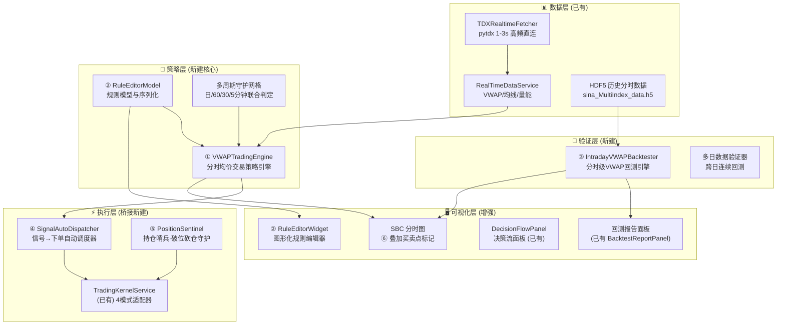
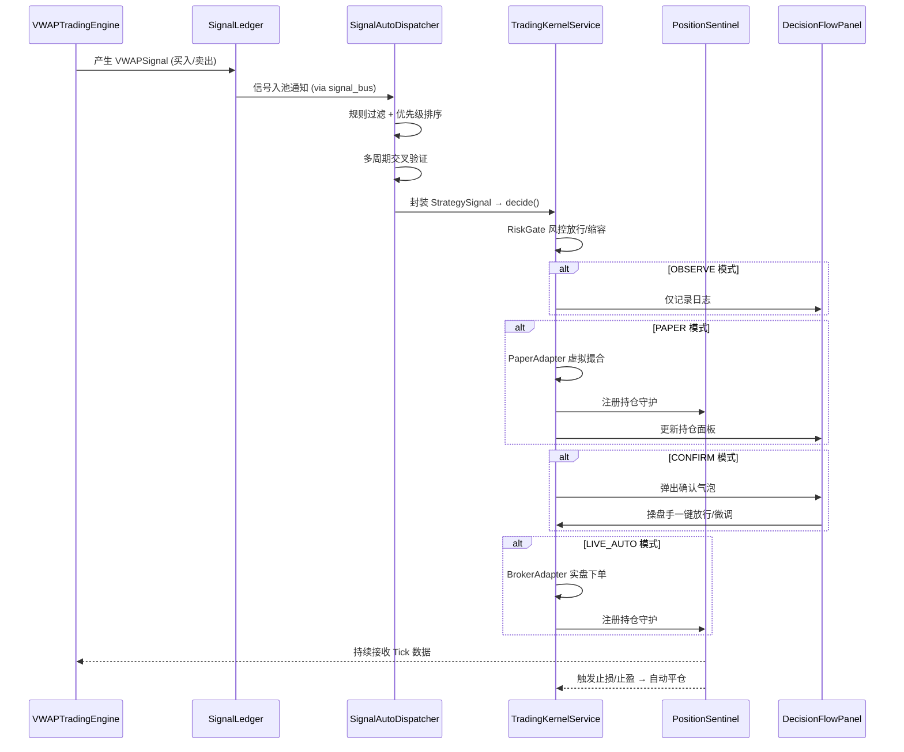

# 全自动分时多周期交易执行系统 — 完整实施设计方案

> **日期**: 2026-09-15  
> **目标**: 将现有 ATS 监控信号系统升级为完整的全自动交易闭环：**信号捕获 → 策略决策 → 自动执行 → 回测验证 → 可视化标记**  
> **核心痛点**: 系统能监控一切异动信号，但无法自动化执行交易，导致人工操作时的情绪化决策（如深套600733、错过301531底部狙击点）

---

## 一、系统现状诊断与核心差距

### ✅ 已经完成的基础设施

| 模块 | 文件 | 能力 |
|------|------|------|
| **信号捕获** | `signal_ledger.py`, `signal_bus.py` | 三级信号池 (RADAR/WATCH/TRADE)，时段优先级评分 |
| **VWAP 计算** | `realtime_data_service.py` | 单日/多日累计 VWAP，支持 1-10 日跨日加权 |
| **通道策略** | `multi_period_channel_strategy.py` | 多周期通道支撑共振评分 (0-100)，99分精准介入点 |
| **日线回测** | `multi_period_channel_backtester.py` | T+1 日线级回测，支持止损止盈跟踪 |
| **决策引擎** | `decision_engine.py` + `intraday_decision_engine.py` | 诱多陷阱一票否决、均线结构分析、趋势强度评估 |
| **交易内核** | `TradingKernelService` + 4 模式适配器 | OBSERVE/PAPER/CONFIRM/LIVE_AUTO 四级天梯 |
| **风控网关** | `risk_gate.py` + `KillSwitch` | 10大硬核风控极限、紧急物理断电、幂等防重 |
| **实时行情** | `TDXRealtimeFetcher` (pytdx) | 1-3秒级 pytdx 高频直连，五档盘口、分时 VWAP |
| **SBC 可视化** | `sbc_core.py` + SBC 面板 | 分时走势与关键价梯基准图，多日连续分时 |
| **仓位状态机** | `position_phase_engine.py` | IDLE→SCOUT→ACCUMULATE→LAUNCH→SURGE→EXIT |

### ❌ 关键缺失环节（痛点根源）

| 缺失环节 | 具体问题 | 影响 |
|----------|----------|------|
| **① 分时级 VWAP 交易策略引擎** | 没有基于分时均价线位移的自动化买卖规则引擎 | 无法自动识别"均价下移→前高附近卖出"、"VWAP站稳→筑底买入"等图中标注的模式 |
| **② 规则可视化编辑器** | 策略规则硬编码在 Python 中，无法快速调整 | 改一个参数要改代码，无法像通达信公式那样所见即所得 |
| **③ 分时级回测引擎** | 现有回测仅支持日线级，不支持分时 Tick 级 VWAP 回测 | 无法验证分时策略的真实效果 |
| **④ 信号→下单的自动桥接** | ATS 信号账本与 TradingKernelService 之间缺少自动调度器 | 信号产生后只能看，不能自动或一键执行 |
| **⑤ 多策略守护与破位砍仓** | 没有持仓级别的实时策略守护进程 | 持仓后无法自动监控破位并果断砍仓，导致深套 |
| **⑥ 买卖点图形标记** | SBC 图表不支持叠加策略买卖点标记 | 无法直观看到策略信号在分时图上的位置 |

---

## 二、系统架构设计（全景图）



---

## 三、六大核心模块详细设计

---

### 模块①：VWAPTradingEngine — 分时均价交易策略引擎

> **核心**: 基于你图中标注的「均价线下移→前高附近卖出」「VWAP站稳→筑底买入」模式

#### 文件位置
```
ats/vwap_trading_engine.py
```

#### 核心数据结构

```python
@dataclass
class VWAPState:
    """单股分时VWAP状态追踪"""
    code: str
    # VWAP 位移跟踪
    vwap_current: float          # 当前分时均价
    vwap_slope_5m: float         # 5分钟VWAP斜率 (下移/上移/横盘)
    vwap_slope_15m: float        # 15分钟VWAP斜率
    vwap_prev_day_high: float    # 前日VWAP对应的价格高点
    vwap_prev_day_close: float   # 前日VWAP收盘位
    
    # 价格与VWAP关系
    price_vs_vwap: str           # "ABOVE" | "BELOW" | "CROSSING_UP" | "CROSSING_DOWN"
    price_vwap_distance_pct: float  # 价格偏离VWAP百分比
    
    # 横盘/筑底检测
    consolidation_minutes: int    # 横盘持续分钟数
    consolidation_range_pct: float  # 横盘振幅
    consolidation_near_prev_high: bool  # 是否在前日高点附近横盘
    
    # 量能配合
    volume_trend: str            # "SHRINK" | "EXPAND" | "NORMAL"
    volume_ratio_vs_5m_avg: float  # 当前量与5分钟均量比
    
    # 状态时间戳
    last_update_ts: float
    signal_history: list         # 历史信号列表
```

#### 策略规则引擎（基于你的图表标注）

```python
class VWAPTradingRules:
    """
    规则体系 — 所有规则以 JSON 序列化配置，支持图形化编辑
    """
    
    # ========== 卖出规则族 (600733 式止损离场) ==========
    
    SELL_RULE_1_VWAP_DOWNSHIFT = {
        "name": "均价线下移卖出",
        "description": "VWAP 5/15分钟斜率持续为负，价格反弹至前日高点附近",
        "conditions": {
            "vwap_slope_5m": "< -0.001",      # VWAP 5分钟斜率为负
            "vwap_slope_15m": "< -0.0005",     # VWAP 15分钟斜率也为负(确认)
            "price_near_prev_high": "True",     # 价格接近前日高点(±0.5%)
            "consolidation_minutes": ">= 3",    # 横盘至少3分钟确认
        },
        "action": "SELL_ALL",
        "priority": 90,
        "enabled": True,
    }
    
    SELL_RULE_2_VWAP_CRASH = {
        "name": "均价线急挫平仓",
        "description": "VWAP 急速下挫（5分钟斜率极端负值），直接清仓",
        "conditions": {
            "vwap_slope_5m": "< -0.003",       # VWAP 急速下挫
            "price_below_vwap": "True",         # 价格跌破VWAP
            "price_vwap_distance_pct": "> 0.5", # 偏离超过0.5%
        },
        "action": "SELL_ALL",
        "priority": 100,  # 最高优先级
        "enabled": True,
    }
    
    SELL_RULE_3_CONSOLIDATION_SELL = {
        "name": "前高横盘出货",
        "description": "在前2日高点附近横盘超过N分钟，量缩，VWAP不再上移",
        "conditions": {
            "consolidation_near_prev_high": "True",
            "consolidation_minutes": ">= 10",
            "vwap_slope_5m": "<= 0",
            "volume_trend": "SHRINK",
        },
        "action": "SELL_HALF",  # 先减半仓
        "priority": 70,
        "enabled": True,
    }
    
    # ========== 买入规则族 (301531 式底部狙击) ==========
    
    BUY_RULE_1_VWAP_BASE_BREAKOUT = {
        "name": "VWAP筑底突破买入",
        "description": "价格在VWAP附近横盘筑底后放量突破站上VWAP",
        "conditions": {
            "price_vs_vwap": "CROSSING_UP",        # 价格从下向上穿越VWAP
            "consolidation_minutes": ">= 15",       # 此前至少横盘15分钟
            "consolidation_range_pct": "< 1.0",     # 横盘振幅小于1%
            "volume_trend": "EXPAND",               # 突破时放量
            "vwap_slope_15m": ">= 0",              # VWAP不再下移(企稳或上翘)
            "multi_period_score": ">= 70",          # 多周期通道评分≥70
        },
        "action": "BUY_SCOUT",  # 试探建仓
        "priority": 85,
        "enabled": True,
    }
    
    BUY_RULE_2_VWAP_STAND_FIRM = {
        "name": "站稳VWAP确认加仓",
        "description": "站上VWAP后回踩不破，二次确认加仓",
        "conditions": {
            "price_above_vwap_minutes": ">= 10",   # 站上VWAP超过10分钟
            "pullback_to_vwap_held": "True",        # 回踩VWAP但未跌破
            "volume_ratio_vs_5m_avg": "> 1.2",      # 量能配合
        },
        "action": "BUY_ADD",  # 加仓
        "priority": 80,
        "enabled": True,
    }
```

#### 核心计算方法

```python
class VWAPTradingEngine:
    def __init__(self, rules_config: dict = None):
        self.rules = self._load_rules(rules_config)
        self.state_map: dict[str, VWAPState] = {}   # code -> VWAPState
        self.signal_output: list[VWAPSignal] = []
    
    def tick(self, code: str, tick_data: dict, multi_period_ctx: dict) -> list[VWAPSignal]:
        """
        每次行情更新时调用，核心计算流程：
        
        1. 更新 VWAPState (均价、斜率、横盘检测)
        2. 遍历所有启用的规则，检查条件是否满足
        3. 按优先级排序输出信号
        4. 与多周期上下文交叉验证
        """
        
    def _calc_vwap_slope(self, vwap_history: list, window: int) -> float:
        """计算VWAP斜率（线性回归斜率 / 标准化）"""
        
    def _detect_consolidation(self, price_history: list, vwap: float) -> tuple:
        """检测横盘筑底模式：振幅、持续时间、位置"""
        
    def _check_rule_conditions(self, state: VWAPState, rule: dict) -> bool:
        """通用规则条件匹配引擎"""
        
    def _cross_validate_with_multi_period(self, signal: VWAPSignal, ctx: dict) -> VWAPSignal:
        """与多周期通道策略交叉验证（60分/日线/周线确认）"""
```

#### 多周期联合判定矩阵

```
分时VWAP信号 + 多周期确认 → 最终决策
─────────────────────────────────────────────────────
分时买入信号 + 60分通道底部(99分) → ✅ 强买 (如301531)
分时买入信号 + 60分通道下行(-11.7°) → ⚠️ 弱买/观望 (如600733)
分时卖出信号 + 日线MA20死叉下行    → ✅ 立即清仓
分时卖出信号 + 60分通道上行        → ⚠️ 减半仓，不全清
```

---

### 模块②：RuleEditorModel + RuleEditorWidget — 图形化规则编辑器

> **核心**: 所见即所得，可以像通达信公式编辑器一样快速调整策略参数

#### 文件位置
```
ats/vwap_rule_model.py          # 规则数据模型与序列化
ats/ui/vwap_rule_editor.py      # Qt6 图形化编辑器
config/vwap_trading_rules.json  # 规则持久化配置文件
```

#### 规则 JSON 配置格式

```json
{
  "version": "1.0",
  "strategies": [
    {
      "id": "sell_vwap_downshift",
      "name": "均价线下移卖出",
      "category": "SELL",
      "enabled": true,
      "priority": 90,
      "conditions": [
        {"field": "vwap_slope_5m",  "op": "<",  "value": -0.001, "label": "VWAP 5分钟斜率"},
        {"field": "vwap_slope_15m", "op": "<",  "value": -0.0005, "label": "VWAP 15分钟斜率"},
        {"field": "price_near_prev_high", "op": "==", "value": true, "label": "接近前日高点"},
        {"field": "consolidation_minutes", "op": ">=", "value": 3, "label": "横盘确认分钟数"}
      ],
      "action": {"type": "SELL_ALL", "label": "全部卖出"},
      "description": "VWAP持续下移，价格反弹至前日高点附近横盘，确认出货"
    }
  ],
  "global_params": {
    "vwap_window_minutes": 5,
    "consolidation_threshold_pct": 0.5,
    "multi_period_min_score": 70,
    "max_position_per_stock": 0.15
  }
}
```

#### UI 编辑器设计

```
┌─────────────────────────────────────────────────────────────────┐
│  📐 VWAP 分时交易规则编辑器                          [置顶] [×] │
├─────────────────────────────────────────────────────────────────┤
│ ┌─ 规则列表 ──────────┐ ┌─ 规则详情 ──────────────────────────┐│
│ │ ☑ 均价线下移卖出 P90│ │ 名称: [均价线下移卖出          ]    ││
│ │ ☑ 均价线急挫平仓 P100│ │ 分类: ○买入 ●卖出                  ││
│ │ ☑ 前高横盘出货  P70 │ │ 优先级: [90  ] ▼                   ││
│ │ ☑ VWAP筑底突破  P85 │ │                                    ││
│ │ ☑ 站稳VWAP加仓  P80 │ │ ── 条件列表 ──                     ││
│ │ ☐ [自定义规则1]     │ │ VWAP 5分钟斜率 [<] [-0.001] ←滑块  ││
│ │                     │ │ VWAP 15分钟斜率 [<] [-0.0005]      ││
│ │ [+ 新建规则]        │ │ 接近前日高点 [==] [True]            ││
│ │ [📋 导入JSON]       │ │ 横盘确认分钟数 [>=] [3] ←滑块      ││
│ │ [📤 导出JSON]       │ │                                    ││
│ └─────────────────────┘ │ 动作: ●全部卖出 ○减半仓 ○1/3减仓   ││
│                         │                                    ││
│                         │ [保存] [回测验证] [实时预览]         ││
│                         └────────────────────────────────────┘│
│ ┌─ 实时信号预览 ────────────────────────────────────────────┐  │
│ │ 09:42 600733 ⚠️ 均价线下移卖出 → SELL_ALL (P90)          │  │
│ │ 10:15 301531 ✅ VWAP筑底突破 → BUY_SCOUT (P85)           │  │
│ │ 10:28 301531 ✅ 站稳VWAP确认 → BUY_ADD (P80)             │  │
│ └──────────────────────────────────────────────────────────┘  │
└─────────────────────────────────────────────────────────────────┘
```

#### 关键交互能力

| 功能 | 实现方式 |
|------|----------|
| **滑块实时调参** | QSlider 绑定规则参数，拖动即时更新 |
| **所见即所得预览** | 修改参数后立即在分时图上重新标注买卖点 |
| **一键回测** | 点击"回测验证"调用分时回测引擎 |
| **JSON 导入/导出** | 支持跨环境迁移策略配置 |
| **规则启用/禁用** | QCheckBox 实时切换，不影响配置 |
| **拖拽排序** | 规则列表支持拖拽调整优先级 |

---

### 模块③：IntradayVWAPBacktester — 分时级 VWAP 回测引擎

> **核心**: 基于历史分时数据逐 Tick 回放，验证 VWAP 策略在多日多股上的真实效果

#### 文件位置
```
ats/vwap_backtest_engine.py
```

#### 架构设计

```python
class IntradayVWAPBacktester:
    """
    分时级 VWAP 策略回测引擎
    
    特点:
    1. 逐 Tick 回放 (防未来函数 Anti-Lookahead)
    2. 支持多日连续回测 (跨日 VWAP 上下文传递)
    3. 与 VWAPTradingEngine 共用同一套规则引擎 (一致性保证)
    4. 输出信号时间线 + 权益曲线 + 买卖点坐标 (用于 SBC 标注)
    """
    
    def __init__(self, 
                 rules_config_path: str,
                 initial_capital: float = 100000.0,
                 commission: float = 0.0003,
                 slippage: float = 0.001):
        self.engine = VWAPTradingEngine(rules_config_path)
        self.initial_capital = initial_capital
        
    def run_single_day(self, code: str, date: str, tick_df: pd.DataFrame) -> BacktestDayResult:
        """单日分时回测"""
        
    def run_multi_day(self, code: str, dates: list[str], tick_source) -> BacktestResult:
        """多日连续回测（跨日 VWAP 上下文自动传递）"""
        
    def run_batch(self, codes: list[str], date_range: tuple) -> BatchBacktestResult:
        """批量多股多日回测"""
```

#### 回测结果数据结构

```python
@dataclass
class BacktestResult:
    # 基础绩效
    total_trades: int
    win_rate: float
    profit_factor: float
    total_return_pct: float
    annualized_return: float
    max_drawdown_pct: float
    sharpe_ratio: float
    calmar_ratio: float
    
    # 信号时间线（用于 SBC 图形标注）
    signal_timeline: list[dict]  # [{ts, price, action, rule_name, ...}]
    
    # 权益曲线
    equity_curve: pd.Series
    
    # 逐笔流水
    trade_log: pd.DataFrame
    
    # 规则统计（哪条规则赚钱最多/亏钱最多）
    rule_performance: dict[str, dict]
```

#### 数据源策略

```
优先级1: TDX pytdx 历史分时数据 (api.get_history_minute_time_data)
优先级2: HDF5 本地缓存 (sina_MultiIndex_data.h5 中的 all_30)
优先级3: 通达信本地导出数据 (new_tdx2 目录)
```

---

### 模块④：SignalAutoDispatcher — 信号→下单自动调度器

> **核心**: 桥接信号账本 (SignalLedger) 与交易内核 (TradingKernelService)

#### 文件位置
```
ats/signal_auto_dispatcher.py
```

#### 工作流



#### 核心类设计

```python
class SignalAutoDispatcher:
    """
    信号自动调度器 — 连接策略引擎与交易内核的桥梁
    
    职责:
    1. 订阅 SignalBus 中的 VWAP 策略信号
    2. 去重 + 冷却期管理（同一标的 N 分钟内不重复下单）
    3. 多周期上下文注入（将日线/60分/30分通道数据附加到信号中）
    4. 转换为 StrategySignal 格式并投递到 TradingKernelService
    5. 记录调度审计日志
    """
    
    def __init__(self, kernel: TradingKernelService, signal_bus: SignalBus):
        self.kernel = kernel
        self.bus = signal_bus
        self.cooldown_map: dict[str, float] = {}  # code -> last_dispatch_ts
        self.cooldown_seconds = 120  # 同一标的120秒冷却
        
    def on_vwap_signal(self, signal: VWAPSignal):
        """信号回调入口"""
        
    def _should_dispatch(self, signal: VWAPSignal) -> tuple[bool, str]:
        """调度前置校验: 冷却期、交易时间、风控预检"""
        
    def _build_strategy_signal(self, signal: VWAPSignal) -> StrategySignal:
        """将 VWAPSignal 转换为 TradingKernel 标准格式"""
```

---

### 模块⑤：PositionSentinel — 持仓哨兵·破位砍仓守护

> **核心**: 持仓后自动监控，破位果断砍仓，避免深套（600733 教训）

#### 文件位置
```
ats/position_sentinel.py
```

#### 守护规则体系

```python
class PositionSentinel:
    """
    持仓哨兵 — 实时监控所有持仓标的的生死线
    
    守护规则（优先级从高到低）:
    
    1. 硬止损线: 亏损超过 X% 立即平仓（默认 -5%）
    2. VWAP 破位: 跌破当日分时均价线超过 Y 分钟
    3. 通道支撑破位: 跌破多周期通道下轨
    4. 均价线持续下移: VWAP 斜率连续 N 分钟为负
    5. 龙头崩塌: 所属板块龙头急杀超过 Z%
    6. 日内亏损限额: 账户当日总亏损触及上限
    7. 移动止盈: 从最高浮盈回撤超过 W%
    8. 尾盘强制: 14:50 后浮亏持仓强制评估
    """
    
    def __init__(self, kernel: TradingKernelService, rules_config: dict):
        self.kernel = kernel
        self.watched_positions: dict[str, SentinelState] = {}
        self._rules = self._load_sentinel_rules(rules_config)
        
    def register_position(self, code: str, entry_price: float, entry_time: str):
        """新建仓后注册到哨兵监控"""
        
    def on_tick(self, code: str, tick_data: dict):
        """每 Tick 更新时检查所有守护规则"""
        
    def _evaluate_all_rules(self, code: str, state: SentinelState) -> Optional[SentinelAction]:
        """遍历所有守护规则，返回最高优先级的触发动作"""
        
    def _execute_sentinel_action(self, action: SentinelAction):
        """执行哨兵动作: 砍仓/减仓/报警"""
```

#### 与 VWAPTradingEngine 的协同

```
VWAPTradingEngine (进攻端) ──→ 发现买入信号 → 建仓
                                    ↓
                           PositionSentinel (防守端) ← 注册守护
                                    ↓
                           持续接收 Tick → 检查守护规则
                                    ↓
                           ┌─ 规则未触发 → 继续守护
                           └─ 规则触发   → 自动砍仓 → TradingKernelService
```

---

### 模块⑥：SBC 买卖点图形标记 — 所见即所得可视化

> **核心**: 在 SBC 分时图上叠加策略买卖点标记，直观展示信号位置

#### 增强文件
```
sbc_core.py              # 增加 signal_markers 数据通道
ats/ui/chart_widgets.py   # 增加买卖点绘制图元
```

#### 标记类型设计

```python
@dataclass
class SignalMarker:
    """分时图买卖点标记"""
    timestamp: float          # 精确到秒的时间戳
    price: float              # 触发价格
    marker_type: str          # "BUY" | "SELL" | "STOP_LOSS" | "TAKE_PROFIT"
    rule_name: str            # 触发的规则名称
    confidence: float         # 信号置信度 (0-1)
    source: str               # "LIVE" | "BACKTEST" | "MANUAL"
    
    # 图形属性
    color: str                # 买入绿色、卖出红色
    icon: str                 # "▲" 买入、"▼" 卖出
    tooltip: str              # 鼠标悬停提示
```

#### 渲染方式

```
SBC 分时走势图
│
├─ 青色价格线 (已有)
├─ 黄色虚线 VWAP (已有)
├─ ── 新增 ──
├─ 🟢▲ 买入点标记 (绿色上三角 + 价格标签)
├─ 🔴▼ 卖出点标记 (红色下三角 + 价格标签)
├─ 🟡◆ 止损点标记 (黄色菱形)
├─ 半透明色带: 持仓区间着色
└─ 浮动标签: 盈亏百分比
```

#### 实现要点

- 使用 pyqtgraph `ScatterPlotItem` 绘制标记点（对象池复用，脏检查机制）
- 标记数据通过 `signal_markers: list[SignalMarker]` 传入 SBC 面板
- 回测模式下批量渲染历史买卖点
- 实时模式下增量追加新信号标记
- 鼠标悬停显示详细信号信息（规则名、置信度、盈亏）

---

## 四、数据流与接口对接矩阵

```
┌────────────────────────────────────────────────────────────────────┐
│                        数据流总览                                   │
├────────────────────────────────────────────────────────────────────┤
│                                                                    │
│  TDXRealtimeFetcher ──3s──→ RealTimeDataService                   │
│         │                         │                                │
│         │ tick_data               │ vwap/nclose/volume             │
│         ↓                         ↓                                │
│  VWAPTradingEngine.tick(code, tick_data, multi_period_ctx)         │
│         │                                                          │
│         │ VWAPSignal                                               │
│         ↓                                                          │
│  SignalAutoDispatcher.on_vwap_signal(signal)                       │
│         │                                                          │
│         │ StrategySignal                                           │
│         ↓                                                          │
│  TradingKernelService.ingest_signal(signal)                       │
│         │                                                          │
│         ├──→ DecisionEngine.decide() → RiskGate.evaluate()         │
│         │                                                          │
│         └──→ 模式路由 ──→ PaperAdapter / BrokerAdapter             │
│                   │                                                │
│                   └──→ PositionSentinel.register_position()        │
│                              │                                     │
│                              │ 持续 Tick 监控                       │
│                              ↓                                     │
│                        守护规则触发 → 自动砍仓                      │
│                                                                    │
│  ── 同时 ──                                                        │
│  VWAPTradingEngine ──→ SBC 面板 (signal_markers)                   │
│  IntradayVWAPBacktester ──→ BacktestReportPanel (回测绩效)         │
│  RuleEditorWidget ←→ vwap_trading_rules.json (图形化编辑)          │
│                                                                    │
└────────────────────────────────────────────────────────────────────┘
```

---

## 五、与现有模块的接口对接

### 不修改的模块（100%兼容）

| 模块 | 原因 |
|------|------|
| `TradingKernelService` | 新模块通过标准 `StrategySignal` 接口投递，无需修改内核 |
| `RiskGate` / `KillSwitch` | 风控网关原封不动，所有新信号都必须经过风控 |
| `PaperAdapter` / `BrokerAdapter` | 执行层适配器不变，新系统只是多了一个信号源 |
| `SignalLedger` | 信号账本不变，VWAP 信号作为新的 source 类型写入 |

### 需要增强的模块（最小修改）

| 模块 | 修改内容 | 修改量 |
|------|----------|--------|
| `sbc_core.py` | 增加 `signal_markers` 数据通道 | +30行 |
| `chart_widgets.py` | 增加 `ScatterPlotItem` 买卖点绘制 | +80行 |
| `signal_types.py` | 增加 `VWAP_BUY`/`VWAP_SELL` 信号类型枚举 | +5行 |
| `signal_bus.py` | 增加 `VWAP_SIGNAL` 事件类型 | +3行 |

### 全新模块

| 文件 | 行数估计 | 核心职责 |
|------|----------|----------|
| `ats/vwap_trading_engine.py` | ~800行 | VWAP 分时交易策略引擎 |
| `ats/vwap_rule_model.py` | ~300行 | 规则数据模型与序列化 |
| `ats/vwap_backtest_engine.py` | ~600行 | 分时级 VWAP 回测引擎 |
| `ats/signal_auto_dispatcher.py` | ~400行 | 信号→下单自动调度器 |
| `ats/position_sentinel.py` | ~500行 | 持仓哨兵·破位砍仓守护 |
| `ats/ui/vwap_rule_editor.py` | ~600行 | 图形化规则编辑器 Qt6 |
| `config/vwap_trading_rules.json` | ~200行 | 默认规则配置 |

---

## 六、实施路线图（分阶段）

### Phase 1：核心引擎（打通数据→信号）
```
① VWAPTradingEngine — 分时均价交易策略引擎
② vwap_rule_model — 规则模型与 JSON 序列化
目标: 能够在接收 Tick 数据时自动产生 VWAP 买卖信号
验证: 用 600733 和 301531 的历史数据验证信号准确性
```

### Phase 2：执行桥接（信号→下单）
```
④ SignalAutoDispatcher — 信号自动调度器
⑤ PositionSentinel — 持仓哨兵·破位砍仓守护
目标: VWAP 信号能自动流入 TradingKernelService 并执行
验证: PAPER 模式下全天模拟运行，检查信号调度与仓位管理
```

### Phase 3：回测验证（历史验证）
```
③ IntradayVWAPBacktester — 分时级回测引擎
目标: 多日多股回测，输出胜率/盈亏比/最大回撤等绩效
验证: 对比 600733(亏损案例) 和 301531(盈利案例) 的回测结果
```

### Phase 4：可视化与交互（所见即所得）
```
⑥ SBC 买卖点图形标记
② RuleEditorWidget — 图形化规则编辑器
目标: 分时图上直观展示买卖点，可快速调整规则参数
验证: 修改规则参数后立即在 SBC 上看到信号变化
```

---

## User Review Required

> [!IMPORTANT]
> **交易模式选择**: 初始实施阶段建议锁定在 `PAPER`（高保真模拟）模式，经过至少2周以上的实盘模拟验证后，再逐步升级到 `CONFIRM` 模式。是否同意？

> [!WARNING]
> **TDX 交易 API**: 当前系统使用 `pytdx` 获取行情数据，但 pytdx 本身**不具备下单能力**。实盘自动下单需要对接 QMT/Mini-QMT 或其他券商 API。`BrokerAdapter` 中的 `_execute_broker_order` 目前是模拟实现。实盘阶段需要确认你的券商 API 接入方式。

## Open Questions

> [!IMPORTANT]
> 1. **分时数据源**: 回测用的历史分时数据主要来源？是 HDF5 (`sina_MultiIndex_data.h5`) 还是 pytdx 历史分时接口？还是两者都用？
> 2. **规则调参频率**: 你希望规则调参是在盘中实时生效，还是只在非交易时段调整、次日生效？
> 3. **多策略并行**: 是否需要同时运行多套规则配置（如激进组/保守组），还是一次只用一套？
> 4. **实盘下单接口**: 你目前计划用什么方式实现真实下单？QMT/Mini-QMT？还是通过 AHK 模拟键鼠操作通达信下单？（我看到项目中有 `ahk/tdx-dfcf.ahk`）
