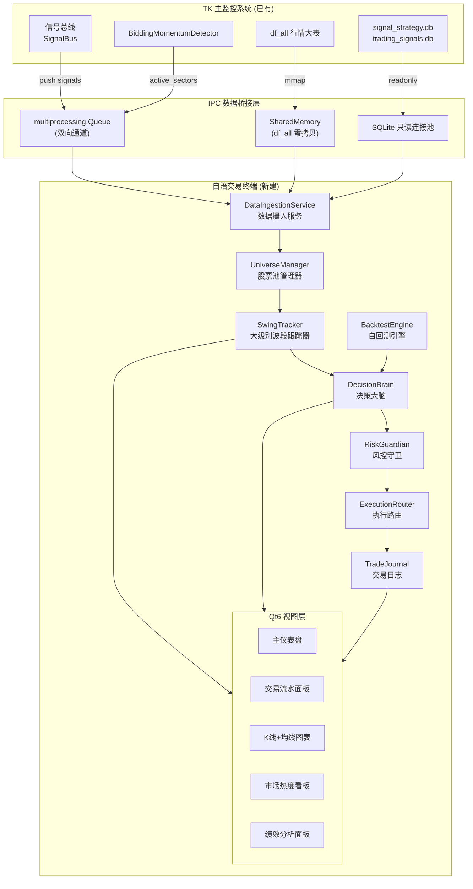
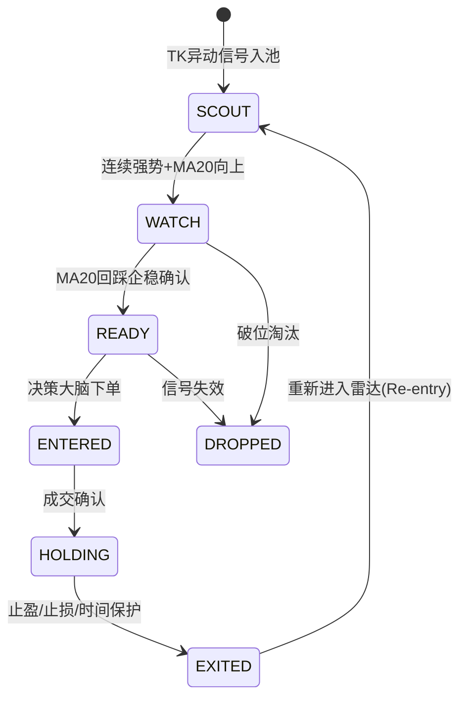
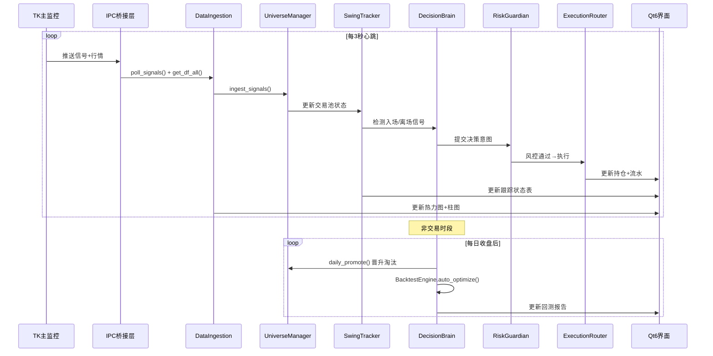

# 🏗️ 独立自治交易决策系统 — 全量架构设计方案

> **版本**: v1.0 | **日期**: 2026-06-11 | **状态**: 规划阶段（仅设计，不实施）

---

## 一、系统定位与核心目标

构建一个 **独立于 TK 主监控程序** 的 Qt6 交易决策终端，具备：

| 能力维度 | 描述 |
|---------|------|
| **24×7 自迭代** | 非交易时段自动回测、复盘、优化信号权重 |
| **大级别跟踪** | MA20/MA60 回调启动的中线波段跟踪，非日内突发异动 |
| **IPC 数据桥** | 通过 `multiprocessing.Queue` / 共享内存读取 TK 全量信号与行情 |
| **自回测闭环** | 内置历史数据回放引擎，验证策略胜率与期望收益 |
| **极速交互** | 饼图/柱图/热力图实时刷新，点击即查交易流水 |

---

## 二、顶层架构总览



---

## 三、模块详细设计

### 3.1 IPC 数据桥接层 (`ipc_bridge.py`)

**职责**：从 TK 系统无侵入式获取全量数据

```python
class IPCBridge:
    """双向 IPC 数据桥接器"""

    def __init__(self):
        self._signal_queue: mp.Queue    # 接收 TK SignalBus 推送
        self._command_queue: mp.Queue   # 向 TK 发送联动指令
        self._shm_name: str             # SharedMemory 名称
        self._db_pool: SQLiteReadPool   # 只读 DB 连接池

    # --- 信号接收 ---
    def poll_signals(self, timeout=0.1) -> list[StandardSignal]:
        """非阻塞轮询 TK 推送的信号"""

    # --- 行情快照 ---
    def get_df_all_snapshot(self) -> pd.DataFrame:
        """通过 SharedMemory 零拷贝读取最新 df_all"""

    # --- 历史数据 ---
    def query_signal_history(self, days=30) -> pd.DataFrame:
        """只读查询 signal_strategy.db"""

    def query_selection_history(self, days=30) -> pd.DataFrame:
        """只读查询 trading_signals.db 选股记录"""

    def query_follow_queue(self) -> pd.DataFrame:
        """读取 TradingHub.follow_queue"""

    # --- 联动指令 ---
    def push_linkage(self, code: str):
        """向 TK 发送股票联动切换指令"""
```

**数据源映射表**：

| 数据 | 来源 | 方式 | 频率 |
|------|------|------|------|
| 实时信号 | `SignalBus` | `mp.Queue` push | 实时 |
| 全量行情 | `df_all` | `SharedMemory` mmap | 3s |
| 活跃板块 | `BiddingMomentumDetector` | Queue 快照 | 5s |
| 选股记录 | `trading_signals.db` | SQLite readonly | 按需 |
| 跟单队列 | `signal_strategy.db` | SQLite readonly | 10s |
| K线历史 | `sina_MultiIndex_data.h5` | HDF5 readonly | 按需 |

---

### 3.2 股票池管理器 (`universe_manager.py`)

**职责**：维护三层股票池，实现从"发现"到"跟踪"到"交易"的晋升链

```python
class UniverseManager:
    """三层漏斗式股票池"""

    # 第一层：雷达池 (500+)
    radar_pool: dict[str, RadarEntry]

    # 第二层：观察池 (50-100)
    watch_pool: dict[str, WatchEntry]

    # 第三层：交易池 (5-15)
    trade_pool: dict[str, TradeEntry]

    def ingest_signals(self, signals: list[StandardSignal]):
        """从 TK 信号中筛选候选股入雷达池"""

    def daily_promote(self):
        """每日收盘后执行晋升/淘汰评估"""

    def check_ma20_setup(self, code: str, df_hist: pd.DataFrame) -> bool:
        """检测 MA20 大级别回调启动信号"""
```

**晋升规则**：

```
雷达池 → 观察池:
  - 连续2日出现在 TK 异动信号中
  - MA20 向上且价格站稳 MA20 上方
  - 所属板块处于活跃状态

观察池 → 交易池:
  - 通过 MA20 回踩验证 (价格触及 MA20±2% 后企稳反弹)
  - 量能配合 (缩量回调 + 放量启动)
  - 通过回测引擎的历史胜率校验 ≥ 55%

淘汰条件:
  - 跌破 MA60 或连续3日缩量阴跌
  - 板块整体转弱 (板块得分连续下降)
  - 停牌/ST/退市风险
```

---

### 3.3 大级别波段跟踪器 (`swing_tracker.py`)

**职责**：MA20 大级别波段的全生命周期跟踪

```python
@dataclass
class SwingState:
    code: str
    name: str
    phase: str          # SCOUT → WATCH → READY → ENTERED → HOLDING → EXITED
    entry_price: float
    current_price: float
    ma20: float
    ma60: float
    days_tracked: int
    days_held: int
    highest_since_entry: float
    pattern: str        # 形态标签: "MA20回踩企稳", "突破平台", "缩量洗盘"

class SwingTracker:
    """大级别波段跟踪器 - 核心状态机"""

    states: dict[str, SwingState]

    def update_tick(self, code: str, snapshot: dict):
        """每个行情心跳更新状态"""

    def check_entry_signal(self, state: SwingState) -> Optional[dict]:
        """检测入场信号: MA20回踩+企稳+放量"""

    def check_exit_signal(self, state: SwingState) -> Optional[dict]:
        """检测离场信号: 跌破MA20/时间保护/止盈"""

    def get_dashboard_data(self) -> list[dict]:
        """供 UI 展示的状态快照"""
```

**状态机流转**：



---

### 3.4 决策大脑 (`decision_brain.py`)

**职责**：整合信号、状态、风控，产出交易决策

复用已有 `trading_kernel/` 架构，扩展大级别策略分支：

```python
class DecisionBrain:
    """交易决策大脑 - 桥接 SwingTracker 与 TradingKernelService"""

    def __init__(self):
        self.kernel = TradingKernelService()  # 复用已有内核
        self.tracker = SwingTracker()
        self.universe = UniverseManager()
        self._decision_log: deque[DecisionRecord]

    def on_heartbeat(self, df_all: pd.DataFrame, signals: list):
        """主心跳循环 - 每3秒执行"""
        # 1. 更新股票池
        self.universe.ingest_signals(signals)
        # 2. 更新跟踪状态
        for code in self.universe.trade_pool:
            snap = self._build_snapshot(code, df_all)
            self.tracker.update_tick(code, snap)
        # 3. 检测入场/离场信号
        for state in self.tracker.states.values():
            entry = self.tracker.check_entry_signal(state)
            if entry:
                self._submit_to_kernel(entry)
            exit_sig = self.tracker.check_exit_signal(state)
            if exit_sig:
                self._submit_to_kernel(exit_sig)

    def _submit_to_kernel(self, signal_dict: dict):
        """提交到 TradingKernelService 走完整决策+风控+执行链"""
        result = self.kernel.evaluate_decision_item(signal_dict)
        self._decision_log.append(DecisionRecord(...))
```

---

### 3.5 风控守卫 (`risk_guardian.py`)

复用已有 `trading_kernel/engine/risk_gate.py`，扩展大级别专属规则：

| 规则 | 参数 | 说明 |
|------|------|------|
| 单股最大仓位 | 30% | 继承 `RiskLimits.max_single_stock_position_pct` |
| 板块集中度 | 50% | 继承 `RiskLimits.max_single_sector_exposure_pct` |
| 总仓位上限 | 80% | 继承 `RiskLimits.total_exposure_cap_pct` |
| 日亏损限额 | ¥50,000 | 继承 `RiskLimits.daily_loss_limit_amount` |
| **波段持仓时间保护** | **5-10天** | 新增：超时未达预期收益自动减仓 |
| **MA20破位强清** | **跌破2%** | 新增：价格跌破MA20的2%立即全平 |
| **波段回撤保护** | **从最高回落5%** | 新增：浮盈回吐超限触发止盈 |

---

### 3.6 自回测引擎 (`backtest_engine.py`)

```python
class BacktestEngine:
    """离线自回测引擎 - 24×7 非交易时段自动运行"""

    def __init__(self):
        self.data_loader = HistoricalDataLoader()  # 从 h5/db 加载
        self.brain = DecisionBrain()               # 复用决策大脑
        self.metrics = BacktestMetrics()

    def run_backtest(self, codes: list[str],
                     start_date: str, end_date: str,
                     strategy_params: dict) -> BacktestResult:
        """对指定股票池执行历史回测"""

    def auto_optimize(self):
        """非交易时段自动参数寻优"""
        # 1. 遍历参数网格
        # 2. 对近30日交易池执行回测
        # 3. 输出最优参数组合
        # 4. 写入 config 供下个交易日使用

    def generate_report(self, result: BacktestResult) -> dict:
        """生成回测报告: 胜率/盈亏比/最大回撤/夏普"""
```

**回测数据源**：

| 数据 | 来源文件 | 说明 |
|------|---------|------|
| 日K线 | `sina_MultiIndex_data.h5` | 全市场历史OHLCV |
| 分钟K线 | `realtime_data_service.DataPublisher` 缓存 | 盘中分时数据 |
| 历史信号 | `signal_strategy.db → live_signal_history` | TK历史触发记录 |
| 选股记录 | `trading_signals.db → stock_selections` | 历史选股评分 |

---

### 3.7 交易日志 (`trade_journal.py`)

复用已有 `TradingLogger` + `TradingHub`，扩展波段级字段：

```python
class TradeJournal:
    """交易日志 - 全生命周期记录"""

    def record_entry(self, code, price, strategy, swing_state):
        """记录入场"""

    def record_exit(self, code, price, reason, pnl):
        """记录离场"""

    def get_trade_flow(self, days=30) -> pd.DataFrame:
        """获取交易流水 (供UI点击查看)"""

    def get_daily_pnl(self, days=30) -> pd.DataFrame:
        """获取每日盈亏 (供柱状图)"""

    def get_strategy_stats(self) -> pd.DataFrame:
        """获取策略绩效 (供饼图)"""
```

---

## 四、Qt6 视图层设计

### 4.1 主窗口布局

```
┌─────────────────────────────────────────────────────────┐
│ 🔧 工具栏: [模式切换] [回测] [设置] [联动TK]           │
├──────────┬──────────────────────────────────────────────┤
│          │  📊 市场热度看板 (饼图+柱图)                 │
│  📋      │  ┌─────────┬────────────┬──────────┐        │
│  股票池  │  │板块热力图│涨跌分布柱图│策略胜率饼│        │
│  三层    │  └─────────┴────────────┴──────────┘        │
│  列表    ├──────────────────────────────────────────────┤
│          │  📈 跟踪状态面板                             │
│  雷达池  │  代码│名称│阶段│MA20│价格│偏离│持仓天│信号   │
│  观察池  │  ────┼────┼────┼────┼────┼────┼──────┼────   │
│  交易池  │  ...  实时滚动更新                           │
│          ├──────────────────────────────────────────────┤
│          │  💰 交易流水 (点击即查)                      │
│          │  时间│代码│方向│价格│数量│盈亏│策略│理由     │
└──────────┴──────────────────────────────────────────────┘
```

### 4.2 视图组件清单

| 组件 | 类名 | 数据源 | 刷新频率 |
|------|------|--------|---------|
| 股票池列表 | `UniverseListWidget` | `UniverseManager` | 5s |
| 市场热力图 | `HeatmapWidget` | `df_all + active_sectors` | 10s |
| 涨跌分布柱图 | `DistributionBarChart` | `df_all.percent` | 10s |
| 策略胜率饼图 | `StrategyPieChart` | `TradeJournal` | 按需 |
| 跟踪状态表 | `SwingStateTable` | `SwingTracker` | 3s |
| 交易流水表 | `TradeFlowTable` | `TradeJournal` | 按需 |
| K线图表 | `KlineChartWidget` | HDF5 + 实时tick | 点击触发 |
| 绩效曲线 | `EquityCurveWidget` | `TradeJournal` | 按需 |
| 回测结果面板 | `BacktestResultPanel` | `BacktestEngine` | 按需 |

### 4.3 图表技术选型

| 图表类型 | 实现方案 | 说明 |
|---------|---------|------|
| K线图 | `pyqtgraph` | 已在项目中使用，高性能 |
| 柱状图 | `pyqtgraph.BarGraphItem` | 涨跌分布、每日盈亏 |
| 饼状图 | `QPainter` 自绘 | 策略占比、板块分布 |
| 热力图 | `pyqtgraph.ImageItem` | 板块强度矩阵 |
| 权益曲线 | `pyqtgraph.PlotWidget` | 累计收益走势 |

---

## 五、数据流时序图



---

## 六、进程模型与启动方式

```python
# main_ats.py - 自治交易终端入口
def main():
    app = QApplication(sys.argv)

    # 1. 初始化 IPC 桥接 (连接 TK)
    bridge = IPCBridge()
    bridge.connect_to_tk()  # 尝试连接, 失败则独立运行

    # 2. 初始化核心引擎
    brain = DecisionBrain()
    backtest = BacktestEngine()

    # 3. 初始化 UI
    window = MainWindow(brain, backtest, bridge)
    window.show()

    # 4. 启动心跳线程
    heartbeat = HeartbeatThread(brain, bridge, interval=3.0)
    heartbeat.start()

    # 5. 启动非交易时段调度器
    scheduler = OffHoursScheduler(backtest, brain)
    scheduler.start()

    sys.exit(app.exec())
```

**独立运行模式**：当 TK 未启动时，系统降级为：
- 从 SQLite/HDF5 加载历史数据
- 仅运行回测与复盘功能
- UI 展示历史交易分析

---

## 七、文件结构规划

```
stock_standalone/
├── ats/                          # 自治交易终端 (新建)
│   ├── __init__.py
│   ├── main_ats.py               # 入口
│   ├── ipc_bridge.py             # IPC 数据桥接
│   ├── universe_manager.py       # 股票池管理
│   ├── swing_tracker.py          # 波段跟踪器
│   ├── decision_brain.py         # 决策大脑
│   ├── risk_guardian.py          # 风控守卫(扩展)
│   ├── backtest_engine.py        # 自回测引擎
│   ├── trade_journal.py          # 交易日志(扩展)
│   ├── scheduler.py              # 非交易时段调度
│   ├── ui/
│   │   ├── main_window.py        # 主窗口
│   │   ├── universe_widget.py    # 股票池列表
│   │   ├── heatmap_widget.py     # 热力图
│   │   ├── chart_widgets.py      # 柱图/饼图/曲线
│   │   ├── swing_table.py        # 跟踪状态表
│   │   ├── trade_flow.py         # 交易流水
│   │   ├── backtest_panel.py     # 回测面板
│   │   └── styles.py             # QSS 样式
│   └── tests/
│       ├── test_universe.py
│       ├── test_swing_tracker.py
│       ├── test_brain.py
│       └── test_backtest.py
```

---

## 八、复用清单

| 已有模块 | 复用方式 | 说明 |
|---------|---------|------|
| `trading_kernel/` | 直接 import | 决策引擎+风控+执行 |
| `signal_standard.py` | 直接 import | 统一信号结构 |
| `trading_hub.py` | 只读查询 | 跟单队列+热股观察 |
| `trading_logger.py` | 扩展继承 | 交易日志持久化 |
| `market_sentiment_fsm.py` | 直接 import | 情绪状态机 |
| `bidding_momentum_detector.py` | IPC 读取 | 板块+个股评分 |
| `realtime_data_service.py` | IPC 订阅 | 分钟K线缓存 |
| `linkage_service.py` | 发送指令 | 联动通达信 |
| `db_utils.py` | 直接 import | SQLite 连接管理 |

---

## 九、实施路线图

| 阶段 | 内容 | 预计周期 |
|------|------|---------|
| **P0** | IPC桥接 + 股票池管理 + 基础UI框架 | 3天 |
| **P1** | SwingTracker 状态机 + DecisionBrain 集成 | 3天 |
| **P2** | 图表组件 (热力图/柱图/饼图/K线) | 2天 |
| **P3** | 自回测引擎 + 参数寻优 | 3天 |
| **P4** | 交易流水面板 + 绩效分析 | 2天 |
| **P5** | 联调测试 + 独立运行模式 | 2天 |

---

## 十、关键设计决策

1. **不引入新框架**：全部使用项目已有的 PyQt6 + pyqtgraph + SQLite + pandas
2. **不修改 TK 代码**：通过 IPC Queue 和 SQLite 只读实现零侵入对接
3. **复用 trading_kernel**：直接 import 已有决策引擎，避免重复实现
4. **独立进程运行**：作为独立 Python 进程启动，崩溃不影响 TK 主系统
5. **大级别优先**：核心跟踪 MA20/MA60 波段，过滤日内噪声信号
