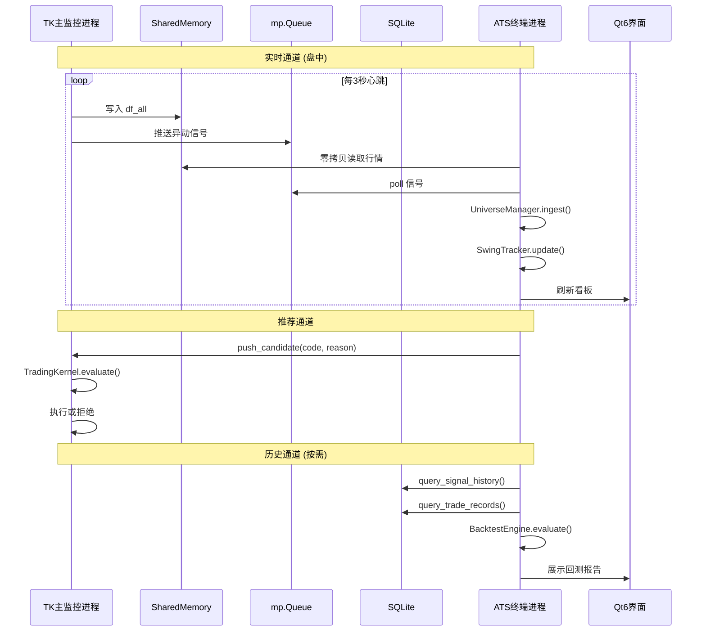

# 🏗️ ATS 自治交易终端 — 精简架构设计方案 v2

> **版本**: v2.0 | **日期**: 2026-06-11 | **状态**: 规划阶段（仅设计，不实施）
> **核心原则**: 不造第二套内核，ATS 是 TK 的消费者，不是竞争者

---

## 一、系统定位

ATS 不是"另一个交易系统"，而是 TK 的 **高级分析终端**：

| ❌ 不做 | ✅ 做 |
|---------|------|
| 再造 DecisionBrain | 直接 `from trading_kernel import *` |
| 再造 RiskGuardian | 复用 `risk_gate.py` |
| 再造 ExecutionRouter | 生成候选 → 推送给 TK 执行 |
| 自动修改策略参数 | 只统计、人工决定是否修改 |
| Socket 通信 | mp.Queue + SharedMemory + SQLite |

**核心解决的痛点**：
- 异动太多、信号太多、无法持续跟踪
- 缺少"信号到底有没有用"的统计闭环
- 没有 MA20 大级别波段的系统化跟踪

---

## 二、最终架构

```
TK 进程
│
├── TradingKernel（保留，唯一决策内核）
│
├── SharedMemory ─── 行情池 (df_all) ──── 50%数据量
├── mp.Queue ──────── 实时信号推送 ─────── 45%数据量
└── SQLite ─────────── 历史数据只读 ────── 5%数据量
                          │
                          ▼
                    ATS 进程 (Qt6)
                    │
                    ├── IPCBridge         ← 数据摄入
                    ├── UniverseManager   ← 三层股票池
                    ├── SwingTracker      ← MA20波段跟踪
                    ├── BacktestEngine    ← 信号有效性统计
                    ├── TradeJournal      ← 交易记录展示
                    └── Qt Dashboard      ← 可视化看板
```

**关键区别**：ATS 只 **观察、统计、推荐**，不直接下单。
下单路径永远是：`ATS候选 → 推送TK → TK.TradingKernel 执行`

---

## 三、IPC 数据桥接层

### 3.1 数据流权重分配

| 通道 | 权重 | 数据 | 方式 |
|------|------|------|------|
| **SharedMemory** | 50% | df_all 全量行情 (5000+股) | mmap 零拷贝，3s刷新 |
| **mp.Queue** | 45% | 实时异动信号 + 板块评分 | push 模式，实时 |
| **SQLite** | 5% | 历史交易/信号/选股 | 只读连接，按需查询 |
| ~~Socket~~ | 0% | ~~不用~~ | 未来做远程终端时再抽象 |

### 3.2 接口设计

```python
class IPCBridge:
    """TK → ATS 单向数据桥接"""

    def __init__(self):
        self._signal_queue: mp.Queue     # TK push → ATS poll
        self._shm_df_all: SharedMemory   # TK write → ATS read
        self._db_path: str               # SQLite 只读路径

    # ── 实时通道 ──
    def poll_signals(self, timeout=0.1) -> list[StandardSignal]:
        """非阻塞读取 TK 推送的异动/信号"""

    def get_df_all_snapshot(self) -> pd.DataFrame:
        """零拷贝读取最新 df_all 行情大表"""

    # ── 历史通道 ──
    def query_signal_history(self, days=30) -> pd.DataFrame:
        """只读查询 signal_strategy.db → live_signal_history"""

    def query_selection_history(self, days=30) -> pd.DataFrame:
        """只读查询 trading_signals.db → stock_selections"""

    def query_follow_queue(self) -> pd.DataFrame:
        """读取 TradingHub.follow_queue 跟单队列"""

    def query_trade_records(self, days=30) -> pd.DataFrame:
        """读取 paper_account_state.json 交易流水"""

    # ── 联动指令 (ATS → TK) ──
    def push_candidate(self, code: str, reason: str):
        """向 TK 推送候选股，由 TK 内核决策是否执行"""
```

### 3.3 TK 侧改动（零侵入方案）

TK 现有代码 **不需要修改**，只需在启动时暴露：

```python
# instock_MonitorTK.py 启动时（已有类似逻辑）
# 1. SharedMemory: df_all 已通过现有机制共享
# 2. Queue: SignalBus 已有 external_queue 机制
# 3. SQLite: signal_strategy.db 天然支持多读者
```

未来如需远程化，只需：
```
Queue → 抽象为 SignalBus → 底层替换为 Socket/WebSocket
```

---

## 四、核心模块设计

### 4.1 UniverseManager — 三层漏斗股票池

**这是 ATS 最核心的价值模块**，解决"异动太多、无法持续跟踪"的痛点。

```python
@dataclass
class StockEntry:
    code: str
    name: str
    sector: str
    discover_date: str       # 首次发现日期
    discover_price: float
    current_price: float
    ma20: float
    ma60: float
    signal_count: int        # 累计异动次数
    consecutive_days: int    # 连续出现天数
    trend_score: float       # 趋势评分
    pool_level: str          # RADAR / WATCH / TRADE

class UniverseManager:
    """三层漏斗式股票池管理器"""

    # 第一层：雷达池 (≤500) — 每日异动汇总
    radar_pool: dict[str, StockEntry]

    # 第二层：观察池 (≤100) — 连续强势+趋势向上
    watch_pool: dict[str, StockEntry]

    # 第三层：交易池 (≤15)  — MA20回踩验证通过
    trade_pool: dict[str, StockEntry]

    def ingest_from_tk(self, signals: list, df_all: pd.DataFrame):
        """从 TK 信号 + 行情中更新雷达池"""
        # 所有异动信号入 radar_pool
        # 去重：同股同日只记一次，累加 signal_count

    def daily_evaluate(self):
        """收盘后执行每日晋升/淘汰"""
        # 雷达 → 观察: 连续2日异动 + MA20向上 + 板块活跃
        # 观察 → 交易: MA20回踩企稳 + 缩量洗盘 + 放量启动
        # 淘汰: 跌破MA60 / 连续3日阴跌 / 板块转弱

    def get_pool_summary(self) -> dict:
        """供 UI 展示的池子汇总"""
```

**晋升规则**：

```
雷达池 → 观察池:
  ✅ 连续 ≥2 日出现在 TK 异动信号中
  ✅ MA20 向上（MA20 > MA20_prev5 * 1.002）
  ✅ 所属板块在 active_sectors 中

观察池 → 交易池:
  ✅ 价格回踩 MA20±2% 后企稳反弹
  ✅ 回调期间缩量 (vol_ratio < 0.9)
  ✅ BacktestEngine 历史胜率 ≥ 55%

淘汰 → 移出:
  ❌ 跌破 MA60
  ❌ 连续 3 日缩量阴跌
  ❌ 板块得分连续下降 (score < prev_score * 0.8)
  ❌ 停牌/ST/退市风险
```

---

### 4.2 SwingTracker — 大级别波段状态机

```python
@dataclass
class SwingState:
    code: str
    name: str
    phase: str              # SCOUT→WATCH→READY→RECOMMEND→TRACKING→CLOSED
    entry_price: float      # 建议入场价
    current_price: float
    ma20: float
    ma60: float
    days_tracked: int       # 跟踪天数
    highest_price: float    # 跟踪期内最高价
    pattern: str            # "MA20回踩企稳" / "突破平台" / "缩量洗盘"
    recommend_reason: str   # 推荐理由

class SwingTracker:
    """MA20 大级别波段跟踪器（只跟踪、只推荐，不下单）"""

    states: dict[str, SwingState]

    def update_tick(self, code: str, row: dict):
        """每个心跳更新个股状态"""

    def check_entry_setup(self, state: SwingState) -> Optional[dict]:
        """检测入场时机 → 生成推荐（推送给TK决策）"""
        # MA20 回踩 + 企稳 + 放量信号

    def check_exit_setup(self, state: SwingState) -> Optional[dict]:
        """检测离场信号 → 生成提醒"""
        # 跌破 MA20 / 从最高回落5% / 时间保护

    def get_dashboard_data(self) -> list[dict]:
        """供 UI QTableWidget 展示"""
```

**状态流转**：

```
SCOUT ──(连续强势)──→ WATCH ──(MA20回踩确认)──→ READY
                                                    │
                                         (推荐给TK) ↓
                                              RECOMMEND
                                                    │
                                        (TK执行后)  ↓
                                              TRACKING
                                                    │
                               (止盈/止损/时间保护) ↓
                                               CLOSED
                                                    │
                                        (Re-entry)  ↓
                                               SCOUT
```

**关键**：SwingTracker 只产出 **推荐**，实际执行由 TK 的 `TradingKernelService` 完成。

---

### 4.3 BacktestEngine — 信号有效性统计

**提前到 P4，因为这是系统最缺的闭环**。

```python
class BacktestEngine:
    """信号有效性统计引擎（只统计，不自动调参）"""

    def __init__(self):
        self.data_loader = HistoricalDataLoader()

    def evaluate_signal_quality(self, signal_type: str,
                                 lookback_days: int = 30) -> SignalReport:
        """统计某类信号的历史表现"""
        # 从 SQLite 读取该类型的历史信号
        # 对每个信号，查找未来 5/10/20 日的价格走势
        # 计算: 胜率、平均收益、最大回撤、盈亏比

    def evaluate_stock_history(self, code: str,
                                lookback_days: int = 60) -> StockReport:
        """统计某只股票的历史信号表现"""

    def batch_evaluate(self, codes: list[str]) -> pd.DataFrame:
        """批量评估交易池全部个股"""

    def generate_report(self) -> BacktestReport:
        """生成综合报告: 供人工决策参考"""
```

**BacktestReport 包含**：

| 指标 | 说明 |
|------|------|
| 胜率 | 信号触发后 N 日收益 > 0 的比例 |
| 盈亏比 | 平均盈利 / 平均亏损 |
| 最大回撤 | 持仓期间最大浮亏 |
| 期望收益 | 胜率 × 平均盈利 - (1-胜率) × 平均亏损 |
| 夏普比率 | 风险调整后收益 |
| 信号衰减曲线 | 信号强度随时间的衰减趋势 |

> [!IMPORTANT]
> v1 版本 **只统计、只展示**，不自动修改任何参数。
> 避免 A 股回测 92% → 实盘 48% 的过拟合陷阱。

---

### 4.4 TradeJournal — 交易记录可视化

```python
class TradeJournal:
    """交易日志展示层 — 复用 TK 已有数据"""

    def __init__(self, bridge: IPCBridge):
        self.bridge = bridge

    def get_trade_flow(self, days=30) -> pd.DataFrame:
        """交易流水 (从 paper_account_state.json 读取)"""

    def get_daily_pnl(self, days=30) -> pd.DataFrame:
        """每日盈亏 (从 TradingHub.daily_pnl 读取)"""

    def get_strategy_breakdown(self) -> dict:
        """策略分布 (供饼图): 哪类策略贡献了多少收益"""

    def get_equity_curve(self) -> pd.Series:
        """权益曲线 (供折线图)"""

    def get_position_summary(self) -> pd.DataFrame:
        """当前持仓汇总 (从 PaperExecutionAdapter 读取)"""
```

---

## 五、Qt6 视图层设计

### 5.1 主窗口布局

```
┌──────────────────────────────────────────────────────────┐
│ 🔧 工具栏: [实时/回放] [回测] [设置] [联动TK] [刷新]    │
├───────────┬──────────────────────────────────────────────┤
│           │  📊 市场热度看板                              │
│  📋      │  ┌──────────┬─────────────┬─────────┐        │
│  股票池   │  │板块热力图 │涨跌分布柱图  │策略饼图 │        │
│  三层列表 │  └──────────┴─────────────┴─────────┘        │
│           ├──────────────────────────────────────────────┤
│  🔴雷达   │  📈 波段跟踪状态表                            │
│  (500)   │  代码│名称│阶段│MA20│价格│偏离│天数│形态│推荐  │
│           │  ────┼────┼────┼────┼────┼────┼────┼────┼──── │
│  🟡观察   │  ...  实时滚动更新                            │
│  (100)   ├──────────────────────────────────────────────┤
│           │  💰 交易流水 + 持仓 (Tab 切换)                │
│  🟢交易   │  [流水] [持仓] [资金曲线] [回测报告]          │
│  (15)    │  时间│代码│方向│价格│数量│盈亏│策略│理由       │
└───────────┴──────────────────────────────────────────────┘
```

### 5.2 视图组件清单

| 组件 | 类名 | 数据源 | 刷新频率 |
|------|------|--------|---------|
| 股票池三层列表 | `UniverseTreeWidget` | UniverseManager | 5s |
| 板块热力图 | `SectorHeatmapWidget` | SharedMemory → df_all | 10s |
| 涨跌分布柱图 | `DistributionBarChart` | SharedMemory → df_all | 10s |
| 策略胜率饼图 | `StrategyPieChart` | TradeJournal | 按需 |
| 波段跟踪表 | `SwingStateTable` | SwingTracker | 3s |
| 交易流水表 | `TradeFlowTable` | TradeJournal | 按需 |
| 持仓面板 | `PositionPanel` | IPCBridge | 10s |
| 资金曲线 | `EquityCurveWidget` | TradeJournal | 按需 |
| 回测报告 | `BacktestReportPanel` | BacktestEngine | 按需 |

### 5.3 图表技术选型

全部使用项目已有依赖，**不引入新库**：

| 图表 | 实现 | 说明 |
|------|------|------|
| K线图 | `pyqtgraph` | 已在 sector_bidding_panel 中使用 |
| 柱状图 | `pyqtgraph.BarGraphItem` | 涨跌分布、每日盈亏 |
| 饼状图 | `QPainter` 自绘 | 策略占比、板块分布 |
| 热力图 | `pyqtgraph.ImageItem` | 板块强度矩阵 |
| 折线图 | `pyqtgraph.PlotWidget` | 权益曲线、信号衰减 |

---

## 六、数据流时序



---

## 七、文件结构

```
stock_standalone/
├── ats/                           # 自治交易终端 (新建)
│   ├── __init__.py
│   ├── main_ats.py                # P0: 入口
│   ├── ipc_bridge.py              # P1: IPC桥接
│   ├── universe_manager.py        # P2: 股票池管理
│   ├── swing_tracker.py           # P3: 波段跟踪
│   ├── backtest_engine.py         # P4: 回测统计
│   ├── trade_journal.py           # P5: 交易日志
│   ├── ui/
│   │   ├── main_window.py         # P0: 主窗口
│   │   ├── universe_widget.py     # P0: 股票池列表
│   │   ├── heatmap_widget.py      # P0: 热力图
│   │   ├── chart_widgets.py       # P0: 柱图/饼图
│   │   ├── swing_table.py         # P3: 跟踪状态表
│   │   ├── trade_flow.py          # P5: 交易流水
│   │   ├── backtest_panel.py      # P4: 回测面板
│   │   └── styles.py              # P0: QSS样式
│   └── tests/
│       ├── test_universe.py
│       ├── test_swing_tracker.py
│       └── test_backtest.py
│
├── trading_kernel/                # ← 已有，ATS 直接 import
├── signal_standard.py             # ← 已有，ATS 直接 import
├── trading_hub.py                 # ← 已有，ATS 只读查询
├── trading_logger.py              # ← 已有，ATS 只读查询
├── market_sentiment_fsm.py        # ← 已有，ATS 直接 import
├── bidding_momentum_detector.py   # ← 已有，ATS 通过 Queue 读取
└── db_utils.py                    # ← 已有，ATS 直接 import
```

---

## 八、已有模块复用策略

| 模块 | 复用方式 | ATS 中角色 |
|------|---------|-----------|
| `trading_kernel/*` | `import` | **唯一决策内核**，ATS不再造 |
| `signal_standard.py` | `import` | 信号数据结构 |
| `trading_hub.py` | SQLite只读 | 跟单队列+热股观察数据 |
| `trading_logger.py` | SQLite只读 | 历史信号+选股记录 |
| `market_sentiment_fsm.py` | `import` | 情绪状态参考 |
| `bidding_momentum_detector.py` | Queue读取 | 板块+个股实时评分 |
| `realtime_data_service.py` | SharedMemory | df_all行情大表 |
| `linkage_service.py` | 发送指令 | 联动通达信切换 |
| `db_utils.py` | `import` | SQLite连接管理 |
| `paper_adapter.py` | JSON读取 | 持仓+流水数据 |

---

## 九、实施路线图

| 阶段 | 内容 | 交付物 | 验证标准 |
|------|------|--------|---------|
| **P0** | Qt Dashboard 原型 | 主窗口+热力图+股票池+K线+持仓 | 能看到静态mock数据 |
| **P1** | IPCBridge + SQLite接入 | 历史交易+信号+资金曲线 | 读到真实DB数据 |
| **P2** | UniverseManager | 三层股票池+晋升淘汰 | 从信号自动分层 |
| **P3** | SwingTracker | MA20波段状态机 | 状态流转正确 |
| **P4** | BacktestEngine | 信号有效性统计报告 | 胜率/盈亏比/回撤 |
| **P5** | TradeJournal完善 | 流水+绩效+饼图 | 点击即查 |
| **P6** | SharedMemory + Queue | 实时行情+信号接入 | 盘中实时刷新 |
| ~~P7~~ | ~~自进化~~ | ~~可选，v2再议~~ | |

> [!WARNING]
> P6 的 SharedMemory 接入放最后，因为它需要 TK 进程配合，
> 而 P0-P5 只需要 SQLite + JSON 文件即可完全独立运行验证。

---

## 十、关键设计决策总结

| # | 决策 | 理由 |
|---|------|------|
| 1 | **不造第二内核** | ATS 只观察/统计/推荐，TK.TradingKernel 是唯一决策者 |
| 2 | **不用 Socket** | mp.Queue + SharedMemory 足够，未来需要时再抽象 |
| 3 | **回测只统计不调参** | 避免 A 股回测过拟合陷阱 |
| 4 | **初始资金 100W** | 与 PaperExecutionAdapter 对齐 |
| 5 | **P0 先验证 UI** | 确认看板有价值后再接数据 |
| 6 | **SQLite 优先于 SharedMemory** | 最简单、零侵入、立刻能看到数据 |
| 7 | **三层股票池是核心价值** | 解决"信号太多无法跟踪"的真正痛点 |
| 8 | **零侵入 TK** | 不修改任何 TK 现有代码 |
