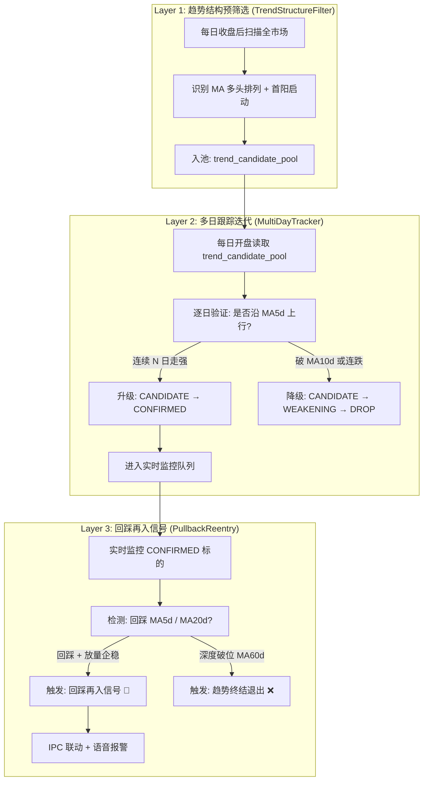
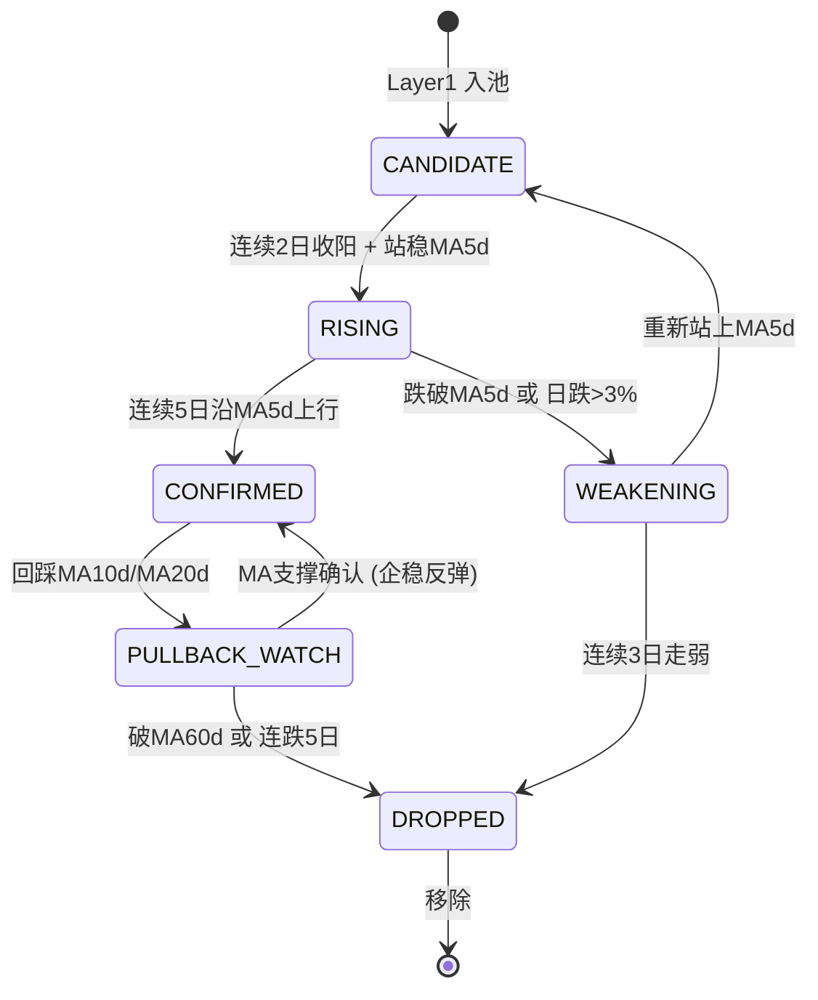

# 信号系统深度分析与改进方案

> **时间**: 2026-06-24 19:50
> **状态**: 仅分析与方案设计，不实施
> **核心问题**: 信号碎片化、追涨化、无持续跟踪迭代能力

---

## 一、现状数据实证

### 1.1 数据库全景

| 数据库 | 表 | 行数 | 用途 |
|---|---|---|---|
| trading_signals.db | signal_history | 14,634 | 历史信号存档 |
| trading_signals.db | live_signal_history | **310,254** | 实时信号流（巨量噪声） |
| trading_signals.db | trade_records | 1,520 | 实际交易记录 |
| trading_signals.db | selection_history | 39,926 | 选股历史 |
| signal_strategy.db | signal_message | 135,267 | 信号消息队列 |
| signal_strategy.db | follow_queue | 1,189 | 跟单队列 |
| signal_strategy.db | hot_stock_watchlist | 241 | 热股观察 |
| signal_strategy.db | mock_trade_log | 904 | 模拟交易 |
| signal_strategy.db | follow_record | 160 | 跟单记录 |

### 1.2 关键数据发现

#### 🔴 信号噪声极其严重
- `live_signal_history` 达 **31 万条**，单只股票单日最高 **296 条信号**
- 代表同一只股票在一天内被反复触发近 300 次 → 信号完全无区分度

#### 🔴 信号几乎全部是当日碎片
- `selection_history` 的 resample 分布：**日线 36,388 条 (91%)**，周线和 3 日线各约 1,700 条
- 信号入库后 **没有跨日跟踪状态字段**，每天重新筛选，无法延续

#### 🔴 跟单队列生命周期极短
- `follow_queue` 中 1,189 条记录，绝大多数 TRACKING → EXITED 周期 < 1 天
- 一日游退出比例极高，V_SHAPE 信号占绝对主导

#### 🔴 模拟账户表现悖论
- 模拟账户 75 只持仓中 **57 只盈利、18 只亏损**，总浮盈约 **+66,171 元** (+66%)
- 但这些盈利仓位基本是 **早期买入并持有** 的结果，而非信号系统主动捕获
- 近期买入的仓位（如 688105、603669、300721）全部亏损 **-5% ~ -8%**

#### 🔴 热股观察池 = 一次性快照
- `hot_stock_watchlist` 的 241 条记录中：
  - 跟踪天数最长仅 **0-1 天**
  - 来源: `日线形态(85)` + `DailyPattern|big_bull(42)` + `vol_drying(37)` + `rising_structure(35)`
  - **没有 "去弱留强" 淘汰机制**，只有入池没有分级升降

---

## 二、5 大结构性缺陷诊断

### 缺陷 ① — 碎片化追涨模型（根因）

**现状**：
```
当日选股 → 当日信号 → 当日退出
```

系统的核心循环是每天从 `StockSelector.get_candidates_df()` 重新筛选强势股，然后 `_scan_hot_concepts` + `_scan_rank_for_follow` 扫描板块龙头。筛选条件集中在：
- 当日涨幅 > 2%
- 量比 > 1.2
- 属于热点板块

**问题**：这实质上是一个 **"今天谁涨最猛就追谁"** 的追涨模型。

你描述的理想标的——"从 MA60d 震荡回踩启动，沿 MA5d 每日均线持续拉升"——在当日维度上只表现为"涨了 2-3%"，完全淹没在大量当日异动噪声中。

### 缺陷 ② — 无多日结构识别能力

**现状代码** (stock_live_strategy.py L1921-1931):
```python
# 回踩均线启动判定 — 仅基于当日数据
is_ma5_bounce = (low <= ma5 * 1.01) and (price > ma5) and (percent > 2.0)
is_ma10_bounce = (low <= ma10 * 1.01) and (price > ma10) and (percent > 2.0)
```

**问题**：
- 仅用当日的 `low` 和 `ma5d` 判定回踩，没有检查 **过去 N 天是否沿 MA5d 运行**
- 没有检查 **MA5d/MA20d/MA60d 是否处于多头排列**
- 没有 "首阳+N日收阳沿 MA5 上行" 的多日模式识别

### 缺陷 ③ — 无回踩再入信号（06-16 痛点）

**你的案例**：06-16 持仓被情绪下车，次日低开从 MA5d 拉升的主升没有接回来。

**现状**：
- `reentry_states.json` 仅有 19 条，且状态全部是 `OBSERVING`，没有实际触发再入
- `_check_pullback_conditions()` (L2267-2278) 的回踩判定过于宽泛：仅检查当前价与 MA5d 偏离在 1.2% 以内，但 **不区分是"趋势中的正常回踩"还是"下跌途中的反弹"**
- 没有 "止损后跟踪最低价、等待 MA 支撑确认后二次入场" 的闭环

### 缺陷 ④ — 股票池无迭代淘汰能力

**现状**：
- `hot_stock_watchlist` 只有 `WATCHING` 和 `PROMOTED` 两种状态
- 没有 **"连续 N 天走弱自动降级"** 机制
- `_daily_watchlist_validation()` (L2026-2061) 仅做一次性验证，不做持续筛汰
- 导致无法实现你说的 **"去弱留强"迭代筛选**

### 缺陷 ⑤ — 均线趋势结构未被利用

**你的图示**（浙技科技 K 线图）完美展示了目标模式：
1. 从 98.56 (MA250 附近) 启动
2. 沿 MA60d (176.87) 回踩后拉升
3. 突破 MA20d (205.92) 加速
4. 沿 MA5d (230.88) 持续上行至 262+

但现有系统**仅使用当日的 ma5d/ma10d 做单帧判定**，完全没有利用：
- MA 多头排列状态 (MA5 > MA10 > MA20 > MA60)
- 价格与各级 MA 的距离/乖离率趋势变化
- 回踩 MA 级别的递进判定 (首次回踩 MA5 → 后续回踩 MA20 → 最后考验 MA60)

---

## 三、改进方案：3 层架构

> [!IMPORTANT]
> 核心思路：从 **"追涨 → 发现"** 转变为 **"结构筛选 → 跟踪验证 → 回踩再入"** 的 3 层闭环。



### Layer 1: 趋势结构预筛选 (TrendStructureFilter)

**目标**：从全市场 5000+ 只股票中，每日收盘后筛选出 **具备多头趋势结构** 的标的。

#### 筛选条件（AND 逻辑）

| 条件 | 说明 | 参数 |
|---|---|---|
| MA 多头排列 | MA5 > MA10 > MA20 | 必须 |
| MA60d 斜率为正 | MA60d 最近 5 日向上 | `slope_60d > 0` |
| 价格在 MA20d 上方 | `Close > MA20d * 0.98` | 容错 2% |
| 首阳启动或连阳 | `win >= 1` 且涨幅 > 1% | `pct > 1.0` |
| 非超涨 | 距 MA5d 乖离 < 8% | `bias_ma5 < 0.08` |
| 量能确认 | 近 5 日均量 > 20 日均量 * 0.8 | 缩量不入 |

#### 数据来源
- 直接使用现有 `selection_history` 表的 `ma5`, `ma10` 字段
- 新增查询: 从 `tdx_data_Day` 获取 `MA20d`, `MA60d`, `MA250d` 历史数据

#### SQL 查询思路
```sql
-- 从已有日线数据中筛选趋势结构
SELECT code, name, close, ma5d, ma10d, ma20d, ma60d,
       (close - ma5d) / ma5d AS bias_ma5,
       (close - ma20d) / ma20d AS bias_ma20,
       win, percent
FROM daily_kline_latest
WHERE ma5d > ma10d            -- MA 多头排列
  AND ma10d > ma20d
  AND close > ma20d * 0.98    -- 价格在 MA20d 上方
  AND (close - ma5d) / ma5d < 0.08  -- 非超涨
  AND win >= 1                -- 有阳线结构
  AND percent > 1.0
ORDER BY bias_ma20 ASC        -- 优先选择刚从 MA20 附近启动的
```

### Layer 2: 多日跟踪迭代 (MultiDayTracker)

**目标**：将 Layer 1 筛选出的标的进行 **逐日追踪、分级升降、去弱留强**。

#### 状态机设计



#### 每日迭代逻辑（伪代码）

```python
def daily_iterate(pool: Dict[str, TrackedStock]):
    """每日收盘后执行一次"""
    for code, stock in pool.items():
        today = get_daily_kline(code)
        
        # 核心指标
        above_ma5 = today.close > today.ma5d * 0.995
        above_ma10 = today.close > today.ma10d * 0.99
        above_ma20 = today.close > today.ma20d * 0.98
        is_rising = today.close > today.open  # 收阳
        
        # 更新连续计数器
        if above_ma5 and is_rising:
            stock.consecutive_strong += 1
        else:
            stock.consecutive_strong = 0
        
        if not above_ma10:
            stock.consecutive_weak += 1
        else:
            stock.consecutive_weak = 0
        
        # 状态转换
        if stock.status == 'CANDIDATE':
            if stock.consecutive_strong >= 2:
                stock.status = 'RISING'
                
        elif stock.status == 'RISING':
            if stock.consecutive_strong >= 5:
                stock.status = 'CONFIRMED'  # ⭐ 重点跟踪
            elif not above_ma5 or today.pct < -3:
                stock.status = 'WEAKENING'
                
        elif stock.status == 'CONFIRMED':
            if not above_ma10:
                stock.status = 'PULLBACK_WATCH'
                stock.pullback_ma_level = 'MA10'
                stock.pullback_low = today.low
                
        elif stock.status == 'PULLBACK_WATCH':
            if above_ma5 and is_rising:
                stock.status = 'CONFIRMED'  # 回踩成功！
                trigger_reentry_signal(code)  # ⭐ 触发再入信号
            elif not above_ma20:
                stock.pullback_ma_level = 'MA20'  # 加深回踩
            elif stock.consecutive_weak >= 5:
                stock.status = 'DROPPED'
                
        elif stock.status == 'WEAKENING':
            if above_ma5 and is_rising:
                stock.status = 'CANDIDATE'  # 给一次机会
            elif stock.consecutive_weak >= 3:
                stock.status = 'DROPPED'
        
        # 更新锚点价格
        stock.latest_price = today.close
        stock.latest_ma5 = today.ma5d
        stock.latest_ma20 = today.ma20d
```

#### 数据库新表: `trend_tracking_pool`

```sql
CREATE TABLE trend_tracking_pool (
    code TEXT NOT NULL,
    name TEXT,
    status TEXT DEFAULT 'CANDIDATE',  -- CANDIDATE/RISING/CONFIRMED/PULLBACK_WATCH/WEAKENING/DROPPED
    discover_date TEXT,               -- 首次入池日期
    discover_price REAL,              -- 首次入池价格
    latest_price REAL,
    latest_ma5 REAL,
    latest_ma20 REAL,
    latest_ma60 REAL,
    consecutive_strong INTEGER DEFAULT 0,  -- 连续走强天数
    consecutive_weak INTEGER DEFAULT 0,    -- 连续走弱天数
    pullback_ma_level TEXT,           -- 回踩到哪级MA (MA5/MA10/MA20/MA60)
    pullback_low REAL,               -- 回踩最低价
    total_gain_since_discover REAL,  -- 入池以来累计涨幅
    sector TEXT,
    updated_at TEXT,
    PRIMARY KEY (code)
);
```

### Layer 3: 回踩再入信号 (PullbackReentry)

**目标**：对 CONFIRMED 和 PULLBACK_WATCH 状态的标的，在盘中实时检测回踩再入机会。

#### 信号触发条件

| 信号类型 | 触发条件 | 优先级 |
|---|---|---|
| **MA5回踩企稳** | 昨日或今日低点触及MA5d ± 1%，今日收盘/实时价站上MA5d，量比>1.0 | P1 (最高) |
| **MA20回踩起跳** | 连续缩量回踩MA20d 2-3日后，今日放量阳线突破MA5d | P2 |
| **MA60黄金坑** | 从高位回踩至MA60d附近(±3%)，出现下影线或十字星+次日阳线 | P3 (稀有高价值) |
| **均线粘合突破** | MA5/MA10/MA20 距离<2%后，价格向上突破 | P2 |

#### 与现有系统的整合点

```python
# 在 _process_follow_queue() 中增加新的 entry_strategy 分支
elif "趋势回踩" in entry_strategy:
    triggered, trigger_msg = self._check_trend_pullback_reentry(code, row, signal)

def _check_trend_pullback_reentry(self, code, row, signal):
    """Layer 3 核心: 趋势中的回踩再入判定"""
    price = float(row.get('trade', 0))
    ma5 = float(row.get('ma5d', 0))
    ma10 = float(row.get('ma10d', 0))
    ma20 = float(row.get('ma20d', 0))
    low = float(row.get('low', 0))
    volume_ratio = float(row.get('volume', 0))
    
    if ma5 <= 0 or ma20 <= 0:
        return False, ""
    
    # 前提: MA多头排列仍成立
    if not (ma5 > ma10 > ma20):
        return False, ""
    
    # 条件1: 低点触及MA5d附近 (±1.5%)
    touched_ma5 = abs(low - ma5) / ma5 < 0.015
    # 条件2: 当前价站回MA5d上方
    above_ma5 = price > ma5 * 0.998
    # 条件3: 量能确认 (不缩量)
    vol_ok = volume_ratio > 0.8
    
    if touched_ma5 and above_ma5 and vol_ok:
        bias_ma20 = (price - ma20) / ma20 * 100
        return True, f"趋势回踩MA5企稳 (距MA20 {bias_ma20:.1f}%) 量比{volume_ratio:.1f}"
    
    # MA20 回踩 (更高级别的买点)
    touched_ma20 = abs(low - ma20) / ma20 < 0.02
    if touched_ma20 and price > ma5 and volume_ratio > 1.2:
        return True, f"趋势回踩MA20起跳 量比{volume_ratio:.1f} ⭐高价值"
    
    return False, ""
```

---

## 四、具体改进清单

### Phase 1: 趋势结构预筛选（核心改造）

> [!TIP]
> 这是最高优先级的改造。当前系统的 `StockSelector.get_candidates_df()` 是纯当日强势筛选，需要增加一个 **前置过滤层**。

| 改造项 | 文件 | 说明 |
|---|---|---|
| 新增 `TrendStructureFilter` 类 | `trend_structure_filter.py` (新文件) | 独立模块，每日收盘调用 |
| 在 `data_utils.py` 中暴露 MA20d/MA60d 计算 | `data_utils.py` | 确保日线数据包含长周期均线 |
| 修改 `_import_hotspot_candidates` | `stock_live_strategy.py` L4751+ | 增加趋势结构前置过滤 |
| 新建 `trend_tracking_pool` 表 | `signal_strategy.db` | 存储多日跟踪状态 |

### Phase 2: 多日跟踪迭代引擎

| 改造项 | 文件 | 说明 |
|---|---|---|
| 新增 `MultiDayTracker` 类 | `multi_day_tracker.py` (新文件) | 每日收盘迭代一次 |
| 在 `_perform_daily_settlement()` 中调用 | `stock_live_strategy.py` L4975+ | 收盘后触发迭代 |
| 扩展 `hot_stock_watchlist` 表 | `signal_strategy.db` | 增加 `consecutive_strong`, `pullback_ma_level` 等字段 |
| UI 面板展示跟踪池 | `signal_dashboard_panel.py` | 新 Tab 页显示迭代状态 |

### Phase 3: 回踩再入信号引擎

| 改造项 | 文件 | 说明 |
|---|---|---|
| 新增 `_check_trend_pullback_reentry()` | `stock_live_strategy.py` | 盘中实时回踩检测 |
| 扩展 `reentry_states.json` 逻辑 | `stock_live_strategy.py` | 下车后自动进入回踩监控 |
| 接入 `_process_follow_queue()` | `stock_live_strategy.py` L2065+ | 新增 "趋势回踩" entry_strategy |
| 语音播报适配 | `stock_live_strategy.py` | "XX 趋势回踩 MA5 企稳，可回踩再入" |

### Phase 4: 信号降噪与聚焦

| 改造项 | 说明 |
|---|---|
| `live_signal_history` 去重节流 | 同一股票同一信号类型，单日仅入库 1 次 |
| 信号优先级分级 | 趋势结构信号 P1 > 日内异动 P5 > V_SHAPE P8 |
| Dashboard 按趋势阶段着色 | CONFIRMED(绿色高亮) > RISING(淡绿) > CANDIDATE(灰色) |

---

## 五、你的 06-16 案例复盘（588000 科创50ETF 华夏）

从 K 线图可以清晰看到：

1. **MA60d = 1.745** 是核心支撑线
2. 在 1.590 → 2.195 的主升浪中，关键回踩点：
   - 1.665 附近回踩 MA60d → 拉升至 2.195
   - 06-16 在高位震荡后回踩 MA20d (约 1.888)
3. 06-16 情绪下车后，次日低开到 MA5d 附近拉升

**如果有 Layer 2 + Layer 3**：
- Layer 2 会在 588000 从 1.665 启动后的第 2-3 天将其升级为 `RISING`
- 连续走强 5 天后升级为 `CONFIRMED`
- 06-16 回踩时，Layer 3 会检测到 "回踩 MA20d + MA多头排列仍成立" → 标记为 `PULLBACK_WATCH`
- 次日低开从 MA5d 拉升时，触发 **"趋势回踩MA5企稳"信号** → 回踩再入机会不会错过

---

## 六、实施优先级与风险

> [!WARNING]
> 以下改造涉及核心信号链路，必须增量开发、灰度验证。

### 推荐实施顺序

```
Phase 1 (1-2天) ─→ Phase 2 (2-3天) ─→ Phase 3 (1-2天) ─→ Phase 4 (1天)
```

### 风险控制

1. **新模块独立文件**：`TrendStructureFilter` 和 `MultiDayTracker` 独立为新 .py 文件，不修改现有核心逻辑
2. **渐进集成**：先在 `_perform_daily_settlement()` 中以只读模式运行 Layer 1+2，写入日志但不触发交易
3. **并行运行**：新旧信号系统并行 5-10 个交易日，对比命中率
4. **数据库兼容**：新表 `trend_tracking_pool` 独立于现有表，不影响现有 follow_queue / hot_stock_watchlist

### 关键度量指标

| 指标 | 当前值 | 目标值 |
|---|---|---|
| 信号当日存活率 | ~95% 当日退出 | < 50% 当日退出 |
| 跟踪池平均持有天数 | 0-1 天 | 5-15 天 |
| 回踩再入命中率 | 0% (无此功能) | > 40% |
| 去弱留强淘汰比 | 0% (无淘汰) | 每周淘汰 30-50% |
| 信号/交易比 | ~200:1 (310K/1.5K) | < 20:1 |

---

## 七、总结

> [!IMPORTANT]
> **核心洞察**：当前系统的问题不在于单个信号的灵敏度，而在于 **缺乏时间维度的持续跟踪能力**。系统每天都在做"全新的筛选"，但真正赚钱的股票需要的是 "发现 → 验证 → 等待回踩 → 再入" 的完整生命周期管理。

**一句话改进方向**：
> 从 **"每日追涨选股器"** 升级为 **"多日趋势跟踪与回踩再入引擎"**。
