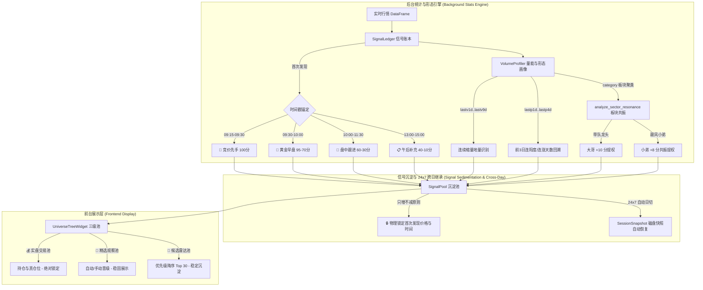

# 🎯 大级别 MA20D 回调跟踪器 — 高性能「后台统计沉淀 + 前台龙头捕捉」架构重构与落地文档

## 一、 问题诊断与重构背景

### 1. 现状致命缺陷（重构前）

原系统每次收到实时行情推送（约 3 秒一次），`refresh_realtime_ui()` 均会调用 `universe_manager.run_pipeline_filtering()`，该函数 **每轮全量重新扫描全市场 5000+ DataFrame**：

```text
收到行情 → run_pipeline_filtering() → 重新评估所有 5000+ 只股票
→ 偏离度 -1.5%~+2.5% 的自动入池/剔除 → 池子内容每 3 秒大幅变化
→ UI 上 候选/精选/实盘 不停闪烁流动 → 人眼无法捕捉有效信号
```

**核心痛点**：
1. **无时间锚定** — 不区分「竞价/开盘首批拉升」和「盘中 2 小时后才拉升的」，缺少时间优先权；
2. **无信号沉淀** — 每轮全量重算，股票进出池子像走马灯，已发现的好标的随时被冲掉；
3. **无量能时序** — 不统计「何时放量、缩量多久、在什么价位放量」，只看瞬时快照；
4. **无板块与连阳联动** — 无法识别“带队龙头”与“跟风小弟”，缺少启动前的连阳/多阳整固形态回溯；
5. **无跨日继承** — 重启软件或次日开盘后，昨日跟踪的精选标的丢失，无法连续跟单。

---

## 二、 架构总览与设计原则



---

## 三、 核心模块详细实施方案

### 1. SignalLedger — 增量信号账本与跨日恢复 (`ats/signal_ledger.py`)

**职责**：废除全量重算，实现 **增量写入、只增不删、时间戳锚定** 的信号管理中心。

#### 核心数据结构 (`SignalEntry`)
- `first_seen_ts` / `first_seen_price` / `first_seen_phase`：首次发现时间戳与价格，**写入后物理锁定**，永不改动；
- `latest_price` / `latest_pct` / `latest_deviation`：最新实时价格、涨幅与 MA20 偏离度，随行情**动态更新**；
- `priority_score`：综合优先级评分（0-100）；
- `tier`：`RADAR` (候选雷达) / `WATCH` (精选观察) / `TRADE` (实盘交易) / `INACTIVE` (破位隐藏)。

#### 优先级评分公式
$$\text{priority} = \text{time\_score} \times 0.45 + \text{volume\_score} \times 0.30 + \text{deviation\_score} \times 0.15 + \text{momentum\_score} \times 0.10$$
- **`time_score`**：竞价(100分) > 黄金半小时(95$\rightarrow$70分) > 盘中(60$\rightarrow$30分) > 午后(40$\rightarrow$10分)；
- **`volume_score`**：由 `VolumeProfiler` 提供的量能与形态综合评分。

#### 24×7 无感跨日日切 (`_ensure_daily_reset`) 与磁盘恢复 (`load_previous_signals`)
- **自动日切**：行情触发时比对 `today_str`，新一日自动唤起日切。保留昨日 `WATCH` 与 `TRADE` 标的并降级为 `RADAR` 继续跟踪，清空过期的普通 `RADAR` 和 `INACTIVE` 杂波；
- **磁盘恢复**：启动时自动调用 `load_previous_signals` 读取昨日 `daily_summary_YYYYMMDD.json` 快照，将昨日精选标的以 `PHASE_PREMARKET` 状态恢复至今天的账本中。

---

### 2. VolumeProfiler — 量能画像、连阳回溯与板块共振 (`ats/volume_profiler.py`)

**职责**：后台静默积累每只股票的量能时序、K线形态与板块联动画像。

#### 核心算法与特征回溯
1. **连续缩量天数 (`_calc_consecutive_shrink_days`)**：基于 `lastv1d`~`lastv9d`，精准统计历史连续地量萎缩天数；
2. **前 3 日连阳度 (`_calc_recent_up_days_3d`)**：基于 `lastp1d`~`lastp4d` 历史收盘价，计算前 3 个交易日中股价连续抬高、连阳收涨的天数（识别长城军工启动前的“3连阳/多日缩量整固”形态）；
3. **连涨天数 (`_calc_consecutive_up_days`)**：计算大区间连续上涨天数（如 6 连阳）；
4. **板块动能与共振分析 (`analyze_sector_resonance`)**：
   - 提取主行业分类 `profile.sector`；
   - 认领板块内放量最早、得分最高者为**带队大哥** (`is_sector_leader=True`，**额外加 10 分**)；
   - 在大哥启动 5 秒后被带起的同板块股票识别为**跟风小弟** (`is_sector_follower=True`，**赋予 8 分共振提权分**)；
5. **大盘量能环境感知 (`MarketVolumeContext`)**：基于上证指数 `lastv1d`~`lastv9d` 连续 2 天以上缩量且当日大盘量比 $>1.0$，识别“连续缩量后放量反弹节点”，为龙头股注入最高 **15分** 的 `rebound_quality` 加权。

---

### 3. SessionSnapshot — 盘中快照与收盘总结 (`ats/session_snapshot.py`)

**职责**：定时快照存盘，收盘后自动生成总结报告。
- 每 10 分钟自动快照至 `logs/signal_snapshots/signal_ledger_YYYYMMDD_HHMM.json`；
- 收盘后（15:00 之后在 `main_window.py` 中自动触发）生成 `daily_summary_YYYYMMDD.json` 当日汇总报告。

---

### 4. UniverseManager & UI 联动 (`ats/universe_manager.py`, `swing_table.py`, `universe_widget.py`)

**改动核心**：从「全量扫描」改为「从 `SignalLedger` 同步已沉淀信号」。
- **`SwingStateTable` 表格**：扩展为 16 列，包含“首次发现”时段时间戳与“优先级评分”列；
- **`UniverseTreeWidget` 树控件**：
  - 竞价信号（`🔔`）以**亮红前景色 + 加粗**展示；
  - 黄金半小时信号（`🥇`）以**金黄前景色 + 加粗**展示；
  - 支持右键一键设为重点关注、发送异动联动及复制股票代码。

---

## 四、 实盘新老信号生命周期与接力机制

```stateDiagram-v2
    [*] --> RADAR: 新信号发现 / 跨日继承恢复
    
    RADAR --> WATCH: 黄金半小时放量 / 量比>=1.2 / 强势突破
    WATCH --> TRADE: 买入信号判定 / 手动建仓
    
    RADAR --> INACTIVE: 偏离度跌破 -6.0% (严重破位)
    WATCH --> INACTIVE: 股价杀跌破位
    
    INACTIVE --> RADAR: 回调强支撑企稳 + 再次放量自愈激活 (Reactivation)
    
    WATCH --> RADAR: 跨日重置降级 (次日重新观察)
    TRADE --> TRADE: 真实持仓锁定 (跨日永久保留)
```

1. **新信号登顶**：盘中 09:15-10:00 竞价及早盘新出现的起爆股，获得 **100~95分** 高时间分 + 放量/竞价异动 + 板块带队（+10分），瞬间登顶；
2. **旧龙头平滑衰退**：昨天的旧龙头如果今日盘中走弱，其时间分随着时间推移自然衰减（从 95 分降至 30~10 分），优先级得分降速极快，自然退居后排，被新爆发的龙头超越，完成**新老龙头平滑接力**；
3. **破位隐藏与自愈激活**：偏离度跌破 `-6.0%` 的股票被自动标记为 `INACTIVE` 并隐藏；若日后回调至支撑位企稳并再次放量拉升（偏离度回到 `-2.5% ~ +4.0%`），系统自动将其**重新激活 (Reactivation)** 为 `RADAR` 继续追踪。

---

## 五、 单元测试与质量验证

测试脚本 `tests/test_signal_ledger.py` 包含 **8 大自动化断言校验**，全量测试 **100% 成功通过**：

```text
Ran 8 tests in 0.113s
OK

[PASS] 1. test_detect_phase                    - 交易时段 (竞价/黄金/盘中/午后) 识别
[PASS] 2. test_compute_time_score              - 时间基础分衰减曲线 100->10
[PASS] 3. test_record_signal_and_lock          - 首次发现时间与价格物理锁定只增不删
[PASS] 4. test_consecutive_shrink_days         - 2~9 天连续缩量地量洗盘计算
[PASS] 5. test_market_rebound_from_shrink      - 大盘连续缩量后放量反弹关键节点感知
[PASS] 6. test_recent_up_days_and_consecutive_up - 3连阳度与6日连涨形态特征回溯
[PASS] 7. test_sector_resonance_leader_follower - 国防军工带队大哥(长城军工)与小弟(北方长龙)共振提权
[PASS] 8. test_cross_day_signal_restoration     - 昨日快照信号自动恢复、跨日迭代与新老交替接力
```

---

## 六、 涉及文件一览

| 模块 / 文件 | 类型 | 核心职责与改动摘要 |
|:---|:---:|:---|
| `ats/signal_ledger.py` | [NEW] | 信号账本：增量写入、时间锚定、优先级评分、跨日自动重置 `_ensure_daily_reset` 与昨日快照恢复 `load_previous_signals` |
| `ats/volume_profiler.py` | [NEW] | 量能与形态画像器：缩量天数、前3日连阳度 `_calc_recent_up_days_3d`、连涨天数 `_calc_consecutive_up_days`、板块共振 `analyze_sector_resonance` 与大盘环境感知 |
| `ats/session_snapshot.py` | [NEW] | 盘中快照：每 10 分钟自动快照、收盘后自动导出 `daily_summary_YYYYMMDD.json` 及昨日快照加载 `load_previous_day_signals` |
| `ats/universe_manager.py` | [MODIFY] | 三级池管理：废除全量重算，改为从 `SignalLedger` 同步稳定三级池 |
| `ats/ui/main_window.py` | [MODIFY] | 主界面集成：`_update_signal_ledger` 增量更新、二阶段板块共振计算、15:00 盘后自动总结导出与启动自动跨日恢复 |
| `ats/ui/swing_table.py` | [MODIFY] | 16 列回调跟踪器表格：高亮“首次发现”时段与“优先级评分”列 |
| `ats/ui/universe_widget.py` | [MODIFY] | 树形控件：竞价/黄金期信号亮红/金黄高亮与右键菜单 |
| `tests/test_signal_ledger.py` | [NEW] | 全量单元测试：覆盖时段、锁定、连阳、板块共振与跨日继承 8 大断言 |
