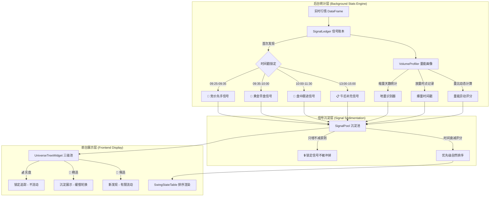

# 🎯 大级别 MA20D 回调跟踪器 — 高性能「后台统计沉淀 + 前台龙头捕捉」架构重构

## 问题诊断

### 现状致命缺陷

当前系统每次收到实时行情推送（约 3 秒一次），`refresh_realtime_ui()` 会调用 `universe_manager.run_pipeline_filtering()`，该函数 **每轮全量重新扫描全市场 DataFrame**：

```
收到行情 → run_pipeline_filtering() → 重新评估所有 5000+ 只股票
→ 偏离度 -1.5%~+2.5% 的自动入池/剔除 → 池子内容每 3 秒大幅变化
→ UI 上 候选/精选/实盘 不停闪烁流动 → 人眼无法捕捉有效信号
```

**核心问题**：
1. **无时间锚定** — 不区分「开盘第一批涨起来的」和「盘中 2 小时后才拉升的」，没有时间优先级
2. **无信号沉淀** — 每轮全量重算，股票进出池子像走马灯，已发现的好标的随时被冲掉
3. **无量能时序** — 不统计「何时放量、缩量多久、在什么价位放量」，只看瞬时快照
4. **无龙头锁定** — 没有「一旦发现、持续追踪、不轻易剔除」的沉淀机制

### 用户核心诉求

> **"快一步步步快"** — 大盘连续缩量后的反弹日，开盘同步缩量反弹带动的个股优先级永远高于后面拉升的。
> 越早的信号越有标志性价值，不能让实盘/候选不停快速流动。

---

## 设计目标

| 维度 | 目标 | 量化指标 |
|:---:|:---|:---|
| ⏱️ 时间沉淀 | 信号一旦捕获即锁定，不再因行情波动被冲掉 | 早盘信号持久化率 100% |
| 🏆 龙头优先 | 最早放量突破的个股永远排在最前面 | 按首次突破时间戳排序 |
| 📊 后台统计 | 后台线程静默积累统计数据，不干扰 UI | UI 刷新 < 50ms |
| 🎯 前台捕捉 | 前台只展示已沉淀的高价值信号，不流动 | 池子稳定性 > 90% |
| 📈 量能时序 | 记录每只股票的量能演化轨迹，支持回溯 | 保留全天分钟级量能快照 |

---

## 架构总览



---

## 核心设计原则

### 原则一：信号只增不删（Append-Only Signal Ledger）

```
当前：每轮全量重算，股票随时进出
改后：信号一旦写入账本，仅标记状态变化，永不物理删除
```

### 原则二：时间戳决定优先级（Time-Anchored Priority）

```
09:25 竞价异动放量 → Priority 100（最高）
09:30 开盘首分钟突破 → Priority 95
09:35-10:00 黄金半小时 → Priority 80~90
10:00 以后 → Priority 逐分钟衰减
```

### 原则三：量能画像沉淀（Volume Profile Accumulation）

```
不看瞬时量比，而是积累：
- 连续缩量天数（大盘/个股）
- 首次放量时间点与幅度
- 量能密度（分钟级量能分布曲线）
```

---

## 详细实现方案

### [Component 1] SignalLedger — 信号账本（核心新增）

#### [NEW] [signal_ledger.py](file:///d:/MacTools/WorkFile/WorkSpace/pyQuant3/stock_standalone/ats/signal_ledger.py)

**职责**：替代现有 `UniverseManager.run_pipeline_filtering()` 的全量重算逻辑，改为 **增量写入、只增不删** 的信号账本。

**核心数据结构**：
```python
class SignalEntry:
    code: str           # 股票代码
    name: str           # 股票名称
    first_seen_ts: float    # 首次发现时间戳（锁定后不变）
    first_seen_price: float # 首次发现时的价格
    first_seen_pct: float   # 首次发现时的涨幅
    first_seen_phase: str   # 首次发现所处时段: 'AUCTION'/'GOLDEN'/'MORNING'/'AFTERNOON'
    
    latest_price: float     # 最新价格（实时更新）
    latest_pct: float       # 最新涨幅（实时更新）
    latest_deviation: float # 最新MA20偏离度
    
    volume_profile: dict    # 量能画像快照
    priority_score: float   # 综合优先级评分
    tier: str               # 当前层级: 'RADAR'/'WATCH'/'TRADE'
    is_locked: bool         # 是否已锁定（锁定后不自动剔除）
    
    state_history: list     # 状态变更历史记录
```

**关键逻辑**：
- `record_signal(code, row, timestamp)` — 发现新信号时写入，已存在则仅更新最新价格
- `promote(code, tier)` — 晋级到更高层级（只升不降，除非手动操作）
- `compute_priority(entry)` — 基于时间戳 + 量能 + 偏离度的综合评分
- `get_sorted_pool(tier)` — 按优先级排序返回指定层级的信号列表

**优先级评分公式**：
```
priority = time_score × 0.45 + volume_score × 0.30 + deviation_score × 0.15 + momentum_score × 0.10

time_score = {
    AUCTION (09:25-09:30):  100
    GOLDEN  (09:30-10:00):  85 - (minutes_after_0930 × 0.5)
    MORNING (10:00-11:30):  60 - (minutes_after_1000 × 0.3)
    AFTERNOON (13:00-15:00): 40 - (minutes_after_1300 × 0.2)
}

volume_score = min(100, vol_ratio × 30 + consecutive_shrink_days × 8)

deviation_score = max(0, 100 - abs(deviation) × 20)  # 越贴近MA20得分越高

momentum_score = min(100, max(0, pct × 15 + rs_val × 10))  # 涨幅与逆势强度
```

---

### [Component 2] VolumeProfiler — 量能画像器（核心新增）

#### [NEW] [volume_profiler.py](file:///d:/MacTools/WorkFile/WorkSpace/pyQuant3/stock_standalone/ats/volume_profiler.py)

**职责**：后台静默积累每只关注股票的量能时序画像，为信号优先级评分提供量能维度数据。

**核心功能**：
- `update_profile(code, row)` — 每次行情推送时更新量能画像
- `get_consecutive_shrink_days(code)` — 获取连续缩量天数（基于 `lastv1d..lastv9d`）
- `get_first_surge_time(code)` — 获取当日首次放量突破时间点
- `get_volume_density(code)` — 获取盘中量能密度分布
- `compute_volume_score(code)` — 综合量能评分

**大盘量能环境感知**：
```python
class MarketVolumeContext:
    """大盘量能环境上下文 — 判断当前是否处于缩量后反弹的关键时点"""
    consecutive_market_shrink_days: int  # 大盘连续缩量天数
    market_volume_ratio: float          # 大盘当日量比
    is_rebound_from_shrink: bool        # 是否处于缩量后反弹
    rebound_quality: float              # 反弹质量评分 (0-100)
```

当 `consecutive_market_shrink_days >= 2` 且当日大盘量比 > 1.0 时，自动提升所有 `AUCTION` 和 `GOLDEN` 时段信号的优先级权重（因为这正是用户描述的"上周四五连续缩量后今天大反弹"的行情结构）。

---

### [Component 3] UniverseManager 重构

#### [MODIFY] [universe_manager.py](file:///d:/MacTools/WorkFile/WorkSpace/pyQuant3/stock_standalone/ats/universe_manager.py)

**改动核心**：从「全量重算」改为「读取 SignalLedger 沉淀数据」。

```diff
- def run_pipeline_filtering(self, df_all, ma20_series=None):
-     """每轮全量扫描 5000+ 只股票，重新评估入池/出池"""
-     ...全量循环逻辑...
+ def sync_from_ledger(self, signal_ledger):
+     """从信号账本同步已沉淀信号到三级池，不做全量重算"""
+     # 只读取 ledger 中已确认的信号，按优先级排序填充池子
+     # 池子内容稳定，不会因行情波动而快速流动
```

**关键改动**：
1. `radar_pool` 改为从 `SignalLedger` 的 `RADAR` 层级读取，最多展示 30 只（按优先级排序）
2. `watch_pool` 改为从 `SignalLedger` 的 `WATCH` 层级读取，锁定不自动剔除
3. `trade_pool` 保持现有持仓逻辑不变
4. **废除** `evict()` 的自动剔除逻辑 — 改为仅在用户手动操作或止损触发时才剔除

---

### [Component 4] refresh_realtime_ui 重构

#### [MODIFY] [main_window.py](file:///d:/MacTools/WorkFile/WorkSpace/pyQuant3/stock_standalone/ats/ui/main_window.py)

**改动核心**：将「每次全量重算」改为「后台增量更新 + 前台稳定展示」。

```diff
  def refresh_realtime_ui(self):
-     # 2. Run pipeline filtering (每次全量重算)
-     if has_df:
-         self.universe_manager.run_pipeline_filtering(self.current_df)
+     # 2. 后台增量更新信号账本（仅写入新信号，不删除旧信号）
+     if has_df:
+         self._update_signal_ledger(self.current_df)
+         # 从信号账本同步到三级池（稳定展示，不快速流动）
+         self.universe_manager.sync_from_ledger(self.signal_ledger)
```

新增方法 `_update_signal_ledger(df)`:
1. 扫描全市场 DataFrame，筛选 MA20 偏离度在 `-2.0%~+3.0%` 范围内的标的
2. **新标的** → 写入 SignalLedger，记录首次发现时间戳
3. **已存在标的** → 仅更新最新价格/涨幅，不改变首次发现时间和优先级
4. 自动检测大盘量能环境，调整优先级权重

---

### [Component 5] 盘中快照持久化

#### [NEW] [session_snapshot.py](file:///d:/MacTools/WorkFile/WorkSpace/pyQuant3/stock_standalone/ats/session_snapshot.py)

**职责**：每日交易时段的信号账本定时快照存盘，支持收盘后复盘分析。

- 每 10 分钟自动序列化 `SignalLedger` 至 `logs/signal_ledger_YYYYMMDD_HHMM.json`
- 收盘后自动生成当日信号总结报告
- 支持跨日信号追踪（昨日 WATCH 信号今日是否继续走强）

---

## 时段与优先级映射表

| 时段 | 标签 | 基础分 | 含义 | 衰减规则 |
|:---|:---|:---:|:---|:---|
| 09:15-09:25 | `🔔 集合竞价` | 100 | 竞价异动，最高优先 | 无衰减 |
| 09:25-09:30 | `⚡ 竞价确认` | 98 | 竞价结束确认放量 | 无衰减 |
| 09:30-09:35 | `🥇 首分钟` | 95 | 开盘首 5 分钟突破 | 无衰减 |
| 09:35-10:00 | `🥈 黄金半小时` | 85→70 | 黄金早盘放量拉升 | 每分钟 -0.6 |
| 10:00-10:30 | `🥉 盘中前半` | 60→50 | 盘中跟进信号 | 每分钟 -0.33 |
| 10:30-11:30 | `📋 上午后半` | 50→30 | 上午后段补充 | 每分钟 -0.33 |
| 13:00-14:00 | `📋 午后前段` | 40→25 | 午后补充观察 | 每分钟 -0.25 |
| 14:00-15:00 | `📋 尾盘` | 25→10 | 尾盘异动记录 | 每分钟 -0.25 |

---

## User Review Required

> [!IMPORTANT]
> ### 1. 信号沉淀策略确认
> 目前设计为「信号一旦写入账本，只增不删」，即一旦被发现就锁定在池中，仅标记状态变化。
> - **好处**：池子稳定，不会因行情波动而快速流动
> - **风险**：如果当天发现的标的过多（如大反弹日可能 200+ 只贴近 MA20），池子会不会太大？
> - **建议的折中**：
>   - RADAR 候选池限制展示 Top 30（按优先级排序），但底层账本保留全部
>   - WATCH 精选池限制 Top 15，且仅手动或自动晋级才能进入
>   - 已跌破 MA20 超过 -5% 的标记为 `INACTIVE`（灰色显示但不物理删除）

> [!IMPORTANT]
> ### 2. 大盘量能环境加权确认
> 当检测到「大盘连续 ≥2 天缩量 + 今日量比 > 1.0」时，自动将所有竞价和黄金时段信号的优先级提升 15%。
> 这是否符合您对「每次行情发生变化的时点」的预期？

> [!WARNING]
> ### 3. 与现有 DragonLeaderTracker 的整合
> 现有的 `sector_focus_engine.py` 中已有 `DragonLeaderTracker` 4 阶段龙头状态机和 `StarFollowEngine`。
> 本次设计的 SignalLedger 会在 **ATS 面板**（大级别 MA20D 回调跟踪器）中独立运行，不修改 `sector_focus_engine.py` 的龙头逻辑。
> 两者并行运行，互不干扰。是否 OK？

## Open Questions

> [!IMPORTANT]
> ### Q1: RADAR 候选池的偏离度范围
> 当前 `run_pipeline_filtering` 使用 `-1.5%~+2.5%`。在大反弹日，大量个股从 MA20 下方反弹突破，是否需要扩展到 `-3.0%~+5.0%`？或者保持现有范围，仅通过量能和时间优先级来筛选？

> [!IMPORTANT]
> ### Q2: 历史信号追踪周期
> SignalLedger 的信号保留多久？
> - A) 仅保留当日（每日开盘自动清空）
> - B) 保留近 3 个交易日（支持「昨日发现→今日确认→明日执行」的追踪链）
> - C) 永久保留（需要手动清理）

> [!IMPORTANT]
> ### Q3: 自动晋级阈值
> 从 RADAR → WATCH 的自动晋级条件：
> - 当前设计：`量比 >= 1.2 且涨幅 >= -1.0%` 或 `涨幅 >= 1.5% 且 dff > 1.0`
> - 是否需要增加「首次发现时段为竞价/黄金半小时」作为加分项？
> - 是否需要增加「大盘缩量后反弹环境」作为自动晋级的触发条件？

---

## 涉及文件清单

### 新增文件
| 文件 | 职责 |
|:---|:---|
| `ats/signal_ledger.py` | 信号账本 — 增量写入、时间锚定、优先级评分 |
| `ats/volume_profiler.py` | 量能画像器 — 缩量/放量时序统计 |
| `ats/session_snapshot.py` | 盘中快照 — 定时持久化与复盘 |

### 修改文件
| 文件 | 改动摘要 |
|:---|:---|
| `ats/universe_manager.py` | 废除全量重算，改为从 SignalLedger 同步 |
| `ats/ui/main_window.py` | `refresh_realtime_ui` 改为增量更新 + 稳定展示 |
| `ats/ui/universe_widget.py` | 增加时段标签列 + 优先级排序列 + 信号锁定图标 |
| `ats/ui/swing_table.py` | 增加「首次发现时间」列 + 优先级评分列 |

### 不修改的文件
| 文件 | 原因 |
|:---|:---|
| `sector_focus_engine.py` | 龙头逻辑独立运行，不干扰 |
| `intraday_pattern_detector.py` | 分时形态检测独立运行 |
| `swing_tracker.py` | 状态机逻辑保持不变 |
| `ipc_bridge.py` | 数据通道保持不变 |

---

## Verification Plan

### Automated Tests
- 创建 `tests/test_signal_ledger.py`，验证信号写入、优先级计算、时段分类的正确性
- 验证 `VolumeProfiler` 的连续缩量天数计算与大盘环境感知

### Manual Verification
1. 盘中运行，观察池子是否稳定（不再快速流动）
2. 检查早盘信号是否始终排在前面
3. 验证大反弹日信号沉淀数量是否合理（预期 RADAR 30 只、WATCH 15 只左右）
4. 收盘后检查快照文件是否正确生成
