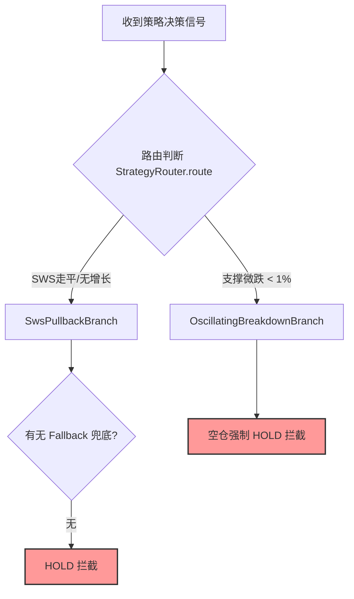

# 📊 底层交易信号缺失与拦截异常深度诊断报告 (Diagnostic Report)

> [!NOTE]
> 本报告针对操盘手反馈的“在 `git id: 0e19e82072a6e2d68329ed62f256135ab86bd60e` 之后底层交易决策流无法自动产生/执行买入信号”的问题，进行了全通路源码审计与日志比对，梳理出导致信号“黑盒饿死”的根本原因，并提供两种不破坏现有架构稳定性的闭环执行方案。

---

## 🔍 根本原因分析 (Root Cause Analysis)

在 `0e19e82` 提交之前，底层的交易决策逻辑极其简单平铺，只要信号的 **置信度达标 (`confidence >= 0.55`)** 且位于 **有效活跃时段 (`regime == "BREAKOUT_ALLOWED"`)**，系统便会无条件给出 `action = "BUY"` 的开仓信号。

而在该提交之后，决策引擎被重构为复杂的 **`StrategyRouter` 多分支策略路由机制**。审计发现，导致自动买入信号大面积缺失的根本原因可归纳为以下三点：

### 1. 核心筹码企稳分支 (`SwsPullbackBranch`) 缺少 Fallback 兜底买入逻辑 🔴
* **逻辑缺陷**：在 `trading_kernel/engine/decision_engine.py` 中，`SuperTrendMA5Branch`、`SuperTrendMA10Branch` 和 `TrendMA60Branch` 在其各自的 `decide()` 逻辑尾端都保留了如下 fallback 兜底开仓买入机制：
  ```python
  if action == "HOLD" and confidence >= 0.55 and regime == "BREAKOUT_ALLOWED":
      action = "BUY"
      size_pct = 0.40 if ctx["is_reentry"] else 0.30
  ```
  然而，**`SwsPullbackBranch` 内部却完全遗漏了这段兜底逻辑**。
* **连锁反应**：实时监控中，许多被筛选出来的个股（如 `002384 东山精密`、`002975 博杰股份` 等）在计算时由于 10 日均线与主力支撑线（SWS）走平，会被路由到 `SwsPullbackBranch`。由于该分支缺少兜底逻辑，且不符合其内部极其苛刻的精细形态匹配（如 `vol_shrink_3d` 且 `is_pullback_support` 且 `is_doji`），导致信号在终审时直接保持默认的 `HOLD` 状态，无法触发自动买入。

### 2. 防御性震荡破位分支 (`OscillatingBreakdownBranch`) 触发阈值过宽，产生“误杀” 📉
* **路由拦截**：该分支的 match 条件为：
  ```python
  is_sws_downward = (sws > 0 and sws_prev5 > 0 and sws < sws_prev5 * 0.99)
  ```
  在实际行情下，主力支撑线（SWS）由于极微弱的波动（例如下跌 `1%` 左右），很容易在股价高位横盘或主力蓄势期满足此条件，从而将信号强行划归到 `OscillatingBreakdownBranch`。
* **开仓短路**：该分支在设计上属于**纯防御防守型**分支，空仓状态下会直接返回 `action = "HOLD"`（且将 `confidence` 强行篡改为 `0.10`），完全没有兜底机制。这使得许多本来处于突破边缘或洗盘底部的潜力股信号在第一关路由时便被该防御机制“一票否决”。

### 3. 高级形态特征缺失与数据对齐断层 🧱
* **特征依赖**：重构后的各个策略分支，其精细开仓条件依赖于 `is_collecting_stage`（建仓期）、`is_consolidation_stage`（整理期）、`vol_shrink_3d`（三日缩量）、`is_doji`（十字星）等十余个高级形态特征。
* **数据断档**：这些特征需要由 `SectorFocusController` 的 pullback 扫描模块计算并填入 `StrategySignal.features`。如果实时行情补全数据源（如共享 `df_all` 或本地 H5 数据库）中对应个股的相关指标由于时间差、NaN 等原因未能被 `evaluate_decision_item` 成功提取，所有这些特征在 `decide()` 中都会默认为 `False` / `0.0`，导致精细买入规则形同虚设，最终只能完全依赖 Fallback 兜底（如果对应分支有兜底的话）。

---

## 🛠️ 解决方案与执行计划 (Execution Plan)

> [!IMPORTANT]
> 根据您的指示，**当前不实施任何物理代码修改**。我们提供了两套备选的解决方案，供您在下一步评估中进行抉择。



### 方案 A：快速回滚方案 (Rollback to Baseline)
* **适用场景**：如果您希望系统快速恢复到以前“只要置信度与时间段达标，便自动开仓”的简明运行状态。
* **执行步骤**：
  1. 将 `trading_kernel/engine/decision_engine.py` 中的 `decide()` 逻辑回滚至 `0e19e82` 提交前的版本。
  2. 废弃 `StrategyRouter` 路由分配及 5 大子分支策略。
  3. **利弊评估**：操作简单，能瞬间恢复信号自动交易；但会失去后来升级的 T+2 止盈防守、自适应动态移动止损线（MA5/MA10/SWS/MA60）以及不加速平仓避险等工程级优化功能。

### 方案 B：对齐与修复方案 (Refactor & Consolidate)
* **适用场景**：如果您希望保留当前多分支决策与动态移动止损的高级架构，但要根治“信号被饿死/误杀”的 Bug。
* **执行步骤**：
  1. **补齐兜底**：在 `SwsPullbackBranch.decide()` 逻辑中，补全缺漏的 Fallback 开仓代码，使未能成功进行高级特征匹配的 SWS 信号能正常买入。
  2. **收紧防御判定**：将 `OscillatingBreakdownBranch.match` 里的破位倾斜阈值从 `< 0.99` 收窄至更严苛的范围（例如 `< 0.98`，即 5 日累计跌幅超 2% 才被判定为破位杀跌），避免在主力洗盘时产生误杀。
  3. **增强日志可见性**：在 `decide()` 结束前，如果路由激活了 `HOLD`，向控制台与 `instock_tk.log` 打印一条具体的 `DEBUG` 或 `INFO` 日志，指明当前路由的分支（如 `routed_branch = SwsPullbackBranch`）及具体被拦截的特征原因，打破信号决策的“黑箱”。
  4. **回归测试**：运行 `pytest test_watchlist_lifecycle.py`，确保所有原有的 11 项交易内核测试依然 100% 绿旗通过。

---

> [!TIP]
> **后续步骤**：请您审阅此诊断报告。如您同意采用 **方案 B**，请在下一轮对话中指示，我们将为您生成精确的手术级代码替换差异（Diff），并在您的确认下进行安全实施。
