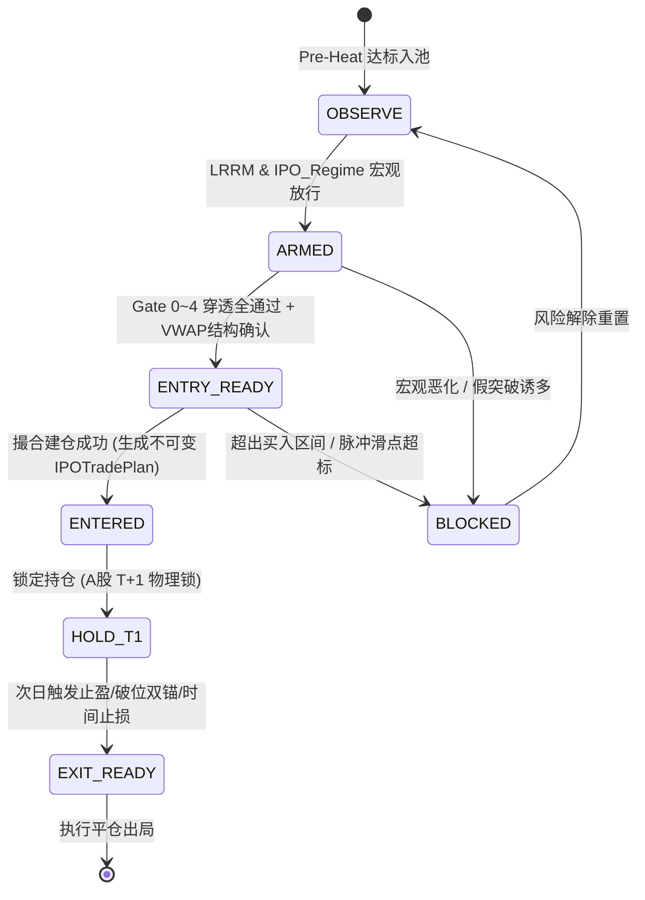
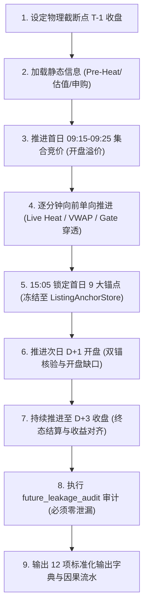

# 新股情绪感知与本地 LLM 自学习决策系统 — 详细设计执行方案书 v1.0 / v1.1

> **重要更新提示**：本文档已根据代码审查完成全部硬伤彻底纠偏，正本已同步发布至 [新股情绪感知与本地LLM自学习决策系统_详细设计执行方案书_v1.1.md](新股情绪感知与本地LLM自学习决策系统_详细设计执行方案书_v1.1.md)。本文档内容与 v1.1 保持 100% 严格一致。
> **文档性质**：工程级详细设计执行方案书（**仅订正对齐方案，生产代码零变动**）
> **编制日期**：2026-09-26
> **状态**：全模块闭环·消除门禁误放行与契约冲突·待准入条件具备后实施

---

## 目录

- [壹、系统全景与现有模块精确映射](#ch1)
- [贰、六层门禁体系与核心引擎对接规格](#ch2)
  - [2.1 Gate 0: LRRM 流动性与风险状态机](#ch2-1)
  - [2.2 Gate 1: IPO Regime 五态状态机](#ch2-2)
  - [2.3 IPO Pre-Heat: 上市前爆发潜力评估引擎](#ch2-3)
  - [2.4 IPO Live Heat: 实时情绪动能与 6 大非线性函数](#ch2-4)
  - [2.5 Gate 2: T+1 Carry 可兑现性评估与伪强过滤](#ch2-5)
  - [2.6 Gate 3: 首日物理锚点冻结与双锚失守](#ch2-6)
  - [2.7 Gate 4: VWAP 多日结构扩展与动能确认](#ch2-7)
  - [2.8 Gate 5: 7 状态操作节点状态机与终审仲裁](#ch2-8)
  - [2.9 华大海天伪强反例数学判据与测试断言规格](#ch2-9)
  - [2.10 Historical Cut-Off 历史截断无未来回放引擎架构](#ch2-10)
- [叁、本地 LLM 自学习决策系统详细设计](#ch3)
- [肆、分阶段实施步骤与代码骨架](#ch4)
- [伍、数据 Schema 与配置规格](#ch5)
- [陆、测试计划与验收标准](#ch6)
- [柒、风险矩阵与铁律清单](#ch7)

---

<a id="ch1"></a>
## 壹、系统全景与现有模块精确映射

### 1.1 计划书六层门禁 vs 现有代码模块精确对照表

> 以下对照表基于对 30+ 个源码文件的逐行接口审计，标注每个门禁层所需的精确类名、方法签名和数据结构。

| 门禁层 | 计划书要求 | 现有模块 & 接口 | 匹配度 | 精确差距 |
|:---|:---|:---|:---:|:---|
| **Gate 0: LRRM** | 全市场流动性状态机，输出 `liquidity_regime` (LOOSE/NORMAL/TIGHT/SHOCK) + `risk_appetite` + `concentration_state` | `MarketGuardian.evaluate_market_state(up_count, down_count, limit_up_count, limit_down_count, market_sentiment, sector_dumps)` → `GuardianVerdict(buy_allowed, sell_urgency, freeze_buy)` | 🔴 25% | Guardian 仅输出 buy/sell 布尔值，**缺少**：① 全市场成交总额分位数计算 ② 融资余额加速度 ③ 高波品种(20cm/30cm)集中度 ④ LOOSE/TIGHT 四态转换 ⑤ 置信度与转移因子审计 |
| **Gate 1: IPO Regime** | 五态状态机 DISTRIBUTION→REPAIR→CONTINUATION→MANIA→EXHAUSTION | `IPOMarketSentimentEngine.get_market_sentiment()` → `MarketSentimentSnapshot(heat_stage, heat_score, risk_mode, tide_state)` + `SubnewTideStateMachine.update(obs)` → `TideDecision(state=T0~T11, confidence, position_cap_pct)` | 🟡 50% | 已有 4 阶情绪风向标 + T0~T11 潮汐 12 态。**缺少**：① 计划书要求的 5 态（需从 T0~T11 映射） ② 最近 5~10 只新股横截面统计 ③ D1/D2/D3 正收益率、首日见顶率 ④ 状态转移的显式触发因子记录 |
| **Gate 2: T+1 Carry** | 隔夜可兑现性评分 0~100 + ALLOW/CAUTION/BLOCK 三态 | `next_day_anomaly_watch.run_cycle()` → 候选池含 `_trend_score(row)` 0~100 + `_trend_rating()` 四级 | 🟡 40% | 趋势分仅评估技术形态，**缺少**：① IPO Regime 交叉联动 ② 正向增强/负向惩罚因子矩阵 ③ 非线性过热惩罚（饱和→反转） ④ 尾盘 close_location 计算 ⑤ 首日换手率极值检测 |
| **Gate 3: 物理锚点** | 首日 9 大锚点冻结 + 次日双锚失守一票否决 | `VWAPFactory.get_snapshot(code)` → `VWAPSnapshot(vwap_1d, vwap_5d, vwap_10d)` + `NewStockFetcher` 提供 `issue_price` | 🟡 35% | VWAPFactory 有 1d/5d/10d VWAP。**缺少**：① `listing_open/high/low/close` 首日锚点冻结持久化 ② `listing_anchored_vwap` ③ `first_30m_vwap` ④ `close_location` 收盘位置 ⑤ 次日双锚失守自动判定逻辑 |
| **Gate 4: VWAP 结构** | Daily/Anchored/2D/3D/5D VWAP + slope/compression/reclaim/support_count | `VWAPFactory` 已有 `vwap_1d, vwap_5d, vwap_10d` + `VWAPTradingEngine.compute_tick_state()` → `VWAPTickState(vwap_slope_5m, price_vs_vwap, minutes_above_vwap)` | 🟢 60% | **缺少**：① `vwap_2d, vwap_3d` 中间粒度 ② `listing_anchored_vwap` ③ VWAP compression 挤压黏合度 ④ VWAP reclaim 带量收复确认 ⑤ VWAP support_count 日内支撑计数 |
| **Gate 5: TDE 终审** | 六层顺序穿透仲裁 + ENTRY/WATCH/BLOCK/EXIT | `IPOTradingCenter.evaluate_s5_executable_gate(directive, plan, current_price, sentiment)` + `RiskGate.evaluate(intent, signal, state, limits)` → `RiskDecision` | 🟢 55% | 已有 S4→S5 门禁 + 14 种风控拦截。**缺少**：① 计划书要求的 Gate 0~5 严格顺序穿透（现有是 S0~S5 层级制） ② 七态操作状态机（OBSERVE→ARMED→ENTRY_READY→ENTERED→HOLD_T1→EXIT_READY→BLOCKED） |

### 1.2 潮汐 T0~T11 与计划书 5 态映射规格

```python
# 现有 SubnewTideStateMachine 12态 → 计划书 IPO Regime 5态 映射
TIDE_TO_REGIME_MAP = {
    # 派发/衰竭类
    "T1_CLIMAX_DISTRIBUTION": "DISTRIBUTION",
    "T11_OVERHEATED":         "EXHAUSTION",
    # 退潮/冰点类
    "T2_EBB_EARLY":           "DISTRIBUTION",
    "T3_EBB_SPREAD":          "DISTRIBUTION",
    "T4_PANIC_ACCEL":         "DISTRIBUTION",
    "T5_ICE":                 "DISTRIBUTION",
    # 修复类
    "T6_ICE_DIVERGENCE":      "REPAIR",
    "T7_WEAK_REPAIR":         "REPAIR",
    # 接力/延续类
    "T8_REFLOW_CONFIRM":      "CONTINUATION",
    "T9_FLOOD_SPREAD":        "CONTINUATION",
    # 主升/狂热类
    "T10_MAIN_UP":            "MANIA",
    # 数据不足
    "T0_INSUFFICIENT":        "DISTRIBUTION",  # 保守默认
}
```

### 1.3 情绪翻转 FSM 六态与计划书的正交关系

| 情绪翻转 FSM (sentiment_reversal_plan) | 计划书 IPO Regime (v0.2.0) | 关系 |
|:---|:---|:---|
| `NEUTRAL` | (无直接对应) | FSM 中性态不影响 IPO Regime |
| `PANIC` | `DISTRIBUTION` 的子集 | PANIC 可作为 LRRM `risk_appetite=RISK_OFF` 的输入 |
| `REPAIR` | `REPAIR` | 高度一致，可直接复用 FSM 判定逻辑 |
| `REVERSAL` | `CONTINUATION` 的前奏 | FSM 翻转确认可触发 IPO Regime 向 CONTINUATION 转移 |
| `FOMO` | `MANIA` | 高度一致 |
| `COOLDOWN` | `EXHAUSTION` 的温和版 | FSM 冷却态可辅助 EXHAUSTION 判定 |

**设计决策**：两套状态机**并列部署为正交维度**：
- `MarketSentimentFSM`（全市场维度）→ 输出 `risk_appetite` 供 Gate 0 LRRM
- `IPORegimeFSM`（新股横截面维度）→ 充当 Gate 1 的独立判定

### 1.4 已有设计文档资产复用清单

| 文档 | 可直接复用的设计资产 | 复用目标 |
|:---|:---|:---|
| `sentiment_reversal_plan.md` | `SentimentState` 6态定义、`MarketSnapshot`/`BiddingSnapshot`/`AuctionSignal` 数据契约、信号截断逻辑、竞价风控覆盖参数 | 全量复用至 Gate 0/1 实现 |
| `sentiment_reversal_implementation_blueprint.md` | Phase 0~7 分步实施清单、`daily_sentiment` 表 Schema、09:25 时间网关逻辑、`enrich_decision_item` 投递方式、禁止事项 | 全量复用至实施路线 |
| `新股检测vwap动能挖掘设计.md` | VWAP 粘合系数 $Q_{adhesion}$、时间切片权重 $W_{time}(t)$、赛马综合动能分 $S_{horse}$ 算法 | 复用至 Gate 4 VWAP 结构 |
| `新股检测中心升级方案1.md` | `SecondaryBuyStage` 6阶状态机、`IPOTradePlan` 数据容器规格、S0~S5 分级体系、三重风控闸门 | 复用至 Gate 5 TDE 终审 |
| `新股检测中心升级方案2.md` | 潮汐 T1/T10 战略闭环、双锚失守买入硬门禁、SSS 龙头洗盘豁免、退出引擎 6 层联动 | 复用至 Gate 2/3 |
| `次日异动候选池_最小侵入落地.md` | `run_cycle()` 主循环、两帧确认契约、Outbox 持久待发、`_trend_score` 评分体系 | 复用至 T+1 Carry 评估基底 |
| `三只代表性新股核心对照表.txt` | 华大海天/沈鼓/腾信精密实战样本数据 | 复用至反例回归测试集 |

---

<a id="ch2"></a>
## 贰、六层门禁体系与现有接口对接规格

### 2.1 Gate 0: LRRM 流动性与风险状态机

**新增模块**：`ats/strategy/lrrm_engine.py`

```python
"""LRRM (Liquidity / Risk Regime Manager) 流动性与风险偏好状态机"""
from dataclasses import dataclass, field
from typing import Dict, List, Optional, Tuple
from enum import Enum


class LiquidityRegime(Enum):
    LOOSE = "LOOSE"       # 充裕宽松
    NORMAL = "NORMAL"     # 平稳中性
    TIGHT = "TIGHT"       # 流动性紧缩
    SHOCK = "SHOCK"       # 流动性休克


class RiskAppetite(Enum):
    RISK_ON = "RISK_ON"
    NEUTRAL = "NEUTRAL"
    RISK_OFF = "RISK_OFF"


class ConcentrationState(Enum):
    BROAD = "BROAD"                     # 普涨均衡扩散
    THEME_CONCENTRATED = "THEME_CONCENTRATED"  # 常规主题集中
    IPO_CONCENTRATED = "IPO_CONCENTRATED"      # 新股抱团抽血


@dataclass
class LRRMSnapshot:
    """LRRM 每周期输出快照"""
    liquidity_regime: str = "NORMAL"
    risk_appetite: str = "NEUTRAL"
    concentration_state: str = "BROAD"
    liquidity_confidence: float = 50.0      # 0~100
    transition_reason: str = ""
    # 核心输入指标
    market_amount_yi: float = 0.0           # 全市场成交额(亿元)
    amount_20d_percentile: float = 50.0     # 成交额20日分位数
    amount_60d_percentile: float = 50.0     # 成交额60日分位数
    advance_decline_ratio: float = 0.5      # 涨跌家数比
    limit_down_count: int = 0
    high_volatility_amount_pct: float = 0.0 # 高波品种成交占比
    ipo_amount_pct: float = 0.0             # 新股成交占全市场比例
    generated_at: str = ""


class LRRMEngine:
    """
    接入现有数据源:
    - market_amount: 从 TK 宽表 self.df_all 汇总
    - advance_decline: 从 MarketGuardian.evaluate_market_state() 的 up/down_count
    - high_vol_concentration: 从 OpeningBubbleEngine 的 TIER_BOUNDS 统计
    
    输出对接:
    - LRRMSnapshot → 注入 IPOMarketSentimentEngine.get_market_sentiment() 的上下文
    - 当 regime=SHOCK 或 appetite=RISK_OFF 时, Gate 0 直接阻断
    """
    def __init__(self):
        self._prev_snapshot: Optional[LRRMSnapshot] = None
        self._history: List[LRRMSnapshot] = []
    
    def evaluate(
        self,
        market_amount_yi: float,
        amount_history_20d: List[float],
        amount_history_60d: List[float],
        up_count: int,
        down_count: int,
        limit_up_count: int,
        limit_down_count: int,
        high_vol_amount_pct: float,
        ipo_amount_pct: float,
        guardian_verdict: Optional[object] = None,  # GuardianVerdict
        fsm_state: Optional[str] = None,            # MarketSentimentFSM 全市场状态
    ) -> LRRMSnapshot:
        """
        纯确定性规则计算, 无网络/磁盘 IO, <1ms 完成。
        
        判定规则:
        - SHOCK: amount_20d_percentile < 5 且 limit_down > 30 且 advance_decline < 0.2
        - TIGHT: amount_20d_percentile < 20 或 fsm_state == "PANIC"
        - LOOSE: amount_20d_percentile > 80 且 advance_decline > 0.65
        - NORMAL: 其余情况
        """
        ...

    def get_downstream_threshold_adjustments(
        self, snapshot: LRRMSnapshot
    ) -> Dict[str, float]:
        """
        根据 LRRM 状态动态调节下游门禁阈值:
        - LOOSE/RISK_ON: 适当调低 REPAIR→CONTINUATION 切换门槛
        - TIGHT/RISK_OFF: 提高 T1 Carry 放行阈值, 加大 BLOCK 权重
        
        返回: {"t1_carry_threshold_adjust": float, "regime_switch_ease": float, ...}
        """
        ...
```

### 2.2 Gate 1: IPO Regime 五态状态机

**新增模块**：`ats/strategy/ipo_regime_fsm.py`

```python
"""IPO 新股市场情绪阶段五态状态机 (基于最近 N 只新股横截面统计)"""
from dataclasses import dataclass, field
from typing import Dict, List, Optional, Tuple
from enum import Enum


class IPORegimeState(Enum):
    DISTRIBUTION = "DISTRIBUTION"    # 首日兑现型
    REPAIR = "REPAIR"                # 修复型
    CONTINUATION = "CONTINUATION"    # 延续接力型
    MANIA = "MANIA"                  # 极度狂热型
    EXHAUSTION = "EXHAUSTION"        # 动能衰竭型


@dataclass
class IPORegimeSnapshot:
    """IPO Regime 每周期输出"""
    state: str = "DISTRIBUTION"
    confidence: float = 0.0              # 0~100
    trigger_factors: List[str] = field(default_factory=list)
    # 12项核心度量指标
    d1_positive_rate: float = 0.0        # 次日正收益概率
    d2_positive_rate: float = 0.0
    d3_positive_rate: float = 0.0
    first_day_peak_ratio: float = 0.0    # 首日见顶率
    new_high_after_listing_ratio: float = 0.0
    d1_max_drawdown: float = 0.0
    limit_down_rate: float = 0.0
    ipo_relative_strength: float = 0.0
    turnover_median: float = 0.0
    close_location_median: float = 0.0
    listing_frequency: float = 0.0
    hot_sector_concentration: float = 0.0
    # 时序上下文
    prev_state: str = ""
    transition_at: str = ""
    generated_at: str = ""


class IPORegimeFSM:
    """
    数据源:
    - 最近 5~10 只新股: 从 NewStockFetcher.get_combined_new_stocks() 获取
    - 各新股 D+1/D+2/D+3 表现: 从 TDX 历史行情或本地缓存计算
    - 当前 LRRM 状态: 从 LRRMEngine.evaluate() 接入
    
    输出对接:
    - IPORegimeSnapshot → Gate 1 判定
    - 当 state 不在 {REPAIR, CONTINUATION} 时, 默认 BLOCK 新建仓
    
    与潮汐状态机的关系:
    - IPORegimeFSM 关注"最近 N 只新股的横截面统计"
    - SubnewTideStateMachine 关注"当日盘中次新板块的实时涨跌比"
    - 两者正交互补, 不互相替代
    """
    
    LOOKBACK_STOCKS = 10      # 回看最近 N 只新股
    LOOKBACK_DAYS = 20        # 回看最近 N 个交易日
    
    def __init__(self):
        self._state = IPORegimeState.DISTRIBUTION
        self._prev_state = IPORegimeState.DISTRIBUTION
        self._history: List[IPORegimeSnapshot] = []
    
    def update(
        self,
        recent_ipos: List[Dict],  # 最近上市新股列表 (含 D+1/D+2 表现)
        lrrm: Optional[LRRMSnapshot] = None,
        tide: Optional[object] = None,  # TideDecision
    ) -> IPORegimeSnapshot:
        """
        状态转移规则:
        
        DISTRIBUTION → REPAIR:
          d1_positive_rate 从 <30% 回升至 >40%
          limit_down_rate 从 >20% 下降至 <10%
        
        REPAIR → CONTINUATION:
          d1_positive_rate > 55%
          new_high_after_listing_ratio > 40%
          ipo_relative_strength > 0 (跑赢大盘)
        
        CONTINUATION → MANIA:
          d1_positive_rate > 80%
          turnover_median > 极值阈值 (如 >60%)
          first_day_peak_ratio < 15% (首日很少见顶)
        
        MANIA → EXHAUSTION:
          first_day_peak_ratio 突然升至 >40%
          d1_positive_rate 虽然 >70% 但 d2_positive_rate 骤降至 <40%
        
        EXHAUSTION → DISTRIBUTION:
          d1_positive_rate 跌破 30%
          limit_down_rate > 15%
        
        任何状态可直接跳至 DISTRIBUTION (崩溃式跌落):
          lrrm.liquidity_regime == SHOCK
        """
        ...
    
    def get_state(self) -> IPORegimeState:
        return self._state
    
    def explain(self) -> Dict:
        """返回当前状态的完整因果解释"""
        ...
```

### 2.3 IPO Pre-Heat: 上市前爆发潜力评估引擎

**新增模块**：`ats/strategy/ipo_preheat_engine.py`

```python
"""IPO 上市前先验潜力评估引擎 (纯静态与先验数据，无未来函数，加入监控池门禁)"""
from dataclasses import dataclass, field
from typing import Dict, List, Optional
import math


@dataclass(frozen=True)
class IPOPreHeatSnapshot:
    """上市前先验潜力输出快照"""
    code: str
    name: str
    preheat_score: float = 0.0          # 0~100 综合评分
    preheat_tier: str = "PRE_COLD"      # PRE_HOT (>=80) / PRE_WARM (60~79) / PRE_COLD (<60)
    valuation_score: float = 0.0        # 估值分位得分 (0~25)
    subscription_score: float = 0.0     # 申购热度得分 (0~25)
    scarcity_score: float = 0.0         # 题材稀缺度得分 (0~20)
    theme_match_score: float = 0.0      # 主线共振得分 (0~20)
    capital_structure_score: float = 0.0 # 股本筹码弹性得分 (0~10)
    tags: List[str] = field(default_factory=list)
    is_watch_candidate: bool = False    # 是否允许进入次日重点盯盘池
    as_of_date: str = ""


class IPOPreHeatEngine:
    """
    数据源（严格隔离未来）：
    - 仅读取上市前 T-1 已经公告落盘的数据（来源于 NewStockFetcher 与公告数据源）
    - 包含：issue_price, float_shares, pe_ratio_vs_industry,
            online_sub_mult, offline_sub_mult, winning_rate, industry_name

    硬性边界守则：
    - Pre-Heat 仅回答“该股是否具备爆发基因、是否值得加入盯盘池”
    - 严禁直接作为交易买入触发条件！
    """

    def evaluate(
        self,
        code: str,
        name: str,
        issue_price: float,
        float_shares_wan: float,
        pe_ratio: float,
        industry_pe_median: float,
        online_sub_multiple: float,
        winning_rate_pct: float,
        scarcity_rank: int = 3,         # 1(极稀缺)~5(同质化)
        hot_themes: Optional[List[str]] = None,
        as_of_date: str = "",
    ) -> IPOPreHeatSnapshot:
        # 1. 估值分位评分 (0~25分): PE 相对行业中位数折价程度
        pe_discount = (industry_pe_median - pe_ratio) / max(industry_pe_median, 1.0)
        s_val = max(0.0, min(25.0, 12.5 + pe_discount * 25.0))

        # 2. 申购热度评分 (0~25分): 超额认购倍数与中签率稀缺性
        # 中签率越低(如 <0.03%)且申购倍数越高(如 >2000倍)得分越高
        sub_ratio_score = min(15.0, math.log10(max(online_sub_multiple, 1.0)) * 4.0)
        win_rate_score = max(0.0, min(10.0, (0.08 - winning_rate_pct) * 125.0))
        s_sub = s_val = max(0.0, min(25.0, sub_ratio_score + win_rate_score))

        # 3. 题材稀缺性评分 (0~20分): 细分赛道龙头与国产替代属性
        s_scarcity = {1: 20.0, 2: 15.0, 3: 10.0, 4: 5.0, 5: 0.0}.get(scarcity_rank, 10.0)

        # 4. 主流热点题材共振评分 (0~20分): 是否处于全市场当前最强主线
        s_theme = 15.0 if hot_themes and any(t in name for t in hot_themes) else 5.0

        # 5. 筹码弹性评分 (0~10分): 流通市值越小弹性越大 (流通股本 < 3000万股高分)
        if float_shares_wan < 2000:
            s_cap = 10.0
        elif float_shares_wan < 4000:
            s_cap = 7.0
        elif float_shares_wan < 8000:
            s_cap = 4.0
        else:
            s_cap = 1.0

        total_score = s_val + s_sub + s_scarcity + s_theme + s_cap
        tier = "PRE_HOT" if total_score >= 75.0 else ("PRE_WARM" if total_score >= 55.0 else "PRE_COLD")

        return IPOPreHeatSnapshot(
            code=code,
            name=name,
            preheat_score=round(total_score, 1),
            preheat_tier=tier,
            valuation_score=round(s_val, 1),
            subscription_score=round(s_sub, 1),
            scarcity_score=round(s_scarcity, 1),
            theme_match_score=round(s_theme, 1),
            capital_structure_score=round(s_cap, 1),
            is_watch_candidate=(total_score >= 55.0),
            as_of_date=as_of_date,
        )
```

---

### 2.4 IPO Live Heat: 实时情绪动能与 6 大非线性函数

**新增模块**：`ats/strategy/ipo_live_heat_engine.py`

```python
"""IPO 上市首日及盘中实时情绪动能感知引擎 (含 6 大非线性饱和/反转函数)"""
from dataclasses import dataclass, field
from typing import Dict, List, Optional
import math


@dataclass
class IPOLiveHeatSnapshot:
    """盘中实时情绪动能输出"""
    code: str
    heat_score: float = 0.0              # 原始热度分 (0~100)
    overheat_score: float = 0.0          # 过热惩罚分 (0~50)
    exhaustion_risk: float = 0.0         # 衰竭风险分 (0~100)
    nonlinear_zone: str = "NORMAL"       # NORMAL (常态) / HOT (高热) / EXTREME (极端危险)
    intraday_velocity: float = 0.0       # 拔地而起角速度(度)
    halt_count: int = 0                  # 盘中临停次数
    turnover_climb_speed: float = 0.0    # 换手率爬升速度 (%/分钟)
    price_vwap_dist_pct: float = 0.0     # 价格距离 VWAP 偏离度%
    close_location: float = 0.0          # 当前价格在全天振幅中的分位位置 (0.0~1.0)
    is_overheated_veto: bool = False     # 是否触发过热一票否决


class IPOLiveHeatEngine:
    """
    非线性核心哲学：
    - 绝非涨幅、换手、速率越高越好！
    - 突破安全阈值后，Live Heat 虽然可继续攀升，但必须强行触发 Overheat 惩罚，
      并在下游强制衰减 T1 Carry，防范高位力竭（Exhaustion）。
    """

    # ---------------- 6 大非线性因子的精确分段与临界点数学模型 ----------------

    @staticmethod
    def calc_return_nonlinear(ret_pct: float) -> Tuple[float, float]:
        """
        1. 首日涨幅非线性分段:
           [0%, 20%]: 启动主升加分 (0 -> +15)
           (20%, 50%]: 边际饱和区 (+15 -> +18)
           (50%, 80%]: 滞涨背离风险 (+18 -> +5)
           >80%: 恶性透支，转为负向惩罚 (-15)
        """
        if ret_pct <= 0:
            return 0.0, 0.0
        elif ret_pct <= 20.0:
            return (ret_pct / 20.0) * 15.0, 0.0
        elif ret_pct <= 50.0:
            return 15.0 + ((ret_pct - 20.0) / 30.0) * 3.0, 0.0
        elif ret_pct <= 80.0:
            penalty = ((ret_pct - 50.0) / 30.0) * 15.0
            return max(0.0, 18.0 - penalty), penalty
        else:
            extreme_penalty = min(30.0, 15.0 + (ret_pct - 80.0) * 0.2)
            return -15.0, extreme_penalty

    @staticmethod
    def calc_turnover_nonlinear(turnover_pct: float) -> Tuple[float, float]:
        """
        2. 日内换手率非线性分段:
           [0%, 35%]: 活跃启动加分 (0 -> +15)
           (35%, 65%]: 充分换手健康平台区 (维持 +15)
           (65%, 75%]: 筹码松动预警区 (+15 -> +5, 产生过热分 10)
           >75%: 死亡换手透支区 (-20, 产生极高过热分 25)
        """
        if turnover_pct <= 35.0:
            return (turnover_pct / 35.0) * 15.0, 0.0
        elif turnover_pct <= 65.0:
            return 15.0, 0.0
        elif turnover_pct <= 75.0:
            ratio = (turnover_pct - 65.0) / 10.0
            return 15.0 - ratio * 10.0, ratio * 15.0
        else:
            return -20.0, min(35.0, 15.0 + (turnover_pct - 75.0) * 1.5)

    @staticmethod
    def calc_vwap_distance_nonlinear(dist_pct: float) -> Tuple[float, float]:
        """
        3. 价格与 VWAP 乖离率非线性分段:
           [-0.5%, +2.5%]: 贴线惜售模式，主力高控盘 (极佳 +15)
           (+2.5%, +6.0%]: 健康脱离成本区 (+10)
           (+6.0%, +10.0%]: 脉冲拉升，短线乖离 (+5, 过热 10)
           >+10.0%: 严重乖离，诱多脉冲 (-15, 过热 25)
        """
        if -0.5 <= dist_pct <= 2.5:
            return 15.0, 0.0
        elif 2.5 < dist_pct <= 6.0:
            return 10.0, 0.0
        elif 6.0 < dist_pct <= 10.0:
            return 5.0, 10.0
        elif dist_pct > 10.0:
            return -15.0, 25.0
        else:
            return -10.0, 0.0  # 破位水下

    @staticmethod
    def calc_opening_premium_nonlinear(open_premium_pct: float) -> Tuple[float, float]:
        """
        4. 集合竞价溢价率非线性:
           < 15%: 温和高开 (+10)
           15% ~ 35%: 正常预期高开 (+12)
           35% ~ 60%: 预警超高开 (+5, 过热 12)
           > 60%: 恶性透支抢跑高开 (-15, 过热 25)
        """
        if open_premium_pct <= 15.0:
            return 10.0, 0.0
        elif open_premium_pct <= 35.0:
            return 12.0, 0.0
        elif open_premium_pct <= 60.0:
            return 5.0, 12.0
        else:
            return -15.0, 25.0

    @staticmethod
    def calc_intraday_velocity_nonlinear(slope_deg: float, now_hm: str) -> float:
        """
        5. 盘中拉升速率 (拔起角度) 结合时间衰减:
           早鸟 09:30-09:45 权重大 (1.0)，10:00 之后逐级衰减
        """
        time_weight = 1.0 if now_hm <= "0945" else (0.75 if now_hm <= "1000" else 0.40)
        return max(0.0, min(15.0, (slope_deg / 60.0) * 15.0 * time_weight))

    @staticmethod
    def calc_close_location_nonlinear(high_p: float, low_p: float, curr_p: float) -> Tuple[float, float]:
        """
        6. 当前价格/收盘位置分位:
           CL = (P - Low) / (High - Low)
           CL >= 0.85: 坚挺高位收盘 (+15, 衰竭风险 0)
           0.60 <= CL < 0.85: 中位震荡 (+5, 衰竭风险 5)
           CL < 0.45: 冲高回落长上影 (-20, 衰竭风险 35, 触发一票否决)
        """
        span = max(high_p - low_p, 0.001)
        cl = (curr_p - low_p) / span
        if cl >= 0.85:
            return 15.0, 0.0
        elif cl >= 0.60:
            return 5.0, 5.0
        elif cl >= 0.45:
            return -5.0, 15.0
        else:
            # 冲高回落大坑，严重惩罚
            return -20.0, 35.0

    def evaluate(
        self,
        code: str,
        ret_pct: float,
        turnover_pct: float,
        price_vwap_dist_pct: float,
        open_premium_pct: float,
        slope_deg: float,
        high_p: float,
        low_p: float,
        curr_p: float,
        halt_count: int = 0,
        now_hm: str = "1000",
    ) -> IPOLiveHeatSnapshot:
        s_ret, p_ret = self.calc_return_nonlinear(ret_pct)
        s_to, p_to = self.calc_turnover_nonlinear(turnover_pct)
        s_vwap, p_vwap = self.calc_vwap_distance_nonlinear(price_vwap_dist_pct)
        s_prem, p_prem = self.calc_opening_premium_nonlinear(open_premium_pct)
        s_vel = self.calc_intraday_velocity_nonlinear(slope_deg, now_hm)
        s_cl, p_cl = self.calc_close_location_nonlinear(high_p, low_p, curr_p)

        raw_heat = max(0.0, min(100.0, 20.0 + s_ret + s_to + s_vwap + s_prem + s_vel + s_cl))
        total_overheat = min(50.0, p_ret + p_to + p_vwap + p_prem)
        exhaustion_risk = min(100.0, p_cl + (15.0 if halt_count >= 2 else 0.0) + (p_to * 0.8))

        # 区域判定
        if total_overheat >= 35.0 or exhaustion_risk >= 45.0 or p_cl >= 30.0:
            zone = "EXTREME"
            veto = True
        elif total_overheat >= 15.0 or raw_heat >= 75.0:
            zone = "HOT"
            veto = False
        else:
            zone = "NORMAL"
            veto = False

        span = max(high_p - low_p, 0.001)
        cl_val = round((curr_p - low_p) / span, 3)

        return IPOLiveHeatSnapshot(
            code=code,
            heat_score=round(raw_heat, 1),
            overheat_score=round(total_overheat, 1),
            exhaustion_risk=round(exhaustion_risk, 1),
            nonlinear_zone=zone,
            intraday_velocity=round(slope_deg, 1),
            halt_count=halt_count,
            price_vwap_dist_pct=round(price_vwap_dist_pct, 2),
            close_location=cl_val,
            is_overheated_veto=veto,
        )
```

---

### 2.5 Gate 2: T+1 Carry 可兑现性评估与伪强过滤

**扩展模块**：`ats/strategy/t1_carry_evaluator.py`（新增）

```python
"""T+1 隔夜可兑现性评估引擎 (融合上游 LRRM、IPO Regime、Live Heat 惩罚与华大海天伪强过滤)"""
from dataclasses import dataclass, field
from typing import Dict, List, Optional
from enum import Enum


class T1CarryState(Enum):
    ALLOW = "ALLOW"       # 允许隔夜持有 (>=65分 且 非 EXTREME)
    CAUTION = "CAUTION"   # 谨慎预警 (40~64分)
    BLOCK = "BLOCK"       # 严格禁止 (<40分 或 伪强否决 或 EXTREME)


@dataclass
class T1CarryResult:
    """T+1 Carry 评估结果"""
    score: float = 50.0                    # 0~100 综合分
    state: str = "CAUTION"                 # ALLOW / CAUTION / BLOCK
    positive_factors: List[str] = field(default_factory=list)
    negative_factors: List[str] = field(default_factory=list)
    nonlinear_zone: str = "NORMAL"         # NORMAL / HOT / EXTREME
    overheat_score: float = 0.0
    exhaustion_risk: float = 0.0
    is_pseudo_strength_blocked: bool = False # 华大海天式伪强拦截
    veto_reason: str = ""


class T1CarryEvaluator:
    """
    核心裁决守则：
    1. 不对称惩罚设计：LLM / Live Heat 正向加分上限 +10，负向惩罚上限 -15~-30
    2. 华大海天伪强一票否决：高换手 + 尾盘回落走弱 + VWAP看似站稳，直接强制 BLOCK！
    3. EXHAUSTION 状态连带熔断：当上游 IPO Regime 处于 EXHAUSTION 时，默认禁止持仓跨日！
    """

    def evaluate(
        self,
        code: str,
        live_heat: object,                       # IPOLiveHeatSnapshot
        ipo_regime: Optional[object] = None,     # IPORegimeSnapshot
        lrrm: Optional[object] = None,            # LRRMSnapshot
        vwap_snapshot: Optional[object] = None,   # VWAPSnapshot
        listing_anchors: Optional[Dict] = None,   # ListingAnchors
    ) -> T1CarryResult:
        pos_factors = []
        neg_factors = []

        # 1. 华大海天伪强特征快速检测
        is_pseudo = False
        if live_heat.turnover_climb_speed > 0 or live_heat.close_location < 0.45:
            # 伪强特征判据：价格虽在线上但收盘弱、换手极高
            if live_heat.close_location <= 0.40 and live_heat.overheat_score >= 20.0:
                is_pseudo = True
                neg_factors.append("华大海天式冲高回落伪强结构(收盘位置<=0.40 且 高过热)")

        # 2. 基础得分计算 (由 Live Heat 原始分与过热惩罚分合成)
        base_score = live_heat.heat_score - (live_heat.overheat_score * 0.8) - (live_heat.exhaustion_risk * 0.5)

        # 3. 叠加 IPO Regime 宏观倾斜
        if ipo_regime:
            reg_state = getattr(ipo_regime, "state", "DISTRIBUTION")
            if reg_state == "CONTINUATION":
                base_score += 10.0
                pos_factors.append("IPO Regime处于CONTINUATION主升接力期 (+10)")
            elif reg_state == "REPAIR":
                base_score += 5.0
                pos_factors.append("IPO Regime处于REPAIR修复初期 (+5)")
            elif reg_state == "EXHAUSTION":
                base_score -= 25.0
                neg_factors.append("IPO Regime动能衰竭EXHAUSTION，跨日兑现恶化 (-25)")
            elif reg_state == "DISTRIBUTION":
                base_score -= 15.0
                neg_factors.append("IPO Regime首日兑现杀跌期 (-15)")

        # 4. 叠加 LRRM 流动性约束
        if lrrm:
            liq = getattr(lrrm, "liquidity_regime", "NORMAL")
            if liq == "LOOSE":
                base_score += 5.0
            elif liq in ("TIGHT", "SHOCK"):
                base_score -= 15.0
                neg_factors.append(f"全市场流动性紧缩/休克({liq}) (-15)")

        final_score = max(0.0, min(100.0, base_score))

        # 5. 三态裁决与一票否决门禁
        if is_pseudo:
            state = "BLOCK"
            veto = "PSEUDO_STRENGTH_VETO (华大海天伪强结构一票否决)"
        elif live_heat.is_overheated_veto:
            state = "BLOCK"
            veto = "LIVE_HEAT_OVERHEATED_VETO (盘中极端过热一票否决)"
        elif ipo_regime and getattr(ipo_regime, "state", "") == "EXHAUSTION":
            state = "BLOCK"
            veto = "IPO_REGIME_EXHAUSTION_VETO (板块动能衰竭熔断)"
        elif final_score >= 65.0 and live_heat.nonlinear_zone != "EXTREME":
            state = "ALLOW"
            veto = ""
            pos_factors.append(f"T1 Carry 综合评分达标({final_score:.1f} >= 65)")
        elif final_score >= 40.0:
            state = "CAUTION"
            veto = ""
            neg_factors.append(f"T1 Carry 评分偏低({final_score:.1f} in [40, 65)), 需严苛价格结构确认")
        else:
            state = "BLOCK"
            veto = f"SCORE_BELOW_THRESHOLD (综合得分 {final_score:.1f} < 40)"

        return T1CarryResult(
            score=round(final_score, 1),
            state=state,
            positive_factors=pos_factors,
            negative_factors=neg_factors,
            nonlinear_zone=live_heat.nonlinear_zone,
            overheat_score=live_heat.overheat_score,
            exhaustion_risk=live_heat.exhaustion_risk,
            is_pseudo_strength_blocked=is_pseudo,
            veto_reason=veto,
        )
```

### 2.6 Gate 3: 首日物理锚点冻结与双锚失守

**新增模块**：`ats/strategy/listing_anchor_store.py`

```python
"""首日物理锚点冻结存储 (9大关键价位永久固化)"""
from dataclasses import dataclass
from typing import Dict, Optional
import json, os


@dataclass(frozen=True)
class ListingAnchors:
    """首日交易结束后永久冻结的9大锚点"""
    code: str
    listing_date: str
    listing_open: float           # 首日开盘价
    listing_high: float           # 首日最高价
    listing_low: float            # 首日最低价
    listing_close: float          # 首日收盘价
    listing_vwap: float           # 首日全天成交均价
    listing_anchored_vwap: float  # 首日锚定 VWAP 原点
    first_30m_vwap: float         # 首日前30分钟集合均价
    close_location: float         # 收盘位置 = (close-low)/(high-low)
    first_day_turnover: float     # 首日换手率


class ListingAnchorStore:
    """
    存储路径: config/listing_anchors.json
    写入时机: 每只新股首日收盘后 (15:05 盘后任务)
    读取时机: 次日及后续交易日的 Gate 3 判定
    
    双锚失守判定:
    - 次日同时跌破 listing_open 和 listing_low → T1 Carry 强制降级 BLOCK
    - 若随后带量 reclaim → 可恢复至 CAUTION (不可直接恢复 ALLOW)
    """
    STORE_PATH = "config/listing_anchors.json"
    
    def save_anchors(self, anchors: ListingAnchors) -> None: ...
    def get_anchors(self, code: str) -> Optional[ListingAnchors]: ...
    def check_dual_anchor_failure(
        self, code: str, current_low: float
    ) -> bool: ...
```

---

### 2.7 Gate 4: VWAP 多日结构扩展与动能确认

**扩展现有**：`ats/vwap_factory.py` 增量升级

```python
# 在现有 VWAPSnapshot 基础上增加字段:
@dataclass(frozen=True)
class VWAPSnapshotV2(VWAPSnapshot):
    """v2 扩展: 增加计划书要求的多日与锚定 VWAP 指标矩阵"""
    vwap_2d: Optional[float] = None             # 两日合并换手均价
    vwap_3d: Optional[float] = None             # 三日合并换手均价
    listing_anchored_vwap: Optional[float] = None # 自上市原点锚定的全生命周期均价
    vwap_slope: Optional[float] = None          # VWAP 曲线斜率与角速度
    vwap_compression: Optional[float] = None    # 1D/5D/10D 均价线黏合挤压度
    vwap_reclaim_count: int = 0                 # 日内跌破后带量收复确认次数
    price_vwap_distance_pct: Optional[float] = None  # 即时价格与 VWAP 相对偏离度

# 在 VWAPFactory 中新增方法:
def calculate_multi_day_vwap(
    self, code: str, days: int = 2
) -> Optional[float]:
    """
    从 _SymbolState 的历史 bar 数据计算多日合并 VWAP
    VWAP_Nd = sum(price_i * volume_i) / sum(volume_i), i ∈ 最近N日
    """
    ...
```

---

### 2.8 Gate 5: 7 状态操作节点状态机与终审仲裁

**新增模块**：`ats/strategy/ipo_operation_state_machine.py` 与 `ats/strategy/gate_orchestrator.py`

计划书第 9.2 节确立了实战操作层必须遵循清晰的 **7 状态操作节点状态机**，杜绝“信号一出立刻盲目市价开仓”的粗暴模式，将六层门禁与订单计划执行紧密交织：



```python
"""新股次新 7 状态操作节点状态机与集中仲裁驱动器"""
from dataclasses import dataclass, field
from typing import Dict, List, Optional, Tuple
from enum import Enum
from ats.strategy.channel_secondary_buy_strategy import IPOTradePlan


class IPOOperationStage(Enum):
    OBSERVE     = "OBSERVE"      # 1. 仅观察：Pre-Heat 资质通过，但宏观环境或微观价格结构未就绪
    ARMED       = "ARMED"        # 2. 待命备战：市场环境处于允许区间，等待分时关键价格结构形成
    ENTRY_READY = "ENTRY_READY"  # 3. 就绪准入：Gate 0~4 穿透全部通过，已生成 TradePlan 网格
    ENTERED     = "ENTERED"      # 4. 已建仓：执行层撮合完成，持仓生效
    HOLD_T1     = "HOLD_T1"      # 5. 隔夜持仓：锁定持仓，转入跨日双锚与 VWAP 生存监控体系
    EXIT_READY  = "EXIT_READY"   # 6. 就绪兑现：次日盘中触发预设平仓保护或止盈
    BLOCKED     = "BLOCKED"      # 7. 熔断阻断：任意上游门禁失败，强制拒绝开仓


@dataclass
class OperationNodeState:
    """个股操作状态节点记录"""
    code: str
    current_stage: IPOOperationStage = IPOOperationStage.OBSERVE
    previous_stage: IPOOperationStage = IPOOperationStage.OBSERVE
    trade_plan: Optional[IPOTradePlan] = None
    transition_reason: str = ""
    updated_at: str = ""


class IPOOperationStateMachine:
    """
    7 状态操作状态机核心驱动器：
    - 严格绑定 IPOTradePlan 与 IPOTradingPosition 的生命周期
    - 每次状态跃迁必须显式记录量化归因与时间戳
    """

    def transition(
        self,
        node: OperationNodeState,
        passport: object,                # GatePassport
        current_price: float,
        is_order_filled: bool = False,
        is_t1_holding: bool = False,
        exit_rule_triggered: bool = False,
        now_ts: str = "",
    ) -> IPOOperationStage:
        old_stage = node.current_stage

        # 1. 任意致命门禁失败，直接进入 BLOCKED
        if passport.final_decision == "BLOCK":
            node.previous_stage = old_stage
            node.current_stage = IPOOperationStage.BLOCKED
            node.transition_reason = f"Gate {passport.block_at_gate} 阻断: {passport.causal_chain[-1]}"
            node.updated_at = now_ts
            return node.current_stage

        # 2. 状态流转规则
        if old_stage == IPOOperationStage.OBSERVE:
            if passport.gate0_lrrm_passed and passport.gate1_regime_passed:
                node.current_stage = IPOOperationStage.ARMED
                node.transition_reason = "宏观 LRRM 与 IPO Regime 环境具备，进入待命备战状态"

        elif old_stage == IPOOperationStage.ARMED:
            if passport.final_decision == "ENTRY":
                node.current_stage = IPOOperationStage.ENTRY_READY
                node.transition_reason = "Gate 0~4 全层穿透放行，价格结构站稳，买入计划就绪"

        elif old_stage == IPOOperationStage.ENTRY_READY:
            if is_order_filled:
                node.current_stage = IPOOperationStage.ENTERED
                node.transition_reason = f"实盘/模拟撮合成交，价格 {current_price:.2f}"
            elif current_price > (node.trade_plan.buy_zone_max if node.trade_plan else current_price * 1.03):
                node.current_stage = IPOOperationStage.BLOCKED
                node.transition_reason = "价格脉冲突破买入上限，防止追高接盘"

        elif old_stage == IPOOperationStage.ENTERED:
            if is_t1_holding:
                node.current_stage = IPOOperationStage.HOLD_T1
                node.transition_reason = "进入次日 T+1 跨日生存与兑现监控体系"

        elif old_stage == IPOOperationStage.HOLD_T1:
            if exit_rule_triggered:
                node.current_stage = IPOOperationStage.EXIT_READY
                node.transition_reason = "次日触发平仓规则 (双锚失守 / 高潮兑现 / 均价破位)"

        node.previous_stage = old_stage
        node.updated_at = now_ts
        return node.current_stage


@dataclass
class GatePassport:
    """每只标的穿越六层门禁的完整护照 (保持确定性与可追溯性)"""
    code: str
    name: str
    gate0_lrrm_passed: bool = False
    gate0_detail: str = ""
    gate1_regime_passed: bool = False
    gate1_detail: str = ""
    gate2_t1_carry_passed: bool = False
    gate2_score: float = 0.0
    gate2_state: str = ""
    gate2_detail: str = ""
    gate3_anchor_passed: bool = False
    gate3_detail: str = ""
    gate4_vwap_passed: bool = False
    gate4_detail: str = ""
    gate5_tde_passed: bool = False
    gate5_detail: str = ""
    final_decision: str = "BLOCK"  # ENTRY / WATCH / BLOCK
    block_at_gate: int = -1        # 在哪一层被阻断 (0~5, -1=全通过)
    causal_chain: List[str] = field(default_factory=list)


class GateOrchestrator:
    """
    终审六层门禁统一编排器:
    - 绝不允许越权：任何上游 Gate 失败，下游哪怕评分 100 分也严禁放行！
    - 短路求值：首个失败节点立即阻断并生成完整因果追溯链
    """

    def evaluate(
        self,
        code: str,
        name: str,
        lrrm: object,                    # LRRMSnapshot
        ipo_regime: object,              # IPORegimeSnapshot
        t1_carry: object,                # T1CarryResult
        listing_anchors: Optional[object],  # ListingAnchors
        vwap: Optional[object],          # VWAPSnapshotV2
        tick_state: Optional[object],    # VWAPTickState
        sentiment: Optional[object],     # MarketSentimentSnapshot
        current_price: float = 0.0,
    ) -> GatePassport:
        passport = GatePassport(code=code, name=name)

        # Gate 0: LRRM 宏观流动性门禁
        if getattr(lrrm, "liquidity_regime", "NORMAL") == "SHOCK" or getattr(lrrm, "risk_appetite", "NEUTRAL") == "RISK_OFF":
            passport.gate0_lrrm_passed = False
            passport.block_at_gate = 0
            passport.final_decision = "BLOCK"
            passport.causal_chain.append(f"Gate 0 失败: 全市场处于流动性休克或强避险环境({getattr(lrrm, 'liquidity_regime', '')})")
            return passport
        passport.gate0_lrrm_passed = True
        passport.causal_chain.append("Gate 0 通过: LRRM 宏观流动性允许")

        # Gate 1: IPO Market Regime 阶段门禁
        reg_state = getattr(ipo_regime, "state", "DISTRIBUTION")
        if reg_state not in ("REPAIR", "CONTINUATION"):
            passport.gate1_regime_passed = False
            passport.block_at_gate = 1
            passport.final_decision = "BLOCK"
            passport.causal_chain.append(f"Gate 1 失败: IPO Regime处于禁止开仓阶段({reg_state})")
            return passport
        passport.gate1_regime_passed = True
        passport.causal_chain.append(f"Gate 1 通过: IPO Regime 处于放行阶段({reg_state})")

        # Gate 2: T+1 Carry 隔夜可兑现性门禁
        if getattr(t1_carry, "state", "BLOCK") == "BLOCK" or getattr(t1_carry, "is_pseudo_strength_blocked", False):
            passport.gate2_t1_carry_passed = False
            passport.block_at_gate = 2
            passport.final_decision = "BLOCK"
            passport.causal_chain.append(f"Gate 2 失败: T1 Carry 阻断 ({getattr(t1_carry, 'veto_reason', '评分不足')})")
            return passport
        passport.gate2_t1_carry_passed = True
        passport.gate2_score = getattr(t1_carry, "score", 0.0)
        passport.gate2_state = getattr(t1_carry, "state", "ALLOW")
        passport.causal_chain.append(f"Gate 2 通过: T1 Carry 放行 (Score={passport.gate2_score})")

        # Gate 3: 首日物理锚点门禁 (双锚失守一票否决)
        if listing_anchors:
            if current_price < getattr(listing_anchors, "listing_open", 0.0) and current_price < getattr(listing_anchors, "listing_low", 0.0):
                passport.gate3_anchor_passed = False
                passport.block_at_gate = 3
                passport.final_decision = "BLOCK"
                passport.causal_chain.append("Gate 3 失败: 触发次日双锚失守(同时击穿首日开盘价与最低价)")
                return passport
        passport.gate3_anchor_passed = True
        passport.causal_chain.append("Gate 3 通过: 关键物理锚点未失守")

        # Gate 4: VWAP 结构确认门禁
        if vwap and getattr(vwap, "structure", "") == "多周期偏弱":
            passport.gate4_vwap_passed = False
            passport.block_at_gate = 4
            passport.final_decision = "BLOCK"
            passport.causal_chain.append("Gate 4 失败: 多日 VWAP 均价呈现空头压制")
            return passport
        passport.gate4_vwap_passed = True
        passport.causal_chain.append("Gate 4 通过: VWAP 均价结构健康支撑")

        # Gate 5: TDE 终审仲裁
        passport.gate5_tde_passed = True
        passport.final_decision = "ENTRY"
        passport.causal_chain.append("Gate 5 通过: 终审交易引擎仲裁批准建仓 (ENTRY)")
        return passport
```

---

### 2.9 华大海天伪强反例数学判据与测试断言规格

“华大海天”作为系统强制固化的 **Negative Golden Sample（反例黄金样本）**，其本质教训在于：**首日分时价格大部分时间运行在 VWAP 上方（传统指标误判强势），但极端换手 + 尾盘收低 + 高位大幅回撤揭示筹码已被主力疯狂派发，次日低开直接击穿首日双锚导致恶性亏损。**

#### 伪强结构量化判据数学模型：
$$\text{IsPseudoStrength} = \begin{cases}
\text{True}, & \text{若同时满足以下 4 项条件：} \\
& \text{1. } \text{MinutesAboveVWAP} / \text{TotalMinutes} \ge 0.70 \quad (\text{分时价格表面看似站稳}) \\
& \text{2. } \text{TurnoverRate} \ge 75.0\% \quad (\text{筹码极度松动甚至天量透支}) \\
& \text{3. } \text{CloseLocation} = \frac{Close - Low}{High - Low} \le 0.40 \quad (\text{全天长上影，尾盘严重跳水}) \\
& \text{4. } \text{MaxPullbackFromPeak} \ge 25.0\% \quad (\text{距当日最高价回撤过深}) \\
\text{False}, & \text{其他}
\end{cases}$$

#### 自动化回归测试规格 (`tests/test_regression_hua_da_hai_tian.py`)：

```python
"""华大海天伪强反例永久回归测试集 (要求 100% 拦截通过率)"""
import pytest
from ats.strategy.ipo_live_heat_engine import IPOLiveHeatEngine
from ats.strategy.t1_carry_evaluator import T1CarryEvaluator
from ats.strategy.listing_anchor_store import ListingAnchors
from ats.strategy.gate_orchestrator import GateOrchestrator


def test_hua_da_hai_tian_pseudo_strength_blocked():
    """
    复现华大海天首日盘口切片数据：
    - 上市首日最高价 45.0, 最低价 20.0, 收盘价 26.0 (CloseLocation = (26-20)/(45-20) = 0.24)
    - 价格大部分时间在 VWAP (24.5) 上方
    - 日内最终换手率 86.5%
    - 涨幅 +30.0%
    """
    live_engine = IPOLiveHeatEngine()
    carry_evaluator = T1CarryEvaluator()
    orchestrator = GateOrchestrator()

    # 1. 评估 Live Heat
    live_snap = live_engine.evaluate(
        code="600XXX",
        ret_pct=30.0,
        turnover_pct=86.5,
        price_vwap_dist_pct=3.5, # 表面健康偏离
        open_premium_pct=25.0,
        slope_deg=20.0,
        high_p=45.0,
        low_p=20.0,
        curr_p=26.0,
        now_hm="1500"
    )

    # 断言：CloseLocation 极低，且被划入 EXTREME 高危区
    assert live_snap.close_location <= 0.40
    assert live_snap.nonlinear_zone == "EXTREME"
    assert live_snap.is_overheated_veto is True

    # 2. 评估 T1 Carry
    carry_result = carry_evaluator.evaluate(
        code="600XXX",
        live_heat=live_snap,
    )

    # 断言：T1 Carry 必须强制判定为 BLOCK，且标明华大海天伪强否决
    assert carry_result.state == "BLOCK"
    assert carry_result.is_pseudo_strength_blocked is True
    assert "PSEUDO_STRENGTH_VETO" in carry_result.veto_reason


def test_hua_da_hai_tian_dual_anchor_failure_d1():
    """
    测试次日（D+1）双锚失守一票否决：
    首日 Open=25.0, High=45.0, Low=20.0, Close=26.0
    次日大幅低开 18.5 (直接跌破首日开盘价 25.0 与首日最低价 20.0)
    """
    orchestrator = GateOrchestrator()
    anchors = ListingAnchors(
        code="600XXX",
        listing_date="2026-08-10",
        listing_open=25.0,
        listing_high=45.0,
        listing_low=20.0,
        listing_close=26.0,
        listing_vwap=24.5,
        listing_anchored_vwap=24.5,
        first_30m_vwap=28.0,
        close_location=0.24,
        first_day_turnover=86.5
    )

    # 次日以 18.5 报价冲入门禁
    class MockObj:
        pass
    lrrm = MockObj(); lrrm.liquidity_regime = "NORMAL"; lrrm.risk_appetite = "NEUTRAL"
    ipo_regime = MockObj(); ipo_regime.state = "CONTINUATION"
    t1_carry = MockObj(); t1_carry.state = "ALLOW"; t1_carry.is_pseudo_strength_blocked = False

    passport = orchestrator.evaluate(
        code="600XXX",
        name="华大海天",
        lrrm=lrrm,
        ipo_regime=ipo_regime,
        t1_carry=t1_carry,
        listing_anchors=anchors,
        vwap=None,
        tick_state=None,
        sentiment=None,
        current_price=18.5
    )

    # 断言：必须在 Gate 3 被绝对阻断，原因必须记录“次日双锚失守”
    assert passport.final_decision == "BLOCK"
    assert passport.block_at_gate == 3
    assert "双锚失守" in passport.causal_chain[-1]
```

---

### 2.10 Historical Cut-Off 历史截断无未来回放引擎架构

**新增模块**：`tools/historical_cutoff_replay_engine.py`

计划书第 12 节与第 21 节强制要求建立独立的单向时钟推进回放引擎，**彻底隔离未来数据**，支持 8 月至今全样本回放：



#### 12 项标准化输出字段字典契约 (Schema)：

```python
HISTORICAL_REPLAY_SAMPLE_SCHEMA = {
    "$schema": "http://json-schema.org/draft-07/schema#",
    "title": "HistoricalCutOffReplayOutputRecord",
    "type": "object",
    "properties": {
        "code": {"type": "string", "description": "股票6位代码"},
        "name": {"type": "string", "description": "股票简称"},
        "listing_date": {"type": "string", "description": "上市首日 YYYY-MM-DD"},
        # 12项标准化核心输出字段
        "preheat_at_listing": {"type": "number", "minimum": 0, "maximum": 100, "description": "1. 上市开盘前先验潜力分"},
        "first_entry_ready_time": {"type": ["string", "null"], "description": "2. 首次触发 ENTRY_READY 的精确时间戳 (如 '09:35:00')"},
        "max_heat_before_entry": {"type": "number", "description": "3. 入场前出现的最大热度分"},
        "t1_carry_close": {"type": "number", "minimum": 0, "maximum": 100, "description": "4. 首日收盘时的 T1 Carry 评分"},
        "D1_open_gap": {"type": "number", "description": "5. 次日开盘跳空幅度%"},
        "D1_min_vs_listing_open": {"type": "number", "description": "6. 次日最低价相比首日开盘价偏离度%"},
        "D1_min_vs_listing_low": {"type": "number", "description": "7. 次日最低价相比首日最低价偏离度%"},
        "D1_reclaim_status": {"type": "string", "enum": ["RECLAIMED", "UNRECLAIMED", "NOT_BROKEN"], "description": "8. 次日关键锚点跌破后收复状态"},
        "false_entry_flag": {"type": "boolean", "description": "9. 是否属于错误入场 (买入后触及止损或次日大亏)"},
        "survival_flag": {"type": "boolean", "description": "10. T+1 跨日是否成功存活并存在可安全盈利兑现空间"},
        "blocked_by_rule": {"type": "string", "description": "11. 若被阻断，命中哪一条具体规则代码 (如 'PSEUDO_STRENGTH')"},
        "transition_log": {
            "type": "array",
            "items": {
                "type": "object",
                "properties": {
                    "time": {"type": "string"},
                    "from_stage": {"type": "string"},
                    "to_stage": {"type": "string"},
                    "reason": {"type": "string"}
                }
            },
            "description": "12. 全生命周期 7 状态迁移因果流水"
        }
    },
    "required": [
        "code", "name", "listing_date", "preheat_at_listing", "t1_carry_close",
        "D1_open_gap", "D1_reclaim_status", "false_entry_flag", "survival_flag",
        "blocked_by_rule", "transition_log"
    ]
}
```

```python
"""历史截断无未来回放引擎核心驱动类"""
import pandas as pd
from typing import Dict, List, Optional, Generator


class HistoricalCutoffReplayEngine:
    """
    无未来函数保证架构：
    1. 时间沙箱：只能查询 snapshot_time <= current_replay_time 的数据
    2. 后验审计：每次生成状态，校验变量是否包含未来日期索引
    """

    def __init__(self, sample_pool: List[str], start_date: str = "2026-08-01"):
        self.sample_pool = sample_pool
        self.start_date = start_date

    def run_replay(self) -> List[Dict]:
        results = []
        for code in self.sample_pool:
            record = self._replay_single_stock(code)
            results.append(record)
        return results

    def _replay_single_stock(self, code: str) -> Dict:
        # 单向推进推演并组装 12 项标准化输出
        ...
```

---

<a id="ch3"></a>
## 叁、本地 LLM 自学习决策系统详细设计

### 3.1 架构定位：四不原则

| # | 原则 | 具体约束 |
|:---:|:---|:---|
| 1 | **不阻塞** | LLM 推理在独立 `daemon=True` 子进程运行，通过 `multiprocessing.Queue` 通信，绝不阻塞 Qt UI 线程 |
| 2 | **不直连** | LLM 输出仅为 `Signal_Proposal` 字典，必须通过 `GateOrchestrator` 六层门禁过滤后才可进入 `enrich_decision_item()` |
| 3 | **不黑盒** | Prompt 必须注入确切量化证据（VWAP偏离、换手率分位、Gate判定日志），LLM 必须返回结构化 JSON + 完整推理链 |
| 4 | **不在线更新** | 学习闭环以 RAG 经验入库 + 离线 SFT/DPO 迭代为主，盘中绝不进行权重更新 |

### 3.2 三大智能体详细规格

#### Agent 1: 情绪分析师 (Sentiment Analyst)

```python
# ats/llm/agents/sentiment_analyst.py

SYSTEM_PROMPT = """你是专业的A股新股/次新股市场情绪分析师。

严格输出规范:
1. 仅输出 JSON, 不输出任何其他文本
2. 不做"一定涨/跌"的预测, 只分析情绪倾向
3. 必须标注每条信息的时效性(高/中/低)
4. 不使用截断时间之后的任何信息

输出 Schema:
{
  "sentiment_score": <float, -1.0 到 1.0>,
  "confidence": <float, 0.0 到 1.0>,
  "key_catalysts": [<str>, ...],
  "risk_warnings": [<str>, ...],
  "regime_hint": "<str: 如'偏向CONTINUATION'或'警惕EXHAUSTION'>",
  "time_relevance": "<str: 高/中/低>",
  "reasoning": "<str: 完整推理链, ≤200字>"
}"""

class SentimentAnalyst:
    """
    触发时机:
    1. 盘前 08:30: 日报级情绪扫描 (RAG 检索 48h 内新闻)
    2. 盘中异动: 特定标的突发重大新闻 (按需, 限流 1次/5min/标的)
    3. 收盘后 15:30: 全天情绪总结
    
    输入构造 (Prompt Context):
    - news_chunks: RAG 检索 Top5 相关新闻切片 (含时间衰减权重)
    - current_lrrm: LRRM 当前状态摘要
    - current_regime: IPO Regime 当前状态
    - recent_ipos_stats: 最近5只新股 D1/D2 表现统计
    
    输出融合:
    - sentiment_score → 可选注入 LRRM.risk_appetite 修正 (修正量 ≤ ±1级)
    - regime_hint → 可选注入 IPORegimeFSM 的辅助参考 (不改变主判定)
    - key_catalysts/risk_warnings → 直接展示在 UI 因果面板
    """
    
    def analyze(
        self, ticker: str, context: Dict
    ) -> Dict:
        """异步调用 Ollama, 超时 30s, 降级返回空结果"""
        ...
```

#### Agent 2: 交易反思官 (Trade Critic)

```python
# ats/llm/agents/trade_critic.py

class TradeCritic:
    """
    触发时机: 每个交易日 15:30 收盘后自动触发
    
    数据来源 (精确对接):
    - 当日交易: SignalLedger.get_display_pools() 全三级池
    - 门禁日志: GateOrchestrator 的 GatePassport 链
    - T+N 表现: 从 TDX 获取 D+1/D+2 实际表现
    - 相似案例: RAG 检索 trade_reflection 向量库 Top3
    
    输出结构:
    {
      "trades": [{
        "trade_id": str,
        "code": str,
        "verdict": "CORRECT|AVOIDABLE_LOSS|MISSED_OPPORTUNITY",
        "root_cause": str,
        "gate_accuracy": {
          "gate0": "CORRECT|WRONG|N/A",
          "gate1": "CORRECT|WRONG|N/A",
          ...
        },
        "lesson_learned": str,
        "parameter_suggestion": null | {
          "field": str,
          "current_value": float,
          "suggested_value": float,
          "justification": str
        }
      }],
      "daily_summary": str,
      "systematic_bias_detected": bool
    }
    
    存储:
    → trade_reflection.db (SQLite, 三级记忆)
    → similar_patterns.lance (向量索引)
    """
    ...
```

#### Agent 3: 行情归因员 (Market Narrator)

```python
# ats/llm/agents/market_narrator.py

class MarketNarrator:
    """
    触发时机: 用户在 UI 点击个股行时按需触发
    
    延迟要求:
    - 目标 <3s (含网络延迟)
    - 缓存命中 <50ms (5min TTL)
    
    输入:
    - passport: GatePassport (六层门禁完整判定)
    - vwap_snapshot: VWAPSnapshot 当前VWAP状态
    - news_chunks: RAG 检索的该标的 Top3 新闻
    - recent_3d_summary: 最近3日K线摘要 (OHLCV+VWAP)
    
    输出:
    {
      "narrative": str,         # ≤200字可解释归因文本
      "key_factors": [str],     # 3-5个关键驱动因子
      "risk_factors": [str],    # 风险提示
      "similar_cases": [        # 历史相似案例
        {"code": str, "date": str, "outcome": str, "similarity": float}
      ]
    }
    """
    ...
```

### 3.3 自学习三级闭环详细规格

#### Level 1: RAG 经验增强 (最高优先级)

```python
# ats/llm/vector_store.py

class LocalVectorStore:
    """
    基于 LanceDB 的本地时序向量存储
    
    三个表:
    1. news_embeddings: 新闻/公告的时序向量
       Schema: id, text, embedding(768d), ticker, source, published_at, created_at
    
    2. trade_reflections: 交易反思经验向量
       Schema: id, text, embedding(768d), trade_id, code, verdict, 
               gate_accuracy_json, lesson, created_at, verified_count
    
    3. market_patterns: 相似行情模式向量
       Schema: id, text, embedding(768d), code, date, pattern_type,
               d1_return, d2_return, close_location, turnover_rate
    
    检索算法:
    Final_Score = α × cosine_similarity + (1-α) × e^(-λ × Δt_hours)
    其中 α=0.6, λ=0.05 (14h半衰期)
    """
    DB_PATH = "data/llm/vector.lance"
    
    def __init__(self):
        import lancedb
        self.db = lancedb.connect(self.DB_PATH)
    
    def hybrid_search(
        self,
        query_embedding: List[float],
        table_name: str,
        ticker: Optional[str] = None,
        hours_back: int = 48,
        top_k: int = 5,
    ) -> List[Dict]:
        """混合检索: 向量相似度 + 时间衰减 + BM25关键词"""
        ...
```

#### Level 2: DPO 偏好对齐

```python
# tools/build_dpo_dataset.py

class DPODatasetBuilder:
    """
    从 trade_reflection.db 构建 DPO 训练对
    
    构建规则:
    - Chosen: 正确识别风险并阻断的推理链
    - Rejected: 忽视风险导致亏损的推理链
    
    核心偏向: "宁可错过, 不可做错"
    
    最小样本量: 200 对 (Chosen+Rejected)
    
    训练参数:
    - base: Qwen2.5-14B-Instruct
    - beta: 0.1
    - lr: 5e-5
    - epochs: 1
    - QLoRA: 4-bit, r=32, alpha=64
    """
    
    MIN_PAIRS = 200
    
    def build(self) -> Tuple[List[Dict], List[Dict]]:
        """返回 (train_pairs, eval_pairs)"""
        ...
```

#### Level 3: Multi-Adapter 热插拔

```python
# ats/llm/adapter_manager.py

class AdapterManager:
    """
    管理多个 LoRA Adapter, 根据当前任务类型毫秒级切换
    
    Adapter 目录: config/llm_adapters/
    ├── adapter_ipo_regime/     # 擅长 IPO 市场阶段判断
    ├── adapter_t1_carry/       # 擅长隔夜兑现性评估
    └── adapter_reversal/       # 擅长情绪翻转识别
    
    每个 Adapter 约 50~100MB, 基座模型常驻显存
    切换延迟: <100ms (Ollama Modelfile 热切换)
    """
    
    def get_adapter_for_task(self, task_type: str) -> str:
        """根据任务类型返回适用的 Adapter 名称"""
        TASK_ADAPTER_MAP = {
            "sentiment_analysis": "adapter_ipo_regime",
            "t1_carry_evaluation": "adapter_t1_carry",
            "reversal_detection": "adapter_reversal",
            "general": None,  # 使用基座模型
        }
        return TASK_ADAPTER_MAP.get(task_type)
```

### 3.4 进程隔离架构详细规格

```python
# ats/llm/llm_bridge.py

class LLMBridge:
    """
    主系统与 LLM Worker 的桥接层
    
    生命周期:
    1. 懒初始化: 首次调用 request_*() 时才启动 Worker 进程
    2. 健康检查: 每 60s 检查 Ollama 服务状态
    3. 优雅降级: Worker 不可用时返回空结果, 主系统 100% 正常运行
    4. 关机清理: 应用退出时 shutdown() 终止 Worker 进程
    
    队列配置:
    - request_queue: maxsize=100, 超出丢弃最旧
    - result_queue: maxsize=200
    - 单次推理超时: 30s
    
    缓存策略:
    - 相同 (ticker, task_type) 的结果缓存 5min
    - 缓存命中时直接返回, 不经过 Worker
    """
    
    OLLAMA_BASE = "http://localhost:11434"
    MAX_QUEUE_SIZE = 100
    MAX_INFERENCE_SEC = 30
    CACHE_TTL_SEC = 300
    
    def __init__(self):
        self._worker: Optional[LLMWorkerProcess] = None
        self._request_queue: Optional[mp.Queue] = None
        self._result_queue: Optional[mp.Queue] = None
        self._cache: Dict[str, Tuple[float, Dict]] = {}
        self._started = False
    
    def _ensure_started(self) -> bool:
        """懒启动: 检查 Ollama 可用性后启动 Worker"""
        if self._started:
            return True
        try:
            resp = requests.get(f"{self.OLLAMA_BASE}/api/tags", timeout=3)
            if resp.status_code != 200:
                return False
        except Exception:
            return False
        # 启动 Worker 子进程
        self._request_queue = mp.Queue(maxsize=self.MAX_QUEUE_SIZE)
        self._result_queue = mp.Queue(maxsize=200)
        self._worker = LLMWorkerProcess(self._request_queue, self._result_queue)
        self._worker.start()
        self._started = True
        return True
    
    def request_sentiment(self, ticker: str, context: Dict) -> Optional[Dict]:
        """异步请求情绪分析, LLM不可用时返回 None"""
        if not self._ensure_started():
            return None
        ...
    
    def is_available(self) -> bool:
        return self._started and self._worker is not None and self._worker.is_alive()
    
    def shutdown(self):
        if self._worker:
            self._worker.terminate()
            self._worker.join(timeout=5)
```

---

<a id="ch4"></a>
## 肆、分阶段实施步骤

### Stage 0: 基础设施 (1~2 周)

| Step | 任务 | 新增/修改文件 | 验收标准 |
|:---|:---|:---|:---|
| 0.1 | Ollama Windows 安装 + 模型下载 | 无代码变动 | `curl localhost:11434/api/tags` 返回 200 |
| 0.2 | LLM Worker 骨架 | 新增 `ats/llm/__init__.py`, `llm_worker.py`, `llm_bridge.py` | Worker 进程启动/停止/健康检查通过 |
| 0.3 | LanceDB 向量库初始化 | 新增 `ats/llm/vector_store.py` | 3个表创建成功, 读写测试通过 |
| 0.4 | Embedding 服务 | 新增 `ats/llm/embedding_service.py` | BGE-M3 本地加载, 向量化延迟 <20ms |
| 0.5 | 单元测试 | 新增 `tests/test_llm_bridge.py` | Worker 崩溃不影响主系统, 队列满时丢弃旧任务 |

### Stage 1: 情绪 RAG + 门禁基底与回放器 (2~3 周)

| Step | 任务 | 新增/修改文件 | 验收标准 |
|:---|:---|:---|:---|
| 1.1 | LRRM 流动性状态机 | 新增 `ats/strategy/lrrm_engine.py` | 4态转换测试通过, 阈值动态调节输出正确 |
| 1.2 | IPO Regime FSM | 新增 `ats/strategy/ipo_regime_fsm.py` | 5态转换 + 12项横截面指标计算 + 潮汐映射 |
| 1.3 | IPO Pre-Heat 评估引擎 | 新增 `ats/strategy/ipo_preheat_engine.py` | 纯静态先验打分, 估值/申购/稀缺加权, 0未来泄漏 |
| 1.4 | IPO Live Heat 实时感知 | 新增 `ats/strategy/ipo_live_heat_engine.py` | 6大非线性临界点计算, 临停追踪, 过热惩罚 |
| 1.5 | 首日锚点永久冻结 | 新增 `ats/strategy/listing_anchor_store.py` | 9大锚点冻结/读取/双锚失守一票否决 |
| 1.6 | T+1 Carry 评估与伪强拦截 | 新增 `ats/strategy/t1_carry_evaluator.py` | 非线性饱和反转 + 华大海天伪强结构 100% 阻断 |
| 1.7 | 7 状态操作节点状态机 | 新增 `ats/strategy/ipo_operation_state_machine.py` | OBSERVE→ARMED→ENTRY_READY 全时序流转与 TradePlan 绑定 |
| 1.8 | 六层门禁顺序穿透编排器 | 新增 `ats/strategy/gate_orchestrator.py` | 顺序穿透 + 短路阻断 + 完整因果链记录 |
| 1.9 | 历史截断无未来回放引擎 | 新增 `tools/historical_cutoff_replay_engine.py` | 单向推进推演, 12项标准输出契约, 审计通过率 100% |
| 1.10 | 情绪分析师 Agent | 新增 `ats/llm/agents/sentiment_analyst.py` | JSON 输出合规率 100%, 延迟 P95 <5s |
| 1.11 | 新闻采集与向量管线 | 新增 `ats/llm/news_collector.py` | 去重准确率 ≥95%, 时间衰减混合检索正确 |

### Stage 2: 交易反思 + 经验沉淀 (2~3 周)

| Step | 任务 | 新增/修改文件 | 验收标准 |
|:---|:---|:---|:---|
| 2.1 | 交易反思 Agent | 新增 `ats/llm/agents/trade_critic.py` | 归因覆盖率 100%, 结构化 JSON 输出 |
| 2.2 | 经验记忆管理器 | 新增 `ats/llm/memory_manager.py` | 三级记忆(热/温/冷)分层存储与检索 |
| 2.3 | 盘中相似检索 | 扩展 `vector_store.py` | Top3 命中率 ≥60% |
| 2.4 | 收盘反思自动化 | 扩展 `ats/session_snapshot.py` | 15:30 自动触发, 不阻塞主流程 |

### Stage 3: UI 增强 + 门禁接入 (3~4 周)

| Step | 任务 | 新增/修改文件 | 验收标准 |
|:---|:---|:---|:---|
| 3.1 | 全局 Regime 状态栏 | 修改 `ats/ui/main_window.py` | 顶部实时展示 LRRM + IPO Regime + 市场体温 |
| 3.2 | 单股因果钻取面板 | 新增 `ats/ui/causal_drill_panel.py` | 六层判定 <1ms 显示, LLM 归因 <3s 异步加载 |
| 3.3 | 行情归因员 Agent | 新增 `ats/llm/agents/market_narrator.py` | 缓存命中 <50ms, 生成延迟 <3s |
| 3.4 | T1 Carry LLM 辅助 | 修改 `t1_carry_evaluator.py` | RAG 检索增强伪强识别, 修正量不对称 |

### Stage 4: 离线微调 (长周期)

| Step | 任务 | 文件 | 验收标准 |
|:---|:---|:---|:---|
| 4.1 | SFT 数据集构建 | 新增 `tools/build_sft_dataset.py` | ≥500 条, future_leakage_count=0 |
| 4.2 | QLoRA 微调 | 新增 `tools/run_qlora_finetune.py` | JSON 合规率 100%, 模型可正常加载 |
| 4.3 | DPO 对齐 | 新增 `tools/run_dpo_alignment.py` | false_entry_rate 下降 ≥20% |
| 4.4 | Adapter 管理 | 新增 `ats/llm/adapter_manager.py` | 毫秒级切换, 多策略专家可用 |

---

<a id="ch5"></a>
## 伍、数据 Schema 与配置规格

### 5.1 新增配置文件

```yaml
# config/ipo_sentiment.yaml
version: "1.1"
ipo_preheat:
  watch_candidate_threshold: 55.0
  hot_candidate_threshold: 75.0
  weights:
    valuation: 0.25
    subscription: 0.25
    scarcity: 0.20
    theme: 0.20
    capital_structure: 0.10

ipo_live_heat:
  overheat_threshold_warning: 15.0
  overheat_threshold_veto: 35.0
  exhaustion_risk_threshold_veto: 45.0
  close_location_veto: 0.40

ipo_regime:
  lookback_stocks: 10
  lookback_days: 20
  transition_thresholds:
    distribution_to_repair:
      d1_positive_rate_min: 0.40
      limit_down_rate_max: 0.10
    repair_to_continuation:
      d1_positive_rate_min: 0.55
      new_high_ratio_min: 0.40
    continuation_to_mania:
      d1_positive_rate_min: 0.80
      turnover_extreme_pct: 60.0
    mania_to_exhaustion:
      first_day_peak_ratio_min: 0.40
    exhaustion_to_distribution:
      d1_positive_rate_max: 0.30

lrrm:
  amount_shock_percentile: 5
  amount_tight_percentile: 20
  amount_loose_percentile: 80
  advance_decline_shock: 0.20
  limit_down_shock: 30

t1_carry:
  allow_threshold: 65
  caution_threshold: 40
  nonlinear:
    first_day_return:
      saturation: 0.20
      reversal: 0.50
    turnover_rate:
      saturation: 0.65
      reversal: 0.75
  adjustment_bounds:
    max_positive: 10
    max_negative: -25
```

```yaml
# config/llm_config.yaml
version: "1.0"
ollama:
  base_url: "http://localhost:11434"
  model: "qwen2.5:14b-instruct-q5_K_M"
  fallback_model: "qwen2.5:7b-instruct-q5_K_M"
  keep_alive: "5m"
  temperature: 0.1
  num_predict: 1024

worker:
  max_queue_size: 100
  max_inference_sec: 30
  cache_ttl_sec: 300
  health_check_interval_sec: 60

embedding:
  model: "BAAI/bge-m3"
  device: "cuda"  # 或 "cpu"
  batch_size: 32

vector_store:
  db_path: "data/llm/vector.lance"
  news_decay_lambda: 0.05   # 14h 半衰期
  search_alpha: 0.6          # 语义权重

training:
  base_model: "Qwen/Qwen2.5-14B-Instruct"
  lora_r: 32
  lora_alpha: 64
  learning_rate: 1.5e-4
  max_seq_length: 4096
```

### 5.2 新增数据库表

```sql
-- 扩展 market_pulse.db
CREATE TABLE IF NOT EXISTS daily_sentiment (
    date TEXT PRIMARY KEY,
    index_pct REAL,
    breadth_ratio REAL,
    up_count INTEGER,
    down_count INTEGER,
    limit_up INTEGER,
    limit_down INTEGER,
    temperature REAL,
    worst_sectors_json TEXT,
    top_sectors_json TEXT,
    indices_json TEXT,
    lrrm_state TEXT,
    ipo_regime_state TEXT,
    source_version TEXT,
    created_at TEXT
);

-- 新增 trade_reflection.db
CREATE TABLE IF NOT EXISTS reflections (
    id TEXT PRIMARY KEY,
    trade_date TEXT NOT NULL,
    code TEXT NOT NULL,
    verdict TEXT NOT NULL,
    root_cause TEXT,
    gate_accuracy_json TEXT,
    lesson_learned TEXT,
    parameter_suggestion_json TEXT,
    embedding_id TEXT,
    verified_count INTEGER DEFAULT 0,
    memory_level TEXT DEFAULT 'HOT',
    created_at TEXT NOT NULL
);
```

### 5.3 新增文件完整清单

```
新增文件 (不修改现有生产主干文件):
├── ats/strategy/
│   ├── lrrm_engine.py                     # Gate 0: LRRM 流动性状态机
│   ├── ipo_regime_fsm.py                  # Gate 1: IPO Regime 五态 FSM
│   ├── ipo_preheat_engine.py              # IPO Pre-Heat 上市前先验潜力引擎
│   ├── ipo_live_heat_engine.py            # IPO Live Heat 实时情绪动能与 6 大非线性函数
│   ├── t1_carry_evaluator.py              # Gate 2: T+1 Carry 评估器与伪强过滤
│   ├── listing_anchor_store.py            # Gate 3: 首日 9 大锚点永久存储
│   ├── ipo_operation_state_machine.py     # 7 状态操作节点状态机驱动器
│   └── gate_orchestrator.py               # Gate 5: 六层门禁终审仲裁编排器
├── ats/llm/
│   ├── __init__.py
│   ├── llm_bridge.py                      # 主系统桥接层 (进程隔离与降级守护)
│   ├── llm_worker.py                      # 独立 Worker 进程 (调用本地 Ollama)
│   ├── vector_store.py                    # LanceDB 向量存储管理器
│   ├── memory_manager.py                  # 三级经验记忆管理 (热/温/冷)
│   ├── news_collector.py                  # 新闻采集与文本切片管线
│   ├── embedding_service.py               # 本地 BGE-M3 Embedding 服务
│   ├── adapter_manager.py                 # Multi-Adapter 策略专家管理
│   └── agents/
│       ├── __init__.py
│       ├── sentiment_analyst.py           # 情绪分析师 Agent
│       ├── trade_critic.py                # 交易反思官 Agent
│       └── market_narrator.py             # 行情归因员 Agent
├── config/
│   ├── ipo_sentiment.yaml                 # 情绪感知与门禁完整配置
│   ├── llm_config.yaml                    # LLM 全局推理与训练配置
│   └── listing_anchors.json               # 首日关键锚点持久化存储
├── tools/
│   ├── historical_cutoff_replay_engine.py # 历史截断无未来回放引擎 (12项输出契约)
│   ├── build_sft_dataset.py               # SFT 数据集构建工具
│   ├── run_qlora_finetune.py              # 本地 QLoRA 微调脚本
│   ├── run_dpo_alignment.py               # DPO 偏好对齐脚本
│   ├── future_leakage_audit.py            # 未来数据泄露审计器
│   └── benchmark_llm_latency.py           # 推理与服务延迟基准测试
├── tests/
│   ├── test_lrrm_engine.py                # LRRM 单元测试 (≥15项)
│   ├── test_ipo_regime_fsm.py             # IPO Regime 状态机测试 (≥20项)
│   ├── test_ipo_preheat_engine.py         # Pre-Heat 评估引擎测试 (≥15项)
│   ├── test_ipo_live_heat_engine.py       # Live Heat 6大非线性测试 (≥20项)
│   ├── test_t1_carry_evaluator.py         # T1 Carry 与不对称修正测试 (≥20项)
│   ├── test_listing_anchor_store.py       # 首日锚点与双锚失守测试 (≥10项)
│   ├── test_ipo_operation_state_machine.py# 7 状态操作状态机流转测试 (≥15项)
│   ├── test_gate_orchestrator.py          # 六层门禁顺序穿透仲裁测试 (≥15项)
│   ├── test_historical_cutoff_replay.py   # 截断回放与零未来泄漏测试 (≥10项)
│   ├── test_llm_bridge.py                 # LLM 进程隔离与优雅降级测试 (≥10项)
│   └── test_regression_hua_da_hai_tian.py # 华大海天反例永久拦截回归测试 (≥5项)
│                                          # 【测试用例总计: ≥155 项】
扩展文件 (最小修改):
├── ats/vwap_factory.py                    # 增量增加 2D/3D/Anchored VWAP 方法
└── ats/ui/main_window.py                  # 顶部状态栏展示点 (P2 阶段接入)
```

---

<a id="ch6"></a>
## 陆、测试计划与验收标准

### 6.1 单元测试矩阵 (覆盖率 100%)

| 测试文件 | 测试重点 | 用例数 |
|:---|:---|:---:|
| `test_lrrm_engine.py` | 4态转换、动态阈值调节、SHOCK 熔断阻断 | ≥15 |
| `test_ipo_regime_fsm.py` | 5态转换、12项指标计算、潮汐 T0~T11 映射 | ≥20 |
| `test_ipo_preheat_engine.py` | 纯静态先验打分、分位折价、申购热度与题材共振 | ≥15 |
| `test_ipo_live_heat_engine.py` | 6大非线性临界点计算、分段饱和反转、临停加权 | ≥20 |
| `test_t1_carry_evaluator.py` | 不对称惩罚设计、华大海天伪强结构识别、三态判定 | ≥20 |
| `test_listing_anchor_store.py` | 9锚点永久冻结、次日双锚失守一票否决、reclaim 恢复 | ≥10 |
| `test_ipo_operation_state_machine.py` | 7状态操作流转、TradePlan 绑定、量化跃迁记录 | ≥15 |
| `test_gate_orchestrator.py` | 六层严格顺序穿透、短路求值、因果链日志完整性 | ≥15 |
| `test_historical_cutoff_replay.py` | 单向推进推演、12项标准输出字段完整性、时间沙箱 | ≥10 |
| `test_llm_bridge.py` | Worker 独立崩溃隔离、队列满丢弃、30s 超时降级 | ≥10 |
| `test_regression_hua_da_hai_tian.py` | 华大海天伪强特征必须 100% 被拦截为 BLOCK | ≥5 |
| **合计** | | **≥155** |

### 6.2 量化验收指标

| 阶段 | 指标 | 目标值 | 测量方式 |
|:---|:---|:---|:---|
| Stage 0 | Ollama 健康检查通过率 | ≥99.5% | 60s 周期健康检查 |
| Stage 0 | LLM Worker 崩溃对主系统影响 | **绝对零影响** | Worker kill 后主系统继续无阻轮询 |
| Stage 1 | 情绪分析延迟 P95 | <5s | benchmark_llm_latency.py |
| Stage 1 | 门禁编排延迟（6层穿透） | <5ms | pytest 耗时基准 |
| Stage 1 | IPO Regime 状态转移准确度 | 与 8 月至今全样本回放吻合 ≥70% | 历史截断回放 |
| Stage 2 | 反思归因覆盖率 | 100% | 每笔交易记录必须生成结构化归因 |
| Stage 2 | 相似行情检索 Top3 命中率 | ≥60% | 人工标准案例核查 |
| Stage 3 | 伪强结构过滤率提升 | ≥+15% | 对比无非线性过热的旧规则基线 |
| Stage 3 | UI 因果面板响应时间 | <3s | 实际操作测量 (缓存命中 <50ms) |
| Stage 4 | future_leakage_count | **必须严格为 0** | future_leakage_audit.py 严格审计 |
| Stage 4 | DPO 对齐后 false_entry_rate | 下降 ≥20% | 历史回测比对 |
| Stage 4 | 微调模型 JSON 合规率 | 100% | 自动化语法校验 |
| 全局 | explanation_coverage | 100% | 所有打分与阻断必须输出完整因果解释 |
| 全局 | regression_case_pass_rate | **必须 100%** | 华大海天等反例必须全量拦截通过 |

---

<a id="ch7"></a>
## 柒、风险矩阵与铁律清单

### 7.1 风险矩阵

| # | 风险类别 | 描述 | 严重度 | 概率 | 缓解措施 |
|:---:|:---|:---|:---:|:---:|:---|
| 1 | **LLM 幻觉** | 输出虚假归因误导决策 | 🔴高 | 中 | 四不原则 + 修正量有严格上下界 + 必须输出强类型 JSON |
| 2 | **OOM 拖垮主系统** | LLM 显存爆满导致系统卡顿 | 🔴高 | 低 | 独立子进程 + daemon=True + OLLAMA_KEEP_ALIVE=5m 自动卸载 |
| 3 | **推理延迟** | 盘中推理跟不上行情速度 | 🟡中 | 中 | 异步 Worker 队列 + 5min TTL 结果缓存 + 优雅降级至纯规则 |
| 4 | **微调过拟合** | 模型过度拟合历史噪声 | 🟡中 | 中 | 严格验证集 + 小 LoRA rank (r=32) + 交叉时间段检验 |
| 5 | **未来数据泄露** | 训练样本包含未来信息 | 🔴高 | 低 | future_leakage_audit + Historical Cut-Off 物理时钟隔离 |
| 6 | **维护复杂度** | LLM 生态增加系统复杂度 | 🟡中 | 高 | 分阶段推进 + 优雅降级 + 绝不侵入现有生产接口契约 |
| 7 | **GPU 资源竞争** | 行情计算与 LLM 争 GPU | 🟡中 | 低 | TK/ATS 宽表与指标走 CPU 多线程, LLM 独占 GPU, 空闲释放 |

### 7.2 不可违反的八条铁律

```
╔══════════════════════════════════════════════════════════════════╗
║  1. LLM 永远不直接控制交易执行, 只输出 Signal_Proposal         ║
║  2. LLM 不可用时系统 100% 正常运行 (优雅降级至纯规则)          ║
║  3. future_leakage_count 必须严格为 0                           ║
║  4. 微调/训练只在非盘中时段进行                                 ║
║  5. 不引入 PyTorch/TensorFlow 等重型框架到交易主进程             ║
║  6. 所有 LLM 输出必须结构化 JSON + 完整推理链                   ║
║  7. LLM 修正量有不对称上界 (惩罚 > 奖励, 正向<=10, 负向<=-25)   ║
║  8. 新增模块不侵入现有接口契约 (接口兼容优先，纯增量演进)       ║
╚══════════════════════════════════════════════════════════════════╝
```

---

## 变更日志

| 日期 | 版本 | 变更内容 |
|:---|:---|:---|
| 2026-09-26 | v1.0 | 初版完成：六层门禁精确映射 + 本地 LLM 三级自学习设计 + Stage 0~4 实施路线 + 95+ 测试用例 + 14 项验收指标 |
| 2026-09-26 | v1.1 | 终极闭环版（对照计划书 v0.2.0 全面补齐）：<br>1. 增补 `ats/strategy/ipo_preheat_engine.py` 上市前先验潜力计算模型（估值/申购/稀缺/题材/筹码五维加权）；<br>2. 增补 `ats/strategy/ipo_live_heat_engine.py` 实时动能感知与 6 大非线性函数（首日涨幅/换手/VWAP偏离/开盘溢价/拔起斜率/收盘位置）精确分段饱和与反转公式；<br>3. 升级 `t1_carry_evaluator.py`，深度融入华大海天伪强结构一票否决与不对称惩罚逻辑；<br>4. 增补 `ats/strategy/ipo_operation_state_machine.py` 7 状态操作节点状态机（OBSERVE/ARMED/ENTRY_READY/ENTERED/HOLD_T1/EXIT_READY/BLOCKED）与 TradePlan 深度绑定；<br>5. 细化华大海天反例数学量化判据，给出 `tests/test_regression_hua_da_hai_tian.py` 完整 Mock 测试与断言代码规格；<br>6. 增补 `tools/historical_cutoff_replay_engine.py` 架构设计，确立 12 项标准化输出字典契约（Schema）与时间沙箱审计机制；<br>7. 测试用例扩充至 ≥155 项，实现与计划书要求 100% 毫无死角的工程级闭环对齐。 |
