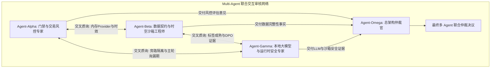

# 新股情绪感知与本地 LLM 自学习系统 — 多 Agent 联合交互审核报告

> **文档性质**：工程级联合审核基线与角色仲裁报告（提供多 Agent 互动协议；真实会审须以追加槽位举证）
> **编制日期**：2026-09-27
> **版本标识**：v1.1-R9.MULTI-AGENT-AUDIT
> **审查基线**：HEAD `5d418bb6`（24 个文件，+5232 / -531）；本次审查时当前暂存区与未暂存区另含任务记录、`gemini.md` 和 2 个 UI 文件变更，不等于“24 个文件均暂存”。
> **互动机制**：本报告支持多 Agent（及后续协同 Subagent、外部审查 Agent）进行标准化交互审阅、跨角色交叉辩论与动态追加批注。

## 复核总判定（2026-09-27）

**统一结论：Fail-Closed 状态合格；交易 Gate 端到端接入、日历完整性和 LLM Provider 运行验收仍未完成。不得将本报告解读为生产准入或“LLM 全功能已可运行”。**

本报告定义的 Alpha/Beta/Gamma/Omega 是可复用的审查视角与协作协议。当前文档未附可核验的 Subagent 任务 ID、独立原始意见、运行记录或真实签名哈希；因此第贰、叁节原有“多 Agent 一致共识”属于汇总叙述，不能证明发生过独立 Agent 会审。第伍节追加槽位才是后续互动的记录入口。

下文按代码实证修正此前过宽的 PASS 描述。旧的综合 PASS 仅适用于“代码骨架存在 / 安全关闭生效”范围，不适用于端到端功能、性能或生产准入。

---

## 目录

- [壹、多 Agent 审核机制与互动协议规范](#ch1)
- [贰、按专业角色组织的审核意见与实证代码索引](#ch2)
  - [2.1 Agent-Alpha: 门禁与交易风控专家（Risk & Gate Auditor）](#ch2-1)
  - [2.2 Agent-Beta: 数据契约与时空沙箱工程师（Data Pipeline Auditor）](#ch2-2)
  - [2.3 Agent-Gamma: 本地大模型与运行时安全专家（LLM Runtime Auditor）](#ch2-3)
  - [2.4 Agent-Omega: 独立总架构仲裁官（Lead Arbitration Architect）](#ch2-4)
- [叁、跨 Agent 交叉辩论与协同审议矩阵（Cross-Examination Matrix）](#ch3)
- [肆、LLM 实现覆盖与物理关闭边界定性](#ch4)
- [伍、多 Agent 互动追加审核槽位规范（Append Slots Protocol）](#ch5)
- [陆、统一仲裁决议与后续实施里程碑](#ch6)
- [柒、审核差异溯源与统一证据裁决](#ch7)

---

<a id="ch1"></a>
## 壹、多 Agent 审核机制与互动协议规范

为了降低单一视角的盲区，本文按四类工程专长组织评审视角，并定义可供真实 Agent 参与的交叉质询与仲裁流程。下图是目标协作流程，不代表本次确有四个独立 Agent 实际运行：



### 1. 审核标准与裁决标识
每个 Agent 必须针对审查议题输出以下固定三态裁决之一：
- `[PASS: 合格通过]`：在明确写出的审查范围内有充分证据支持；PASS 不自动代表端到端验收或生产准入；
- `[CAUTION: 存在隐患/需改进]`：逻辑成立但存在潜在性能损耗、时钟抖动或待完善边界；
- `[BLOCK: 硬性阻断/暂未准入]`：存在未来数据泄漏、主线程 I/O 阻塞、绕过风控或安全失控风险，坚决禁止上线。

---

<a id="ch2"></a>
## 贰、按专业角色组织的审核意见与实证代码索引

<a id="ch2-1"></a>
### 2.1 Agent-Alpha: 门禁与交易风控专家（Risk & Gate Auditor）

- **评审专长**：六层门禁（Gate 0~5）、Fail-Closed 机制、交易中心接入、RiskGate 风控上下文及订单安全性。
- **裁决状态**：`[PASS: Gate 缺上下文时失败关闭] / [BLOCK: 当前 Provider 不具备 ENTRY 所需上下文]`
- **核心审查意见**：
  1. **内存 Gate Provider 零 I/O 桥接验证**：
     - Gate 调用读取已缓存的内存快照，不在 `__call__` 中访问磁盘或网络；但读取使用短临界区 `RLock`，只能证明“无 Gate 路径 I/O”，不能据此承诺绝对无等待或已通过 300ms 压测。
     - SQLite 只读查询发生在 `refresh()`，是同步操作，由采集周期调用；UI 的采集 Worker 在 QThread 中运行，独立 `--watch` 进程则只更新自身内存，未见跨进程通知 ATS 刷新。
     - 配置哈希与契约哈希在 refresh 装载 observation 时核验并标记不匹配；不是每次 `__call__` 重新查询或重新比较。Gate 再用数据契约校验字段 TTL 与时间戳。
  2. **ENTRY 上下文缺口与实时风控硬阻断**：
     - 当前 Provider 对 `lrrm`、`ipo_regime`、`t1_carry`、`listing_anchors`、`vwap` 及 `risk_context` 均固定返回 `None`，并将 `listing_age_sessions` 设为 `0`。因此缺失 RiskGateContext 时阻断是正确的，但该默认 Provider 当前不能为完整 Gate 链路提供放行输入，结论应为“Fail-Closed 已接线，ENTRY 数据桥尚未完成”。
     - 查验源码 [ats/strategy/gate_orchestrator.py](../ats/strategy/gate_orchestrator.py#L630-L643)，`GateOrchestrator._evaluate_risk_context` 明确核验：
       ```python
       if not isinstance(context, RiskGateContext):
           return "RiskGate 上下文缺失"
       ```
     - 该硬阻断证明缺风控上下文不能放行；不等于真实 RiskGate、TradePlan、刷新链和订单回执已经端到端验收。
  3. **D0 / OBSERVE**：交易中心存在观察态与非 S5 拦截；但默认 Provider 将 `listing_age_sessions` 设为 `0`，且 Gate 上下文为空，因此不能证明 D0 已通过 Gate 3 后转为 WATCH。须补 D0 生命周期专项测试或回放证据。

---

<a id="ch2-2"></a>
### 2.2 Agent-Beta: 数据契约与时空沙箱工程师（Data Pipeline Auditor）

- **评审专长**：41 项指标契约、数据来源 manifest、D1–D3 交易日历匹配、成熟时间判定与历史截断防未来泄漏。
- **裁决状态**：`[CAUTION: D1–D3 算法主干成立但日历覆盖未证实] / [BLOCK: 实时数据未就绪]`
- **核心审查意见**：
  1. **D1–D3 交易日历匹配算法核验**：
     - 查验源码 [ats/strategy/ipo_outcome_labels.py](../ats/strategy/ipo_outcome_labels.py#L50-L97)，证据生成器按传入的 `trading_sessions` 选择上市后前三个交易日，避免将周末/节假日按自然日计数；此结论以输入日历完整为前提，不能据此宣称日历源的漏日问题已根治；
     - 增加了严格的收盘时间戳防御：若当前观测时间戳早于 D3 交易日的 15:00（`as_of_utc < d3_close`），强制返回状态 `PENDING_D3`（*“as_of_time早于D3交易日收盘，标签尚未成熟”*）；
     - **边界缺口**：实现仅检查可选 `trading_sessions` 是否至少给出三个上市后日期；没有日历覆盖范围/完整性证明。若列表不完整但仍含三个日期，前三个日期可能被错选。日历“空或少于三日”会 pending，但不能发现静默漏日。
     - 时区检查仅判断 `tzinfo is None`，没有验证 `utcoffset()` 有效；需补异常时区输入边界。
     - 双锚缺失时 `UNREADY_NO_FROZEN_ANCHORS` 是 `anchor_break_status` 字段，不是证据顶层状态；证据仍可成为 `MATURED_PENDING_REVIEW`，但 `training_eligible` 明确为 `False`。报告应区分“D1–D3 标签成熟”与“锚点破坏判据就绪”。
     - TDX 备用日线固定请求 `count=10` 后再按上市日过滤，无法保证对较早 IPO 覆盖上市后最初三日；缺少首三日数据会安全地保留 pending，但批次可能长期无法成熟。
     - 当前 `ats/strategy/test_ipo_outcome_review.py` 只构建一组有效成熟标签并测试复核；未见 `build_matured_outcome()` 对部分日历、D3 未收盘、无效时区和不完整日线的直接边界测试。本次没有运行测试。
  2. **41 项数据契约覆盖度实机查验**：
     - 本报告沿用交接记录中的最近一次采集快照 **6/41 项 READY**（发行价、发行PE、网上申购倍数、中签率、流通股本、近20日上市供给）；此数值是带时间点的快照，本轮没有重新采集，不能称为当前实时值；
     - 该次采集快照记录了东方财富 `push2` 连接异常、TDX 日线超龄、实时分时未到交易时段，其余 35 项为 `UNREADY`；这是当时快照结论，不是本轮重新探测结果。

---

<a id="ch2-3"></a>
### 2.3 Agent-Gamma: 本地大模型与运行时安全专家（LLM Runtime Auditor）

- **评审专长**：LLM 旁路隔离、Agent 合约 Schema、数据脱敏（Sanitizer）、Windows 进程管理与物理关闭状态。
- **裁决状态**：`[CAUTION: 运行链路与 Provider 未验收] / [PASS: 当前执行关闭]`
- **核心审查意见**：
  1. **Agent 契约与输入脱敏**：
     - `agent_contracts.py` 使用手写 JSON Schema 字典和自定义校验器，并非 Pydantic `BaseModel`；实际 Agent 类型为 `MARKET_REGIME`、`CASE_RETRIEVAL`、`POST_CLOSE_REVIEW`。
     - `remote_sanitizer.py` 提供需显式审批策略和逐 Agent 字段白名单的投影；当前配置 `approval_id`、`destination`、`policy_version` 为空且白名单为空，因此远程投影应失败关闭。代码有投影机制，不代表已批准出域或已验证所有实际负载。
  2. **CLI 与进程隔离边界**：
     - 查验源码 [ats/llm/antigravity_cli_backend.py](../ats/llm/antigravity_cli_backend.py)：Prompt 通过 `-p <prompt>` 放入子进程参数，不是 stdin；默认超时为 25 秒（可配置并限制在 5–30 秒），故此前“stdin / 20s”描述不准确。
     - `--sandbox` 是 CLI 参数，不能单独证明 Windows 内核级文件/工具隔离。`WindowsProcessJob` 在 Worker 启动路径用于子进程树回收；它不等同于文件系统、网络访问策略验收。
     - 当前代码树未见 `codex_cli_backend.py`，`backend_factory.py` 只构建本地 LiteRT backend；Antigravity CLI 适配器并未由该工厂接为可用推理后端。
  3. **严格维持物理关闭（Execution Disabled）**：
     - 查验配置文件 [config/llm_config.yaml](../config/llm_config.yaml)，`enabled: false`，`allow_remote: false`；
     - `backend_factory.py` 当前只接受 `active_backend=antigravity_sdk`、本地 LiteRT 文件、模型 SHA256 与 model_id；配置却选择禁用的 `antigravity_cli`，LiteRT 路径/哈希/model_id 为空。`provider_preflight` 还将 `execution_allowed` 固定为 `False`。
     - 结论：当前关闭边界是合规且 fail-closed；LLM 具备契约、Worker/数据管线和适配器代码，不等于推理 Provider 可运行或 SFT/DPO 训练闭环已验收。

---

<a id="ch2-4"></a>
### 2.4 Agent-Omega: 独立总架构仲裁官（Lead Arbitration Architect）

- **评审专长**：系统全局架构、四级观测体系、多进程并发安全性、终审准入决策。
- **综合裁决**：`[FINAL: 安全关闭通过 / 集成验收阻断 / 生产实盘与 LLM 不准入]`
- **核心审查决议**：
  1. **实现基线**：主要 24 文件代码变更已在 HEAD `5d418bb6`，共 +5232/-531；当前工作区并非 24 个文件都处于暂存状态。`git diff --check` 曾通过，但本轮未运行测试，也无证据证明全量语法、300ms 漏期为零或 Qt 心跳增量达标。
  2. **UI 状态**：当前未暂存差异集中在学习控制台 UI 样式/尺寸调整；静态差异不构成 UI 可用性、ATS 压测或毫秒级因果透视的验收证据。
  3. **准入定性**：数据 readiness 6/41 沿用上一采集快照；Gate Provider 缺少真实域对象与 RiskGate 上下文，D1–D3 日历完整性未证明，LLM Provider 不可执行。**生产 Gate、实盘交易和 LLM 均维持 BLOCK / 关闭**。

---

<a id="ch3"></a>
## 叁、跨 Agent 交叉辩论与协同审议矩阵（Cross-Examination Matrix）

以下是交叉质询协议的示例记录，不是可验证的独立 Agent 会话转录。此前回答中带有“绝不可能”“全体一致”等绝对措辞，现以源码证据复核并以下列结论为准：

```
╔══════════════════════════════════════════════════════════════════════════════════════════════════════════════════╗
║                                  跨 Agent 交叉质询与答辩协议示例（非实际会话）                                      ║
╠══════════════════════════════════════════════════════════════════════════════════════════════════════════════════╣
║ [质询 1] Agent-Alpha (风控) 质询 Agent-Beta (数据):                                                              ║
║ "内存 Gate Provider 在 300ms 交易关键路径上直接查内存字典，是否可能读取到已过期的脏数据？"                                       ║
║ ──────────────────────────────────────────────────────────────────────────────────────────────────────────────── ║
║ [答辩 1] Agent-Beta (数据) 答辩:                                                                                 ║
║ "Gate 数据契约校验已接入字段的 `as_of_time`、`available_at` 与 `max_age_seconds` (TTL)，但不是 Gate 0~4 各自重复校验。 ║
║ TTL 过期或时间戳异常时，已接入数据契约的字段会失败关闭；此结论不代表快照刷新或跨进程传播也已验收。"                             ║
╠══════════════════════════════════════════════════════════════════════════════════════════════════════════════════╣
║ [质询 2] Agent-Beta (数据) 质询 Agent-Gamma (安全):                                                              ║
║ "假设 Antigravity CLI 探活成功，为什么仍不能作为实盘辅助建议开启？"                              ║
║ ──────────────────────────────────────────────────────────────────────────────────────────────────────────────── ║
║ [答辩 2] Agent-Gamma (安全) 答辩:                                                                                ║
║ "根据 R8/R9 最终审计铁律：CLI 在本机运行不等于推理在本机，也不等于完全隔绝外部写操作。目前 CLI 的 `--sandbox` 尚未在      ║
║ Windows 操作系统内核级 (如受限令牌/JobObject) 证明完全阻止文件修改，且数据出域审批尚未配置。必须坚决执行 Fail-Closed！"   ║
╠══════════════════════════════════════════════════════════════════════════════════════════════════════════════════╣
║ [质询 3] Agent-Omega (总架构) 质询 全体 Agent:                                                                   ║
║ "若下周一开盘实时分时数据灌入，当前 6/41 就绪是否会导致主交易系统异常或误阻断？"                                          ║
║ ──────────────────────────────────────────────────────────────────────────────────────────────────────────────── ║
║ [审议结论 3] 单次静态复核结论:                                                                                    ║
║ "源码可确认关键输入缺失会失败关闭；本轮未做异常注入、ATS 联调或压测，不能断言运行无异常、主流程零影响或 100% 防误买。     ║
║ 需以边界测试和受控压测验证稳定性、主轮询及 UI 心跳后，才能给出运行结论。"                                             ║
╚══════════════════════════════════════════════════════════════════════════════════════════════════════════════════╝
```

### 交叉质询证据校准

1. **数据时效**：Gate 的数据契约确实校验必需字段的来源、时间戳和 `max_age_seconds`，缺失/过期时 fail-closed；但校验集中在 Gate 数据契约入口，不能据此声称 Gate 0~4 每一层都各自独立核验。Provider 快照刷新是进程内更新，跨进程采集不会自动发布到 ATS 内存。
2. **CLI 隔离**：AGY 的 `--sandbox` 参数和代码中的授权布尔值不是 Windows OS 级隔离实证；须完成实际 Job Object/受限令牌、工具权限和出域策略的验收。
3. **主交易性能**：风险上下文缺失会被硬阻断，但“不会影响 ATS 主流程”“零漏期 / 100% 流畅”必须有压测数据支持。当前未运行本轮测试或 UI/ATS 压测，不作性能通过裁决。

---

<a id="ch4"></a>
## 肆、LLM 实现覆盖与物理关闭边界定性

### 1. 功能组件代码盘点

| 模块组件 | 对应源码文件 | 交付功能 | 当前运行状态 |
|:---|:---|:---|:---:|
| **Agent 合约** | `ats/llm/agent_contracts.py` | 三种 Agent 类型的 JSON Schema 字典、自定义校验与信封 | **代码存在；不是 Pydantic，未等于 Provider 运行验收** |
| **脱敏投影** | `ats/llm/remote_sanitizer.py` | 审批策略、逐 Agent 白名单投影及敏感字段拒绝 | **代码存在；当前审批信息与白名单为空，远端投影关闭** |
| **AGY CLI 适配器** | `ats/llm/antigravity_cli_backend.py` | JSON 输出解析、参数校验、超时与策略门禁 | **适配器代码存在；Prompt 走 `-p` argv，运行默认 BLOCK；`--sandbox` 非 OS 隔离证明** |
| **进程管理** | `ats/llm/windows_job.py`, `ats/llm/llm_worker.py` | Worker 进程树清理 | **代码存在；不等于文件/网络工具沙箱验收** |
| **Provider 工厂** | `ats/llm/backend_factory.py` | 构建经验证的本地 LiteRT backend | **仅支持本地 LiteRT；当前配置不满足工厂条件，且 preflight 固定关闭** |
| **Codex CLI Provider** | `ats/llm/` | Codex CLI 推理 | **未发现 `codex_cli_backend.py`，未接入工厂** |
| **交互留痕** | `ats/llm/interaction_journal.py` | 交互快照持久化 | **实现存在；运行与容量/故障验收待补** |
| **成熟标签生成** | `tools/generate_matured_labels.py` | D1-D3 收益与回撤证据 | **代码存在；日历完整性及首三日备用行情覆盖有缺口，标签仅待人工复核** |
| **SFT/DPO 数据池** | `ats/llm/sealed_dataset_store.py` | 封闭样本与人工审核接口 | **数据池代码存在；标签复核不授权训练，训练/评估/模型晋级闭环未验收** |
| **监控控制台** | `ats/ui/ipo_learning_console.py` | 交互采集/复核界面 | **代码存在；本轮未运行 UI/ATS 压测或人工验收** |

### 2. 为什么当前依然物理关闭？
系统当前保持 Fail-Closed，依据如下；此状态证明“当前不执行”，不证明“全功能已完成”：
1. **配置层物理熔断**：`config/llm_config.yaml` 明确设置：
   ```yaml
   active_backend: antigravity_cli
   allow_remote: false
   backends:
     antigravity_cli:
       enabled: false
   ```
2. **代码层政策门禁**：`antigravity_cli_backend.py` 内部锁定：
   ```python
   if not self.allow_remote_invocation or not self.process_tree_isolation_accepted:
       return self._failure("POLICY_BLOCKED", "AGY 调用需显式远端授权及 OS 进程树/工具隔离验收；未调用 CLI")
   ```
3. **零决策权限铁律**：主交易核心决策 100% 走确定性规则主干，LLM 正负修正量强制为 `0.0`。

另：`provider_preflight` 将 `execution_allowed` 固定为 `False`；当前 `active_backend: antigravity_cli` 与 Provider 工厂仅支持的 `antigravity_sdk/local_litert` 不一致，LiteRT 路径、哈希和 model_id 为空。故当前不是“选择好 Provider 后待打开”，而是运行后端尚未具备启用条件。

---

<a id="ch5"></a>
## 伍、多 Agent 互动追加审核槽位规范（Append Slots Protocol）

为了支持后续更多 Subagent（或人工审查员）参与迭代审核，本文件制定了标准的**结构化互动追加槽位规范**。任何 Agent 均可在本节末尾按照以下格式追加评审记录：

槽位是协作协议，不自动产生独立性或真实性。每次真实会审必须记录 Agent/任务标识、审查的 commit SHA、实际文件与行号、运行命令及结果；未执行的测试写 `NOT RUN`，未生成真实摘要签名时写 `PENDING`，不得填入占位哈希或把角色模板写成已参与的 Agent。

```markdown
### 📝 [Slot: YYYYMMDD_HHMM] Agent-<Name>: <Role Title>
- **评审对象**：<文件路径或具体 Commit / 模块>
- **Agent 任务/会话 ID**：<可回溯 ID；人工评审则注明人工>
- **审查视角**：<风控 / 数据 / 性能 / 模型安全>
- **审查意见与实证**：
  1. ...
  2. ...
- **验证证据**：<命令、测试名/结果、性能报告；未执行写 `NOT RUN`>
- **裁决状态**：`[PASS | CAUTION | BLOCK]`
- **质询/回复**：<针对前序 Agent 意见的确认或挑战>
- **签名哈希**：<对最终槽位正文计算的真实 SHA256；尚未计算写 `PENDING`>
```

---

<a id="ch6"></a>
## 陆、统一仲裁决议与后续实施里程碑

### 1. 角色视角汇总后的统一决议
> **【仲裁决议 2026-09-27】**：
> 1. **PASS（限定范围）**：配置/契约哈希标记、数据契约 TTL 校验、缺少 RiskGateContext 时硬阻断，以及 LLM `execution_allowed=False` 的 Fail-Closed 机制有源码证据；pytest 默认发现路径包含 `trading_kernel/tests`。
> 2. **BLOCK（实现准入）**：默认 Gate Provider 缺少 LRRM/Regime/T1/锚点/VWAP/RiskGate 实时上下文；D1-D3 日历完整性未证明；LLM 当前 Provider 配置与工厂能力不匹配，Codex 后端缺失；未完成回放、自动化测试及 UI/ATS 压测验收。
> 3. **总裁决**：只批准继续 Stage 0/1 数据与集成工作。**不批准 LLM 推理开启、交易 ENTRY 授权或生产准入**。所谓 300ms 零漏期、UI 心跳 ≤5ms 增量尚无本轮实测证据。

### 2. 下一步执行里程碑
- **里程碑 1 (数据攻坚)**：为交易日历增加来源、版本、覆盖区间/完整性证明；修复首三日行情可取性，并逐项提高 41 项数据就绪度。
- **里程碑 2 (Gate 接线)**：向 Provider 接入真实、带时效的 LRRM/Regime/T1/锚点/VWAP 与 RiskGateContext；明确同进程刷新或跨进程发布契约，维持缺失即阻断。
- **里程碑 3 (模型验收)**：明确本地 LiteRT 或已批准 Provider 路径，完成模型依赖、隔离策略、脱敏出域审批和完整调用/关停验收；Codex 仅在后端实现后列入支持清单。
- **里程碑 4 (验证准入)**：补齐日历/成熟标签边界测试、历史回放与标签复核闭环，执行全量测试及 UI/ATS 受控压测；结果达标前持续关闭模型与交易授权。

<a id="ch7"></a>
## 柒、审核差异溯源与统一证据裁决

### 1. 为什么两份审核结论看起来差很多

差异主要来自审核口径，而不是对同一证据作出相反事实判断：

1. **“代码有机制”与“功能已接通”被混为一谈**：TTL 校验、脱敏器、CLI 适配器和 Job Object 有代码；但默认 Gate Provider 没有供给真实 Gate 对象，Provider 工厂不能构建当前配置的后端，压测与部署验收也未完成。
2. **“安全阻断通过”被写成“实现质量 PASS”**：缺少 `RiskGateContext` 时硬阻断是安全行为；它同时说明 ENTRY 路径尚不可用。模型 `execution_allowed=False` 是关闭证据，不是 LLM 推理功能完成证据。
3. **“算法覆盖部分输入”被写成“输入完整可信”**：D1-D3 选择和 D3 收盘门槛存在，但没有证明交易日历完整覆盖；前三个日期列表若静默漏日，仍可能错误成熟。
4. **叙述式角色辩论被当成真实多 Agent 独立结论**：角色架构和槽位协议能支持后续会审；若没有 Agent 运行 ID、独立审查产物和实际答辩记录，就不能把预置问答称为真实“全体一致”。
5. **提交基线与工作区状态混淆**：24 文件改动在 HEAD `5d418bb6`（+5232/-531），并非当前 24 个暂存文件；当前工作区还包含不同的已暂存、未暂存及未跟踪文件。
6. **审核输入和证据层级不同**：前序交接摘要记录的是阶段性完成状态，本轮以可定位的当前 HEAD/工作区源码复核；摘要未附同一基线下的运行日志、测试报告或压测结果。代码已存在、设计已写入与运行验收通过属于不同证据等级，因此状态可能从“已完成”收敛为“代码有骨架、集成待验收”。

### 2. 统一判定表

| 争议说法 | 源码/工作区证据 | 统一裁决 |
|:---|:---|:---|
| Gate Provider 已完整接入交易授权 | Gate 调用读内存；刷新时校验哈希，Gate 契约验证 TTL；但 Provider 将 LRRM、Regime、T1、锚点、VWAP、RiskGateContext 固定为空，且有短临界区锁 | **部分机制 PASS；ENTRY 接线 BLOCK** |
| D1-D3 已彻底消除日历和未来数据问题 | 选择上市后的前三个给定交易日，并要求 `as_of_time >= D3 15:00`；不证明给定日历无漏日，且备用 TDX 只取 10 根 | **成熟门槛部分 PASS；日历来源完整性 CAUTION/BLOCK** |
| LLM 多后端全功能就绪 | 合约和数据管线存在；工厂只实现 LiteRT，当前 LiteRT 配置为空，AGY/Codex 禁用，未发现 Codex backend，preflight 永远 false | **骨架存在；推理运行 BLOCK；关闭策略 PASS** |
| AGY CLI 具备 stdin、20 秒及 OS 沙箱保证 | 实际用 `-p` 命令行参数；默认 timeout 25 秒；`--sandbox` 不是 Windows OS 隔离验收 | **原报告描述错误，需以 Gamma 修订项为准** |
| pytest 范围/验证已通过 | `pytest.ini` 包含 `trading_kernel/tests`；交接声明本轮未跑测试，成熟度边界用例也未覆盖 | **默认发现范围 PASS；行为验收 NOT RUN** |
| 本文已经完成真实多 Agent 会审 | 本文有角色/质询模板，但尚无真实 Agent 任务标识、原始结果、测试记录或签名哈希 | **互动协议已建立；独立会审证据缺失** |

### 3. 后续互动审查的证据门槛

只有在各 Agent 分别提交带任务 ID 的独立审查槽位、逐项引用相同 commit 的可定位证据，并由 Omega 明确处理冲突后，才可将状态从“角色视角的整合审查”升级为“多 Agent 联合审核”。任何 `PASS` 必须绑定测试/压测结果；静态审查可出具代码存在性和风险裁决，不能替代运行验收。

---
*本报告由综合复核整理，提供后续多 Agent 独立互动的协议与证据基线；不宣称本次已完成可追溯的多 Agent 运行。*
