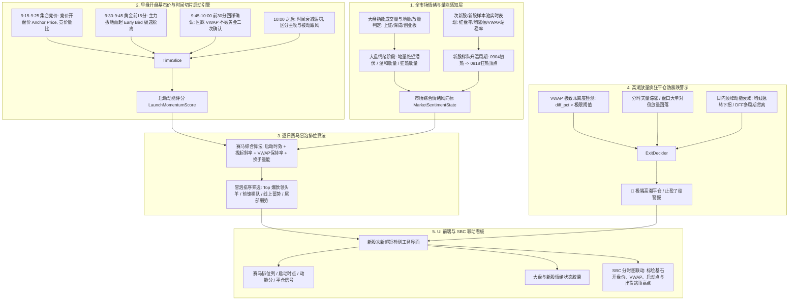

# 新股次新股超短检测工具：全市场情绪感知、早盘基石价动能赛马与高潮平仓策略方案

## 一、方案背景与核心交易哲学

在 A 股 **T+1 交易制度** 下，新股与次新股呈现极高弹性与波动：
1. **早一天强一天，T+1 晚一步万劫不复**：
   - 当天买入无法当天卖出，次日才能平仓。追高在高潮顶点（如图 4 沈鼓集团从 82.59 暴跌至 57.77），当日不仅承受巨大浮亏，次日更面临低开计提；
   - 核心优势在于**提前一天或在绝望地量期潜伏**，或在**早盘开盘前 30 分钟（9:30-10:00）主力建仓起爆点上车**，从而在次日享有充裕的获利平仓主动权。
2. **大盘量能共振与绝望地量周期**：
   - 历史规律表明：大盘成交量处于地量绝望期（如 09-04 阶段新股开始暗流涌动），主力往往在此逆向开启新股次新行情；
   - 随着大盘放量反弹中阳爆发（09-18），新股梯队迎来情绪顶点（华汇智能、百迈科、电科思仪、信诺维、沈鼓集团梯队扩散并共振爆发）。
3. **早盘开盘价作为基石价（Anchor Price）与主力意图**：
   - 散户在 9:15-9:25 集合竞价和 9:30 开盘时往往处于恐惧或观望；
   - 只有具备明确意图的主力资金，才会在早盘前 30 分钟内果断动手，以开盘价为基石迅速将价格拔离成本区、推升到 VWAP 之上；越早发动、启动时间越早，后发跟风盘越多，溢价空间越大。
4. **高潮疯狂时的高点平仓能力（Extreme Climax Exit）**：
   - 类似 601091 沈鼓集团次日暴涨 200%+，分时冲刺到 82.59 时，偏离 VWAP 达到极致且放出天量，系统必须能够毫秒级感知**极端高潮派发/量价滞涨**，输出**坚决平仓逃顶/锁定胜果**预警，严禁开仓买入。

---

## 二、系统架构与核心模块设计

---

## 三、数学模型与核心算法实施细则

### 1. 早盘开盘基石价与时间切片启动模型 (Anchor & Time Slice)
以当日开盘价 $P_{open}$ 作为基石参考，并记录早盘最低价 $P_{low}^{morning}$：
- **时间惩罚因子 (Early Bird Factor)**：
  $$W_{time}(t) = \begin{cases}
  1.0, & 09:30 \le t \le 09:40 \\
  0.85, & 09:40 < t \le 09:50 \\
  0.70, & 09:50 < t \le 10:00 \\
  0.50 \cdot e^{-0.015 \cdot (t - 10:00)}, & t > 10:00
  \end{cases}$$
  *注：9:30-9:45 发动的个股具有最高情绪权重，越往后启动衰减越快。*
- **拔地而起斜率 (Surge Slope)**：
  从开盘价/早盘低点拉升到现价（或首次站稳 VWAP）的角斜率：
  $$\theta_{surge} = \arctan\left(\frac{P_{now} - P_{anchor}}{P_{anchor} \cdot \Delta t_{min}}\right) \times \frac{180}{\pi}$$
  斜率大于 $45^\circ$ 表明主力意图极其坚决。
- **VWAP 站稳持续率 (VWAP Hold Ratio)**：
  统计开盘至今分时 K 棒中在 VWAP 之上的比例：
  $$R_{hold} = \frac{\sum_{i=1}^{N} \mathbb{I}(P_i \ge VWAP_i)}{N}$$
  若 $R_{hold} \ge 90\%$ 且价格紧贴 VWAP 上方抬升，为最标准的健康强势走势。

### 2. 逐日赛马冒泡排位算法 (Horse Race Momentum Engine)
为每只新股/次新股计算综合赛马得分（0~100 分）：
$$S_{horse} = 0.30 \cdot S_{early\_launch} + 0.25 \cdot S_{slope} + 0.20 \cdot S_{vwap\_hold} + 0.15 \cdot S_{vol\_ratio} + 0.10 \cdot S_{kline\_trend}$$
- **排位标签体系**：
  - **🥇 赛马领头羊 (Top 1~2)**：$S_{horse} \ge 85$，开盘 30 分钟内最早拔起，VWAP 持续站稳，放量领先，标记为爆款先锋；
  - **🥈 梯队共振前锋 (Top 3~6)**：$75 \le S_{horse} < 85$，跟随板块热度上行，结构良好；
  - **🎯 线上蓄势 (潜伏/预下单)**：在 VWAP 上走平 1~3 天，蓄势待发；
  - **⏱️ 迟滞跟风**：10:00 以后被动跟风拉升，溢价低；
  - **⚠️ 破位弱势**：运行于 VWAP 之下，坚决排除。

### 3. 全市场情绪与大盘量能感知模型 (Market & Index Coupling)
- **大盘指数状态判别**：
  - 提取上证指数（999999/000001）与创业板指（399006）的成交额与前 5 日均量对比；
  - **绝望地量期 (Bottom Shrink)**：成交额低于 5 日均量的 85%，市场绝望，主力在新股中逆市建仓；
  - **主升放量期 (Surge Expansion)**：成交额突破 5 日均量 1.2 倍以上，普涨爆发，新股情绪迎来峰值；
  - **高位天量震荡期 (Volume Climax)**：放天量滞涨，警惕获利盘涌出。
- **新股梯队升温指数 (IPO Heat Index)**：
  - 统计上市 15 日内所有新股：红盘比率、平均涨幅、大于 +5% 标的数量、平均量比；
  - 动态划分为：`❄️ 冰点极寒 -> 🌱 绝望孕育 -> 🔥 梯队升温 -> 🌋 狂热高潮`。

### 4. 极端高潮放量平仓/防暴跌预警算法 (Climax Distribution & Exit Guard)
针对类似沈鼓集团暴拉至 82.59 后的剧烈出货：
- **触发条件 1（极限乖离）**：分时现价偏离日内/10d VWAP 达到极端值（如 $P_{now} - VWAP \ge 18\%$，新股当日偏离 $\ge 35\%$）；
- **触发条件 2（天量滞涨/回落）**：最近 5 分钟成交量达到日内分时最高峰（天量），但价格涨幅未能创新高，或自高点快速回撤超过 3.5%；
- **触发条件 3（均线下破）**：分时快速跌破分时均线，且 DFF 发生死叉。
- **输出决策**：
  - 信号评级变更为：`🚨 疯狂高潮平仓`；
  - 操作建议高亮显示：`现价偏离VWAP达极限(+X%)且放天量滞涨，主力疯狂兑现，坚决平仓保利，严禁追买!`

---

## 四、具体工程落地与修改细则

### 1. `ats/strategy/ipo_vwap_detector_engine.py` (核心引擎增强)
- **扩充 `VWAPDetectorSignal` 数据类字段**：
  - `open_anchor_price`: float（早盘基石开盘价）
  - `morning_low_price`: float（早盘最低价）
  - `launch_time_str`: str（启动时点，如 "09:32"）
  - `launch_slope_deg`: float（启动斜率角度）
  - `vwap_hold_ratio`: float（分时 VWAP 站稳率 0~100%）
  - `horse_race_score`: float（赛马动能综合得分 0~100）
  - `horse_race_tier`: str（🥇 领头羊 / 🥈 前锋梯队 / 🎯 线上蓄势 / ⏱️ 迟滞跟风 / ⚠️ 破位弱势）
  - `is_climax_exit`: bool（是否处于高潮疯狂平仓状态）
  - `climax_desc`: str（平仓预警详细原因）
- **实现算法子函数**：
  - `_evaluate_morning_launch_momentum(...)`：提取早盘 9:15-10:00 关键时间切片，计算基石价与拔地而起动能；
  - `_evaluate_climax_exit(...)`：高潮放量平仓与天量滞涨检测；
  - `batch_evaluate_horse_race_ranking(signals: List[VWAPDetectorSignal])`：对所有信号执行冒泡排序与梯队排位标记。

### 2. `ats/strategy/ipo_market_sentiment_engine.py` (NEW 情绪感知器)
- 纯单例/内存轻量模块，复用 `TDXRealtimeFetcher` 已有缓存，零主线程阻塞：
  - `get_index_volume_status()`：快速判定上证/创业板地量与放量周期；
  - `get_ipo_heat_snapshot(ipo_signals)`：计算新股整体热度与梯队升温阶段；
  - 返回字典供 UI 状态栏与信号综合裁决使用。

### 3. `ats/ui/ipo_subnew_detector_dialog.py` (UI 前端增强)
- **表头升级**：
  - 在“代码”、“名称”后新增/调整【赛马排位】（显示 🥇 爆款领头羊、🥈 梯队前锋等）、【启动时点】、【动能分】；
  - 右侧状态与操作建议融入【🚨 疯狂高潮平仓】、【🎯 地量绝望潜伏】、【🚀 早盘拔地起爆】等高辨识度标签；
- **顶栏增加【大盘量能与新股情绪风向标】胶囊状态卡片**：
  - 实时显示：`大盘量能: 绝望地量 / 温和放量 / 狂热放量 | 新股情绪: 🔥 梯队升温共振 (站稳率 78%)`；
- **表格排序默认支持按【赛马动能分】降序冒泡排列**，一键让最强的“爆款”浮在最上方；
- **快捷联动与 SBC 窗口**：
  - 双击或快捷键调出 SBC 走势窗口，并在 SBC 走势图上标出基石开盘价水平线与高潮平仓警戒线。

---

## 五、自动化测试与回归计划

### 1. 单元与集成测试 (`tests/test_ipo_vwap_sentiment_and_horse_race.py` NEW)
- **测试用例 1**：早盘 9:30-9:45 快速拔地而起标的，启动动能分显著高于 10:30 跟风标的；
- **测试用例 2**：沈鼓集团式分时模拟：从 11.9 暴涨至 82.59 并在高位放天量滞涨，精准触发 `🚨 疯狂高潮平仓` 信号，且阻断任何买入建议；
- **测试用例 3**：大盘地量与新股梯队升温判定测试（模拟缩量与放量指标）；
- **测试用例 4**：赛马冒泡排位算法测试（多只新股打分排序，领头羊置顶）；
- **测试用例 5**：UI 表头与列宽持久化回归（确保极窄模式与 BaseATSTableWidget 100% 稳定兼容）。

### 2. 全量回归测试
- 运行 `tests/test_ipo_subnew_detector.py`
- 运行 `tests/test_ipo_detector_column_widths_persistence.py`
- 运行 `tests/test_sbc_ats_mode_alt_exit_guard_and_paste.py`
- 确保测试 100% 绿灯通过，无任何 Regression。
