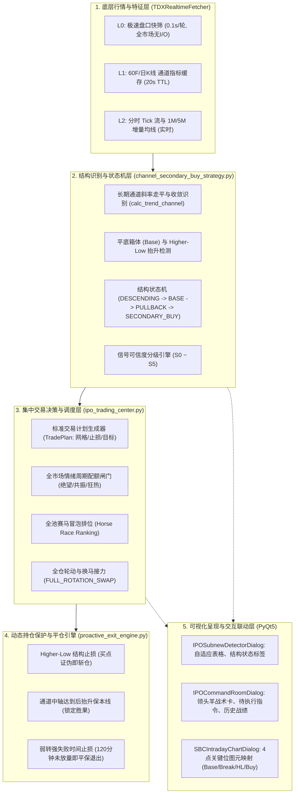

# 【技术实施方案】新股检测中心与集中交易指挥室：长期通道企稳底部结构次级买点实盘交易闭环

> **文档性质**：工程级技术实施规划方案（**严守“只规划，不实施代码变动”原则**）  
> **编写日期**：2026-09-19 21:10  
> **状态**：方案已编制完备，处于安全就绪状态；严格遵照操盘手指示，生产代码零变动。  
> **对齐模块**：`ats/strategy/ipo_vwap_detector_engine.py`、`ats/strategy/ipo_trading_center.py`、`ats/tdx_realtime_fetcher.py`、`ats/ui/ipo_subnew_detector_dialog.py`、`ats/ui/ipo_command_room_dialog.py`、`ats/ui/intraday_strategy_dialog.py`

---

## 一、 背景与系统定位

在股票量化实战体系中，**盘中“异动提示”与“实盘买入决策”有着本质的分水岭**：
- **异动提示阶段**：基于单一瞬时指标（如 $Price > VWAP$ 或单根大阳线突破）抛出标签。该模式缺乏时序前后文与结构认知，极易在诱多放量冲顶时成为接盘侠，且买入后缺乏防守锚点；
- **实盘买入阶段**：必须具备**“多周期结构感知 $\rightarrow$ 状态机时序流转 $\rightarrow$ 信号严密分级(S0~S5) $\rightarrow$ 生成不可变 TradePlan $\rightarrow$ 资金集中仲裁 $\rightarrow$ 外科手术式动态持仓保护 $\rightarrow$ 历史复盘归因”**的完整工业级交易闭环。

针对 688826、300058（蓝色光标）等标的的实战走势，其核心机会在于**“长期下降通道减速走平 $\rightarrow$ 构筑平底箱体扎底 $\rightarrow$ 首次长阳突破试盘（不追高） $\rightarrow$ 极度缩量回踩守住次低点（Higher-Low） $\rightarrow$ 日内放量突破确认次级买点”**。

本方案旨在现有 ATS 系统架构下，为新股检测工具与交易决策中心规划该能力的完整实施蓝图，并彻底解耦优化底层 `TDXRealtimeFetcher`。

---

## 二、 核心架构设计与职责边界（SOLID 原则）

系统遵循 **单一职责（SRP）** 与 **依赖倒置（DIP）** 原则，将全流程拆分为 5 个清晰层次，彻底杜绝在 `TDXRealtimeFetcher` 内部继续膨胀业务判断：



---

## 三、 核心形态量化定义与状态机规范

### 1. 结构量化定义
- **长期通道背景（60F / 日K）**：
  - 过去 15~60 根 K 线下轨斜率 $Slope_{down} \in [-0.15, +0.05]$（下行势能枯竭，明显走平）；
  - 价格由触碰通道下轨反弹回中轨下方；
  - 伴随成交量呈现阶梯式衰减，呈现“地量底”。
- **平底箱体（Base Foundation）**：
  - 构筑持续 3~8 个周期的箱体震荡，振幅收敛在 $\le 5\%$；
  - 箱体最低点记为 $Base\_Low$。
- **首次试盘（First Breakout）**：
  - 单根中大阳线突破箱体上沿，成交量为前 5 日均量的 $1.8 \times \sim 3.0 \times$；
  - **实战铁律**：此时仅标记 $First\_Break\_Price$，**绝对不追高开仓**！
- **缩量回踩企稳（Pullback Stability）**：
  - 突破后连续 1~3 根 K 线缩量回落（成交量缩减 $50\%$ 以上）；
  - 回踩最低点 $Higher\_Low > Base\_Low \times 1.01$（重心抬高，空头衰竭）；
  - 分时回踩不破 10d VWAP 或 3 分钟内迅速金叉收回。
- **次级买点确认（Secondary Buy Confirmation）**：
  - 分时放量上穿回踩小箱体高点，且 $VWAP\_Adhesion \ge 75\%$；
  - 当日涨幅处于 $+1.0\% \sim +5.5\%$ 合理进攻区间（非透支秒板）；
  - 向上距长期通道中轴/上轨空间 $\ge 8\%$，盈亏比 $\ge 3:1$。

### 2. 状态机时序流转（Structure State Machine）
```python
class SecondaryBuyStage:
    STAGE_DESCENDING_CHANNEL = "DESCENDING_CHANNEL"  # 1. 长期通道压制
    STAGE_BASE_DRYUP         = "BASE_DRYUP"          # 2. 底部缩量筑底
    STAGE_FIRST_BREAKOUT     = "FIRST_BREAKOUT"      # 3. 首阳试盘突破 (只标记不买)
    STAGE_PULLBACK_STABLE    = "PULLBACK_STABLE"     # 4. 缩量回踩抬高 (蓄势就绪)
    STAGE_SECONDARY_BUY      = "SECONDARY_BUY"       # 5. 次级放量确认 (生成买点)
    STAGE_INVALIDATED        = "INVALIDATED"         # 6. 跌破底台破位 (彻底失效)
```

---

## 四、 强信号分级（S0 ~ S5）与风控闸门

为了保证实盘交易指令的高信噪比与极高胜率，引入 5 级晋级体系，只有 **S4 / S5** 允许进入下单链路：

| 级别 | 信号定义 | 处置动作 | UI与系统表现 |
| :--- | :--- | :--- | :--- |
| **S0** | 通道下行中或继续创新低 | 内部静默记录 | 不在界面展示，丢弃 |
| **S1** | 底部出现脉冲放量，但未脱离通道 | 列入长周期大底监控池 | 仅在后台维护列表，不告警 |
| **S2** | 完成首阳突破，进入回踩观察池 | 启动分时追踪 | 检测中心表格标记 `🔍 回踩观察`，不发声音 |
| **S3** | 回踩完成 Higher-Low 抬升且地量企稳 | 准备捕捉次级拉升 | 调度室预备队置顶，状态栏提示 `⏳ 预备就绪` |
| **S4** | 分时放量突破次级确认线，站稳 VWAP | 自动生成不可变 `TradePlan` | 触发 ATS Toast 弹窗与预警语音，进入赛马排位 |
| **S5** | 通过大盘情绪、T+1追高禁令与赛马Top1仲裁 | 下发实盘/模拟开仓指令 | 指挥室生成 `BUY` / `FULL_ROTATION_SWAP` 指令 |

### 实盘执行的三重严密风控闸门：
1. **闸门 1：T+1 追高禁令（`is_t1_forbidden_buy`）**：
   - 非上市首日标的，若早盘涨幅已超过 $+12\%$ 或连续临停加速，禁止作为次级买点开仓接盘，防范次日核按钮。
2. **闸门 2：大盘情绪周期额度配给**：
   - 绝望地量期：仅允许 $10\% \sim 20\%$ 试探仓；
   - 升温共振期：放行 $50\% \sim 70\%$ 主升仓；
   - 狂热高潮期：禁止开新仓，仅允许卖出。
3. **闸门 3：滑点与买区偏离保护**：
   - 现价必须落在 $[Buy\_Zone\_Min, Buy\_Zone\_Max]$ 区间内，若脉冲超幅超过 $1.5\%$ 则自动撤单，绝不追单。

---

## 五、 标准 TradePlan 规范与买卖点全生命周期绑定

### 1. 标准化 `IPOTradePlan` 数据容器
```python
@dataclass
class IPOTradePlan:
    plan_id: str                      # 唯一计划编号，如 TP_688826_20260919_094512
    code: str                         # 标的代码
    name: str                         # 标的名称
    strategy_tag: str = "CHANNEL_SECONDARY_BUY"
    signal_tier: str = "SSS"          # SSS / S / A
    
    # 价格执行网络
    trigger_price: float = 0.0        # 次级买点确认触发价
    buy_zone_min: float = 0.0         # 买入价格下限
    buy_zone_max: float = 0.0         # 买入价格上限 (严防追高)
    
    # 结构防守与止损铁律 (严格溯源开仓形态)
    higher_low_stop: float = 0.0      # 核心防守：次级回踩低点 (跌破即说明买点错误，立斩出局)
    base_low_invalid: float = 0.0     # 终极失效：底部大平底箱体最低点
    hard_stop_loss_pct: float = 2.5   # 极窄硬止损上限 (不超过 2.5%)
    
    # 盈利目标阶梯
    target_1_channel_mid: float = 0.0 # 第一目标：长期通道中轴/上轨阻力位 (减仓 30% 抬保本线)
    target_2_swing_high: float = 0.0  # 第二目标：前期波段高点 (减仓 40% 留底仓趋势跟踪)
    
    # 仓位规划
    initial_weight_pct: float = 30.0  # 首笔探路仓位
    confirm_weight_pct: float = 40.0  # 突破放量站稳加仓仓位
    max_weight_pct: float = 70.0      # 单票总仓位上限
    
    # 时间止损
    max_consolidation_minutes: int = 120 # 买入后若 120 分钟未脱离成本区，平保走人
```

### 2. 卖出引擎（`ProactiveExitEngine`）的结构化回溯
卖出与保护逻辑彻底告别“盲人摸象”，将开仓生成的 `TradePlan` 完整注入持仓上下文：
- **铁律 1（买错立斩）**：现价跌破 $Higher\_Low \times 0.992$，触发结构破位止损，执行 `CRITICAL` 极速出局；
- **铁律 2（保本推移）**：现价触及 $Target\_1$（长期通道中轴），将保护线由 $Higher\_Low$ 动态上移至 $Trigger\_Price + 0.5\%$，锁定不亏本局面；
- **铁律 3（时间磨损出局）**：持仓超过 120 分钟且收益率在 $[-0.5\%, +0.8\%]$ 滞涨，触发“弱转强失败”，主动平仓回收资金；
- **铁律 4（高潮提前算法限价挂单）**：若后续经历 2~4 次临停加速冲顶，提前计算 $Climax\_Price$，以 `LIMIT` 挂单提前排队兑现。

---

## 六、 性能拓展性：L0 / L1 / L2 三层漏斗与 TDX 优化方案

为了在交易时间内确保全市场监控与毫秒级决策响应，同时消灭主线程阻塞与网络风暴，设计三层性能漏斗：

| 层次 | 监控范围 | 运行周期 | 数据源与计算复杂度 | 产出成果 |
| :--- | :--- | :--- | :--- | :--- |
| **L0: 极速盘口快筛** | 500+ 只新股/全市场标的 | 100ms / 轮 | 纯内存无 I/O 计算：日内涨跌幅 ($0\% \sim 6\%$)、分时偏离 VWAP、量比 ($>1.2$)、站稳 MA20 | 过滤掉 $85\%$ 不相关杂音，筛选 30~50 只潜在候选标的 |
| **L1: 候选池结构推演** | 30~50 只候选池标的 | 15~20s 异步轮询 | 读取带 30s 内存 TTL 缓存的 60F/日K 线；运行 `calc_trend_channel` 与底部箱体识别 | 状态机推移：识别处于 `PULLBACK_STABLE` 或 `SECONDARY_BUY` 的 5~10 只标的 |
| **L2: 强信号盘口深度确认** | 5~10 只顶级候选 | 秒级/Tick 驱动 | 直连 1M/5M 流式 K 线与分笔成交；校验 VWAP 站稳率、买区滑点、T+1 禁令 | 生成 S4/S5 `TradePlan`，驱动语音告警与调度室下单 |

### `TDXRealtimeFetcher` 的针对性优化：
1. **策略逻辑彻底外置**：Fetcher 仅负责网络 IO、连接保活、K 线拉取与轻量指标向量化，绝不承载业务买卖点决策；
2. **多周期 K 线智能缓存**：
   - 60F K 线：设置 30 秒 TTL 内存缓存；
   - 日 K 线：设置 180 秒 TTL 内存缓存；
   - 分时 VWAP：采用增量差分推送机制，避免重复全量拉取。

---

## 七、 前端界面呈现与 SBC 分时图联动

### 1. 新股检测中心（`IPOSubnewDetectorDialog`）
- 表格列新增【形态阶段】：直观展示 `📉 通道寻底` / `📦 平底箱体` / `🚀 首次试盘` / `⏳ 缩量回踩` / `👑 次级买点(S4)`；
- 表格列新增【结构关键位】：展示 `底: 12.88 | 回踩: 13.05 | 次买: 13.40`；
- 结合此前实现的弹性视口拉伸，自适应铺满全屏，0 像素黑边。

### 2. 集中指挥调度室（`IPOCommandRoomDialog`）
- 领头羊战术卡：次级买点确认标的直接赋予赛马高分，高亮显示在领头羊前锋席位；
- 待执行指令区：展示包含完整价格网格与止损位的标准 `TradePlan`；
- 历史战绩复盘：详细记录每一次次级买点的“触发价、Higher-Low 防守位、实际退出价、盈亏比与胜负归因”。

### 3. SBC 分时图（`SBCIntradayChartDialog`）图元映射
双击表格联动打开 SBC 分时图，主副图清晰渲染 4 个核心结构坐标：
1. **绿色虚线**：大平底最低点（$Base\_Low$）；
2. **橙色点划线**：首次试盘突破高点（$First\_Break$）；
3. **黄色粗线**：回踩次低点防守线（$Higher\_Low$）；
4. **红色箭头+文字**：次级放量买点确认点（$Secondary\_Buy$）。

---

## 八、 分步实施路线图与阶段性里程碑

```
Stage 1: 策略核心与状态机独立模块 (ats/strategy/channel_secondary_buy_strategy.py)
  - 实现 evaluate_channel_secondary_buy() 纯函数
  - 实现 ChannelSecondaryBuyStateMachine 状态机类
  - 编写离线仿真与单元测试，覆盖 688826/300058 等历史形态 (100% 测试通过)

Stage 2: TDXRealtimeFetcher 取数与多周期二级缓存优化
  - 实现 fetch_cached_kline_bars() 内存级 TTL 缓存机制
  - 解耦策略代码，保持 Fetcher 接口纯粹与高性能

Stage 3: 接入新股检测引擎与 L0/L1/L2 漏斗调度 (ats/strategy/ipo_vwap_detector_engine.py)
  - 将状态机接入后台 Worker 轮询
  - 扩展 VWAPDetectorSignal 包含阶段状态与关键价格网络

Stage 4: 交易决策中心 TradePlan 闭环与持仓保护联动 (ats/strategy/ipo_trading_center.py)
  - 建立 TradePlan 生成机制与 S0~S5 闸门
  - 联动 ProactiveExitEngine 实现 Higher-Low 动态防守与全仓轮动

Stage 5: 前端 UI 呈现与 SBC 分时图图元联动映射
  - 升级 IPOSubnewDetectorDialog 与 IPOCommandRoomDialog 界面
  - 在 SBCChartCanvas 绘制 4 点结构关键线
```

---

## 九、 自动化测试规划

为确保整个交易闭环在 Windows 多进程与实时行情下的绝对稳定性，设计如下测试套件：
1. `tests/test_channel_secondary_buy_strategy.py`：测试各种 K 线形态（破位新低、首次突破冲高回落、缩量回踩抬高、次级放量突破）的状态机转移精准度；
2. `tests/test_tdx_kline_caching_performance.py`：高频并发调用下验证 K 线 TTL 缓存命中率与零阻塞；
3. `tests/test_ipo_trade_plan_and_exit_linkage.py`：验证从 `TradePlan` 生成到触发 `higher_low_stop` 止损的完整状态回溯闭环；
4. `tests/test_ipo_detector_secondary_buy_ui_integration.py`：验证前端表格自适应渲染、阶段标签更新与指令分发。

---

## 十、 总结与结语

本实施方案不依赖任何外部未知库，全量复用并深度整合现有的 `IPOVWAPDetectorEngine`、`IPOTradingCenter`、`TDXRealtimeFetcher` 与 `ProactiveExitEngine`。方案将盘中交易逻辑由原先脆弱的“单点提示”彻底升格为具有**多周期时空认知、严格状态机推演、精细化资金仲裁与动态结构保护**的实战级交易闭环。
