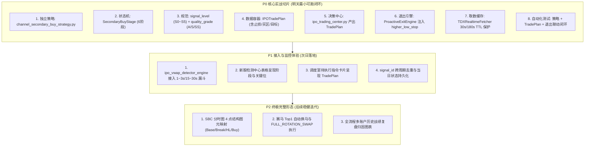

# 【实战优化版实施方案】新股检测中心与集中交易决策中心：长期通道底部结构次级买点最小可跑闭环 (P0~P2 裁剪)

> **方案性质**：根据操盘手实战反馈深度收敛的工程落地实施方案  
> **更新日期**：2026-09-19 21:35  
> **对齐原则**：**拒绝大而全的单次冒进，以“强信号落地 TradePlan + 退出引擎保护”作为明天可跑的 P0 最小切片，P1/P2 渐进演进**。

---

## 一、 操盘手实战修正破案与方案收敛

针对初始蓝图在实战落地中的 5 个潜在风险点，本方案进行硬核收敛与重构：

| 序号 | 初始蓝图风险点 | 操盘手实战纠偏 | 本方案收敛落地规范 |
| :--- | :--- | :--- | :--- |
| **1** | **L0 100ms 目标偏激进**，极易引发 Windows / pytdx / Qt 线程抖动 | 降速保稳，杜绝主线程与网络拥堵 | **L0**：收敛至 `1s ~ 3s` 一轮（全市场/监控池盘口轻筛）<br>**L1**：`15s ~ 30s` 一轮（候选池 60F/日K 通道状态机）<br>**L2**：秒级/Tick 驱动，**严格仅对 5~10 只强候选** 深度确认 |
| **2** | **`signal_tier` 与 `S0~S5` 字段冲突**，导致排序与风控混乱 | 统一为双层正交维度，禁止混淆 | **`signal_level`**：`"S0"` ~ `"S5"`（生命周期流转层级，仅 S4/S5 允许交易）<br>**`quality_grade`**：`"A"` \| `"S"` \| `"SS"`（形态质量评分评级） |
| **3** | **首日新股与通道次级买点混淆**，两者的实战风控边界天差地别 | 结构共用 TradePlan，但策略 Tag 严格正交隔离 | **`IPO_BID_SURGE`**：首日竞价/早盘抢筹<br>**`IPO_VWAP_STABLE`**：首日/次日 VWAP 承接<br>**`SUBNEW_PULLBACK_REENTRY`**：次新缩量回踩再买点<br>**`CHANNEL_SECONDARY_BUY`**：长期通道底部次级买点 |
| **4** | **直接做全仓轮动换马风险极高**，未经过 paper 验证严禁实盘 | 严禁自动化全仓调仓换马，收敛指令类型 | 明天实盘指令收敛为 3 种：<br>① `BUY_SCOUT`（探路轻仓 30%）<br>② `BUY_CONFIRM`（站稳加仓 30%）<br>③ `EXIT_ALL`（保护触发全清）<br>`FULL_ROTATION_SWAP` **仅作为界面战术建议展示，绝对不自动下单**！ |
| **5** | **UI与图元全量改造过重**，挤占核心交易逻辑的稳定性验证 | 核心交易闭环 P0 优先，UI 图元降为 P2 | 先把 **强信号 $\rightarrow$ TradePlan $\rightarrow$ 退出保护** 跑通；SBC 4 点图元与指挥室美化放 P2 |

---

## 二、 P0 / P1 / P2 阶段切片规划



---

## 三、 P0 核心技术规格与数据结构规范

### 1. 字段命名与分级双层正交规范
彻底废弃不规范的自由文本，统一为严格的枚举与类型定义：
- **`signal_level`（信号生命周期层级）**：
  - `"S0"`：背景噪声（长期下行或继续破位）
  - `"S1"`：异动初现（脉冲放量但未脱离下轨）
  - `"S2"`：蓄势观察（首阳试盘突破，进入回踩观察）
  - `"S3"`：预备就绪（地量缩量回踩完成 Higher-Low 抬升）
  - `"S4"`：**可交易买点**（分时放量站上 VWAP 并突破次级确认线，触发生成不可变 `TradePlan`）
  - `"S5"`：**可执行指令**（通过 T+1 追高禁令、大盘情绪配额校验，正式生成开仓指令）
- **`quality_grade`（形态质量评级）**：
  - `"A"`：标准形态，盈亏比 $\ge 2.5:1$
  - `"S"`：优质形态，大平底收敛 + 长期通道走平 + 盈亏比 $\ge 3.5:1$
  - `"SS"`：极品形态，多周期（60F+日K）共振突破 + 底部地量九转 + 板块共振

---

### 2. 标准不可变 `IPOTradePlan` 数据容器规范
```python
@dataclass
class IPOTradePlan:
    plan_id: str                      # 唯一编号，如 TP_688826_20260919_093201
    code: str                         # 股票代码
    name: str                         # 股票名称
    strategy_tag: str                 # "CHANNEL_SECONDARY_BUY" | "SUBNEW_PULLBACK_REENTRY" | "IPO_VWAP_STABLE" | "IPO_BID_SURGE"
    signal_level: str = "S4"          # "S4" | "S5"
    quality_grade: str = "S"          # "A" | "S" | "SS"
    
    # 价格执行网络
    trigger_price: float = 0.0        # 次级买点确认触发价
    buy_zone_min: float = 0.0         # 买入区间下限 (回踩均线支撑)
    buy_zone_max: float = 0.0         # 买入区间上限 (严禁追高超幅 1.5%)
    
    # 结构防守与止损铁律 (严格溯源开仓形态，注入 ProactiveExitEngine)
    higher_low_stop: float = 0.0      # 核心防守位：次级回踩低点 (跌破即说明买点错误，立斩出局)
    base_low_invalid: float = 0.0     # 终极失效位：底部大平底最低价
    hard_stop_loss_pct: float = 2.5   # 极窄风险兜底 (最大亏损不超过 2.5%)
    
    # 盈利目标阶梯
    target_1_channel_mid: float = 0.0 # 目标 1：长期通道中轴/上轨 (减仓 30% 并抬保本线)
    target_2_swing_high: float = 0.0  # 目标 2：前期波段高点 (减仓 40% 留底仓趋势跟踪)
    
    # 执行建议 (明天收敛为单向仓位，禁止自动换马)
    suggested_action: str = "BUY_SCOUT" # "BUY_SCOUT" (30%) | "BUY_CONFIRM" (30%)
    position_pct: float = 30.0        # 建议单笔仓位百分比
    expire_at: str = "14:45:00"       # 计划失效截止时间
```

---

### 3. `ProactiveExitEngine` 注入与动态保护闭环
退出引擎在接收 Tick 或每秒轮询时，直接调用绑定的 `TradePlan`：
1. **买错立斩**：$Price \le plan.higher\_low\_stop \times 0.992 \implies$ 触发结构止损，发出 `EXIT_ALL` 指令；
2. **保本推移**：$Price \ge plan.target\_1\_channel\_mid \implies$ 动态将保本线移至 $plan.trigger\_price + 0.5\%$；
3. **时间止损**：入场后 120 分钟内收益率在 $[-0.5\%, +0.8\%]$ 滞涨，判定弱转强失败，发出 `EXIT_ALL` 平保出局。

---

## 四、 P0 实施文件清单与操作步骤

### Step 1: 新增独立策略文件 `ats/strategy/channel_secondary_buy_strategy.py`
- **职责**：只做形态数学计算与状态机推演，输入清洁 K 线（60F / 日K / 分时），输出结构字典；
- **核心类与函数**：
  - `SecondaryBuyStage`：定义 6 大状态；
  - `evaluate_channel_secondary_buy(df_60m, df_day=None, current_quote=None) -> Dict[str, Any]`；
  - 计算通道走平斜率、平底箱体 $Base\_Low$、首阳突破价 $First\_Break$、次低点 $Higher\_Low$ 与次级买点确认。

### Step 2: 扩展 `ats/strategy/ipo_trading_center.py` 生成与管理 TradePlan
- 在 `IPOTradingCenter` 中增加 `create_trade_plan_from_signal(...) -> IPOTradePlan`；
- 将 `signal_level` 与 `quality_grade` 规范化；
- 生成指令时仅发出 `BUY_SCOUT`、`BUY_CONFIRM` 或 `EXIT_ALL`，对于轮动建议仅标记 `suggested_swap_target`，**不自动执行换马**。

### Step 3: `ats/proactive_exit_engine.py` 挂接 TradePlan 结构防守
- 在 `evaluate_tick()` 中支持读取 `extra_ctx["trade_plan"]` 或 `extra_ctx["higher_low_stop"]`；
- 跌破回踩低点触发主动外科手术式止损。

### Step 4: `ats/tdx_realtime_fetcher.py` 缓存与调用安全加固
- 为 `fetch_kline_bars()` 的 60F 设定 30 秒内存 TTL 缓存，日K 设定 180 秒内存 TTL 缓存；
- 确保高频调用时不引发重复网络请求与主线程阻塞。

### Step 5: 全量自动化测试套件构建
- `tests/test_channel_secondary_buy_strategy.py`：
  - 测试下降通道企稳、平底形成、首次突破不买、缩量回踩抬高、放量突破触发 S4/S5；
  - 测试破位创新低直接流转至 `INVALIDATED`；
  - 测试 `IPOTradePlan` 生成与字段完整性；
  - 测试 `ProactiveExitEngine` 跌破 `higher_low_stop` 触发止损。

---

## 五、 总结与执行原则

本优化版方案完全吸纳了操盘手的实战真知灼见：
- **消除了激进的 100ms 性能风险**，收敛为稳健的 1~3s / 15~30s / 秒级；
- **统一了字段体系**，理清了 `signal_level` 与 `quality_grade`；
- **隔离了风控标签**，避免新股抢筹与通道次级买点互相污染；
- **规避了自动全仓轮动的实盘危险**，锁定了指令范围；
- **锁定了 P0 最小切片**，确保明天盘中能扎扎实实稳定跑通核心信号与保护闭环。
