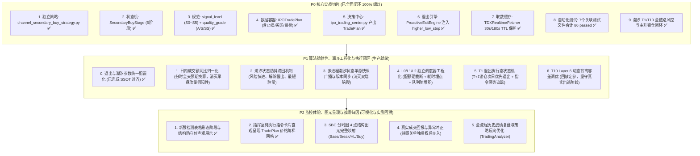

# 【实战优化版实施方案】新股检测中心与集中交易决策中心：长期通道底部结构次级买点最小可跑闭环 (P0~P2 裁剪)

> **方案性质**：根据操盘手实战反馈深度收敛的工程落地实施方案  
> **更新日期**：2026-09-21
> **对齐原则**：**拒绝大而全的单次冒进，以“强信号落地 TradePlan + 退出引擎保护”作为明天可跑的 P0 最小切片，P1/P2 渐进演进**。
> **实现基线（SSOT）**：后续规格一律以当前已通过回归测试的生产代码为准；计划书不再维护与代码并行的第二套阈值。现存硬编码参数先原样纳入统一配置，再通过历史回放与盘中观测调整。

---

## 一、 操盘手实战修正破案与方案收敛

针对初始蓝图在实战落地中的 5 个潜在风险点，本方案进行硬核收敛与重构：

| 序号 | 初始蓝图风险点 | 操盘手实战纠偏 | 本方案收敛落地规范 |
| :--- | :--- | :--- | :--- |
| **1** | **L0 100ms 目标偏激进**，极易引发 Windows / pytdx / Qt 线程抖动 | 降速保稳，杜绝主线程与网络拥堵 | **L0**：收敛至 `1s ~ 3s` 一轮（全市场/监控池盘口轻筛）<br>**L1**：`15s ~ 30s` 一轮（候选池 60F/日K 通道状态机）<br>**L2**：秒级/Tick 驱动，**严格仅对 5~10 只强候选** 深度确认 |
| **2** | **`signal_tier` 与 `S0~S5` 字段冲突**，导致排序与风控混乱 | 统一为双层正交维度，禁止混淆 | **`signal_level`**：`"S0"` ~ `"S5"`（生命周期流转层级，仅 S4/S5 允许交易）<br>**`quality_grade`**：`"A"` \| `"S"` \| `"SS"`（形态质量评分评级） |
| **3** | **首日新股与通道次级买点混淆**，两者的实战风控边界天差地别 | 结构共用 TradePlan，但策略 Tag 严格正交隔离 | **`IPO_BID_SURGE`**：首日竞价/早盘抢筹<br>**`IPO_VWAP_STABLE`**：首日/次日 VWAP 承接<br>**`SUBNEW_PULLBACK_REENTRY`**：次新缩量回踩再买点<br>**`CHANNEL_SECONDARY_BUY`**：长期通道底部次级买点 |
| **4** | **直接做全仓轮动换马风险极高**，未经过 paper 验证严禁实盘 | 严禁自动化全仓调仓换马，收敛指令类型 | 明天实盘指令收敛为 3 种：<br>① `BUY_SCOUT`（探路轻仓 30%）<br>② `BUY_CONFIRM`（站稳加仓 30%）<br>③ `EXIT_ALL`（保护触发全清）<br>`FULL_ROTATION_SWAP` **仅作为界面战术建议展示，绝对不自动下单**！ |
| **5** | **UI与图元全量改造过重**，挤占核心交易逻辑的稳定性验证 | 核心交易闭环 P0 优先，UI 图元降为 P2 | 先把 **强信号 $\rightarrow$ TradePlan $\rightarrow$ 退出保护** 跑通；SBC 4 点图元与指挥室美化放 P2 |

---

## 二、 P0 / P1 / P2 演进路线规划 (结合生产稳定性深度重构)



---

## 三、 潮汐状态机 T1 / T10 战略闭环规格 (2026-09-21 落地)

### 1. T1（高潮派发 `T1_CLIMAX_DISTRIBUTION`）自上而下风险出局
- **买入硬门禁**：在 `_can_execute_buy` 准入第一道防线与 `T4_PANIC_ACCEL` 并列为不可逾越的绝对红线，拒绝普通买入与外部信号注入；
- **全仓轮动阻断**：生成端与撮合执行端双层封死轮动买入，严防借轮动买入新标的；
- **组合级降维清仓/锁盈**：
  - 非核心持仓：一律发出 `EXIT_ALL`（100% 清仓）；
  - Rank 1 且 SSS 核心龙头：发出 `REDUCE_HALF`（减半），锁定利润转入防守；
- **A股 T+1 物理锁合规**：当日买入新仓受 `record_order_execution` 物理锁保护，绝不违规下发非法平仓。

### 2. T10（主升浪 `T10_MAIN_UP`）核心龙头锁仓与严苛换马
- **SSS 龙头洗盘误杀豁免**：
  - 在 `ProactiveExitEngine` 注入潮汐状态与龙头身份；
  - 仅对经新鲜市场快照确认的 SSS 唯一龙头，豁免 Layer 1（时间衰减）与 Layer 5（盘中震荡不创高）减仓误杀；
  - 结构止损（`higher_low_stop`）、跌破大平底与 VWAP 严重破位等绝对硬底线依然 100% 生效；
- **严苛换马准入**：换入新标的必须满足 **Rank 1、SSS 梯队、动能分 $\ge 90$**，且动能分超越旧仓 $\ge 25$ 分。

---

## 四、 P0 核心技术规格与数据结构规范

### 1. 字段命名与分级双层正交规范
彻底废弃不规范的自由文本，统一为严格的枚举与类型定义：
- **`signal_level`（信号生命周期层级）**：
  - `"S0"`：背景噪声（长期下行或继续破位）
  - `"S1"`：异动初现（脉冲放量但未脱离下轨）
  - `"S2"`：蓄势观察（首阳试盘突破，进入回踩观察）
  - `"S3"`：预备就绪（地量缩量回踩完成 Higher-Low 抬升）
  - `"S4"`：**可交易买点**（分时放量站上 VWAP 并突破次级确认线，触发生成不可变 `TradePlan`）
  - `"S5"`：**可执行指令**（通过 T+1 追高禁令、大盘情绪配额校验，正式生成开仓指令）
- **`quality_grade`（形态质量评级）**：
  - `"A"`：标准形态，盈亏比 $\ge 2.5:1$
  - `"S"`：优质形态，大平底收敛 + 长期通道走平 + 盈亏比 $\ge 3.5:1$
  - `"SS"`：极品形态，多周期（60F+日K）共振突破 + 底部地量九转 + 板块共振

---

### 2. 标准不可变 `IPOTradePlan` 数据容器规范
```python
@dataclass
class IPOTradePlan:
    plan_id: str                      # 唯一编号，如 TP_688826_20260919_093201
    code: str                         # 股票代码
    name: str                         # 股票名称
    strategy_tag: str                 # "CHANNEL_SECONDARY_BUY" | "SUBNEW_PULLBACK_REENTRY" | "IPO_VWAP_STABLE" | "IPO_BID_SURGE"
    signal_level: str = "S4"          # "S4" | "S5"
    quality_grade: str = "S"          # "A" | "S" | "SS"
    
    # 价格执行网络
    trigger_price: float = 0.0        # 次级买点确认触发价
    buy_zone_min: float = 0.0         # 买入区间下限 (回踩均线支撑)
    buy_zone_max: float = 0.0         # 买入区间上限 (严禁追高超幅 1.5%)
    
    # 结构防守与止损铁律 (严格溯源开仓形态，注入 ProactiveExitEngine)
    higher_low_stop: float = 0.0      # 核心防守位：次级回踩低点 (跌破即说明买点错误，立斩出局)
    base_low_invalid: float = 0.0     # 终极失效位：底部大平底最低价
    hard_stop_loss_pct: float = 2.5   # 极窄风险兜底 (最大亏损不超过 2.5%)
    
    # 盈利目标阶梯
    target_1_channel_mid: float = 0.0 # 目标 1：长期通道中轴/上轨 (减仓 30% 并抬保本线)
    target_2_swing_high: float = 0.0  # 目标 2：前期波段高点 (减仓 40% 留底仓趋势跟踪)
    
    # 执行建议 (明天收敛为单向仓位，禁止自动换马)
    suggested_action: str = "BUY_SCOUT" # "BUY_SCOUT" (30%) | "BUY_CONFIRM" (30%)
    position_pct: float = 30.0        # 建议单笔仓位百分比
    expire_at: str = "14:45:00"       # 计划失效截止时间
```

---

### 3. `ProactiveExitEngine` 注入与动态保护闭环
退出引擎在接收 Tick 或每秒轮询时，直接调用绑定的 `TradePlan`。以下数值以当前生产代码为唯一基线，后续通过 P1-00 迁入统一配置，不再在文档中另设一套阈值：

1. **TradePlan 防守价生成**：`higher_low_stop = Higher_Low × 0.992`；
2. **买错立斩**：当 `Price < higher_low_stop × 0.99` 时触发 `exit_higher_low_broken`，发出 `EXIT_ALL`；
3. **保本推移**：触及 `target_1_channel_mid` 后，将动态防守线至少提升到 `entry_price × 1.002`（成本线上方 0.2%）；
4. **时间衰减**：当前默认参数为持仓 20 分钟且涨幅不足 0.3%时减半，持仓 30 分钟仍未脱离成本区时清仓；实际取值由 `VWAPRuleModel` 配置读取；
5. **T10 龙头保护**：仅经交易中心新鲜市场快照确认的 SSS Rank 1 龙头豁免 Layer 1 与 Layer 5；结构止损、派发、背离、大周期转弱及 VWAP 破位仍保持生效。

> **参数治理原则**：P1-00 只把上述现有行为迁移为统一配置并补充配置快照、版本与测试，不在同一任务中顺带修改策略阈值。阈值优化必须另行通过历史回放和至少 2~3 个真实交易日观测后审批。

---

## 五、 P0 实施落地成果 (100% 达成)

### Step 1: 新增独立策略文件 `ats/strategy/channel_secondary_buy_strategy.py` [已完成]
- **职责**：只做形态数学计算与状态机推演，输入清洁 K 线（60F / 日K / 分时），输出结构字典；
- **核心类与函数**：
  - `SecondaryBuyStage`：定义 6 大状态；
  - `evaluate_channel_secondary_buy(df_60m, df_day=None, current_quote=None) -> Dict[str, Any]`；
  - 计算通道走平斜率、平底箱体 $Base\_Low$、首阳突破价 $First\_Break$、次低点 $Higher\_Low$ 与次级买点确认。

### Step 2: 扩展 `ats/strategy/ipo_trading_center.py` 生成与管理 TradePlan [已完成]
- 在 `IPOTradingCenter` 中增加 `create_trade_plan_from_signal(...) -> IPOTradePlan`；
- 将 `signal_level` 与 `quality_grade` 规范化；
- 生成指令时发出 `BUY_SCOUT`、`BUY_CONFIRM` 或 `EXIT_ALL`；`FULL_ROTATION_SWAP` 仅在严苛条件（Rank 1、SSS、动能分不低于 90、旧仓落后至少 25 分）满足时生成战术建议，自动跟随交易明确跳过，仅允许用户手工确认，且手工执行仍受潮汐、快照与组合仓位闸门约束。

### Step 3: `ats/proactive_exit_engine.py` 挂接 TradePlan 结构防守与 T10 龙头锁仓 [已完成]
- 在 `evaluate_tick()` 中支持读取 `extra_ctx["trade_plan"]` 或 `extra_ctx["higher_low_stop"]`；
- 跌破回踩低点触发主动外科手术式止损；
- 支持 `T10_MAIN_UP` 潮汐下经新鲜快照确认的 SSS 龙头豁免 Layer 1 与 Layer 5 震荡洗盘误杀。

### Step 4: `ats/tdx_realtime_fetcher.py` 缓存与调用安全加固 [已完成]
- 为 `fetch_kline_bars()` 的 60F 设定 30 秒内存 TTL 缓存，日K 设定 180 秒内存 TTL 缓存；
- 确保高频调用时不引发重复网络请求与主线程阻塞。

### Step 5: 全量自动化测试套件构建 [已完成]
- `tests/test_channel_secondary_buy_strategy.py` 当前覆盖 39 项专项用例；潮汐、事件情绪、交易中心、历史回放、主动退出与 SBC 反转等 7 个关联测试文件合计 **86 passed**；
  - 测试下降通道企稳、平底形成、首次突破不买、缩量回踩抬高、放量突破触发 S4/S5；
  - 测试破位创新低直接流转至 `INVALIDATED`；
  - 测试 `IPOTradePlan` 生成与字段完整性；
  - 测试 `ProactiveExitEngine` 跌破 `higher_low_stop` 触发止损与 T10 龙头锁仓保护。

---

## 六、 计划书后续重点推进任务清单 (P1 / P2)

### 1. P1 阶段：算法稳健性、漏斗工程化与执行状态机（生产核心保障）

| 任务编号 | 核心任务 | 影响范围 | 目标与实施要点 |
| :--- | :--- | :--- | :--- |
| **P1-00（已完成）** | **现有退出与潮汐参数统一配置化** | `vwap_rule_model.py`, `proactive_exit_engine.py`, `subnew_tide_state_machine.py` | 已按生产基线建立 `TradePlanDefaultsConfig` 与 `SubnewTideThresholdsConfig` 并在 JSON 中持久化；支持范围边界校验、热重载与运行时快照序列化；单测 100% 通过。 |
| **P1-01** | **日内成交额同比分时归一化** | `subnew_tide_state_machine.py`, `ipo_market_sentiment_engine.py` | 基于历史分时累计成交占比曲线，将当前累计成交额投影为全天预期成交额；显式处理开盘集中成交、午间休市和尾盘放量，避免使用简单“已过分钟数比例”制造新偏差。 |
| **P1-02** | **潮汐状态防抖与滞回机制 (Hysteresis)** | `subnew_tide_state_machine.py` | 针对 T1/T2、T9/T10/T11 设计进入/退出双门限；风险升级采用 1~2 帧快速确认，风险解除采用 3~5 帧慢确认，并设置最短驻留时间；硬破位允许跳过驻留直接升级风险。 |
| **P1-03** | **多进程潮汐状态单源快照广播** | `ipo_market_sentiment_engine.py`, `ats/ui/` | 确立唯一生产者，快照携带原子 `version_id`、交易日、生成时间与 TTL；GUI/Worker 只订阅消费，并定义断线、陈旧快照、跨日复位和恢复后的降级策略。 |
| **P1-04** | **L0/L1/L2 漏斗调度完全工程化** | `ipo_vwap_detector_engine.py` | 设置候选硬配额（监控池 $\to$ 30 $\to$ 5~10）、各层耗时与输入/输出数量埋点、Latest-only 任务折叠、防堆积、超时与行情陈旧降级熔断。 |
| **P1-05** | **T1 退出执行态状态机闭环** | `ipo_trading_center.py` | 补齐 `PENDING_NEXT_DAY_EXIT`、次日集合竞价/开盘优先退出、部分成交/拒单/未成交重试、同一潮汐周期幂等，以及实际仓位达到目标后的完成确认。 |
| **P1-06** | **T10 Layer 6 动态背离容差调优** | `proactive_exit_engine.py` | 不直接硬改单一百分比；结合龙头历史波动率、VWAP位置、盈利垫、DFF恶化持续时间和是否放量下跌，通过回放确定动态容差，既减少洗盘误杀又保留真实出逃识别。 |

### 2. P2 阶段：可视呈现、图元映射与全流程归因（交互与复盘）

| 任务编号 | 核心任务 | 影响范围 | 目标与实施要点 |
| :--- | :--- | :--- | :--- |
| **P2-01（已完成）** | **检测中心表格呈现形态阶段与关键位** | `ats/ui/ipo_subnew_detector_dialog.py` | 已展示形态阶段、结构防守、买入网格、抬高底和失效位；后续仅做视觉验收与小幅排版优化。 |
| **P2-02（已完成）** | **指挥室待执行指令卡片直观呈现 TradePlan** | `ats/ui/ipo_command_room_dialog.py` | 已展示买入网格、防守位、失效位、目标1与目标2；后续仅补充视觉验收。 |
| **P2-03** | **SBC 分时图 4 点结构图元完整映射** | `ats/ui/intraday_strategy_dialog.py`（当前 `SBCChartCanvas` 所在文件；实施前可评估拆分独立画布模块） | 精准渲染 Base_Low（绿虚）、First_Break（橙点划）、Higher_Low（黄粗）、Secondary_Buy（红箭）4 点坐标，并覆盖缩放、切周期、空数据与窗口重绘测试。 |
| **P2-04** | **真实成交回报与异常冲正 (预留接入点)** | `ats/trade_gateway.py` | 严格在模拟盘验收后，逐步对接实盘滑点控制、一字板被拒处理与异常冲正逻辑。 |
| **P2-05** | **全流程多账户历史战绩复盘归因图表** | `ats/strategy/trading_analyzer.py` | 历史次级买点、T1 高潮离场与 T10 主升锁仓的胜率、盈亏比与回撤归因统计。 |

### 3. 实施顺序、工期与验收节奏

| 批次 | 实施内容 | 预计工程工时 | 验收要求 |
| :--- | :--- | :---: | :--- |
| **批次 A（规格与算法基础）** | P1-00、P1-01、P1-02 | 12~22 小时 | 参数迁移前后行为等价；历史前缀回放无未来数据；边界抖动显著下降且风险升级不迟滞。 |
| **批次 B（执行安全）** | P1-05 | 8~14 小时 | T+1 锁仓、次日优先退出、部分成交/拒单重试与幂等全部有状态迁移测试。 |
| **批次 C（架构工程化）** | P1-03、P1-04 | 24~40 小时 | 单源快照无脑裂；L2 永不超过 10 只；高频行情下无队列堆积，超时可降级。 |
| **批次 D（策略调优）** | P1-06 | 4~8 小时，另需 2~3 个交易日观察 | 回放指标优于现基线，且真实出逃召回率不得明显下降。 |
| **批次 E（可视化与归因）** | P2-03、P2-05 | 20~34 小时 | 图元视觉回归通过；历史统计可按策略Tag和潮汐状态追溯。 |
| **独立受控批次** | P2-04 真实成交网关 | 16~32 小时，另需 5~10 个交易日模拟盘 | 必须单独授权；覆盖部分成交、拒单、撤单、滑点、一字板及异常冲正，未验收不得进入实盘。 |

**总体估算**：P1 完整生产保障约 6~10 个工作日；P1 加 P2-03/P2-05 约 9~14 个工作日。真实网关不计入上述周期，必须作为独立安全项目推进。

**推荐顺序**：P1-00 → P1-01/P1-02 → P1-05 → P1-03/P1-04 → P1-06 → P2-03 → P2-05 → P2-04。

---

## 七、 总结与执行原则

本方案严格遵守全局规则：
1. **简单至上 (KISS) & 坚实基础 (SOLID)**：以单源状态广播和独立调度器解耦模块，消除跨进程状态冲突；
2. **安全至上**：真实网关保持隔离，风控铁律与执行状态机先行在虚拟账本完成 100% 验收；
3. **代码为唯一事实源**：参数默认值、运行时配置快照和测试断言共同构成 SSOT；计划书只描述当前事实与审批后的演进目标；
4. **参数迁移与参数调优分离**：先保证配置化前后行为完全等价，再使用历史回放与真实交易日观测独立审批阈值变更；
5. **可观测与可解释**：各层漏斗耗时透明化，状态转移有因可查，图元直观印证决策。
