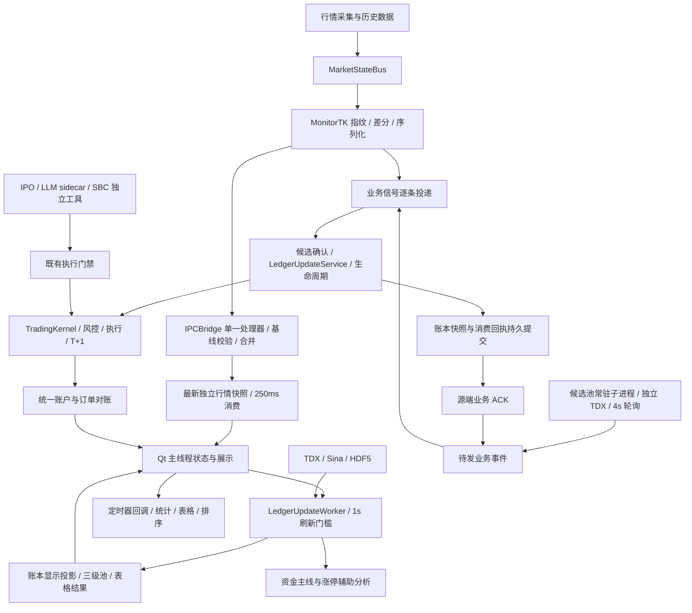

# ATS 全系统架构与极限性能优化实施方案

日期：2026-10-03（香港时间）。审查基准：`a58d053ef88e` 及当时工作区源码。

**结论：优先优化 IPC 宽差分逐列合并、GUI 同步 I/O、锁内网络等待和计算生命周期；随后减少宽表对象展开、重复统计与无效排序。共享内存、增加连接、全面更换表格框架均须由实测瓶颈决定。**

初始方案完成源码审查、隔离回归和离线合成测量；后续生产实现及尚未关闭的验收项见第 9 节。业务不变由逐事件回放、风控/账户对账、持久提交与故障恢复共同验收，不能仅凭单测或局部加速宣称全系统闭环。

### 首批实施记录（2026-10-03）

- 已修改 F14 锁获取路径：`lock_timeout`（默认 20s）控制单次获取总等待，使用单调时钟；仅锁创建竞争重试，路径/权限等创建错误及时返回既有异常处理链。超时不删除其他活跃进程锁，同进程嵌套引用计数保留。这不是整个 HDF 任务的总期限。
- 回放测试固定输入指标，禁用启动时真实历史预热，显式 OBSERVE，隔离状态/账户/对账目录；篡改检测从逻辑归档读取记录并写入独立样本。验证的是冻结特征下的决策回放，不覆盖真实历史补载等价。
- 本批定向回归 47 项通过：HDF 获取期限/多表保留、两项回放、TK 红线/T+1、信号、次日候选契约和 PAPER 指令链。测试源码被当前 Git 忽略规则忽略，交付时须单独纳入版本管理。
- 尚未完成：TDX 冷启动测试隔离、扫描遗留线程排查、端到端基线、IPC/GUI/网络优化、EXE 与 72h 验收；原有微基准仍为优化前证据。

## 1. 当前架构与已完成优化

- 已存在：IPC 单处理器和有界连接队列、行情最新帧合并、主计算防重入、候选池常驻 spawn 进程、公式单 Worker 与代际校验。
- 已存在：候选池一次投影、表格 item 复用和脏检查、表头异步写入器、归档有界缓存、历史补载退避、TDX 扫描门闩及部分结果标识。
- 正常 IPC 入口 `_queue_latest_ipc_frame` 把 Bridge 已合并快照标为 `UPDATE_DF_ALL`；不能把兼容 diff 分支误判为正常路径每帧二次合并。
- 基准节拍：IPC 消费 250ms、Ledger 刷新至少间隔 1s、次日候选轮询 4s；优化默认保留，展示提速单独验收。新股面板的既有限频也保留。
- GUI、Ledger Worker、TDX 扫描、次日进程、IPO/LLM/SBC 和 TK 必须按进程树统计；单进程 CPU/RSS 降低不等于系统收益。

## 2. 本轮证据与性能基线

### 2.1 环境及回归状态

| 项目 | 本轮结果 | 证据边界 |
| --- | --- | --- |
| 默认解释器 | Python 3.9.13 / pandas 1.4.4 / NumPy 1.21.0 / PyQt6 6.6.1 | 下表在此环境测量 |
| 构建脚本默认专用环境 | Python 3.9.13 / pandas 1.4.4 / NumPy 1.23.5 / PyQt6 6.6.1；没有 pytest | 构建入口为 `run_ats.py`；须在实际构建环境和 EXE 重测，不能套用开发环境耗时 |
| 性能与缓存相关回归 | 64 passed，1 deselected，8.00s | 六个已有测试文件；离线 Qt、缓存、不可变发布、幂等及候选投影 |
| 未通过用例 | `test_hot_sector_leaderboard_cold_start_off_hours` 在首次联跑返回空表 | 未完整 mock TDX，连接失败；需隔离数据源后重测，不能宣称全部绿灯，也不能仅据此归因生产缺陷 |
| 业务与 IPC 契约回归 | 54 passed，3.74s | 七个已有测试文件；冷启动/跨日、指纹、信号、PAPER 指令、红线、T+1；未包含下述回放文件 |
| 回放阻塞 | 八文件联跑完成前 42 项后停滞超过 9 分钟；隔离首个回放用例 20s 栈转储仍停滞 | `test_replay_equivalence_flow` 进入真实历史补载，在 `SafeHDFStore._acquire_lock:817` 的锁文件创建失败重试处等待；第二个回放用例未执行，不能认定回放等价通过 |
| 运行态基线 | 尚缺交易时段端到端 P95/P99、真实 paint、72h 资源趋势和当前 EXE 对照 | 周末离线测量不替代完整有效交易会话 |

首次 pytest 启动因 `TEMP=G:\Temp` 的路径解析失败；改用本次新建的工作区临时目录后运行成功。首次联跑另记录到扫描回调 `release unlocked lock`：现有测试 `tests/test_ats_optimization_review.py:811` 会直接释放共享门闩，生产回调在 `ats/channel_bottom_reversal_strategy.py:899` 随后释放；Stage 0 必须排查测试遗留线程/隔离问题并做确定性复现，本轮未证实生产重复释放。

两批完整通过的回归合计 118 项；1 项 TDX 依赖用例未通过，回放文件未完成。隔离回放调用链为 `kernel_service.evaluate_decision_item:1361 → get_tdx_Exp_day_to_df → multiday_feature_store:309 → SafeHDFStore.__init__:420 → _acquire_lock:817`；该路径对锁创建 `OSError` 和有效锁等待都没有总期限，`lock_timeout:351` 仅为兼容参数。此处证实无界等待路径，尚未区分原始文件创建错误的具体原因，不称为已证实死锁；测试必须注入固定历史数据、OBSERVE 模式和独立持久目录。

本轮未记录各次测量的后台负载；收尾时发现并行 Nuitka 构建及长期运行 Python 进程。因此微基准用于定位局部热点，最终比较需在受控负载下复测。

### 2.2 当前生产 IPC 接收方法的离线探针

命令：`python -X utf8 scripts/ats_architecture_perf_probe.py`。执行当前 `IPCBridge` 原生方法；内存连接替代 socket，交易时段判定固定为有效，ACK 和全量重请求替代为本地回调；3 次预热、101 次测量，差分覆盖 1% 行。

| 行数 × 总列数 | 包类型 | 序列化载荷 | 接收处理 P50 | P95 | 最大值 |
| --- | --- | --- | --- | --- | --- |
| 1,000 × 128 | full | 1,043,978 B | 4.903ms | 6.387ms | 7.238ms |
| 1,000 × 128 | diff，12 数值列 | 1,937 B | 11.738ms | 16.787ms | 17.888ms |
| 1,000 × 128 | diff，126 数值列 | 12,449 B | 120.549ms | 350.010ms | 549.593ms |
| 5,000 × 128 | full | 5,210,690 B | 24.786ms | 31.289ms | 37.061ms |
| 5,000 × 128 | diff，12 数值列 | 6,137 B | 14.071ms | 20.643ms | 22.279ms |
| 5,000 × 128 | diff，126 数值列 | 53,129 B | 116.837ms | 158.970ms | 246.093ms |
| 10,000 × 128 | full | 10,419,077 B | 48.228ms | 60.141ms | 70.141ms |
| 10,000 × 128 | diff，12 数值列 | 11,387 B | 16.864ms | 26.493ms | 47.864ms |
| 10,000 × 128 | diff，126 数值列 | 103,988 B | 122.806ms | 144.926ms | 177.697ms |

- **确认的局部热点**：宽差分的 Python/Pandas 逐列索引、掩码与赋值成本明显；5,000 行场景本地处理约为 full 的 4.7 倍，载荷约为 full 的 1/98。
- 这不是“所有行情改发全量”的依据；优化比较 `生成差分 + 序列化 + 传输 + 合并 + 发布` 的总成本，兼顾网络、CPU 和新鲜度。
- 计时包括内存收包、反序列化、规范化、合并及发布回调；包生成、初始缓存建立不计时。没有真实网络、ACK 管道、GUI、生产者计算和屏幕绘制，也没有候选优化后的对照。
- 探针对结果值、形状和已发布快照独立性做断言；跨日、空值、MultiIndex、重连及事件语义由契约测试另验。101 个样本不用于承诺稳定 P99，1,000 行宽差分的尾部波动须复测。

### 2.3 已完成候选池优化复测

`python -X utf8 scripts/ats_stage0_projection_benchmark.py`：5,000 行 / 30 候选，旧式重复查找 P50 98.734ms，一次投影 12.746ms，局部 7.75 倍；10,000 行 / 30 候选为 190.899ms → 19.267ms，局部 9.91 倍。

此优化已经存在，不能再次列为本轮待落地收益。脚本每项只有 7 次样本且只比较部分输出字段；业务等价依靠相关回归补充，不使用其 P95/P99 作为尾延迟结论。

## 3. 当前损耗点、改法与保护条件

优先级：P0 为实施前硬门槛；P1 为首批消耗/阻塞治理；P2 为随后优化；P3 仅在实测满足准入条件时实施。静态发现证明路径存在，实际耗时占比仍需 Stage 0 采样。

下表 `main_window.py` 指 `ats/ui/main_window.py`，UI 面板文件位于 `ats/ui/`；`sina_data.py` 位于 `JSONData/`，`instock_MonitorTK.py` 与 `market_state_bus.py` 位于项目根目录。

| ID / 优先级 | 当前源码证据 | 实施动作 | 不变契约与验收 |
| --- | --- | --- | --- |
| F01 / P1 | `ats/ipc_bridge.py:326–346` 对每列重复 `.loc`、`notna`、索引提取，再深拷贝完整缓存；离线宽差分约 117ms | 行/列位置一次对齐；按 dtype 分组处理数值变化块，对象/异常列沿用回退；结构变化仍 full，复制优化后置 | 逐字段比对；非空→空由 TK full 回退；保持新列、新代码、异常回退、基线/version/ACK 和发布隔离 |
| F02 / P1 | `main_window.py:5191/5207 → 5715–5770` 的 Alpha 回调同步 `exists/listdir/copy2`，首轮/跨日 `evaluation_store.read` 可冷读 | 历史迁移和预加载移到后台一次性任务；GUI 只提交必要的轻量事件，去重/报警沿用同一有序消费逻辑 | 首次信号不能被初始化丢弃；旧档迁移失败可重试；报警门槛与去重输出相同 |
| F03 / P1 | `main_window.py:3553` 切 Tab 调用同步 `save_config_node`；`styles.py:1080` 直接进入同步 `save_config_nodes` | 复用已有 `save_config_nodes_async`，合并同键更新，失败可见；接入退出统一 drain | 不新增写入器；保留跨进程锁、最终 Tab 与布局、提交失败恢复 |
| F04 / P1 | `main_window.py:4779–4838` 持 `hdf5_history_lock` 调 `Sina.get_stock_list_data`；`sina_data.py:1870/1904` 内含 HDF 读取和未设 timeout 的 `requests.get` | 在实际 HDF 调用边界加锁，网络在锁外；补连接/读取超时和整个任务期限，按标的合并在途补载 | 不能直接删锁：readonly 仍读 HDF；保持既有单位/缓存/失败结构和 30→60→300s 退避，超时不能伪造成功或 0 价 |
| F05 / P1 | `tdx_realtime_fetcher.py:3052–3068` 一次持连接锁处理多个 40 只批次，包含连接和网络；K 线消费者亦共享该锁 | 先统计锁等待/持有/请求；每进程复用一个有界调度者，合并相同在途请求，批次间提供公平调度点 | 不并发操作同一 API socket；保留 force、交易日、精确截止时刻、真实报价推进和供应商反馈；额外连接后置 |
| F06 / P1 | `main_window.py:4588–4607` 的直方图 `pd.cut/value_counts/sum/mean` 由 GUI 定时器执行；`5054–5156` 主线程仍逐池取行和刷详情 | 统计移到现有后台计算/纯投影任务，同版本共享一次；主线程提交小结果，按时间片更新可见详情 | 定时器延期不等于线程转移；所有 Qt model/widget 更新留在 GUI，统计分桶/边界/空值相同 |
| F07 / P2 | `LedgerUpdateWorker.run:141/153` 重复规范化 code，并把候选子集的全部列 `to_dict('index')`；每轮重建多标的 MA/历史数组 | 已规范化索引快速通道；列依赖清单加动态列；仅投影必需字段，缓存稳定历史前缀，更新未完成 bar | 这里是候选子集，不能声称全市场逐股字典化；持仓/收藏/真龙准入、历史修订/复权/空值/动态列和同价新量不能遗漏 |
| F08 / P2 | `main_window.py:510–519` results 发出后仍运行资金主线/天梯；busy 到 `finished:5183` 才清除。资金面板 `capital_dragon_panel.py:544` 缓存未命中亦发起分析 | 分阶段计时；缓存结果按输入/配置/日期版本命中，资金分析单在途任务共享结果，前台投影与辅助完成分别治理 | 引擎已有 1s 缓存，不能断言每次都重算；时间驱动状态不能仅按行情 dirty 跳过；确认辅助分析无交易副作用后才允许折叠 |
| F09 / P2 | `market_state_bus.py:58–74` 锁内复制最多四张表；Bridge `238/346/353` 复制，GUI `4489/4492` 再规范化索引 | 先冻结发布所有权；独立快照在安全位置构建后短锁换引用；建立规范化版本标识；统计每环节复制估算字节 | pandas 1.4 浅拷贝共享块，不能直接删 deep copy；检查所有消费者写入、对象列嵌套对象与活跃版本驻留，慢读者不得读到未来帧 |
| F10 / P1 | `next_day_watch_process.py:222–258` poll/snapshot/ACK 共用一把 request 锁；120s 截止在 `Connection.send` 后才建立 | 界定排队+发送+处理+返回总期限；限定载荷和展示请求数量；有界优先排队 ACK，超时恢复读取持久待发 | 单进程串行通信仍保留；运行中的网络请求不能被排队优先级抢占；只能在回执与账本真正提交后 ACK，不缩短归档政策来刷指标 |
| F11 / P2 | `_persist_next_day_receipts:5899 → session_snapshot.py:142/113–124` 在调用线程深拷贝所有 entries 后才起写线程；Ledger/GUI 还共享可变池对象 | 明确状态写者，生成一致业务快照/只读池投影；仅纯展示增量化；单在途写任务与最新待处理合并 | 不能把捕获直接扔到线程造成撕裂；业务回执不可丢；基线/订单/事件恢复完整，版本结果过期只丢展示，不丢事件 |
| F12 / P2 | `swing_table.py:318/353` 已跳过无变化整批及单元格，变化批仍扫描全表；`universe_widget.py:779/793–805` 每轮同步子树、排序、找选中行 | changed codes/fields 增量投影，复用 code→item 映射，仅排序键/集合变化才排序，隐藏页记最新版本 | 保留数值排序、稳定次序、筛选/导出、选择/滚动/列宽；屏外数据继续参加业务、排序和导出 |
| F13 / P2 | `main_window.py:6956–7295` 关闭路径仍有强制快照、总结、缓存 flush 和若干 wait；`ats/main_ats.py:90` 使用 `os._exit`，入口清理不一致 | 显式退出状态机：停输入→必要状态捕获→后台持久 drain→回收资源→退出；两个入口一致验证 | 必要事件/订单不可因追求快速关闭被丢弃；所有 wait 共用总截止，失败留下可恢复状态，晚到 Qt 信号安全 |
| F14 / P1 | `kernel_service.py:1361` 冷指标补载进入 `SafeHDFStore`；`tdx_hdf5_api.py:741–817` 无限循环等待锁/创建失败，`lock_timeout:351` 不控制总等待；隔离回放栈实测停滞 | 单独定义锁获取总期限与可重试错误；目录/权限错误及时返回既有失败结构；历史补载提前后台化，交易决策读取已冻结指标 | 禁止以超时为由删除存活进程的锁或绕开 HDF 互斥；未得到必需指标沿用缺失/拒绝门禁，不能以默认值放行；历史时点、回放和风控结论保持 |

### 3.1 极限优化的条件准入

- **生产者指纹/compare**：`instock_MonitorTK.py:9483/9611` 有全表指纹、空值扫描和 compare；先测占比，后按共享源版本/依赖列避免重复。任何名称、静态分类、日线/分时变化仍应广播；优先复用现有 `tk_frame_fingerprint` 契约。
- **协议自适应**：依据行数、变化列数、结构变化和同机成本模型选 full/diff，加入迟滞；接口与旧客户端兼容。基准只说明宽差分可昂贵，不是改协议的充分证据。
- **纯计算进程**：仅当 GIL/CPU 竞争实测主导 GUI P99，且 `打包+传输+计算+回传+提交` 优于 QThread 时，迁移无副作用函数；状态/账本/执行归现有权威写者。使用常驻 spawn 工作者，限定 NumPy/BLAS 内部线程总量。
- **Model/View**：先完成 item 复用、增量字段和选择性排序；大表真实 paint 仍超过预算才迁移一个面板，不全面改 UI。
- **共享内存/第二数据通道/连接池扩容**：仅当序列化/传输/队首阻塞分别被证实主导时准入；先验证版本、租约、崩溃、旧读者与 Windows 句柄回收，避免高成本架构迁移收益被 IPC/运维消耗抵消。

## 4. 业务逻辑不变的硬门槛（P0）

| 边界 | 必须保持的行为 | 验证方法 |
| --- | --- | --- |
| 行情与业务事件 | 仅展示快照可 latest-only；确认帧、业务事件、指令、回执逐项保序和幂等，队满不能静默丢失 | 固定输入序列，逐事件比对状态、输出及拒绝原因；过载事件落持久待发并可恢复 |
| 候选确认 | 盘前 seed、重复/乱序报价、两帧确认、4s 节奏、间隔重置和跨日规则相同 | `test_signal_pipeline_hardening`、`test_next_day_watch_contract` 加真实入口回放 |
| 数据所有权 | 当前发布版本永不被后续 diff、缓存回写、历史补齐污染 | 慢读者与快写者并发；冻结旧帧，在后续更新/异常/重连后逐字段比较 |
| 数据口径 | code/索引、dtype、动态列、NaN/None、价格/量额单位、VWAP 真值及缺失、复权和截止时点相同 | 黄金样本覆盖空值逆转、MultiIndex、新/删行列、同价新量、当前 bar 修订；不得用 0 代替缺失 |
| 信号和风控 | 相同顺序输入产生相同信号、报警、生命周期、优先级、门禁、撤销/拒绝、T+1 可卖量 | 冻结交易时钟、配置、随机因素；触发阈值两侧样本；分支结果要求完全一致 |
| 资金和执行 | TK 是执行/账户权威；ATS 读取统一账户并经既有门禁提交，持仓/订单/费用/现金一致 | `test_g07_paper_directive_link`、TK 红线/T+1/回放/对账；隔离 PAPER 双运行比较，禁止影子副本向生产执行通道重复提交 |
| 持久交付 | 通知入队≠业务提交；持久回执+账本提交成功后 ACK，失败重试、不重复执行 | 提交前/提交后/ACK 前崩溃恢复，磁盘锁、写失败、重复包；与 outbox/订单逐项对账 |
| 时间与缓存 | 交易日/午休/盘后/历史回补/配置和策略版本均参与失效；延迟到达不覆盖新代际 | 明确缓存键：标的、周期、复权/单位、截止、源版本、交易日、配置版本；保留既有容错门槛 |
| 工具与生命周期 | 隐藏/切页只减少绘制，持仓风险和业务观察持续；IPO/LLM preflight 和执行门禁不变 | 全部工具开关、慢 Worker、窗口销毁/重开、spawn、停止/重启和晚到结果 |

价格、数量、金额和执行结论按现有精度精确比较；仅允许不影响任何阈值分支的纯分析浮点量设置预先固定的误差界。性能不能通过减少观察对象、丢确认帧、放宽门禁、改变缓存新鲜度或保留期换取。

## 5. Stage 0：端到端测量设计与目标

### 5.1 每帧、每任务与每事件的关联

- 行情：`sync_session/source_version/ver/trade_date` 贯穿生产、接收、状态更新、Worker 和展示结果；保持公开信号签名兼容，可由 Worker 元数据关联。展示过期结果可弃，相关业务事件独立处理。
- 事件：`event_id/directive_id/order_id` 贯穿产生、排队、消费、回执提交、源 ACK、执行与对账；记录故障后的重放次数和去重结果。
- 同机阶段用 `perf_counter_ns`；源报价时间和接收时间同时保留，分别报告源数据年龄与内部延迟。跨进程记录时钟口径，校验可比性；不能把 1s/4s 调度等待从用户新鲜度中隐去。
- 分解 TK 采集/发布/锁/指纹/compare/序列化/发送、Bridge 收包/解码/规范化/合并/复制/ACK、GUI 排队/回调/真实 paint、Worker 主计算/辅助计算/整个生命周期、网络排队/锁/请求及持久排队/捕获/提交。
- 采样进程树 CPU、RSS、线程/句柄、文件 I/O、payload、队列长度/最老任务年龄、缓存命中/负缓存/淘汰、版本驻留和 GC 停顿；先测 GC，不能把所有分配成本归因 GC。
- 埋点使用固定容量内存统计和后台聚合，禁止每帧 deep memory scan/同步刷日志；记录采样率、遗漏计数和分位算法。开启埋点相对关闭的 CPU/吞吐开销目标 ≤3%，超过则减采样并保留关键事件全量计数。

### 5.2 待验证目标，非本轮达标声明

| 指标 | 初始工程目标 | 计量条件 |
| --- | --- | --- |
| GUI 事件循环延迟 | P95 ≤16ms、P99 ≤50ms | 5,000 行 / 128 列、5 个面板、10 个详情窗口的标准负载；异常冷启动分开报 |
| 单 GUI 回调 | P99 ≤8ms；拆分后每片 ≤8ms | 禁止业务热回调直接做网络/文件 I/O；同时限制一轮总 GUI 工作量 |
| 发布→ATS 状态就绪 | P95 ≤300ms、P99 ≤500ms | 包含既有 250ms 消费节拍与接收处理，另报供应商数据年龄 |
| 发布→当前面板真实绘制 | P95 ≤1.5s、P99 ≤2s | 包含 1s 刷新门槛、Worker、排队、commit 和 paint；必须携带匹配源版本 |
| 宽差分本地处理 | 5,000×128 / 1% 行 / 126 数值列 P50 ≤35ms | 本轮 116.837ms 为对照；同环境同样本复测，语义断言先通过 |
| 必需业务事件 | 无丢失、无重复生效、待发可恢复；延迟不劣于基线 | 4s 轮询、确认和持久提交规则保持；分别报告消费与耐久 ACK 延迟 |
| 复制/对象展开/重复请求 | 各自可归因消耗下降目标 ≥50% / ≥50% / ≥30% | 作为候选目标，按实际依赖/请求重叠率调整，不能以漏字段/漏报价实现 |
| CPU / 内存 | 同负载进程树 CPU 目标 ≤基线70%，稳态 RSS ≤基线80% | 必须区分预热、必要历史增长和泄漏；72h 无持续无界增长 |
| 正常退出 | 前台响应 ≤200ms，总回收目标 ≤10s | 提交、子进程和各 writer 共用总期限；超时显式保留恢复凭证，必要持久化优先 |

容量模型：单连接服务率受 `每批网络耗时 + 锁内处理` 限制；GUI 总负担是 `Σ(调用率×单次成本)`；峰值内存含 bus/bridge/live/Worker/待展示快照与进程副本。系统加速上限用 `1 / ((1-p)+p/s)` 评估，p 来自实际占比；局部 4.7 倍、9.9 倍不能直接换算成整机收益。

## 6. 分阶段实施与可交付闭环

每阶段单独最小 diff，保留接口；进入下一阶段前完成业务等价、性能对照和回退验证。工作量为建议工程日，不包含交易观察、72h 稳定性窗口和阻塞排查。

| 阶段 | 工作及依赖 | 建议工作量 | 完成门槛 / 交付物 |
| --- | --- | --- | --- |
| Stage 0 | 冻结源代码/配置/依赖/负载；补上述关联埋点；隔离冷启动测试、排查遗留 Future；修复回放依赖隔离，复现 F14 等待并建立黄金样本 | 1–2 日，另需完整有效交易会话；阻塞排查另计 | 可复现阶段分解与 P50/P95/P99、开销对照；两项回放完成且事件/账户黄金结果成立；当前 EXE 对照；基线缺失不能宣称整体瓶颈排名已实测 |
| Stage 1 | F02/F03/F06：Alpha 迁移/冷读后台化、复用配置 writer、统计投影一次计算 | 2–3 日 | 真实 GUI 热路径无同步 I/O，选择/报警/配置无变化；5k 标准负载事件循环目标及冷启动恢复通过 |
| Stage 2 | F04/F05/F10/F14：HDF/HTTP 拆锁、锁获取/网络期限、按进程合并在途请求、通信总期限与 ACK 排队 | 2–4 日 | 锁内无外网等待，慢请求不导致无界线程/队列；锁创建失败和有效持锁竞争有界返回且不破坏互斥；force/报价推进/回执时序不变，慢网和恢复无请求风暴 |
| Stage 3 | F01/F07/F08/F09/F11：优先批量差分对齐，再裁剪列/复用历史/辅助任务共享；所有权明确后减复制和快照捕获成本 | 3–5 日 | 宽差分目标与黄金字段通过；旧帧不变；业务观察序列等价；整个 Worker 生命周期改善，副作用执行次数不变 |
| Stage 4 | F12：脏行/脏字段、选择性排序、隐藏页最新结果；必要时单面板 Model/View | 1–3 日 | 真实 paint、排序/导出/列宽/选择/滚动全通过；缓存命中或绘制节省能解释 GUI P99 改善 |
| Stage 5 | F13 及全系统压力/故障/恢复；源码、Nuitka/PyInstaller、全部工具和统一账户验收 | 2–4 日，另加 72h 与有效交易日验证 | 分阶段性能报告、逐事件差异为零、资源趋势、重启对账、退出 drain 与回退演练；所有下节场景完成 |

**开始执行顺序**：先 Stage 0 建立硬门槛；Stage 1 清 GUI 阻塞；Stage 2 保证慢 I/O 有界；Stage 3 首先攻 F01 的已测宽差分热点。只在残余占比值得时推进高成本架构项，不预先承诺 10 倍整机加速。

## 7. 全系统验证、故障与回退

### 7.1 负载与业务矩阵

| 场景 | 必测内容 | 通过条件 |
| --- | --- | --- |
| 容量 | 1k/5k/10k 行，32/128/256 列；10/100/1k 候选；0/1/10/100% 行变化；窄/宽 diff | 分别报告吞吐、处理/队列年龄、CPU/RSS、p50/p95/p99；拥堵无界增长不可通过 |
| 展示 | 5 主 Tab、10/30 详情/独立窗口，滚动/排序/筛选/动态列/缩放/隐藏重开 | GUI 延迟和真实绘制达标；代码索引、选择、导出内容一致；后台风险持续 |
| 时段 | 盘前 seed、集合竞价、早盘峰值、午休、盘中、盘后、休市、跨日冷启动 | 调度与交易日冻结规则一致；重复静态报价不构成新的确认帧 |
| IPC | 部分包、重复/乱序/缺版本、断连、旧 ACK、新会话、行列增删、空值逆转 | 回退 full 恢复完整基线；旧 ACK 不清新期待；事件不随展示合并被丢弃 |
| 数据与缓存 | HDF 冷读/文件锁、历史修订/复权、未完成 bar、同价新量、缺失与迟到分类、过期缓存 | 输出逐字段一致；负缓存可恢复；单位/截止/版本和动态依赖不遗漏 |
| 业务 | 信号→确认→门禁→指令→PAPER→订单/持仓/现金→对账；次日 outbox→receipt→ACK | 冻结输入逐事件分支一致；T+1/撤销/拒绝/幂等不变；订单与资金精确一致 |
| 故障 | 网络挂起/超时、磁盘慢/写失败、Worker 异常、spawn 子进程崩溃、窗口销毁、退出中晚到结果 | 所有资源与任务有界；关键事件保留/可重试；恢复后无重复生效和请求风暴 |
| 长跑/发布 | 72h 进程树资源与句柄趋势；有效交易会话；当前构建环境、实际 EXE、冷/热启动与两个入口退出 | 没有持续泄漏、线程/句柄积压；同构建指纹的性能、回放、业务恢复证据配套 |

既有回归入口：`tests/test_ats_optimization_review.py`、`test_ats_archive_cache.py`、`test_ats_market_frame_immutable_publish.py`、`test_ipc_cold_start_baseline.py`、`test_ipc_trade_rollover.py`、`test_tk_frame_fingerprint.py`、`test_signal_pipeline_hardening.py`、`test_signal_message_idempotency.py`、`test_next_day_watch_contract.py`、`test_next_day_watch_row_lookup_perf.py`、`test_g07_paper_directive_link.py`、`test_g14_replay_evidence.py`，以及 TK 的回放、红线、T+1、PAPER 对账测试。模拟器测试不能替代真实发送器→Bridge→GUI→账本的端到端测试。

- 每个实现项补的是上述缺口的生产入口测试与故障测试，不用“某 API 被禁用”或复制实现代码的测试替代效果/语义验证。
- 微基准至少 3 次独立运行，预热后 ≥100 次；端到端每稳定场景目标 ≥10,000 帧且注明时段/采样/误差；少样本只报中位数和范围。
- 新旧实现使用相同输入、时钟、配置与数据；阶段边界交替 A/B，避免并行压测互相抢 CPU。记录硬件、电源策略、后台负载、Python/NumPy/Qt 和构建指纹。
- 复用 `tools/run_shadow_live_test.py`、`ats/replay_release_gate.py`、`tools/verify_ats_release.py` 的现有 release 契约，新增性能证据作为补充，原 12 项业务准入不能被性能成绩替代。

### 7.2 有界降级与回退

- 按任务年龄、GUI 滞后、数据年龄和资源持续越界触发，进入/退出采用不同阈值和最小驻留；先停预热/装饰，再合并纯展示刷新，必要观察/持仓风险/业务回执保持。
- 队列满时展示保留最新独立快照；业务事件回到持久待发，源端未确认且可重发。过期报价不可伪装成新报价；沿用现有门禁和失败结果格式。
- 各阶段使用少量独立开关保留原路径，不引入双写账户；出现语义差异立即回退，持续性能/资源恶化则回退该阶段。
- 回退 IPC 实现前先排空/作废展示代际并重新请求 full；恢复旧实现不得沿用不兼容 diff 游标。schema 只允许兼容增量，新配置有旧值默认。
- 必须演练“关开关→恢复基线→重放待发→账户对账”；删除缓存/重置账本不能作为回退方案。

## 8. 交付状态与最终准入

- 已完成：当前源码热点定位、IPC/候选投影局部测量、已有相关回归、实施顺序、验收目标、业务保护、压力/故障和回退矩阵。
- 新增：生产路径优化、隔离 IPC A/B、源码/EXE 启动退出工具及回归证据，详见实施记录。
- 当前：生产优化已实施，四组定向回归合计 316 项通过；全系统发布准入仍待真实端到端/绘制、完整业务黄金轨迹、有效交易会话、Nuitka 和 72h 持续负载验收，不能声明全部闭环。
- 历史方案按符号复核后使用；2026-09-26 文档中的候选投影/GUI 读盘/Worker 堆积部分已被后续修复，不能照旧重复实施。2026-10-01 的专项测试通过也不能代表本轮完整链路已达标。

技术依据：定时器依线程归属执行，GUI 回调仍须及时返回，见 [Qt QTimer](https://doc.qt.io/qt-6/qtimer.html)；pandas 1.4 浅拷贝共享底层数据，见 [DataFrame.copy 1.4](https://pandas.pydata.org/pandas-docs/version/1.4/reference/api/pandas.DataFrame.copy.html)；Future 取消无法停止正在运行的任务，见 [Python 3.9 concurrent.futures](https://docs.python.org/3.9/library/concurrent.futures.html)；Windows spawn、冻结入口和 IPC 生命周期见 [Python 3.9 multiprocessing](https://docs.python.org/3.9/library/multiprocessing.html)。仅使用本机版本已有能力，不以依赖升级作为首批优化。

## 9. 2026-10-03 实施记录

| 项目 | 已落地 | 验收边界 |
|---|---|---|
| F01 | 按 dtype 批量差分合并，混合字段保留原路径 | 随机字段等价；`ATS_BATCH_DIFF=0` 回退 |
| F02/F03/F06 | Alpha 迁移冷读后台化、原时间顺序补放；共享配置 writer；后台统计、详情分片 | 冷读阈值、分箱测试通过；实际 GUI paint/交互待验收 |
| F04/F05 | HTTP 移出历史锁；HTTP/锁期限；单 socket 短锁分块及共享在途任务 | 复杂历史补齐总期限、慢网报价推进仍待完整验证 |
| F07/F08/F09 | tuple 行视图保留动态字段；分析任务按版本共享；发布深拷贝移到数据锁外 | 旧帧不可变测试通过；历史前缀缓存未启用，须证明安全与收益 |
| F10 | 有界 ACK 优先队列、排队/发送/接收共同期限、Windows overlapped 取消 | 真实 spawn 阻塞发送、超时重启通过；提交后 ACK 保持 |
| F11 | 账本 mutation lock、一致快照捕获、回执忙时重试 | 完整共享池写者审计与黄金逐事件轨迹仍待补齐 |
| F12 | 单行签名、code/item 映射、排序键变化才排序 | 真实选择/滚动/导出/列宽与隐藏页待 GUI 验收 |
| F13 | 双入口后台持久化排空；Alpha 状态纳入退出提交；超时保留窗口与状态 | 两源码入口无残留；晚到布局写、失败恢复与完整总期限待压力验证 |
| F14 | 锁等待和 open 重试共用截止时间；不删除有效持有者 | 有效持有者、创建失败、嵌套锁、原截止时间重试通过 |

- 定向回归：`.ats_validation/final_regression.xml`，194 项通过；HDF/多表/回放专项 11 项通过，包含耗尽预算后禁止重新 open 的检查。
- 真实 Qt 表格专项：`.ats_validation/incremental_gui.xml`，1 项通过；排序后选择、item 复用、隐藏页刷新列宽和复制代码一致。全窗口滚动、动态列、筛选和导出仍须覆盖。
- 容量等价矩阵：`.ats_validation/capacity_equivalence.xml`，72 项通过；1k/5k/10k 行 × 32/128/256 列 × 0/1/10/100% 变化 × 窄/宽差分逐字段等价，不作为并行构建期间的性能证据。
- PAPER/对账/状态并发/人工确认/幂等扩展：`.ats_validation/business_regression.xml`，49 项通过。修正四项旧测试的逻辑归档读取及现行封账边界，未更改生产持久化策略。
- 宽差分隔离 A/B：5k×128、1% 行，三轮各 41 样本；旧路径 P50 106.861–108.459ms，新路径 14.316–14.979ms。仅证明本地 IPC 接收收益。
- 最终两源码入口隔离启动退出：35.734s / 38.843s；PyInstaller EXE 为 43.782s，均 exit 0、输入指纹稳定、无残留子进程。17 个打包 ATS 模块与当前源码字节码一致；构建并行期间测量，仅用于生命周期验收。
- 证据：`ats_closed_loop/performance_ab_20261003.json`、`ats_closed_loop/implementation_evidence_20261003.json`；`release_ready=false`。
- 72h 合成 Qt 持续负载已启动：`scripts/ats_gui_workload.py`，任务 ID、PID 与开始时间见实施证据；每分钟保存资源趋势。行情传输、历史数据和账户输入隔离替代，不能替代真实行情、GUI 交互和统一账户 72h 验收。
- 回退：F01 开关切回旧路径；其余优化逆向应用本次逐文件补丁，再跑业务硬门槛及两个入口；禁止双写账户和删除未 ACK 持久回执。

### 审核后定向修复

- Alpha 待入缓存快照按日期隔离，同日仅最新任务生效；退出提交涵盖前日未完成任务，并停止晚到防抖写入。归档 flush 在剩余期限内等待锁，向关闭流程返回忙/写失败；writer 返回 False 时保留脏数据和回执以便重试。
- 本次定向验证：归档/关闭相关 11 项及 HDF 重试期限回归 1 项通过；关闭流程要求归档缓存清洁，窗口未开放时保留脏状态并阻止退出。未重跑整套回归或重建发布证据；30 分钟归档、时段门禁和每日封账规则保持，`release_ready=false`。
