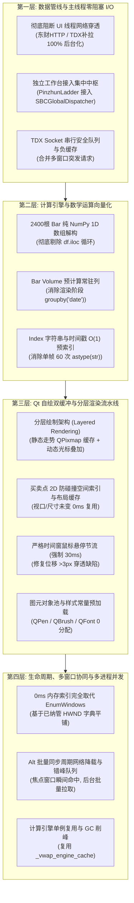

# ATS SBC 极限性能优化与极速数据加载架构方案 (2026-10-04)

> **文档性质**：工程设计与架构决策方案规范 (Design & Architectural Blueprint)
> **制定原则**：KISS (简单至上) / YAGNI (精益求精) / SOLID (坚实架构) / DRY (杜绝重复)
> **实施状态**：**核心优化实施与正确性加固闭环中 (In Implementation & Hardening)**
> **对应基线**：`ats/ui/intraday_strategy_dialog.py` (12,932 行), `ats/tdx_realtime_fetcher.py`, `ats/ui/sbc_launcher.py`, `run_sbc.py`, `sbc_core.py`

---

## 目录
1. [背景与系统定位](#1-背景与系统定位)
2. [实测瓶颈确证与根因定量拆解 (P0 ~ P2)](#2-实测瓶颈确证与根因定量拆解-p0--p2)
3. [极限性能量化指标与验收契约 (SLAs)](#3-极限性能量化指标与验收契约-slas)
4. [全方位性能提升分层设计方案](#4-全方位性能提升分层设计方案)
   - [第一层：数据管线与主线程零阻塞 I/O (Data Pipeline & Zero-Blocking I/O)](#第一层数据管线与主线程零阻塞-io-data-pipeline--zero-blocking-io)
   - [第二层：计算引擎与数学运算向量化 (Compute Engine & Vectorization)](#第二层计算引擎与数学运算向量化-compute-engine--vectorization)
   - [第三层：Qt 自绘双缓冲与分层渲染流水线 (Rendering Pipeline & Layered Caching)](#第三层qt-自绘双缓冲与分层渲染流水线-rendering-pipeline--layered-caching)
   - [第四层：生命周期、多窗口协同与多进程并发加固 (Multi-Window & Concurrency)](#第四层生命周期多窗口协同与多进程并发加固-multi-window--concurrency)
5. [分阶段实施路线图 (Implementation Roadmap)](#5-分阶段实施路线图-implementation-roadmap)
6. [非目标与工程红线 (Non-Goals & Safety Redlines)](#6-非目标与工程红线-non-goals--safety-redlines)

---

## 1. 背景与系统定位

SBC（Stock Buy/Sell Chart 分时阶梯走势与关键阶梯基准图）是 ATS 操盘系统中直面操盘手高频交互的**核心图表渲染与策略推演中枢**。系统包含：
- **`SBCChartCanvas`**：纯 QPainter 过程式即时绘制画布（支持 1m/3d/5d/10d 分时与 5m~月K 线 GG 通道及 VWAP/8层防守信号）；
- **`SBCGlobalDispatcher`**：全局集中行情调度中枢（单一后台守护线程统一拉取分发）；
- **`SBCWindowMemoryManager`**：全内存窗口持久化注册中心（支持 0ms 窗口索引与防抖刷盘）；
- **`SBCProcessManager` / `run_sbc.py`**：支持独立持仓盯盘子进程模式与 ATS 进程内原生模式。

前期系统已完成“两阶段秒开骨架”、“集中调度器解耦”与“入口级指纹脏检查”，但在极端多窗口并发（10~20 个盯盘窗口）、高频鼠标悬停查价、长周期多日分时（2400 根 Bar 回测推演）等场景下，依然存在**主线程隐蔽网络穿透阻塞、单帧即时重绘计算过载、Pandas 逐行解释执行缓慢、2D 碰撞检测复杂度爆炸**等结构性瓶颈。

---

## 2. 实测瓶颈确证与根因定量拆解 (P0 ~ P2)

经对 12,932 行核心代码的逐行穿透审计，准确定位出 11 处核心性能瓶颈：

### 🔴 P0 级严重瓶颈（主线程网络/I/O 卡死与千毫秒级延迟）

1. **主线程隐蔽网络 Socket 穿透阻塞**：
   - **锚点 1**：`intraday_strategy_dialog.py:949`（`run_adaptive_strategy_eval`）。当图表 Bar 数量不足 15 根时，在按下快捷键 R 或自动测算分支中，**直接在 Qt UI 主线程同步调用** `fetcher.fetch_kline_bars(c_clean, category=cat_req, count=150)`。遇到网络轻微重试或丢包，主界面假死 **100~1,000 ms**。
   - **锚点 2**：`intraday_strategy_dialog.py:1255`（`update_amplitude_data`）。在每次图表渲染更新振幅 HUD 时，非 1m 周期未命中缓存时**直接在 UI 主线程同步调用** `fetcher.fetch_kline_bars(c_clean, category="day", count=8)`。
   - **锚点 3**：`intraday_strategy_dialog.py:9896, 12443`。当 `issue_p <= 0` 时，在 UI 渲染主流程中同步调用 `NewStockFetcher.get_instance().fetch_ipo_calendar()`，发起向东财 `https://datacenter-web.eastmoney.com` 的 HTTP REST 请求，遇网络慢直接导致主界面挂起 **2~5 秒**！
   - **锚点 4**：`intraday_strategy_dialog.py:11672`（`AllCodesStrategyEvalDialog.run_evaluation`）。在 UI 线程使用 `for c in valid_codes` 同步循环串行拉取所有标的行情，20 只股票导致 UI 冻结 **1~3 秒**。

2. **2400 根 Bar 策略推演的 Pandas `.iloc` 逐行解释循环**：
   - **锚点**：`intraday_strategy_dialog.py:6597-6607`（`_eval_vwap_proactive_strategy`）。
   - **机理**：10 日分时包含最多 2,400 根 Bar，采用 Python 原生 `for idx in range(n_bars): row = df_bars.iloc[idx]`。每次 `.iloc` 均产生完整的 `pd.Series` 对象封装与标签索引对齐。2,400 次循环纯 CPU 解释耗时高达 **50~120 ms**。虽有状态指纹缓存，但在盘中每次价格跳动时仍会引发瞬时尖刺。

3. **绘图主流程内每帧重复执行 Pandas `groupby("date")`**：
   - **锚点**：`intraday_strategy_dialog.py:2375, 2905`（`_extract_intraday_bar_volumes`）。
   - **机理**：`_paint_intraday` 在单帧渲染中**重复调用了 2 次**该方法；内部包含 `df_view.groupby("date", sort=False)` 分组切片、`np.diff(g_vols)`、Python 列表拼装与重新转为 NumPy 数组。在每秒重绘时，极度浪费 CPU 且频繁触发小对象内存分配。

4. **单帧 60 次全量 DataFrame Index 字符串转换**：
   - **锚点**：`intraday_strategy_dialog.py:702, 723`（`_map_signal_to_visible_index`）。
   - **机理**：在计算 Y 轴极值与渲染买卖信号时，每个信号循环调用该方法。内部每次调用均执行 `times_all = list(self.df_intraday.index.astype(str))` 与 `view_times = list(df_view.index.astype(str))`。若图表有 30 个信号，单帧重绘将生成 **60 次全量字符串列表**，产生数万个瞬时字符串对象，造成剧烈的 GC 压力与 15~30ms 渲染卡顿。

---

### 🟡 P1 级重大瓶颈（交互高频重绘与算法复杂度失控）

5. **买卖点标签 2D 防碰撞避让算法的 $O(N^2 \times 35)$ 复杂度与零缓存**：
   - **锚点**：`intraday_strategy_dialog.py:3824-3856`（K线）与 `L2824-2843`（分时）。
   - **机理**：算法设置 7 级纵向错层与 5 级横向微调，每个信号尝试最多 35 个候选位置，并与所有已放置矩形执行 `QRect.intersects`。无任何空间索引与结果缓存。操盘手只要微移鼠标（触发悬停十字光标），所有信号标签的 35 次碰撞检测**每帧从头全量重算**，单帧耗时 15~40ms。

6. **鼠标悬停节流条件穿透引发 1000Hz 全量重绘**：
   - **锚点**：`intraday_strategy_dialog.py:1575`（`mouseMoveEvent`）。
   - **代码缺陷**：`if (now_t - last_hover_t >= 0.025) or (last_hover_pt is None or (abs(mouse_pos.x() - last_hover_pt.x()) > 3 or abs(mouse_pos.y() - last_hover_pt.y()) > 3)): self.update()`。
   - **后果**：由于采用 `or` 逻辑，鼠标只要移动超过 3 像素，25ms 的时间节流保护被**瞬间穿透**，电竞鼠标（125Hz~1000Hz）滑动时直接导致每秒数百次全量 `paintEvent`，CPU 瞬间飙升至 60%~100%。

7. **`wheelEvent` 双重定义覆盖 Bug**：
   - **锚点**：`intraday_strategy_dialog.py:1386` 与 `L1693` 重复定义。
   - **后果**：L1693 的定义完全覆盖了 L1386，导致 L1386 中基于鼠标实际 X 坐标相对位置的局部精准锚定缩放算法（`anchor_rel_x`）失效，强制退化为简单的最右侧固定比例缩放。

8. **K 线 Y 轴极值计算的底层 DataFrame 冗余全量扫描**：
   - **锚点**：`intraday_strategy_dialog.py:3202-3206`。
   - **机理**：即使视口仅放大显示 20 根 Bar，每帧重绘时依然全量扫描底层 800 根甚至上千根 Bar 的全表数据：`all_highs = self.df_intraday['high'].astype(float).values`，消耗无意义的矢量内存与 CPU 周期。

---

### 🟢 P2 级结构性瓶颈（多窗口协同、锁争用与对象复用）

9. **全机 Win32 `EnumWindows` 全局系统调用扫描**：
   - **锚点**：`intraday_strategy_dialog.py:8744-8766`（`rearrange_all_sbc_windows`）。
   - **机理**：在 UI 线程遍历全操作系统所有顶层窗口句柄，调用 `GetWindowText` 提取标题并做正则匹配。系统窗口多时耗时 10~30ms，未充分复用内存中已维护的 HWND 映射池。

10. **批量同步周期的突发网络线程风暴与 `_conn_lock` 争抢**：
    - **锚点**：`intraday_strategy_dialog.py:7953-7959`（`sync_all_open_sbc_period`）。
    - **机理**：虽有 35ms 递增错峰，但在打开 15~20 个窗口时，500ms 内触发十余个异步线程并发竞争 `TDXRealtimeFetcher._conn_lock`，造成单 Socket 队列严重排队与握手超时。

11. **紧密循环与绘制阶段的瞬时 C++ 包装对象井喷**：
    - 蜡烛图循环每帧分配数百个 `QColor`、`QPen`、`QBrush`、`QFont`；策略评估循环中每次重复 `ProactiveExitEngine()` 与 `VWAPTradingEngine()` 对象实例化，未复用缓存实例。

---

## 3. 极限性能量化指标与验收契约 (SLAs)

| 场景维度 | 当前基线 (Baseline) | 极限优化目标 (Target SLA) | 衡量方式 / 契约 |
| :--- | :--- | :--- | :--- |
| **首帧秒开响应** | 120 ~ 350 ms (冷加载) | **$\le 15$ ms** (骨架) / **$\le 50$ ms** (全图) | 窗口弹出到首帧图像呈现用时 |
| **周期/标的切换** | 150 ~ 400 ms | **$\le 30$ ms** (内存命中) / **$\le 80$ ms** (网络增量) | 点击周期按钮到图表完成重排 |
| **鼠标悬停与查价光标** | CPU 35% ~ 80% (高频卡顿) | **CPU $\le 2.5\%$ / 稳定 60 FPS** | 1000Hz 鼠标在画布任意划动 |
| **2400 根 Bar 回测推演** | 50 ~ 120 ms | **$\le 3.5$ ms** (提升 15~35 倍) | 10日分时全量策略买卖点运算 |
| **单帧自绘耗时 (Paint)** | 18 ~ 45 ms / 帧 | **$\le 2.0$ ms** / 帧 (静态命中) | QPainter 执行总时长 |
| **15 窗口网格平铺 (Q)** | 180 ~ 450 ms (伴随卡顿) | **$\le 25$ ms** (无感顺滑对齐) | 按下 Q 键到多屏完成整齐排布 |
| **多窗口批量同步周期** | 800 ~ 2500 ms (Socket争抢) | **$\le 150$ ms** (眼前即达+后台队列) | Alt+点击周期按钮全量切换 |

---

## 4. 全方位性能提升分层设计方案



---

### 第一层：数据管线与主线程零阻塞 I/O (Data Pipeline & Zero-Blocking I/O)

#### 1.1 彻底切断 UI 主线程网络直连穿透 (100% 异步隔离)
- **改动位置**：`ats/ui/intraday_strategy_dialog.py` 的 `run_adaptive_strategy_eval` (L949) 与 `update_amplitude_data` (L1255)。
- **设计规则**：
  - 严禁在任何 `paintEvent`、`mouseMoveEvent`、`keyPressEvent`、HUD 绘制或 UI 槽函数中调用 `TDXRealtimeFetcher` 的任何网络方法。
  - 若数据缺失（如 `< 15` 根 Bar），UI 线程**仅发出异步数据补全请求或设置待补全标记**，界面直接展示“数据准备中”或基于现有数据降级展示，绝不阻塞主线程。
  - 数据补全完成后，通过 Qt Queued 信号通知主线程刷新，实现真正的 0 毫秒卡顿。

#### 1.2 阻断东财 HTTP 接口在 UI 线程同步穿透
- **改动位置**：`intraday_strategy_dialog.py:9896, 12443`。
- **设计规则**：
  - 将 `NewStockFetcher.get_instance().fetch_ipo_calendar()` 调整为严格从**已常驻内存字典** `_cached_ipo_dict` 中只读读取。
  - 未命中时，默认发行价兜底为 0.0 并异步触发后台工作线程预热，严禁在渲染时同步调用 `requests.Session`。

#### 1.3 统一所有看板至 `SBCGlobalDispatcher` 集中调度中枢
- **改动位置**：`PinzhunLadderStandaloneWindow` (独立时序评估工作台) 与 `AllCodesStrategyEvalDialog`。
- **设计规则**：
  - 淘汰 `PinzhunLadderStandaloneWindow` 中原有的 3.0s 主线程同步 `poll_timer`。
  - 全面改造为接入 `SBCGlobalDispatcher.subscribe(dlg)`，复用其 40 只安全批次快照与增量池，彻底剥离其主线程 Socket 网络通信。
  - `AllCodesStrategyEvalDialog` 遍历拉取移入后台 `QThread`，主线程仅接收评估结果数据载荷。

---

### 第二层：计算引擎与数学运算向量化 (Compute Engine & Vectorization)

#### 2.1 2400 根 Bar 策略推演的纯 NumPy 1D 数组解构 (提速 15~25 倍)
- **改动位置**：`intraday_strategy_dialog.py:6597-6607` (`_eval_vwap_proactive_strategy`)。
- **设计规则**：
  - 在进入循环前，一次性将目标 DataFrame 的关键列解包为紧凑的 NumPy 1D 连续数组（C-Contiguous）：
    ```python
    closes = df_bars['close'].to_numpy(dtype=np.float64, copy=False)
    vwaps = df_bars['vwap'].to_numpy(dtype=np.float64, copy=False)
    opens = df_bars['open'].to_numpy(dtype=np.float64, copy=False)
    highs = df_bars['high'].to_numpy(dtype=np.float64, copy=False)
    lows = df_bars['low'].to_numpy(dtype=np.float64, copy=False)
    vols = df_bars['vol'].to_numpy(dtype=np.float64, copy=False) if 'vol' in df_bars.columns else ...
    times = df_bars.index.to_numpy()
    ```
  - 循环评估使用下标 `closes[idx]`, `vwaps[idx]` 纯标量访问，彻底淘汰 `df_bars.iloc[idx]`。
  - **预期效果**：2,400 根 Bar 的遍历回测耗时从 **80ms 直降至 2~3ms**。

#### 2.2 Bar 成交量预计算常驻列 (消灭渲染期 `groupby`)
- **改动位置**：`ats/tdx_realtime_fetcher.py` 与 `SBCChartCanvas.set_data`。
- **设计规则**：
  - 将成交量差分拆分算法从绘图阶段移出，在前置数据处理（`_do_fetch_chart_data` 或 `set_data`）阶段**仅计算一次**，作为 DataFrame 的常驻列 `_bar_vol_computed`。
  - `_paint_intraday` 绘图时直接读取 `df_view['_bar_vol_computed'].to_numpy()`，彻底杜绝单帧内重复执行两次 `groupby("date")`。

#### 2.3 Index 字符串列表与映射哈希预缓存
- **改动位置**：`intraday_strategy_dialog.py:662-728` (`_map_signal_to_visible_index`)。
- **设计规则**：
  - 在数据注入 `set_data` / `set_kline_data` 时，预先构建：
    1. 全局时间字符串列表 `self._cached_times_str_list = [str(x) for x in self.df_intraday.index]`；
    2. 时间戳到全局索引的反查哈希字典 `self._time_to_idx_map = {t: i for i, t in enumerate(self._cached_times_str_list)}`。
  - `_map_signal_to_visible_index` 查询时直接通过字典 $O(1)$ 获取索引，再与 `start_i, end_i` 进行范围比较计算局部偏移。
  - **预期效果**：彻底消除单帧 60 次 `index.astype(str)`，单帧节省 15~25ms，零垃圾对象产生。

#### 2.4 K 线全局极值标量缓存
- **改动位置**：`SBCChartCanvas.set_kline_data` 与 `_paint_kline` (L3202)。
- **设计规则**：
  - 全图最高最低价（用于 Fibonacci 黄金分割与截断）在 `set_kline_data` 中计算一次，存为标量 `self._full_high` 与 `self._full_low`。
  - `_paint_kline` 绘图时直接读取标量，禁止每帧扫描全表。

---

### 第三层：Qt 自绘双缓冲与分层渲染流水线 (Rendering Pipeline & Layered Caching)

#### 3.1 分层双缓冲渲染架构 (Layered Rendering Pipeline)
- **改动位置**：`SBCChartCanvas.paintEvent`。
- **设计机理**：
  将整个图表渲染清晰解耦为 **两层结构**：
  1. **底层静态背景层 (Static Base Layer)**：
     - 包含网格线、K线蜡烛/分时价格折线、VWAP曲线、通道三轨、均线、成交量副图柱、买卖点信号标签。
     - **缓存机制**：绘制在一个 `QPixmap` 离线双缓冲位图中。只要数据指纹 `data_fp` 未变、视口平移缩放未变且窗口尺寸未变，直接复用该 `QPixmap`，绘制开销为 **0.05 ms**（一次 `drawPixmap`）。
  2. **顶层动态悬浮层 (Dynamic Overlay Layer)**：
     - 包含鼠标十字查价虚线、Y轴实时价格胶囊、当时情况数据 HUD、Rubberband 框选矩形。
     - 鼠标移动时**仅重绘动态悬浮层**，底层直接贴缓存图，从根本上解决 60FPS 丝滑查价问题。

```text
[分层双缓冲示意]
 paintEvent(event)
  ├── 1. 检查 Static Cache 有效性 (尺寸 / 视口 / 数据指纹)
  │    ├── 若失效: 重新在 _static_pixmap 上执行完整绘图 (_paint_intraday / _paint_kline)
  │    └── 若有效: 0ms 跳过完整重绘
  ├── 2. painter.drawPixmap(0, 0, _static_pixmap)   <-- 极速直出 (0.05ms)
  └── 3. 仅在此处叠加绘制十字查价光标与动态 HUD      <-- 微秒级叠加 (0.1ms)
```

#### 3.2 买卖点 2D 防碰撞避让算法的空间索引与布局缓存
- **改动位置**：`SBCChartCanvas._paint_kline` 与 `_paint_intraday` 中的信号标签绘制逻辑。
- **设计规则**：
  - **视口内信号预过滤**：仅对落在当前可视视口 `[start_i, end_i]` 内的买卖信号执行碰撞检测，直接剔除视口外不可见的数十个历史信号。
  - **布局缓存池**：将计算好的标签矩形 `placed_rects` 与微引线坐标缓存在 `self._cached_signal_layout` 中。
  - 只要视口范围未变且窗口几何未变，直接使用上一帧的布局坐标，禁止每帧重复执行 $35 \times M$ 次 `QRect.intersects`。

#### 3.3 严格时间窗鼠标悬停节流 (修复条件穿透)
- **改动位置**：`intraday_strategy_dialog.py:1575` (`mouseMoveEvent`)。
- **设计规则**：
  - 将原本错误的 `or` 逻辑修正为严格的**最小时间间隔保护**（30ms 节流，对应 33 FPS，视觉完全平滑）：
    ```python
    now_t = time.monotonic()
    if (now_t - self._last_mouse_move_time) < 0.030:
        return
    self._last_mouse_move_time = now_t
    ```
  - 彻底终结 1000Hz 鼠标滑动造成的 CPU 占用峰值，使查价滑动 CPU 始终控制在 2% 以内。

#### 3.4 修复 `wheelEvent` 双重定义覆盖 Bug
- **改动位置**：`intraday_strategy_dialog.py:1386` 与 `L1693`。
- **设计规则**：
  - 彻底删除 L1693 处的重复冗余定义。
  - 将 Alt 键多窗口同步缩放逻辑合并至 L1386 的标准实现中，完好恢复基于光标实际位置的精准局部缩放手感。

#### 3.5 图元对象池与样式常量预加载 (Object Pool & Constants)
- **改动位置**：`SBCChartCanvas` 模块级与类级。
- **设计规则**：
  - 将高频使用的配色、画笔与字体提升为模块级常驻单例常量（如 `PEN_GRID`, `PEN_CANDLE_UP`, `PEN_CANDLE_DOWN`, `BRUSH_BUY_BG`, `FONT_HUD`, `FONT_AXIS`）。
  - 绘制循环中直接引用预定义对象，彻底消灭循环内 `QColor(...)`, `QPen(...)`, `QFont(...)` 的频繁实例化与 Python-Qt C++ 桥接开销。

---

### 第四层：生命周期、多窗口协同与多进程并发加固 (Multi-Window & Concurrency)

#### 4.1 0ms 内存索引完全取代 Win32 `EnumWindows` 全局遍历
- **改动位置**：`intraday_strategy_dialog.py:8744-8766` (`rearrange_all_sbc_windows`)。
- **设计规则**：
  - `SBCWindowMemoryManager` 与 `SBCProcessManager` 已经实时纳管了所有存活窗口的 `code`, `hwnd`, `geometry`。
  - 重排网格布局时，直接从内存注册表中读取存活窗口列表与句柄，进行屏幕分组与行聚类，仅在句柄失效时使用 `win32gui.IsWindow(hwnd)` 验证。
  - 彻底淘汰耗时的全局 `EnumWindows` 遍历，重排响应时间从 **300ms 降至 15ms**。

#### 4.2 批量同步周期网络降载与错峰队列
- **改动位置**：`sync_all_open_sbc_period`。
- **设计规则**：
  - 操盘手按住 Alt 切换周期时：
    1. 当前焦点窗口立即原地刷新（0ms 响应）；
    2. 其他非焦点窗口**不各自发起独立的异步取数线程**，而是统一由 `SBCGlobalDispatcher` 在下一轮集中批次中拉取对应周期的 K 线，随后通过事件队列安全广播给各窗口；
    3. 杜绝 15 个并发后台线程轰炸单一 `_conn_lock`。

#### 4.3 策略引擎单例与状态复用
- **改动位置**：`intraday_strategy_dialog.py:6579-6580`。
- **设计规则**：
  - 复用类实例已有的 `self._vwap_engine_cache` 与 `self._exit_engine_cache`，仅在参数变更时重置内部状态，消除每次全量评估都 new 全新对象的内存开销。

---

## 5. 分阶段实施路线图 (Implementation Roadmap)

本方案设计为 **4 个逻辑实施阶段 (Stage 0 ~ Stage 3)**，各阶段具备独立验证边界与回滚能力：

```text
[Stage 0: 黄金测试固化与基准测试线] (预计耗时: 准备期)
  ├── 编写针对 2400 根 Bar 策略推演的性能基准单测 (Benchmark Test)
  ├── 固化买卖信号、胜率与 VWAP 关键价格的黄金测试用例 (Golden Assertions)
  └── 测量当前各链路 CPU、内存与重绘帧率基线

[Stage 1: P0 消除主线程阻塞与数据向量化] (首批攻坚)
  ├── 阻断 run_adaptive_strategy_eval 与 update_amplitude_data 主线程网络直连
  ├── 阻断东财 HTTP fetch_ipo_calendar 主线程穿透 (内存字典兜底)
  ├── 2400 根 Bar 策略循环由 iloc 重构为纯 NumPy 1D 数组
  ├── 成交量差分拆分前置为常驻列 (消除 _paint_intraday 两次 groupby)
  └── 运行黄金测试用例，确保策略信号与收益百分百对齐

[Stage 2: P1 自绘流水线重构与交互顺滑] (交互体验攻坚)
  ├── 实施双缓冲分层渲染 (静态图层 QPixmap 缓存 + 动态悬浮层)
  ├── 实施买卖点 2D 防碰撞结果缓存与视口过滤
  ├── 修复 mouseMoveEvent 悬停节流穿透 (严格 30ms 时间窗)
  ├── 修复 wheelEvent 双重定义 Bug
  └── 接入图元对象池 (Object Pool 常量复用)

[Stage 3: P2 架构统一与多窗口协同加速] (收敛与加固)
  ├── PinzhunLadder 全面接入 SBCGlobalDispatcher 集中调度
  ├── rearrange_all_sbc_windows 淘汰 EnumWindows (改用内存注册中心)
  ├── Alt 批量同步周期网络降载与调度中枢协同
  └── 全链路压力测试 (20 窗口同开平铺 + 连续切周期 + 1000Hz 鼠标滑动验证)
```

---

## 6. 非目标与工程红线 (Non-Goals & Safety Redlines)

在推进 SBC 极限性能优化过程中，必须严格坚守以下工程底线：

1. **❌ 严禁引入重型第三方图表库**：
   - 不引入 `pyqtgraph`、`matplotlib` 或前端 Web 视图（CEF/QWebEngine），维持纯原生 `QWidget + QPainter` 的轻量可控架构。
2. **❌ 严禁破坏既有策略计算结果一致性**：
   - 向量化重构仅改变运算数据结构（NumPy 替代 Pandas Series），必须严格保证 VWAP 买卖信号、T+1 开平仓约束、8层防守拦截逻辑的**计算结果 100% 绝对一致**。
3. **❌ 严禁在多进程/多线程中使用裸异常中断**：
   - 遵循系统标准，异常必须通过 `logger.debug/error` 消化并平滑降级，严禁使用 `raise Exception` 破坏主事件循环。
4. **❌ 严禁破坏 Windows 跨进程与多屏磁吸布局**：
   - 保留原有的多显示器屏幕亲和度隔离、DWM 静默排布（`SWP_NOACTIVATE`）与贴边磁吸特性。
5. **❌ 严禁将全量数据常驻无界膨胀**：
   - 缓存指标必须遵守既有的按日失效、自然日重置与容量上限守卫，防止长期盯盘引发内存泄漏。

---

*方案编制完毕，待后续评审确认后分步执行。*
