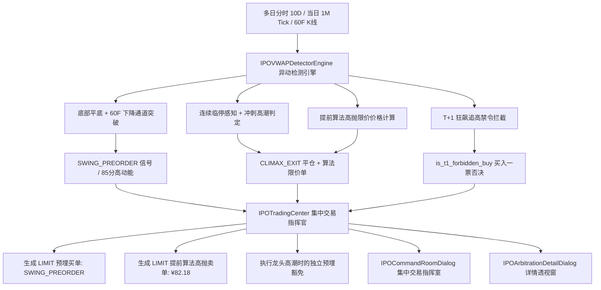

# 新股情绪全面感知与多周期通道突破策略 (1代) 设计与实施说明书

## 1. 策略概述与定位

- **策略名称**：新股情绪全面感知与多周期通道突破策略 1 代 (`IPOVWAPChannelSentimentStrategyV1`)
- **适用标的**：A 股上市新股、次新股全池（含主板、创业板、科创板、北交所）
- **核心定位**：打破传统“见山是山”（仅看当前价格与单根均线）与一刀切避险缺陷，建立**跨日大平底箱体识别、多周期共振通道突破、高潮临停加速感知、T+1 规则买入禁令与提前算法限价挂单**的高确定性超短线实战闭环。

---

## 2. 核心四大实战业务支柱与技术实现

### 支柱 1：多周期共振与跨日平底通道突破（蓝色光标 300058 同款）
- **实战痛点**：
  标的（如蓝色光标）经过连续 3~4 日大平底箱体筑底（如 12.60~13.00 元），60F 分时突破下降通道阻力线，尾盘放量拉升收在全天最高价 13.15 元。此时由于 10d VWAP 在 13.47 元（股价仍在 VWAP 之下），旧系统会武断将其打成“⛔ 破位出局”（999 名淘汰），且止损线错误设置在遥远的 13.47 元，导致错失次周一直接冲破 VWAP 的大级别主升行情。
- **算法实现 (`_evaluate_bottom_base_structure`)**：
  1. 扫描最近 3~4 个交易日的低点极差：
     $$\text{box\_fluctuation} = \frac{\max(\text{day\_lows}) - \min(\text{day\_lows})}{\min(\text{day\_lows})} \times 100\% \le 4.5\%$$
  2. 尾盘收新高检测：
     $$P_{\text{now}} \ge P_{\text{today\_high}} \times 0.990 \quad \text{且} \quad P_{\text{now}} \ge \min(\text{box\_lows}) \times 1.015$$
  3. 60F / 日K 趋势共振支撑确认 (`sig.has_kline_launch_sig`)；
  4. **防守线迁移**：止损线告别遥远的 13.47 VWAP，精准锚定在底台支撑下方 0.8%：
     $$\text{StopLoss} = \text{multi\_day\_base\_support} \times 0.992 \quad (\approx 12.55 \sim 12.88 \text{元})$$
  5. **决议输出**：赋予专属信号 `SWING_PREORDER`（🔭 通道突破），赛马天梯打分 80~86 分，指挥中心生成 `urgency="LIMIT"` 的限价预埋买单，享有龙头冲顶避险时的免死金牌。

---

### 支柱 2：临停计数与冲刺高潮感知（沈鼓集团 601091 同款）
- **实战痛点**：
  次新妖股（如沈鼓集团）连续拔地而起，盘中经历 2~4 次 30% 临停推升至 82.59 疯狂顶点，复牌后往往戛然而止并发生巨幅跳水（瞬间腰斩至 57 元以下）。事后被动使用市价单止损根本无法撮合出局。
- **算法实现 (`_evaluate_vwap_structure`)**：
  1. **临停次数感知 (`suspension_count`)**：
     检测盘中价格越过开盘价 +28%（第 1 次临停）与 +58%（第 2 次临停），并累加跨日临停次数；
  2. **冲刺高潮判定**：
     当偏离 VWAP $\ge 20\%$ 或经历 $\ge 2$ 次临停时，系统自动识别为“加速冲刺高潮阶段”，全面激活逃顶防御机制。

---

### 支柱 3：计算机算法提前设计高抛限价挂单 (`climax_preset_sell_price`)
- **操盘手实操法则**：
  “在 82.59 顶点能卖出的，都是提前计算机设计好的价格挂单才有可能高点成交，跳水后都是加速离场根本卖不掉。”
- **算法实现 (`_evaluate_vwap_structure` & `IPOTradingCenter`)**：
  1. **极限挂单价前瞻推导**：
     $$\text{climax\_preset\_sell\_price} = \begin{cases} 
     \text{round}(P_{\text{high}} \times 0.995, 2), & \text{若 } \text{suspension\_count} \ge 2 \\
     \text{round}(P_{\text{open}} \times 1.60, 2), & \text{若 } \text{suspension\_count} == 1 \\
     \text{round}(P_{\text{open}} \times 1.30, 2), & \text{若偏离 } \text{VWAP} \ge 20\%
     \end{cases}$$
  2. **挂单撮合机制**：
     在平仓阶段生成 `urgency="LIMIT"`, `price=climax_preset_sell_price` 的算法高抛单，提前在交易所委托队列中排队，复牌瞬间自动撮合成交。

---

### 支柱 4：A 股 T+1 追高买入拦截禁令 (`is_t1_forbidden_buy`)
- **实战约束**：
  A 股实行 T+1 交易制度，当日买入的股票无法在当天卖出。因此次日狂飙冲顶的股票，买点只能是首日（昨天），次日去追高买入等于在没有当日撤退权的前提下承担断崖跳水风险。
- **算法实现 (`_evaluate_vwap_structure` & `IPOTradingCenter`)**：
  1. 严格检查 `not sig.is_ipo_first_day`；
  2. 若满足高位冲刺条件（`change_pct >= 15.0` 或 `vwap_diff_pct >= 20.0` 或 `suspension_count >= 1`），标记 `is_t1_forbidden_buy = True`；
  3. 指挥中心开仓买入循环执行“一票否决”，绝对不为该标的生成任何买入指令，彻底根除 T+1 高位接盘恶习。

---

## 3. 架构与数据流图

---

## 4. 后续 2 代策略迭代指南

1. **通道斜率与自适应布林/ATR 共振**：
   - 2 代计划引入动态 ATR 波动收敛率，自适应微调大平底箱体阈值（当前硬编码为 4.5%）；
2. **多档买卖盘口（L2 OrderBook）微观撮合感知**：
   - 2 代计划接入 L2 盘口买一到买五的挂单撤单撤单比，辅助校验提前算法高抛单是否精准贴合复牌撮合价；
3. **分时多空能量潮（OBV/VWAP 分化度）**：
   - 增强在下跌缩量平底期间的资金暗中吸筹（吸筹率指标）的量化打分。
