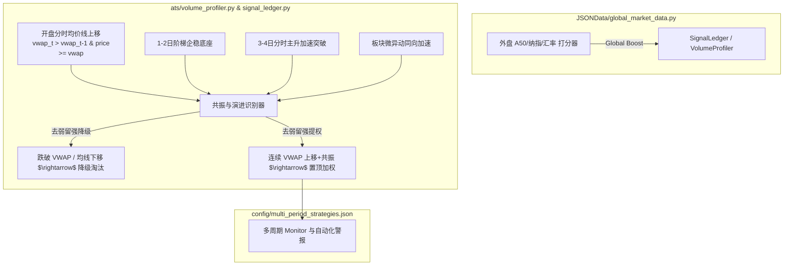

# 外盘情绪感知、多日阶梯底座抬升、分时 VWAP 上移与“去弱留强”共振起爆引擎 实施方案

## 需求背景与盯盘实盘解构

在实盘盯盘中，交易者极易被开盘后的上蹿下跳（盘中 Tick 级别无序噪音）干扰心理情绪。但真正的**胜率起手结构**（如**长城军工 601606**、**北汽蓝谷 600733**、**蓝色光标 300058**）具有非常明确的**分时均线 (VWAP) 趋势与多日生命周期演进规律**：

1. **分时均线 (VWAP) 阶段企稳与高低点收敛 (Intraday Base Stabilization)**：
   - 股价在大盘/板块震荡中，高低点波动幅度剧烈收敛，获得均线有力承接。
   - 全天开盘后**验证均价线上移 (`vwap_t > vwap_{t-1}`)** 且股价全程死守在 VWAP 上方。
2. **多日生命周期演进 (1-2日企稳底座 $\rightarrow$ 3-4日分时主升加速)**：
   - **第 1~2 天（底座蓄势企稳期）**：极缩地量、小波动、每日高低点不破新低并阶梯抬升。
   - **第 3~4 天（分时主升突破期）**：开盘后分时均价线上移，同板块股票形成结构共振，爆起走出加速主升结构！
3. **去弱留强 (Filter Weak, Retain Strong)**：
   - 放弃假拉升、冲高回落跌破均价线的弱势股。
   - 系统动态将均价线上移、板块共振强力的标的升维至最高优先级，彻底锁定真正的主升龙头。
4. **外盘情绪连带与盘前感知 (Global Markets Sentiment Linkage)**：
   - 隔夜/盘前外盘（富时 A50 期货 `hf_CHA50CFD`、纳斯达克 `gb_$COMP`、标普500、离岸人民币 CNH、大宗商品黄金/原油）对 A 股板块情绪有强烈连带作用（如纳斯达克暴涨连带 AI/科技如蓝色光标；A50 拉升连带大盘指数与军工/汽车龙头）。

---

## 核心拟修改/新增模块架构

---

## 拟实施变更细节

### 1. 新增外盘情绪与连带感知引擎 [NEW] `JSONData/global_market_data.py`
- **外盘数据抓取**：抓取富时 A50 期货 (`hf_CHA50CFD`)、纳斯达克 (`gb_$COMP`)、标普 500 (`gb_$SPX`)、离岸人民币 (`fx_susdcnh`) 及大宗商品。
- **板块连带打分映射**：
  - 纳斯达克/标普暴涨/暴跌 $\rightarrow$ 联动科技/AI/传媒板块（如蓝色光标、易点天下）加分/减分。
  - 富时 A50 期货暴涨/暴跌 $\rightarrow$ 联动权重指数与军工/汽车龙头（如长城军工、北汽蓝谷）加分/减分。
- **降级保护**：离线或网络异常时安全静默降级为 0 加分，绝不阻塞主交易线程。

### 2. 重构量能画像与分时 VWAP 上移验证 [MODIFY] `ats/volume_profiler.py`
- **多日生命周期阶段划分 (Lifecycle Engine)**：
  - `Phase 1-2 (🌱 1-2日底座企稳)`：连续 1~2 天地量干涸、波动收敛、`low_t >= 0.98 * low_{t-1}`、`close_t >= close_{t-1}`。
  - `Phase 3-4 (🔥 3-4日分时主升加速)`：在第 3~4 天突破前高，成交量放大，分时均价线连续抬升。
- **分时均价线上移 (VWAP Upward Shift) 追踪**：
  - 实时追踪盘中分时均价线 `vwap` 倾角 `vwap_slope`；
  - 验证开盘后 `vwap` 是否持续向上平滑抬升，且现价处于 `vwap` 上方（`price >= vwap`）。
- **板块微异动共振 (Sector Micro-Resonance)**：
  - 早盘识别同板块内 $\ge 2$ 只标的同向踩在 VWAP 上方微幅加速，赋予 **`👥 板块微异动共振`** 标签与 +35 分提权。

### 3. 重构信号账本与“去弱留强”动态排他引擎 [MODIFY] `ats/signal_ledger.py`
- **“去弱留强”淘汰与晋级机制 (Demotion & Promotion Guard)**：
  - **留强**：对满足“开盘分时 VWAP 连续上移”且“处于 3-4 日主升加速”或“1-2 日坚实底座”的标的赋予 **`🚀 VWAP主升抬升`** / **`🔥 3-4日分时主升`** 标签并强力置顶。
  - **去弱**：若开盘冲高后跌破分时均价线（`price < 0.995 * vwap`）或均价线勾头向下，系统自动判定为“假异动/弱势冲高回落”，将其从 `WATCH` 池强行降级 (Demote) 至 `RADAR` 或 `INACTIVE` 淘汰池，保证优先池 100% 留存最强龙头。

### 4. 内置“多日阶梯底座+外盘/板块共振”伏击策略 [MODIFY] `config/multi_period_strategies.json`
- 在策略库首位内置 `🔥 多日阶梯底座+分时VWAP上移+外盘/板块共振` (`tpl_staircase_sector_global_resonance_ambush`) 策略，实现盘前/早盘低成本埋伏与主升加速验证。

---

## 验证计划

### 自动化与单元测试
1. **外盘 API 抓取与降级测试**：
   - 新建 `tests/test_global_market_data.py`，验证外盘指数解析、板块连带评分与离线降级逻辑。
2. **VWAP 上移与“去弱留强”降级断言测试**：
   - 在 `tests/test_signal_ledger.py` 中补充测试：
     - 验证长城军工(601606)、北汽蓝谷(600733)、蓝色光标(300058)历史起爆数据（1-2日企稳 + 3-4日 VWAP 上移加速）；
     - 验证假冲高标的在跌破 VWAP 后的自动降级（去弱）逻辑。
3. **全量单元测试 100% 通过**：
   - 运行 `pytest tests/` 确保所有用例通过。

---
