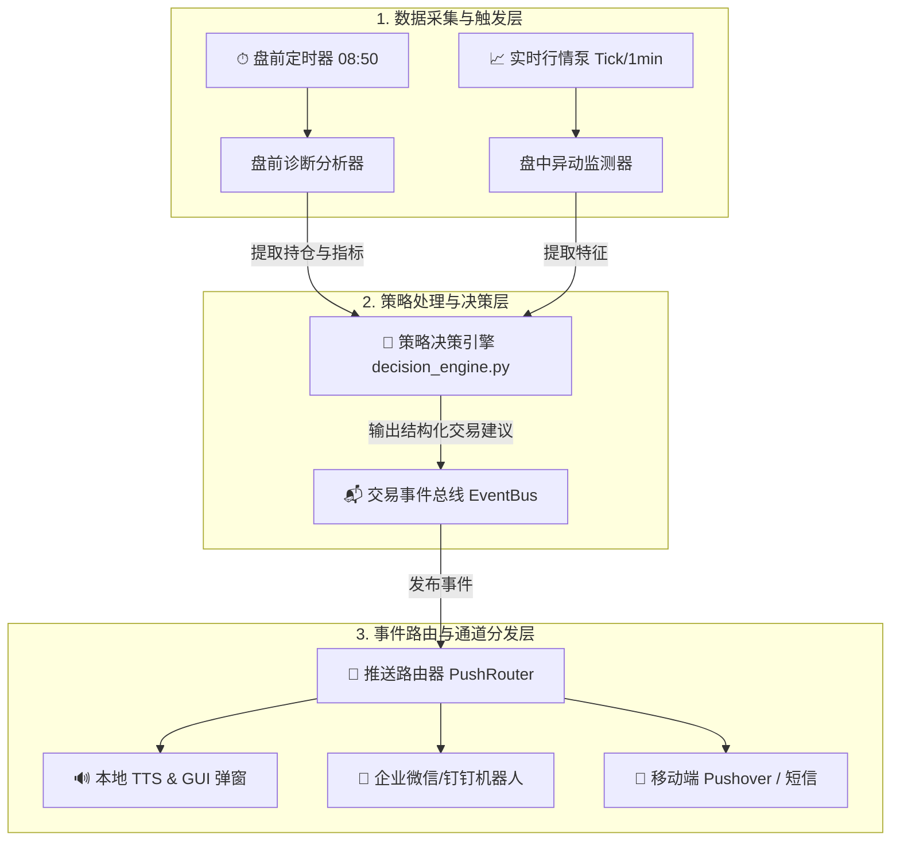

# 👑 股票实时监控、决策通知与交易建议推送系统实施规划方案 (不实施)

> [!NOTE]
> 本方案旨在为既有交易监控系统（由 StockSelector、Stock Live Strategy、Alert System、TradingAnalyzer 组成）提供一套高性能、低延迟的**盘前持仓个股体检**与**盘中异动交易策略建议实时触达**的补充架构设计。本方案仅作为设计规划，当前不实施。

---

## 1. 业务痛点与核心目标

### 1.1 现有系统盲区
1. **盘前缺乏备战策略**：操盘手在每日开盘前（9:15 前），对于当前持仓个股的“理论支撑价（如斜率外推明日5日线价格）”、“硬止损防守价”、“关键Bollinger压力位”缺乏一键体检和推送。
2. **盘中异动缺乏“交易建议”归因**：现有的 `Alert System` 能够发出个股破位或突破的语音/日志报警，但**未与决策大脑（Decision Engine）的分支策略深度对齐**。报警只提示“异动”，不提示“在当前 XX 策略分支下，建议以 XX 价格、买/卖/回补 XX 比例仓位”。
3. **推送通道单一**：目前预警过于依赖本地 GUI 终端的视觉呈现和 TTS 语音报警，一旦操盘手离开电脑，无法实现移动端、微信端或 IM 办公软件的实时秒级触达。

### 1.2 核心建设目标
* **盘前主动推送**：每天 8:50 - 9:10 自动体检所有持仓个股，生成“盘前持仓备战指南”，并推送到指定通道。
* **盘中决策联动**：盘中发现异动后，不仅触发报警，更自动组装 `StrategySignal` 并调用 `decide()`，实时产出**结构化交易建议**（如：“百合花触发5日线回补，建议在 27.24 元挂单回补 70% 仓位”）。
* **多通道秒级触达**：构建统一推送网关，实现本地 GUI 弹窗、TTS 语音、企业微信/钉钉/飞书群机器人、移动端 Pushover 的多维毫秒级分发。

---

## 2. 系统架构设计

系统采用**低耦合、多通道、异步事件驱动**的架构进行设计：



### 2.1 盘前诊断分析模块 (Pre-market Diagnostics)
* **执行时间**：每日交易日 08:50 - 09:10。
* **运行机制**：
  1. 从本地 `paper_account_state.json` 或实盘账户 API 读取当前持仓个股列表。
  2. 提取昨日收盘的日线级别 K 线特征（如 `ma5d`, `ma10d`, `sws`, `upper` 等）。
  3. 利用**斜率外推算法**计算今日理论 5日线挂单回补价，以及 Bollinger 上轨突破阈值。
  4. 组装一份结构化的“持仓个股盘前备战策略表”，推送到事件总线。

### 2.2 盘中异动决策模块 (Intraday Live Router)
* **运行机制**：
  1. 盘中监测模块通过 Sina 实时 Tick 接口高频轮询（已引入 Dirty Check 节流机制）。
  2. 当个股价格碰触到**盘前预设的防守止损位**、**5日/10日均线支撑位**，或者成交量爆发大于 5日均量一定倍数时，触发异动事件。
  3. 异动处理器**瞬间提取当前盘中动态特征**，组装出 `StrategySignal`。
  4. 将信号输入 `decide(sig, state="IN_TRADE" if has_position else "FLAT")`。
  5. 提取 `intent.action` (如 BUY / SELL / ADD)、`intent.reason.routed_branch` (当前主图推荐分支) 以及建议价格，产出“实时交易策略建议”。

---

## 3. 核心事件结构设计 (JSON Schema)

为了保证策略建议在各个推送通道（GUI、企业微信、Pushover）能够被统一解析和高可读展现，设计以下统一事件数据结构：

```json
{
  "event_id": "EVT_20260529_001",
  "timestamp": "2026-05-29 10:05:02",
  "event_type": "INTRADAY_STRATEGY_ADVICE", 
  "priority": "HIGH",
  "stock_info": {
    "code": "603823",
    "name": "百合花",
    "price_current": 28.10
  },
  "tactical_state": {
    "holding_status": "IN_TRADE",
    "active_branch": "SuperTrendMA5Branch",
    "branch_cn": "5日线主升浪"
  },
  "trade_advice": {
    "action": "ADD",
    "action_cn": "做T回补",
    "size_pct": 0.70,
    "suggest_price": 27.24,
    "deviation_pct": 3.15,
    "trigger_reason": "盘中缩量回踩 5日线 核心支撑价 (27.24 元) 止跌反弹，满足做T回补阈值。"
  }
}
```

---

## 4. 实施细节与推送通道配置规划

### 4.1 终端本地推送 (Local GUI & TTS)
* **本地气泡/浮窗**：
  * 在 Qt 可视化主窗口 `trade_visualizer_qt6.py` 中，扩展 `MarqueeLabel` 或设计无边框的非模态 `DesktopNotificationWidget`（右下角滑出，3 秒后淡出）。
  * 浮窗底色与买卖点图标完全同构（买入/回补使用高饱和度红色，卖出/止损使用荧光绿色）。
* **本地 TTS 语音播报**：
  * 扩展已有的 `Alert System` 语音播放线程，将文字转化为高度提炼的操盘指令（例如：*“警告，百合花触发5日线回补，建议挂单价 27.24”*），并通过 `pyttsx3` 或本地快捷 TTS 播放，避免操作员视线偏离屏幕。

### 4.2 企业微信 / 钉钉机器人通道 (Webhooks)
* **推送机制**：使用 `requests` 库异步向企业微信/钉钉机器人的 Webhook 发送 `markdown` 格式的文本。
* **卡片式排版设计样式**：
  > ### 🔔 实时交易策略建议推送
  > **标的名称**：百合花 (603823)  
  > **当前股价**：28.10 元 (盘中跌幅 -1.2%)  
  > **当前分支**：🧡 5日线主升浪 (SuperTrendMA5Branch)  
  > **战术状态**：持仓做T滚动中  
  > 
  > ---
  > **🎯 交易操作建议**：**【 🟢 做T回补 (ADD) 】**  
  > **建议挂单价**：**27.24 元** (当前偏离度 +3.15%)  
  > **回补仓位**：**70%** (将加权拉平成本至 19.21 元)  
  > **触发归因**：盘中缩量回踩预测 MA5 理论支撑位，满足主升浪反转回补逻辑。

### 4.3 移动端秒级推送 (Pushover / Server酱)
* **实现方案**：
  * 注册 Pushover 服务，获取 User Key 和 API Token。
  * 利用 `http.client` 向 Pushover 发送 POST 请求，该请求能直接绕过中国境内网络屏蔽，在 iOS/Android 手机端以**系统级高优先级 Push 通道**弹出通知，并伴随自定义的报警声音。
  * 确保操盘手在离线或外出时，依然能在 1秒内收到震动和交易建议。

---

## 5. 项目推进与上线计划 (五步走)

### 5.1 第一阶段：盘前诊断引擎与本地持久化 (3 个交易日)
* **任务**：编写 `premarket_analyzer.py` 脚本，在 08:50 自动加载持仓并输出盘前策略预测，将其持久化在 `premarket_diagnose.json` 中。
* **交付物**：盘前诊断分析核心算法与本地 JSON 输出。

### 5.2 第二阶段：盘中异动决策路由封装 (3 个交易日)
* **任务**：在实时监控流中，当个股触碰盘前预测价或特定放量比时，调用 `decide()`，实现异动与决策大脑的首次融合。
* **交付物**：结构化异动决策管道，通过单体回归测试。

### 5.3 第三阶段：统一推送网关与 IM 适配器 (2 个交易日)
* **任务**：开发 `push_gateway.py`，实现多线程、异步非阻塞 the Webhook 发送逻辑，加入防抖（Debounce）机制，防止因盘中高频报价抖动导致频繁发送垃圾推送。
* **交付物**：微信/钉钉/Pushover 通道网关。

### 5.4 第四阶段：本地 GUI 气泡与 TTS 音效融合 (2 个交易日)
* **任务**：在 PyQt6 界面中集成浮窗通知，并在 Alert System 中接入高精度操盘 TTS 文字模板。
* **交付物**：桌面端交互和语音提醒的深度升级。

### 5.5 第五阶段：实盘联调与回测对账 (2 个交易日)
* **任务**：进行 3 天的沙盒仿真联调，对比回测历史数据，确保推送的“买卖建议价格和分支”与回测引擎及主图展现完全同源。
* **交付物**：系统全功能上线，进入实盘稳定维护期。
