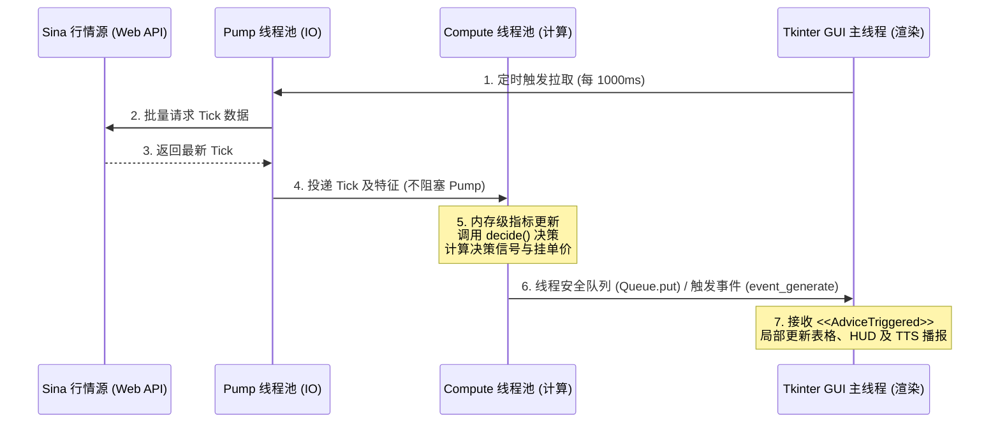
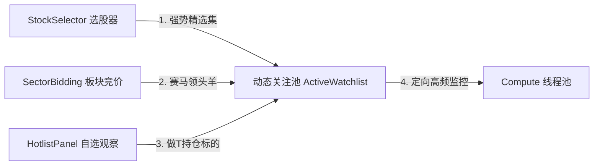

# 👑 Tkinter 实时行情流异步接入与多维数据组件（选股/竞价/HUD）复用实施方案 (不实施)

> [!NOTE]
> 本方案针对现有 Tkinter 系统（`instock_MonitorTK.py`）的单线程 GUI 限制，设计了一套基于“分层线程池（Pump/Compute）”的异步发布-订阅管道，并详述了如何复用现有的强关注选股池、竞价板块赛马个股以及桌面 HUD 悬浮窗，以实现零阻塞、高响应的决策流集成。本方案仅用于规划，当前不实施。

---

## 1. 异步非阻塞接入架构：Pump-Compute-UI 管道

为了防止盘中引入高频指标计算和 `decide()` 决策逻辑导致 Tkinter 界面发生 1-3 秒的假死或粘滞，必须严格贯彻**“IO 与计算双层剥离，通过事件队列回填 UI”**的工程原则。

### 1.1 核心接入点设计
1. **Pump 阶段节流**：
   * 在 `pump_executor` 线程中，仅执行最轻量级的 HTTP 批量拉取，拉取完成后，直接将原始行情数据字典以任务形式推入 `compute_executor` 运行队列，绝不进行就地分析。
2. **Compute 阶段指标预计算**：
   * 在 `compute_executor` 异步线程中，复用内存中的 `df_all` 快照。
   * **$O(1)$ 内存提取优化**：计算今日最新的 5日线、10日线支撑价不需要对大 DataFrame 重新切片，直接将昨日已算好的均线指标与今日最新的 Tick 价格进行增量加权计算（增量更新只需 3 次浮点运算），保证单只股票的策略匹配耗时控制在 **0.05 毫秒** 以内。
3. **安全跨线程回填 Tkinter**：
   * 计算完成后，通过 `queue.Queue` 将 `LiveAdviceEvent` 传回主线程。
   * 在主线程中使用 `root.after()` 轮询队列，或者利用 `root.event_generate("<<AdviceTriggered>>", when="tail")` 触发虚拟事件，确保所有的 UI 控件修改（如表格新增行、气泡弹出）全部都在**主线程中安全执行**，彻底避免 Tkinter 的多线程渲染崩溃。

---

## 2. 强关注选股池与竞价板块数据复用

无需对全市场 5000+ 股票进行盲目监控，通过复用现有面板的输出，能够将监控范围极限压缩至 50-100 只高价值龙头标的。

### 2.1 数据复用与联动规划：
1. **统一 Code 注册机制 (`ActiveWatchlist`)**：
   * 维护一个单例的 `ActiveWatchlist` 内存集，包含三个优先级队列：
     * **High（持仓股）**：来自于 `paper_account_state.json` 的持仓标的，执行最严格的做T回补挂单预测。
     * **Medium（竞价风口）**：来自于 `SectorBiddingPanel` 最强板块的 Top 3 龙头股，监控是否出现日内主升浪沿 5日线 强势拉升。
     * **Low（自选股/选股器）**：来自于 `StockSelector` 每日跑出的高分备选股，监控是否回踩工作线提供首次建仓买点。
2. **零复制数据共享**：
   * 实时行情数据存储在共享的 pandas DataFrame 内存区或 `dx_hdf5_api` 的内存缓存中。
   * 决策引擎直接读取现有的 `current_df` 行情切片，不需要向 Sina 重复发起网络连接，消除了系统总线的 I/O 阻塞。

---

## 3. HUD (桌面悬浮窗) 与 UI 看板的“高吞吐展示”

现有 HUD 悬浮窗与选股面板是操盘手的第一视口，将决策建议与其无缝结合能大幅提升决策效率。

### 3.1 HUD (悬浮窗) 改造细节
* **现有 HUD**：展示股票代码、即时价格、分时涨幅等核心数值。
* **接入改造**：
  * 在 HUD 的最下方增加一行动态指示条（高度 20px，隐藏/显示可配置）。
  * 当 Compute 线程池算出的当前股票活跃分支发生改变（例如 `SwsPullbackBranch` -> `SuperTrendMA5Branch`）或者触发 `BUY`/`ADD` 信号时，指示条使用高对比度底色亮起，并以跑马灯形式滚动播放操盘决策（如：*“👑 MA5主升: 建议在 27.24 元挂单回补”*）。

### 3.2 SignalDashboardPanel 与 GUI 的深度整合
* **信号仪表盘联锁**：
  * 一旦盘中 `LiveAdviceEvent` 被接收，自动向 `SignalDashboardPanel` 的表格插入一行，其 `source` 列标记为 `"LIVE_ADVICE"`。
  * **防止 UI 粘滞保护**：复用已实现的 `_limit_table_column_widths` 限制列宽，且该行插入时自动触发 UI Caching 脏检查，只重画变动的单元格，完全禁止高成本的 `resizeColumnsToContents()` 重新排版。
  * **一键联动 K 线**：操盘手在 Tkinter 表格上双击该新产生的信息行，主窗口立即向 Linkage 子进程发送 `SWITCH_CODE` 联动指令，右侧的 Qt 可视化窗口瞬间跳转到该股票的 K 线图并高亮显示当前的 B/S/A 买卖标签，完成多端自愈分析闭环。
